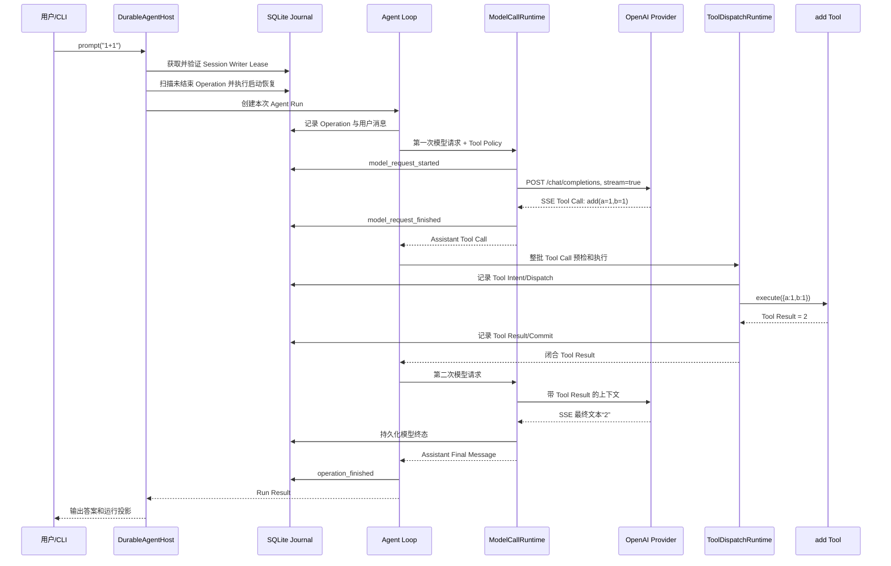

# PI Agent Loop 项目总结与技术面试手册

> 项目：`pi-agent-loop-python`  
> 文档用途：项目复盘、技术架构讲解、面试准备  
> 回答口径：以正常技术面试的方式组织，强调事实、设计取舍、故障边界和可验证结果，不虚构线上规模或性能数据。

## 一、面试开场：请介绍一下这个项目

### 面试官

请用两三分钟介绍一下这个项目。

### 候选人参考回答

我参与研究和完善的是一个纯 Python 的 AI Agent Runtime/Harness，项目名称是 `pi-agent-loop-python`。它不是只封装一次模型 API 调用，而是实现了一个完整的“模型推理—工具执行—结果观察—继续推理”的 Agent 闭环，并在此基础上增加了生产型系统常见的持久化、恢复、审批、写操作、计划执行、多 Agent、评测和安全能力。

项目的低层核心是 `Agent Loop`。模型可以生成结构化 Tool Call，运行时会先校验工具是否可见、参数是否合法、是否满足授权和审批要求，再通过统一的 `ToolDispatchRuntime` 执行。工具结果必须与 Tool Call 一一闭合，然后作为 Observation 回灌给模型，直到模型不再调用工具、工具主动终止、预算耗尽或任务被取消。

项目没有直接依赖 LangChain 或 LangGraph，而是通过一个很小的 `StreamFn` 协议抽象模型，通过 `AgentTool` 抽象工具，自行实现 EventStream、工具调度、状态机、Durable Plan 和 SQLite Event Journal。这样做的主要价值是底层行为透明，并且能够对外部副作用建立更细的安全语义，例如 Approval、Action Hash、Idempotency Key、Commit Boundary、`outcome_unknown`、Reconciliation、CAS、Lease 和 Fencing Token。

在复杂任务场景下，系统可以先通过 Hybrid Router 识别 Intent，再由 Planner 生成可信的多步骤 DAG，PlanExecutor 根据依赖和条件执行。执行结果会进入 Validator；如果结果不满足目标，可以在预算范围内生成 Correction Plan 或 Replan。多 Agent 部分可以把 DAG 节点分发给不同角色和能力的 Worker，并提供并发限制、资源锁、失败传播和结果仲裁。

技术栈以 Python 3.11、asyncio、httpx、SSE、SQLite、AES-GCM、HMAC-SHA256、TOML、pytest、mypy 和 Ruff 为主。当前项目的优点是控制力、可测试性和安全边界较强；代价是自研代码量和维护成本较高，而且跨机器分布式执行、真正的代码沙箱、部分并发与评测证据边界仍需要继续完善。

### 一句话概括

> 这是一个从零实现的、支持 Durable ReAct、工具安全执行、计划编排、崩溃恢复和多 Agent 协作的 Python Agent Runtime，而不是一个简单的聊天机器人封装。

## 二、完整技术架构图

### 面试官

请画一下系统的完整技术架构，并说明每层负责什么。

### 候选人参考回答



```mermaid
flowchart TB
    subgraph Entry[接入与配置层]
        CLI[CLI / Examples]
        APP[业务应用 / API / UI]
        CFG[TOML 配置\nAgent / Provider / Business]
        IDP[OIDC / IAM 适配器\n生产环境外部注入]
    end

    subgraph Host[Durable Host 与生命周期层]
        DAH[DurableAgentHost]
        FAC[DurableHostFactory]
        LIFE[Lifecycle / Resources]
        REC[Startup Recovery Gate]
        WS[Workspace / Project / Session]
    end

    subgraph Decision[可信决策与规划层]
        HR[HybridModelRouter\nIntent 分类]
        RA[RoutedAgent\nCapability 与工具可见性]
        GUARD[RequiredToolCallGuard]
        PLANNER[HybridRequestPlanner]
        PLAN[Durable MultiIntentPlan DAG]
        EXEC[PlanExecutor]
        CLOSED[Execute-Validate-Correct]
        SYN[Result Synthesizer]
    end

    subgraph AgentCore[Agent 核心层]
        AGENT[Agent\nTranscript / steer / follow-up]
        LOOP[Agent Loop\nModel → Tool → Model]
        MSG[Messages / Transcript Closure]
        STREAM[EventStream\nStreaming / Backpressure]
        CANCEL[CancellationToken]
    end

    subgraph ModelSide[模型运行时与 Provider 层]
        MR[ModelCallRuntime]
        RETRY[Retry / Backoff / Circuit Breaker]
        COMPACT[Token-aware Compaction]
        ROUTER[Resilient Model Router]
        PROVIDER[OpenAI-compatible Provider]
        HTTP[httpx Client Pool]
        SSE[SSE Decoder / Translator]
        MODEL[OpenAI-compatible Model Service]
    end

    subgraph ToolSide[工具运行时层]
        TR[ToolRegistry]
        TDR[ToolDispatchRuntime]
        VALID[Schema + validate_args]
        AUTH[Identity / Authorization / Approval]
        SCHED[Parallel / Exclusive / Resource Lock]
        THOOK[Before / After Hooks]
        TOOLS[Calculator / Files / Shell / Business Tools]
        WRITE[WriteOperationService]
        RECON[Outcome Reconciliation]
    end

    subgraph Multi[多 Agent 编排层]
        MA[MultiAgentOrchestrator]
        WR[WorkerRegistry]
        W1[Research Worker]
        W2[Code Worker]
        W3[Review / Test Worker]
        ARB[Result Arbitrator]
    end

    subgraph Data[持久化与状态层]
        JOURNAL[SQLiteSessionEventJournal]
        EVENTS[Runtime / Operation / Retry Events]
        APPROVAL[Approval State Machine]
        WSTATE[Write State Machine]
        PSTATE[Plan / Task State Machine]
        SNAP[Snapshot / Projection / Replay]
        MEMORY[Encrypted Semantic Memory]
        CRYPTO[AES-GCM / SHA-256 / HMAC]
        LEASE[CAS / Lease / Fencing]
    end

    subgraph Cross[横切能力]
        SAFE[ContentSafetyPipeline]
        TEL[Metrics / Trace / Structured Log / Alert]
        EVAL[RouterEvaluator / AgentEvaluator]
        CI[pytest / Coverage / Ruff / mypy\npip-audit / SBOM / Build]
    end

    CLI --> DAH
    APP --> DAH
    CFG --> FAC
    IDP --> AUTH
    FAC --> DAH
    DAH --> LIFE
    DAH --> REC
    DAH --> WS
    DAH --> HR
    HR --> RA
    RA --> GUARD
    HR --> PLANNER
    PLANNER --> PLAN
    PLAN --> EXEC
    EXEC --> CLOSED
    CLOSED --> SYN
    DAH --> AGENT
    AGENT --> LOOP
    LOOP <--> MSG
    LOOP --> STREAM
    CANCEL --> LOOP
    LOOP --> MR
    MR --> RETRY
    MR --> COMPACT
    MR --> ROUTER
    ROUTER --> PROVIDER
    PROVIDER --> HTTP
    HTTP --> MODEL
    MODEL --> SSE
    SSE --> STREAM
    LOOP --> TDR
    TR --> TDR
    TDR --> VALID
    TDR --> AUTH
    TDR --> SCHED
    TDR --> THOOK
    TDR --> TOOLS
    AUTH --> APPROVAL
    TOOLS --> WRITE
    WRITE --> RECON
    EXEC --> TDR
    PLAN --> MA
    MA --> WR
    WR --> W1
    WR --> W2
    WR --> W3
    W1 --> ARB
    W2 --> ARB
    W3 --> ARB
    ARB --> SYN
    DAH <--> JOURNAL
    JOURNAL --> EVENTS
    JOURNAL --> APPROVAL
    JOURNAL --> WSTATE
    JOURNAL --> PSTATE
    JOURNAL --> SNAP
    JOURNAL --> MEMORY
    JOURNAL --> CRYPTO
    JOURNAL --> LEASE
    SAFE -.审核.-> AGENT
    SAFE -.审核.-> TDR
    TEL -.观测.-> DAH
    TEL -.观测.-> MR
    TEL -.观测.-> TDR
    EVAL -.评测.-> HR
    EVAL -.评测.-> AGENT
    CI -.质量门禁.-> AgentCore
    CI -.质量门禁.-> Decision
    CI -.质量门禁.-> Data
```

### 架构分层说明

1. **接入层**负责 CLI、业务 API、UI 和配置加载，不直接执行模型或写操作。
2. **Durable Host 层**是应用 Facade，负责资源生命周期、Session Writer Lease、启动恢复和统一装配。
3. **Agent 核心层**只负责消息、Turn、模型—工具闭环、队列和基础预算，避免反向依赖数据库或 UI。
4. **模型运行时层**统一负责 Provider、物理 Attempt、重试、熔断、压缩、Token/成本计量和持久终态。
5. **工具运行时层**统一负责参数校验、身份、授权、审批、Hook、锁、超时、重试和结果标准化。
6. **决策与规划层**把模型输出重新绑定到可信 Intent/Capability Policy，形成可校验、可恢复的 DAG。
7. **多 Agent 层**负责受信 Worker 的有界协作，不允许任务文本动态创建拥有任意权限的 Worker。
8. **持久化层**通过加密事件日志、Reducer、Projection、CAS、Lease 和 Fencing 支持审计及崩溃恢复。
9. **横切层**负责内容安全、身份、租户隔离、遥测、评测和 CI。

## 三、一次请求的完整执行链路

### 面试官

用户执行 `python basic_usage.py "1+1"` 后，系统内部发生了什么？

### 候选人参考回答



关键点有三个：

- 模型第一次不是直接计算，而是选择结构化 `add` 工具；工具结果作为 Observation 进入第二个 Turn。
- 每个可能影响恢复的阶段都先写 Journal，持久终态是对外发布结果的 Commit Boundary。
- 如果启动时存在无法证明可安全续接的旧 Operation，Host 会 fail-closed，阻止新 Prompt 覆盖旧状态。

## 四、核心技术点与选型理由

### 面试官

项目用了哪些关键技术？为什么使用它们，而不是其它替代方案？

### 候选人参考回答

| 技术点 | 为什么使用 | 为什么没有优先选择替代品 |
|---|---|---|
| Python 3.11+ | AI 生态成熟；`asyncio`、`tomllib`、类型系统和测试生态完善；开发验证速度快 | Java 更重，Rust 开发成本更高，TypeScript 虽适合前端但本项目目标是 Python 教学与运行时实现 |
| asyncio | 模型请求和工具等待以 I/O 为主；协程适合高并发并能统一取消传播 | 每请求一个线程开销更高；多进程适合 CPU 密集但跨进程状态与取消更复杂 |
| httpx | 原生异步、连接池、细粒度 Timeout、流式响应，且 API 相对清晰 | `requests` 不原生支持 asyncio；`aiohttp` 可行但会增加另一套客户端抽象；厂商 SDK 会把核心绑定到具体 Provider |
| SSE | OpenAI-compatible Chat Completions 原生使用 SSE；适合服务器单向增量输出 | WebSocket 对双向实时通信更强，但对单向模型流更复杂；非流式响应首 Token 延迟高且无法展示进度 |
| 自定义 `StreamFn` Protocol | 用一个极小合同隔离 Agent Loop 与厂商 Provider，便于 ScriptedProvider 离线测试 | 直接依赖 LangChain Model 或 OpenAI SDK 会把第三方消息和异常类型渗入核心层 |
| 普通 `dict` 消息 + 类型校验 | JSON 可序列化、方便 Journal、跨语言和 Provider 映射；运行依赖更少 | Pydantic 能提供更强模型校验，但增加依赖、序列化行为和版本升级面；项目选择在边界显式验证 |
| TOML + `tomllib` | Python 3.11 标准库原生读取，适合人类维护 Agent、Provider、Business Policy | YAML 表达力强但解析规则复杂且需额外依赖；JSON 不适合带注释的人工配置；环境变量不适合复杂层次结构 |
| SQLite | 单机部署零运维、事务和 WAL 成熟，适合教学、CLI 与 Durable Session | JSONL 不支持可靠跨流事务和 CAS；PostgreSQL 更适合多机生产，但会提高本地示例和测试门槛 |
| Event Sourcing | 保存事实而不是只保存当前状态，能够重放、审计、恢复和投影 | 只更新当前状态行无法解释“为什么到达此状态”，也难以判断崩溃发生在副作用前还是后 |
| AES-GCM | 同时提供机密性和认证完整性；可用 AAD 绑定租户、Session 等元数据 | 明文 SQLite 不适合保存 Prompt/Tool Result；传统 CBC 需要额外 MAC；Fernet 更简单但对自定义 AAD 和记录格式控制较弱 |
| HMAC-SHA256 | 用于完整性 Manifest 和评测证据签名，能够检测删除或篡改 | 仅 SHA-256 没有密钥，攻击者篡改数据后可以重新计算摘要；非对称签名在本地单服务场景管理成本更高 |
| JSON Schema + `validate_args` | Schema 给模型看，可信校验器在运行时决定参数是否真正合法，职责清晰 | 只信任模型生成的 Schema 参数不安全；完整 JSON Schema 库可用，但项目用更小的显式校验降低依赖并支持业务规则 |
| ToolDispatchRuntime | 普通执行和恢复执行共用唯一工具安全边界，统一授权、Hook、锁、Retry 和 Telemetry | 在每个 Tool 中重复实现会产生策略漂移；直接调用 Python 函数无法建立审计和恢复语义 |
| 整批 Tool 预检 | 一批调用全部合法后才允许任何副作用，避免部分成功 | 逐个校验并立即执行更简单，但可能出现前三个写成功、第四个才发现非法的半完成状态 |
| Semaphore + Exclusive/Resource Lock | 同时支持吞吐量、全局排他操作和资源级读写互斥 | 只有全局锁会严重降低并行度；只有 Semaphore 不能避免两个写操作修改同一资源 |
| 结构化 Retry + Circuit Breaker | 区分瞬时错误和永久错误，使用退避、Jitter、`Retry-After`，避免故障放大 | 无脑重试会重复副作用并压垮服务；完全不重试会降低网络抖动下的可用性 |
| CancellationToken | 父子传播、兄弟隔离，能够统一 Agent、模型、Hook 和 Tool 的协作式取消 | 只调用 `Task.cancel()` 很难传递业务取消原因；但同步阻塞任务仍需进程或沙箱级强杀 |
| Token-aware Structured Compaction | 压缩时保留 Tool Call/Result、审批、约束和业务事实，避免简单截断破坏语义 | 仅滑动窗口会丢失关键事实或留下孤立 Tool Call；纯模型摘要若不复核可能引入虚构内容 |
| Hybrid Intent Router | 模型负责语义分类，可信 Policy 决定 Capability、审批和工具，实现灵活性与安全性的折中 | 纯规则难覆盖自然语言；纯 LLM 路由会让模型间接成为权限来源 |
| Durable DAG Plan | 适合任务拆解、并行依赖、条件分支、暂停和恢复，并能对每一步建立合同 | 线性步骤无法表达分支和并行；自由文本计划无法稳定校验、重放或审计 |
| 显式状态机 | 对 Approval、Write、Plan、Runtime 定义允许转换和不变量，避免非法跳转 | 零散布尔变量和 `status` 字符串容易产生互相矛盾的组合状态 |
| CAS + Lease + Fencing | CAS 防版本覆盖，Lease 赋予限时执行权，Fencing 阻止过期 Worker 提交 | 进程内锁无法解决跨进程竞争；只有 Lease 时旧 Worker 恢复后仍可能写入，需要单调 Fencing Generation |
| Idempotency + `outcome_unknown` + Reconciliation | 外部副作用无法真正做到数据库式 Exactly-once；结果不确定时通过幂等键和外部查询确认 | 把超时直接当失败并重试可能重复扣款或重复发货；宣称 Exactly-once 会掩盖真实故障窗口 |
| Approval + Action Hash | 审批绑定具体身份、参数、风险动作和有效期，审批后参数被修改会失效 | 一个通用 `approved=true` 无法防止“审批读操作、执行写操作”或审批后参数替换 |
| ContentSafetyPipeline | 在模型输入、最终输出和 Tool 输出建立统一策略边界，降低提示注入和敏感信息泄漏 | 仅依赖 System Prompt 属于软约束，不能替代运行时审核与授权 |
| MultiAgent WorkerRegistry | Worker 必须预注册角色和 Capability，任务不能通过 Prompt 动态提升权限 | 任意动态 Spawn 虽灵活，但容易造成权限扩散、上下文泄漏和资源失控 |
| Telemetry + Evaluator | Metrics/Trace/Log 用于运行诊断，版本化 Eval 和 Regression Gate 用于质量回归 | 只有普通日志难以衡量工具合规率、任务成功率、重复副作用、Token 和成本趋势 |
| pytest + branch coverage + mypy + Ruff | 测试行为、分支、类型和风格，配合多 Python/Windows/Linux CI | 单元测试数量不能覆盖类型、供应链或跨平台问题；单一工具无法形成完整质量门禁 |

## 五、为什么自己实现，而不是使用 LangChain、LangGraph

### 面试官

既然行业里常用 LangChain、LangGraph，为什么这个项目还要自己实现？

### 候选人参考回答

首先，LangChain 和 LangGraph 都是很成熟的方案。LangChain 官方定位是高层 Agent Framework，主要优势是预构建 Agent 和丰富的模型、工具集成；目前 LangChain 的 `create_agent` 底层使用 LangGraph。LangGraph 是低层有状态编排 Runtime，重点提供 Durable Execution、Streaming、Human-in-the-loop 和 Persistence。它们不是做不到，而是抽象目标与本项目并不完全相同。

- [LangChain 官方概览](https://docs.langchain.com/oss/python/langchain/overview)
- [LangGraph 官方概览](https://docs.langchain.com/oss/python/langgraph/overview)
- [LangChain 官方 Framework/Runtime/Harness 对比](https://docs.langchain.com/oss/python/concepts/products)

需要说明的是，仓库没有 ADR 明确记录原作者为什么拒绝这两个框架，因此以下理由是根据源码结构和依赖作出的工程判断：

1. **教学和研究目标**：项目要展示 Agent Loop、SSE、Tool Closure、Retry、Compaction 和 Recovery 的底层语义，直接调用高层框架会隐藏这些细节。
2. **副作用一致性要求更细**：项目不仅保存 Graph State，还记录 Tool Intent、Dispatch、Approval、Write、Commit、`outcome_unknown` 和 Reconciliation。
3. **最小 Provider 合同**：核心只依赖 `StreamFn`，不希望第三方框架的消息、异常和生命周期进入底层循环。
4. **最小依赖与可审计供应链**：运行依赖主要是 `httpx` 和 `cryptography`，便于离线测试、SBOM 和版本控制。
5. **完全控制安全边界**：Tool 整批预检、注册合同密封、Action Hash、Transcript Closure、Startup Recovery Gate 都需要精确控制。
6. **确定性测试**：ScriptedProvider 可以在没有 API Key 和网络时完整测试每个事件和故障窗口。

但是自研并不天然更高级，它的代价包括：

- 重复实现成熟框架已有的循环、图和持久化能力；
- 自己承担 Provider 兼容、并发、恢复和安全 Bug；
- 缺少 LangChain 的 Tool、Retriever、Vector Store 生态；
- 缺少 LangGraph/LangSmith 的可视化和调试生态；
- 团队招聘和新人上手成本更高。

我的结论不是“永远不用 LangChain/LangGraph”，而是不要为了流行整体重写。更合理的方式是保留当前 Approval、Write、Journal 和 Recovery 作为安全核心，再增加可选 Adapter：

```text
方案 A：LangChain Model / Tool → Adapter → 现有 PI Runtime

方案 B：LangGraph 外层业务图 → 一个节点调用 DurableAgentHost
        高风险 Tool 与副作用恢复仍由 PI Runtime 管理
```

混合时必须明确：谁拥有正式 Transcript、谁负责 Retry、谁保存最终 Checkpoint、谁拥有副作用 Commit Boundary。不能让 LangGraph 和当前 Runtime 同时自动重放同一个写操作。

## 六、开发过程中遇到的技术难题与解决方案

### 面试官

请讲一下开发过程中遇到的主要技术难题，以及你们是如何解决的。

### 候选人参考回答

下面列出 25 个能够从当前源码、测试或恢复记录中对应到的工程难题。面试中应选择与岗位最相关的三到五个深入讲，不建议机械背诵全部内容。

### 难题 1：SSE 数据块不按 JSON 或 UTF-8 字符边界到达

- **问题**：网络 Chunk 可能截断一个 UTF-8 字符、一个 SSE 行甚至一个 JSON Tool Argument。
- **解决**：实现增量 UTF-8 解码和独立 SSE 状态机，兼容 CR/LF、多行 `data:` 和任意 Chunk 边界，并设置单行、单事件、总字节数与事件数量上限。
- **结果**：Provider 不再假设“一次读取就是一个完整事件”，畸形流会以结构化错误结束。

### 难题 2：流式 Tool Call Arguments 需要跨多个 Delta 聚合

- **问题**：工具名、Call ID 和 JSON Arguments 可能分多次到达，直接逐块解析会产生无效 JSON。
- **解决**：按 Tool Call 索引维护聚合状态，只在终态统一验证 ID、名称和 Arguments 对象。
- **结果**：模型增量协议与内部完整 Tool Call 解耦。

### 难题 3：失败的模型 Attempt 不能污染正式对话

- **问题**：模型流输出一半后发生可重试错误，如果这些 Delta 已进入 Transcript，再次请求会出现重复或半截回答。
- **解决**：每个物理 Attempt 的事件先私下缓冲，只有被选为最终 Attempt 后才公开；持久化终态后再发布 Commit Event。
- **结果**：逻辑 Turn 与物理 Attempt 分离，重试对上层保持原子性。

### 难题 4：Tool Call 与 Tool Result 必须严格闭合

- **问题**：取消、预算不足或工具异常可能留下孤立 Tool Call，下一次 Provider 请求会被拒绝或产生语义混乱。
- **解决**：Transcript Validator 强制一一配对；取消、跳过和错误也生成 Synthetic Tool Result；序列化前再次校验闭合。
- **结果**：任何终止路径都保持合法上下文。

### 难题 5：一批 Tool Call 可能出现部分副作用

- **问题**：模型一次返回多个调用，如果边校验边执行，前几个写操作可能已经成功，后一个才发现越权。
- **解决**：分为整批 canonical preflight 和执行两个阶段；名称、可见性、Schema、参数全部通过后才允许任何 Handler 运行。
- **结果**：结构非法批次不会产生部分副作用。

### 难题 6：并发执行与确定性上下文发生冲突

- **问题**：并行工具应按完成顺序展示进度，但模型上下文需要稳定顺序以便重放和测试。
- **解决**：执行事件按真实完成时间发布，最终 Tool Result 按模型原始 Tool Call 顺序回灌。
- **结果**：兼顾实时性和确定性。

### 难题 7：不同工具需要不同并发语义

- **问题**：只使用 Semaphore 无法表达全局排他操作，也无法避免同一文件或订单被并发写。
- **解决**：支持 `parallel`、`exclusive`、`resource_locked`，资源锁使用校验后的稳定 Key，并提供全局与租户并发限制。
- **结果**：无冲突任务并行，有冲突任务串行。

### 难题 8：超时和取消需要跨多层传播

- **问题**：Agent、模型请求、Hook 和并行工具可能处于不同 Task；只取消父 Task 容易泄漏子任务。
- **解决**：使用父子 CancellationToken、子工具独立 Token，并让模型 Pump 与取消等待竞争；外部取消先完成 Transcript 和 Operation 收尾。
- **边界**：同步阻塞 Handler 仍不能被 asyncio 强杀，需要进程或容器隔离。

### 难题 9：瞬时故障应该重试，但写操作不能盲目重放

- **问题**：网络抖动需要重试，而付款、发货等副作用重复执行风险很高。
- **解决**：模型、工具、任务分别定义错误分类；工具只有显式幂等且出现白名单瞬时错误才重试；写工具默认 `replay_policy=never`。
- **结果**：可用性和副作用安全不再由同一个粗粒度重试开关决定。

### 难题 10：外部操作超时后无法判断是否已成功

- **问题**：请求可能已被外部系统执行，但响应在返回前丢失，直接记录失败会导致重复提交。
- **解决**：跨过 Commit Boundary 后的异常进入 `outcome_unknown`，携带 Operation ID、Idempotency Key 和 Reconciler，再查询外部状态确认。
- **结果**：系统不伪造 Exactly-once，也不把“不知道”错误地当成“失败”。

### 难题 11：进程崩溃后需要知道从哪里恢复

- **问题**：只保存最终消息无法判断崩溃发生在模型请求前、Tool Dispatch 后还是写操作提交后。
- **解决**：通过 Event Journal 记录 Intent、Started、Completed、Unknown 等事实，用 Reducer 重建 Operation State，再由 Recovery Planner 生成动作。
- **结果**：恢复基于事实，而不是根据最后一条日志猜测。

### 难题 12：旧 Session 缺少恢复策略时不能安全续跑

- **问题**：实际示例中出现模型 Request 已开始，但历史事件没有完整 `requestPolicy`，无法恢复原工具白名单和 Tool Choice。
- **解决**：Startup Recovery Gate 采用 fail-closed，标记 Manual Intervention 并阻止新 Prompt；新版本在模型请求前持久化完整 Policy。
- **结果**：宁可暂停，也不使用更宽松权限重新调用模型。

### 难题 13：同一 Session 不能被两个 Writer 同时推进

- **问题**：多进程同时恢复或处理同一 Session 会生成重复 Tool 和冲突事件。
- **解决**：Session Writer Lease + CAS Version；跨 Worker Claim 使用事务竞争，只有获胜者执行外部 Handler。
- **结果**：同一 Session 在任一时刻只有一个合法写者。

### 难题 14：过期 Worker 恢复后仍可能提交结果

- **问题**：仅有 Lease 不够，旧 Worker 在网络恢复后可能继续写入。
- **解决**：每次 Claim 产生单调递增 Fencing Generation，下游写入必须校验 Generation。
- **结果**：过期 Worker 即使继续运行也不能覆盖新 Worker 的结果。

### 难题 15：审批必须绑定具体动作而不是一个布尔值

- **问题**：审批后如果参数被替换，通用 `approved=true` 会授权另一个动作。
- **解决**：对规范化动作生成 Action Hash，审批绑定申请人、审批人、角色、参数、TTL 和消费状态，执行时重新计算并比较。
- **结果**：审批不能被移花接木或重复消费。

### 难题 16：模型路由结果不能直接成为权限

- **问题**：如果模型说“这是退款 Intent”就直接开放退款 Tool，Prompt Injection 可以实现权限提升。
- **解决**：模型只产生 TaskDecision；可信 Business Policy 将 Intent 重新绑定 Capability、风险、审批和工具；RoutedAgent 只暴露所选工具。
- **结果**：模型负责语义建议，代码负责授权。

### 难题 17：模型生成的计划可能循环、越权或引用不存在步骤

- **问题**：自由生成的 DAG 可能有环、重复 ID、未知 Intent 或非法依赖。
- **解决**：PlanValidator 校验节点数、DAG 无环、Policy、参数合同、依赖和结果引用；Planner 使用可信 Intent ID 而不是模型自定义执行器。
- **结果**：不可验证计划在执行前被整体拒绝。

### 难题 18：条件分支不能执行任意模型代码

- **问题**：让模型生成 Python 表达式会形成远程代码执行和不可重放行为。
- **解决**：使用受限 PlanCondition、JSON Path、比较操作和可信前置条件，只读取允许的上游结构化结果。
- **结果**：支持业务分支，同时保持可序列化和可审计。

### 难题 19：计划执行需要支持审批暂停与跨重启继续

- **问题**：长任务可能在中间等待人工审批，进程不能一直占用内存 Task。
- **解决**：Plan、Step、Approval 都写入 Journal；状态进入 `waiting_approval` 后释放执行资源，审批完成后通过 `resume_plan()` 重放并继续。
- **结果**：Human-in-the-loop 成为持久状态，而不是一个进程内回调。

### 难题 20：反思和自修复可能无限循环或扩大权限

- **问题**：模型不断“再试一次”会消耗无限 Token，并可能在 Replan 中增加高风险步骤。
- **解决**：Execute-Validate-Correct 使用 Correction Budget、总 Deadline、模型/工具调用预算；Replanner 不能扩大原 Capability、绕过审批或放宽 Replay Policy。
- **结果**：自修复是有界、可验证的闭环，不是无限自我对话。

### 难题 21：多 Agent 容易发生上下文和权限泄漏

- **问题**：共享同一个 Agent 实例或允许 Prompt 动态创建 Worker，可能把一个 Tenant 的历史和工具权限泄漏给另一个任务。
- **解决**：WorkerRegistry 由 Host 创建，Worker 预声明角色和 Capability；固定 Agent Worker 默认串行且任务前清空 Transcript，并限制消息和结果大小。
- **结果**：任务文本不能提升 Worker 权限，跨任务上下文得到隔离。

### 难题 22：多个 Agent 给出冲突结果时如何合并

- **问题**：简单多数票可能掩盖多个副本共同犯错，也可能选中未满足安全合同的结果。
- **解决**：Replica Execution 默认关闭；启用时必须声明可安全复制并指定可信 Arbitrator；内置 ExactMatch 要求全部成功且文本一致。
- **结果**：不使用隐式多数票把不确定结果包装成确定事实。

### 难题 23：上下文压缩可能破坏 Tool Closure 或丢失业务事实

- **问题**：简单删除旧消息可能保留 Tool Result 却删除对应 Tool Call，也可能丢失审批和约束。
- **解决**：Token-aware Structured Compactor 保留最近消息、Tool Pair、Approval、Constraint 和结构化事实；自定义 Compactor 输出还需再次验证。
- **结果**：压缩后的上下文仍可合法发送给 Provider。

### 难题 24：流式进度可能造成内存背压

- **问题**：UI 或 Observer 消费速度慢时，无界 Queue 会持续增长。
- **解决**：EventStream 同时限制事件数量和保留字节，高频 Delta 可合并，生命周期和终止事件受保护，无法容纳结构事件时显式失败。
- **边界**：当前同步 Observer 仍可能反向阻塞 Producer，需要进一步隔离。

### 难题 25：安全、评测和 CI 如何形成可验证闭环

- **问题**：单元测试通过不能证明没有越权 Tool、重复副作用、秘密泄漏或性能回归。
- **解决**：增加 ContentSafetyPipeline、Runtime Telemetry、版本化 Agent Eval、Regression Gate、branch coverage、mypy、Ruff、pip-audit、SBOM、License 和 Wheel Smoke。
- **边界**：当前 Eval 证据防重放、真实 Agent CI 样本和若干关键模块分支覆盖仍需加强。

## 七、基于本项目的 50 道技术面试题及参考答案

> 使用方法：先用一句话给结论，再解释实现、设计取舍和边界。高级岗位回答不能只背 API，还需要说明故障窗口、安全不变量和为什么没有选择更简单的方案。

### Q01：这个项目的定位是什么，它与普通聊天机器人有什么区别？

**参考答案：**

普通聊天机器人通常是“用户消息进、模型文本出”。本项目定位是 Agent Runtime/Harness，模型不仅生成文本，还可以生成 Tool Call，并在运行时校验、执行、观察结果后继续推理。外层还提供 Session Journal、崩溃恢复、审批、写状态机、DAG Plan、多 Agent 和评测。因此它管理的是一个可持续推进且可能产生外部副作用的执行过程，而不是单次生成。

### Q02：为什么要做分层，而不是把模型、工具和数据库都写进一个 Agent 类？

**参考答案：**

分层的目标是建立稳定依赖方向：Provider 和 Tool 是边界适配器，Agent Loop 只负责控制语义，Model/Tool Runtime 负责重试和执行策略，Session/Host 负责持久化和恢复，UI/API 位于最外层。如果全部放进 Agent 类，低层循环会依赖 HTTP、SQLite、业务审批和 UI，导致测试困难、生命周期混乱，也无法让普通执行和恢复复用同一安全边界。

### Q03：项目如何实现 ReAct？为什么不要求模型输出显式 `Thought`？

**参考答案：**

项目使用原生 Tool Calling 实现 Reason-Act-Observe：模型根据上下文决定 Tool Call，Tool Runtime 执行并产生 Tool Result，结果回灌后模型继续推理。显式 `Thought:` 文本不是协议必要条件，而且可能暴露不稳定或敏感的内部推理。使用结构化 Tool Call 更容易做参数验证、权限控制、持久化和回归测试。

### Q04：为什么计算 `1+1` 可能需要两次模型请求？

**参考答案：**

第一次模型请求负责选择 `add` 并生成参数；本地工具执行得到 `2`；第二次模型请求读取 Tool Result，组织最终自然语言答案。这两个请求是两个逻辑 Turn。只有让工具结果回到模型，模型才能基于真实 Observation 回答，而不是在发起 Tool Call 后同时猜测结果。

### Q05：`Agent` 和 `DurableAgentHost` 的职责有什么区别？

**参考答案：**

`Agent` 管理内存 Transcript、事件、steer/follow-up、取消和低层 Loop。`DurableAgentHost` 是生产型 Facade，负责 Project/Session、Writer Lease、启动恢复、Journal、Approval、Plan 和资源生命周期。裸 Agent 适合轻量或教学场景；需要崩溃恢复和副作用保证时必须通过 Durable Host 装配正式 Runtime。

### Q06：为什么核心模型抽象是 `StreamFn`，而不是继承一个复杂 Provider 基类？

**参考答案：**

`StreamFn(model, context, options) -> AssistantMessageEventStream` 是最小能力合同。它让 Agent Loop 不知道 HTTP、API Key、厂商 SDK 或重试细节，也便于用 ScriptedProvider 做确定性测试。复杂基类容易形成继承耦合；函数协议和 `Protocol` 更适合 Python 的组合式设计。

### Q07：为什么消息使用普通字典，而不是全部使用 Pydantic Model？

**参考答案：**

普通字典天然适合 JSON、Journal、Provider 映射和跨语言交互，并且保持较少运行依赖。项目把强校验放在消息构造、Transcript、Provider 序列化和恢复边界。代价是字段错误更可能在运行时发现；若业务团队更看重开发体验，也可以在应用边界增加 Pydantic Adapter，但不应让其类型渗入低层协议。

### Q08：什么是 Transcript Closure？为什么它重要？

**参考答案：**

Closure 要求每个 Assistant Tool Call 在下一条 User 或 Assistant 消息前，恰好存在一个 Tool Result，并且 Call ID、Tool Name 一致。否则 Provider 无法正确理解对话，恢复时也无法判断工具是否完成。项目在取消、跳过、预算不足时生成 Synthetic Tool Result，并在持久化恢复与发送 Provider 前重复校验。

### Q09：`EventStream` 为什么既支持异步迭代，又支持 `result()`？

**参考答案：**

异步迭代服务 UI 和日志的实时增量展示，`result()` 服务只关心终态的调用方。二者共享一个受控事件流，但最终结果不能依赖消费者是否及时读取每个 Delta。EventStream 还承担事件数量/字节背压、Delta 合并和终止事件保护。

### Q10：`steer()` 和 `follow_up()` 有什么区别？

**参考答案：**

`steer()` 在当前 Assistant 工具批次结束后、下一次模型请求前插入，用于运行中修正方向；`follow_up()` 只在 Agent 原本准备结束时插入，用于串接后续任务。二者都不会打断正在提交的副作用，从而避免在 Tool 执行中间改变安全上下文。

### Q11：实现 SSE Decoder 时最容易犯哪些错误？

**参考答案：**

常见错误包括假设一个网络 Chunk 对应一行、直接对不完整 UTF-8 解码、忽略 CRLF、多行 `data:`、未限制事件大小、没有验证 `[DONE]`，以及把服务器响应体原样放进异常导致敏感信息泄漏。正确做法是使用增量 Decoder 和有状态 SSE Parser，并设置分层协议上限。

### Q12：逻辑 Turn 和物理 Model Attempt 有什么区别？

**参考答案：**

逻辑 Turn 是 Agent 语义上的一次 Assistant 请求，物理 Attempt 是 Provider 层的一次真实 HTTP 尝试。一个 Turn 因 429 或网络故障可能产生多个 Attempt。预算和遥测必须同时记录二者，否则 `max_turns=10` 可能在底层实际发送几十次请求，造成成本失控。

### Q13：为什么失败 Attempt 的流式输出不能立即发送给上层？

**参考答案：**

如果一个 Attempt 输出了半段文本或 Tool Call 后失败，而 Runtime 又切换到下一 Attempt，上层会看到两个回答拼接，甚至执行来自失败 Attempt 的工具。项目先私有缓冲每个 Attempt，只有确定该 Attempt 成功并持久化终态后才公开，从而建立模型输出 Commit Boundary。

### Q14：项目的取消机制为什么不只使用 `asyncio.Task.cancel()`？

**参考答案：**

`Task.cancel()` 是执行机制，但不能表达统一的业务取消状态，也不保证自定义 Hook 和 Tool 能观察到同一个取消信号。CancellationToken 支持父子传播和原因传递，单工具超时只取消自己的子 Token。外层 Task Cancel 仍会使用，但需要先完成 Tool Result 和 Durable Operation 收尾。

### Q15：Circuit Breaker 在模型调用中解决什么问题？

**参考答案：**

当 Provider 持续失败时，单纯指数重试仍会不断发送请求，增加延迟并放大故障。Circuit Breaker 在失败达到阈值后进入 Open，短时间快速失败；探测期进入 Half-open，只允许有限请求验证恢复。它解决的是系统性故障，不替代单次请求的 Retry。

### Q16：为什么上下文压缩不能只删除最旧消息？

**参考答案：**

最旧消息可能包含当前约束、审批、Tool Call，而对应 Tool Result 位于较新位置。简单裁剪会破坏 Closure 或丢失事实。结构化 Compactor 按 Token 预算保留最近消息、Tool Pair 和重要事实，将旧内容转换为摘要，并验证摘要确实减少 Token 且保持合法 Transcript。

### Q17：Provider 错误为什么要结构化并脱敏？

**参考答案：**

Runtime 需要根据 `retryable`、HTTP Status、错误码和 `Retry-After` 做策略决策，但不应该把响应正文、Authorization Header、底层 URL 查询参数或异常字符串写入 Journal。结构化错误保留决策所需字段，用户提示与内部诊断分离，敏感原文只在受控调试边界处理。

### Q18：多模型故障转移为什么需要“输出提交屏障”？

**参考答案：**

如果主模型已经公开文本或 Tool Call，再切换备用模型会把两个模型的输出拼接，且备用模型可能重新发起副作用。项目只允许在尚未发布任何有意义输出时切换候选；一旦输出越过 Commit Barrier，后续失败必须作为当前请求失败处理。

### Q19：一个 `AgentTool` 的安全合同应包含哪些内容？

**参考答案：**

至少包括名称、描述、参数 Schema、可信 `validate_args`、Handler、Timeout、Retry、调度模式、资源键解析、Side-effect、Replay Policy、Capability、审批要求和安全版本。注册时还应密封对象/Handler 身份和合同摘要，防止注册后被同名对象替换。

### Q20：JSON Schema 和 `validate_args` 为什么要同时存在？

**参考答案：**

JSON Schema 主要向模型描述参数结构，也能做基础类型验证；`validate_args` 是可信运行时边界，可以校验文件路径、订单状态、金额范围、字段组合等业务不变量。Schema 是描述，不应被误认为最终授权。

### Q21：为什么 Tool Runtime 要先对整批调用做预检？

**参考答案：**

模型可能一次生成多个 Tool Call。若逐个执行，第四个调用非法时前三个可能已经写入外部系统。整批预检先验证 Tool ID、白名单、Schema、参数和 Tool Choice，全部通过后才执行，从结构层面避免部分提交。执行期故障仍通过各自的写状态机和补偿语义处理。

### Q22：`parallel`、`exclusive` 和 `resource_locked` 分别适合什么场景？

**参考答案：**

`parallel` 适合互不影响的搜索和计算；`exclusive` 适合修改全局配置、迁移等不能与任何操作并行的任务；`resource_locked` 适合按文件、订单或账户隔离冲突。资源键必须来自校验后的规范参数，不能直接信任模型字符串。

### Q23：为什么工具按完成顺序发事件，却按原调用顺序回灌结果？

**参考答案：**

完成顺序有利于实时 UI 和性能观测；原调用顺序有利于 Transcript 确定性、测试重放和 Provider 一致性。将进度事件和上下文顺序分离，能够同时满足用户体验和可复现性。

### Q24：工具重试为什么必须与幂等性绑定？

**参考答案：**

读取和纯计算一般可以安全重试，付款或创建订单不能仅因超时就重放。只有工具明确声明幂等，并且异常属于允许的瞬时错误，Runtime 才能自动重试。即使有 Idempotency Key，也要确认下游真实实现了同键去重，而不是只在本地生成一个字符串。

### Q25：什么是 `outcome_unknown`，它和失败有什么区别？

**参考答案：**

失败表示系统有证据证明操作没有成功；`outcome_unknown` 表示外部副作用可能成功，但本地没有可靠终态。例如付款请求已经发送，连接在响应前断开。Unknown 状态禁止普通重试，需要使用 Operation ID 和 Idempotency Key 查询外部系统，再通过 Reconciliation 转成 succeeded 或 failed。

### Q26：为什么使用 Event Sourcing，而不是只在数据库保存当前状态？

**参考答案：**

Agent 的恢复决策依赖过程事实：模型请求是否开始、工具是否 Dispatch、写操作是否越过 Commit Boundary。只保存当前状态无法解释发生顺序，也难以审计。Event Sourcing 追加不可变事实，再通过 Reducer 得到当前状态；代价是事件 Schema、迁移、Snapshot 和不变量维护更复杂。

### Q27：Reducer 为什么应该尽量是纯函数？

**参考答案：**

纯 Reducer 满足 `new_state = reduce(old_state, event)`，不访问网络、时间或随机数，因此相同事件序列一定重建相同状态，便于测试、恢复和审计。副作用应发生在 Command Handler，生成事件后再交给 Reducer。否则重放历史时可能再次发送请求或得到不同状态。

### Q28：为什么当前 Durable Journal 使用 SQLite，而不是 PostgreSQL？

**参考答案：**

SQLite 适合单机 CLI、教学和测试：零运维、事务可靠、可打包、支持 WAL 和 CAS。PostgreSQL 更适合多实例高并发和集中运维，但会让示例部署复杂。项目通过 Store Protocol 保留替换空间；真正多机生产时应迁移到共享事务存储，而不是共享一个网络盘 SQLite 文件。

### Q29：Journal 为什么需要 AES-GCM？它能解决网络安全问题吗？

**参考答案：**

Journal 保存 Prompt、Tool Arguments、结果和身份信息，需要静态加密。AES-GCM 同时提供机密性与认证完整性，AAD 可绑定 Tenant、Session、Sequence 等元数据。但它只保护 At Rest 数据，不能保护 HTTP 传输；远程 Provider 仍必须使用 TLS/HTTPS。

### Q30：有 SHA-256 校验为什么还需要 HMAC？

**参考答案：**

普通 Hash 只能检测意外损坏；能修改数据库的攻击者可以篡改内容后重新计算 Hash。HMAC 使用服务端密钥，攻击者没有密钥就无法生成合法完整性标签。HMAC 仍需要可靠密钥管理、轮换和备份，否则数据库与密钥同时泄漏时保护会失效。

### Q31：CAS、Lease 和 Fencing Token 分别解决什么问题？

**参考答案：**

CAS 防止基于旧版本覆盖新状态；Lease 规定某个 Worker 在一段时间内拥有执行权；Fencing Token 是每次 Claim 单调增加的代际，阻止过期 Worker 在恢复网络后继续提交。三者不是互相替代：只用 CAS 难管理长任务，只用 Lease 无法阻挡恢复后的旧 Worker，只用进程锁则无法跨机器。

### Q32：`StartupRecoveryBlockedError` 为什么是一种正确的失败？

**参考答案：**

启动恢复如果发现未结束 Operation，但缺少 Tool Policy、Idempotency 或可核对结果，继续新 Prompt 可能覆盖事实或重复副作用。此时 fail-closed 比“尽量继续”更安全。错误报告应指出 Operation ID、阻塞阶段和人工处理要求，运维人员核对并持久化决策后再恢复。

### Q33：Approval 为什么需要 Action Hash、TTL 和一次性消费？

**参考答案：**

Action Hash 把审批绑定到规范化参数和动作；TTL 防止长期有效的旧批准被滥用；一次性消费防重放。审批执行时还要验证身份来源、角色和当前业务前置条件。否则攻击者可以拿一次批准替换参数、延迟执行或重复执行。

### Q34：为什么说 Router 是决策，不是授权？

**参考答案：**

Router 的输入是自然语言，输出来自模型，因此可能受 Prompt Injection、误分类或模型幻觉影响。它可以建议 Intent，但只有可信 Business Policy 才能决定 Capability、Allowed Tool、Risk 和 Approval。把 Router 输出直接当权限，相当于让不可信模型控制授权系统。

### Q35：`RequiredToolCallGuard` 解决了 `tool_choice=auto` 的什么问题？

**参考答案：**

`auto` 允许模型不用工具，模型可能直接编造实时余额或订单状态。对于必须使用可信数据源的 Intent，Guard 缓冲模型输出，检查是否调用了要求的工具、参数是否完全匹配、是否调用越权工具；不满足时替换为策略错误，而不是放行一段看似合理的文本。

### Q36：一个模型生成的 Plan 在执行前要校验哪些内容？

**参考答案：**

至少校验 Schema Version、Plan/Step ID 唯一性、任务数预算、依赖存在、DAG 无环、Intent 是否在可信 Policy 中、参数合同、结果合同、Capability、Approval、Replay Policy、资源键、条件表达和数据引用。模型只能提出结构，不能注入 Runner 或 Handler。

### Q37：条件分支为什么采用受限 JSON Path，而不是 `eval()`？

**参考答案：**

`eval()` 会执行模型生成的任意代码，既不安全也不可跨语言重放。受限 JSON Path 只允许读取已完成步骤的结构化结果，再通过白名单比较运算计算条件。这样条件是可序列化、可验证、可审计的，也能在恢复后得到相同结果。

### Q38：Execute-Validate-Correct 闭环是怎样工作的？

**参考答案：**

Executor 完成当前 Plan 后生成不可变 Observation；可信 ResultValidator 判断目标是否达成并返回具体 Issue；CorrectionPlanner 或 Replanner 只能在预算和原始 Policy 边界内提出修正；修正 Plan 再次经过完整校验和执行；最终由 Synthesizer 汇总。整个循环受次数、调用、Token、成本和 Deadline 限制。

### Q39：为什么不能让模型自己判断任务是否成功？

**参考答案：**

模型可能根据自然语言输出产生“已经完成”的幻觉，但真实订单、文件或审批状态未必满足条件。高价值任务需要可信 Validator 查询结构化结果或外部系统。没有 Validator 时，项目宁可返回 `outcome_unknown` 或进入人工处理，也不把结构执行完成误认为业务目标完成。

### Q40：Plan 的 `completed` 为什么不一定表示业务成功？

**参考答案：**

`completed` 可以只表示所有可运行步骤都到达终态，部分步骤可能失败、跳过，结果也可能不满足用户目标。业务成功需要 Result Contract 和 Plan-level Validator。把结构完成和语义成功分离，可以避免监控系统把“流程结束”错误显示为“任务成功”。

### Q41：Durable Plan 和 Multi-Agent Orchestrator 有什么区别？

**参考答案：**

Durable Plan 关注业务步骤、状态机、审批、数据流、持久化和恢复；Multi-Agent Orchestrator 关注将任务分配给不同 Worker、并发、资源、消息和仲裁。一个 Plan Step 可以由普通 Tool 执行，也可以委派给 Agent Worker。两者可以组合，但不是同一个抽象。

### Q42：为什么 Multi-Agent Worker 必须预注册？

**参考答案：**

预注册能够让 Host 信任 Worker 的身份、角色、Capability、并发上限和 Runner。若允许模型在 Prompt 中动态定义 Worker 和 Tool，任务拆解就可能变成权限提升。任务只能选择已有 Worker，不能注入执行代码或扩大权限。

### Q43：为什么多副本执行默认关闭，且不直接使用多数票？

**参考答案：**

副本会放大模型调用成本和副作用风险，三个副本还可能因为同一错误信息而共同犯错。多数票只表达一致性，不表达正确性。项目要求任务显式声明可安全复制，并由可信 Arbitrator 校验；ExactMatch 适合确定性文本，复杂业务则应使用领域 Validator。

### Q44：当前 Multi-Agent 为什么还不算完整分布式系统？

**参考答案：**

当前核心调度主要在单进程内使用 Semaphore、内存状态和本地资源锁。跨机器生产还需要共享事务 Plan Store、可靠任务队列、Worker 心跳、身份认证、分布式 Claim、Fencing、消息幂等、下游 CAS 和故障转移。代码中有部分协议和边界，但不能把可注入接口等同于已经部署好的集群。

### Q45：Transcript、Clarification State 和 Semantic Memory 有什么区别？

**参考答案：**

Transcript 是当前会话的原始交互历史；Clarification State 是当前任务缺失参数的短期状态；Semantic Memory 是跨轮或跨会话检索的长期事实，具有 Scope、Provenance、TTL 和加密存储。混用会导致上下文膨胀、过期事实被当成当前参数，或把一个用户信息泄漏给另一个用户。

### Q46：内容安全审核和权限控制为什么不能互相替代？

**参考答案：**

内容安全判断文本是否包含泄密、注入或违规内容；权限控制判断某个 Verified Identity 是否能执行某个 Capability。安全文本也可能发起越权操作，危险文本即使来自管理员也不应直接执行。正确架构是输入/输出 Safety、Identity Authorization、Tool Policy 和 Approval 多层共同工作。

### Q47：如何处理来自 Tool Result 的 Prompt Injection？

**参考答案：**

网页、文件或第三方 API 返回的文本属于不可信数据，不能因为它来自 Tool 就成为系统指令。项目通过 Tool Output Safety、来源标记和消息边界把它作为 Observation；权限仍由当前 Tool Policy 决定。对于高风险输出还应做内容隔离、引用而非拼接，并限制模型后续可见工具。

### Q48：Agent Telemetry 应记录什么，不应记录什么？

**参考答案：**

应记录 Run/Session/Request/Tool ID、状态、耗时、重试、错误码、Token、成本、队列和锁等待等可聚合指标；不应默认记录 API Key、Authorization Header、完整 Prompt、Tool Arguments 或用户秘密。正文需要单独受控、加密并执行保留策略。Metrics、Trace、Log 各有用途，不能只依赖一个日志文件。

### Q49：如何评估一个 Agent，而不是只评估模型回答文本？

**参考答案：**

Agent Eval 要同时评估最终目标、多轮行为、Required/Forbidden Tool、参数、未授权动作、重复副作用、恢复、`outcome_unknown`、秘密泄漏、模型/工具调用数、Token、成本和延迟。Regression Gate 应同时有绝对安全线和相对版本比较，并确保执行证据来自可信 Runner，不能只让模型自评分。

### Q50：什么时候应使用 LangChain/LangGraph，什么时候保留本项目自研 Runtime？

**参考答案：**

需要快速接入大量模型、Retriever、Vector Store、SaaS Tool 和通用 Graph 工作流时，LangChain/LangGraph 更经济；需要学习底层、最小依赖、精确控制 Tool、Approval、Write、审计和恢复语义时，自研 Runtime 有价值。实际工程可以混合，但必须指定唯一的 Transcript、Retry、Checkpoint 和副作用 Commit 所有者，避免两套框架重复执行。

## 八、面试收尾：项目优势、局限与下一步

### 面试官

你如何评价这个项目目前的完成度？下一步会怎么做？

### 候选人参考回答

项目的优势是 Agent 运行语义比较完整，尤其重视模型不是权限来源、Tool Closure、持久化恢复、Approval、`outcome_unknown` 和有界自修复。当前运行依赖少，离线测试和跨平台 CI 基础也较好。

但我不会把它描述成已经满分生产化。当前最需要优先处理的是：

1. Tool `on_update` 部分输出统一进入 Content Safety；
2. 修正 Startup Recovery 的边缘终态分类并强化兼容数据迁移；
3. 将无审批写操作的执行身份与原请求人/授权委托严格绑定；
4. 对不可协作取消的同步 Tool 使用独立进程或容器硬超时；
5. 隔离共享 Safety Pipeline 和 Event Observer 的并发状态；
6. 修复评测证据 Challenge 重放和派生指标可信性问题；
7. 增加真实基线/候选隔离的 Agent CI Gate；
8. 提升 Loop、Recovery、Approval 等关键路径的分支覆盖；
9. 生产部署时接入共享事务 Store、可靠 Worker Queue、分布式 Fencing 和下游 CAS；
10. 为 Shell、浏览器和不可信代码提供 OS/容器 Sandbox。

如果业务需要 LangChain 生态，我会先实现 Adapter，而不是重写核心。这样既能获得模型和 Tool 集成，也能保留现有副作用安全和恢复边界。

## 九、源码阅读索引

| 主题 | 建议入口 |
|---|---|
| 最小 Agent Loop | [`src/pi_agent_loop/loop.py`](src/pi_agent_loop/loop.py) |
| 有状态 Agent | [`src/pi_agent_loop/agent.py`](src/pi_agent_loop/agent.py) |
| 消息与 Tool 类型 | [`src/pi_agent_loop/types.py`](src/pi_agent_loop/types.py) |
| Transcript Closure | [`src/pi_agent_loop/transcript.py`](src/pi_agent_loop/transcript.py) |
| EventStream | [`src/pi_agent_loop/event_stream.py`](src/pi_agent_loop/event_stream.py) |
| OpenAI-compatible Provider | [`src/pi_agent_loop/providers/openai_compatible.py`](src/pi_agent_loop/providers/openai_compatible.py) |
| SSE Decoder | [`src/pi_agent_loop/providers/sse.py`](src/pi_agent_loop/providers/sse.py) |
| Tool Runtime | [`src/pi_agent_loop/tool_runtime.py`](src/pi_agent_loop/tool_runtime.py) |
| Model Runtime | [`src/pi_agent_loop/harness/model_runtime_adapter.py`](src/pi_agent_loop/harness/model_runtime_adapter.py) |
| Durable Host | [`src/pi_agent_loop/harness/durable_agent_host.py`](src/pi_agent_loop/harness/durable_agent_host.py) |
| Startup Recovery | [`src/pi_agent_loop/harness/startup_recovery.py`](src/pi_agent_loop/harness/startup_recovery.py) |
| SQLite Event Journal | [`src/pi_agent_loop/session/journal.py`](src/pi_agent_loop/session/journal.py) |
| Approval 状态机 | [`src/pi_agent_loop/approval/state_machine.py`](src/pi_agent_loop/approval/state_machine.py) |
| Write 状态机 | [`src/pi_agent_loop/writes/state_machine.py`](src/pi_agent_loop/writes/state_machine.py) |
| Intent Router | [`src/pi_agent_loop/routing/hybrid_router.py`](src/pi_agent_loop/routing/hybrid_router.py) |
| Planner | [`src/pi_agent_loop/planning/planner.py`](src/pi_agent_loop/planning/planner.py) |
| Plan Executor | [`src/pi_agent_loop/planning/executor.py`](src/pi_agent_loop/planning/executor.py) |
| Closed Loop | [`src/pi_agent_loop/planning/closed_loop.py`](src/pi_agent_loop/planning/closed_loop.py) |
| Autonomous Runner | [`src/pi_agent_loop/harness/autonomous.py`](src/pi_agent_loop/harness/autonomous.py) |
| Multi-Agent | [`src/pi_agent_loop/multi_agent.py`](src/pi_agent_loop/multi_agent.py) |
| Semantic Memory | [`src/pi_agent_loop/memory/manager.py`](src/pi_agent_loop/memory/manager.py) |
| Content Safety | [`src/pi_agent_loop/safety.py`](src/pi_agent_loop/safety.py) |
| Telemetry | [`src/pi_agent_loop/runtime/telemetry.py`](src/pi_agent_loop/runtime/telemetry.py) |
| Agent Evaluation | [`src/pi_agent_loop/evaluation/agent.py`](src/pi_agent_loop/evaluation/agent.py) |
| 基础真实模型示例 | [`examples/basic_usage.py`](examples/basic_usage.py) |
| 项目配置说明 | [`config/README.md`](config/README.md) |
| 构建与依赖 | [`pyproject.toml`](pyproject.toml) |

## 十、面试表达注意事项

1. 不要声称该项目已经在未提供证据的百万级流量或金融生产环境运行。
2. 不要把“实现了接口”描述成“已经具备完整分布式集群”。
3. 不要把测试通过等同于没有安全缺陷，要主动说明当前已知边界。
4. 讲自研原因时要承认 LangChain/LangGraph 的生态与维护优势。
5. 讲难题时优先使用“故障窗口—不变量—解决方案—剩余边界”的结构。
6. 如果面试官追问个人贡献，应只描述自己真实完成、审查或验证过的部分。
7. 涉及数据指标时，以可复现测试和 CI 结果为准，不虚构线上收益。

## 十一、线上工程问题专项面试回答

### 面试官

结合这个项目，谈谈你会如何处理线上超时、工具调用失败、上下文膨胀、工具幻觉、并发、成本、安全和回滚问题。

### 候选人总览回答

我不会把这八类问题分别理解成八个孤立的 `try/except`，而是把它们放进同一条受控执行链：

```text
请求准入与预算
→ 模型/工具策略约束
→ 执行前校验
→ 有界并发和 Deadline
→ 执行事实持久化
→ 结果验证
→ 重试、恢复、对账或补偿
→ 遥测与回归评测
```

整体原则是：

- 能在执行前阻止的问题，不等执行后再补救；
- 能明确失败的记录失败，不能确认结果的记录 `outcome_unknown`；
- 读取和幂等操作可以受控重试，高风险副作用默认不自动重放；
- 内部状态通过事件和 CAS 恢复，外部副作用通过幂等、对账和补偿处理；
- 所有循环、并发、重试和自修复都必须受预算与 Deadline 约束。

| 问题 | 主要预防手段 | 失败后的处理 | 当前关键边界 |
|---|---|---|---|
| 线上超时 | 分层 Timeout、Deadline、CancellationToken | 分类重试、取消、Unknown/Reconcile | 同步阻塞 Handler 不能被协程强杀 |
| 工具失败 | 整批预检、参数校验、授权、Tool 合同 | Synthetic Result、幂等重试、对账 | 非幂等副作用不能普通重试 |
| 上下文膨胀 | Token 预算、结构化压缩、Memory 分层 | Context Overflow 后压缩重试 | 需要更强的调用前 Token Admission |
| 工具幻觉 | 工具白名单、Required Guard、运行时校验 | 拒绝未知 Tool，结构化错误回灌 | `tool_choice=auto` 不能保证必调工具 |
| 并发 | Semaphore、排他锁、资源锁、Lease/Fencing | Queue Timeout、取消、失败传播 | 跨机器需要共享 Store 和分布式锁 |
| 成本 | Turn/Call/Attempt/Token/Cost 多层预算 | 熔断、终止、自修复预算耗尽 | 硬成本依赖可信 Usage Meter |
| 安全 | Safety、Identity、Authorization、Approval、加密 | Fail-closed、审计、撤销/人工处理 | 内容审核不是沙箱，HTTP 必须使用 TLS |
| 回滚 | 预提交校验、CAS、幂等、状态机 | 事件补偿、Reconciliation、业务反向操作 | 外部副作用不存在通用数据库式回滚 |

### 1. 线上超时怎么处理

#### 面试官追问

如果线上模型请求或者工具执行长时间不返回，你怎么处理？

#### 候选人参考回答

我会采用分层 Deadline，而不是只在最外层套一个 `asyncio.wait_for()`：

1. **Provider 层**分别设置 Connect Timeout、Read Timeout 和整个流式响应的墙钟 Deadline。SSE 即使持续发送无意义小数据，也不能无限延长整个请求。
2. **Model Runtime 层**把一个逻辑 Turn 拆成多个物理 Attempt，每个 Attempt 都受取消和重试预算约束；达到总 Deadline 或熔断条件后停止。
3. **Tool Runtime 层**支持每个 Tool 独立 Timeout。并行 Tool 各自使用子 CancellationToken，一个工具超时不会直接取消所有兄弟任务。
4. **Plan 层**还有整条任务 Deadline，避免单个步骤都未超时，但二十个步骤和多轮 Replan 累计运行过久。
5. **队列和锁层**对等待 Semaphore、资源锁和 Lease 也设置等待上限，防止请求没有执行却一直占用内存。

超时之后不能统一记录为普通失败，而要看故障窗口：

```text
未 Dispatch Tool
→ 可以安全记录 timed_out

已进入纯读取或幂等 Tool
→ 根据 Retry Policy 退避重试

写 Tool 已经越过外部提交边界
→ outcome_unknown
→ 通过 Reconciliation 查询真实结果
```

当前实现可以从 [`providers/openai_compatible.py`](src/pi_agent_loop/providers/openai_compatible.py)、[`harness/model_runtime_adapter.py`](src/pi_agent_loop/harness/model_runtime_adapter.py)、[`tool_runtime.py`](src/pi_agent_loop/tool_runtime.py) 和 [`cancellation.py`](src/pi_agent_loop/cancellation.py) 看到。

**当前不足：** asyncio Timeout 本质上仍是协作式取消。若 Tool Handler 调用了阻塞的 C 扩展、死循环或不响应取消的同步代码，外层协程不能保证立刻杀死它。生产方案应把不可信或可能阻塞的工具放入独立进程、容器或远程 Worker，通过进程树终止和 OS 资源限制实现真正硬超时。

### 2. 工具调用失败怎么处理

#### 面试官追问

模型已经选择了工具，但工具参数错误、网络失败或者执行异常怎么办？

#### 候选人参考回答

首先要把工具失败按发生阶段分类：

| 阶段 | 典型问题 | 处理方式 |
|---|---|---|
| Preflight 前 | Tool Call ID、结构异常 | 整批拒绝，不执行任何 Handler |
| Preflight | 未知工具、越权工具、参数非法 | 生成结构化错误 Tool Result |
| Queue/Lock | 并发满、资源锁超时 | 不进入 Handler，可安全失败或受控重试 |
| Handler 执行前半段 | 瞬时网络错误 | 只有显式幂等 Tool 才按白名单策略重试 |
| 外部 Commit 后 | 响应丢失、Lease 丢失、取消 | 标记 `outcome_unknown`，禁止普通重放 |
| Result Validation | 返回结构不符合合同 | 记录工具失败，交给 Plan Validator/Replanner |

项目通过 `ToolDispatchRuntime` 统一完成：

- 工具是否在当前可见白名单；
- JSON Schema 和可信 `validate_args`；
- Identity、Authorization 和 Approval；
- Before/After Hook；
- Timeout、Retry、Resource Lock；
- Tool Result 标准化与 Telemetry。

无论工具成功还是失败，每个 Tool Call 都必须产生一个 Tool Result，保持 Transcript Closure。模型可以看到“参数错误”或“暂时不可用”并重新规划，但模型不能自行决定重放高风险写操作。

对于并行批次，只重试失败且允许重试的 Tool，已经成功的兄弟工具不会重复执行；Retry Backoff 期间会释放并发槽和资源锁，再次 Attempt 时重新申请。

### 3. 上下文膨胀怎么处理

#### 面试官追问

长对话、工具结果和多 Agent 消息越来越多，超过模型上下文怎么办？

#### 候选人参考回答

项目将上下文问题拆成四层：

1. **Transcript 层**保存当前会话的正式消息，但要求 Tool Call/Result 闭合。
2. **Compaction 层**在识别到 Context Overflow 后，通过 `TokenAwareStructuredCompactor` 在同一个逻辑请求内压缩并重试。
3. **Memory 层**把需要跨会话保存的事实写入有 Scope、Provenance 和 TTL 的 Semantic Memory，而不是无限堆在 Prompt 中。
4. **消息与流限制**限制单消息、Tool Arguments、Tool Result、SSE 总响应和 Multi-Agent 消息大小，防止一个异常结果直接撑爆上下文。

压缩不能简单删除最旧消息，而需要保留：

- 最近对话；
- Tool Call 与 Tool Result 配对；
- 审批和写操作事实；
- 用户约束和可信业务事实；
- 当前任务仍会引用的上游结果。

被裁剪内容会形成结构化摘要，同时记录 `ContextReplacement`，并再次校验：源上下文是否准确、Closure 是否保持、Token 是否真实下降、是否仍在预算内。核心实现是 [`retry/compaction.py`](src/pi_agent_loop/retry/compaction.py)。

**当前不足：**现有生产型压缩主要围绕 Context Overflow 触发。更成熟的线上方案应在调用模型前使用对应模型的 Tokenizer 做 Admission，预留最大输出和 Tool Schema 空间，在达到窗口前主动压缩，而不是先收到一次超限错误。

### 4. 工具幻觉怎么处理

#### 面试官追问

模型调用了不存在的工具、编造参数，或者本应查工具却直接回答，怎么解决？

#### 候选人参考回答

工具幻觉通常有四类：

```text
调用不存在的 Tool
调用当前无权限的 Tool
生成错误或虚构参数
本应调用可信数据 Tool，却直接生成文本答案
```

项目采用多层防护：

1. 每轮只把当前 Intent 允许的工具发送给模型，而不是暴露全部 Registry。
2. `ToolDispatchRuntime` 再次检查 Tool 是否真实注册、是否属于当前可见白名单、注册合同和 Handler 身份是否未被替换。
3. 参数必须是对象并通过 Schema 和 `validate_args`；业务路径、金额和资源键在可信代码中重新规范化。
4. 对实时数据和写操作使用 `tool_choice=required` 或指定 Tool，而不是依赖 `auto`。
5. `RequiredToolCallGuard` 会缓冲 Assistant 输出，校验它是否真正调用了要求的 Capability、Tool 和预期参数；不满足时不会放行模型编造的最终文本。
6. Eval 数据集检查 Required/Forbidden Tool、越权调用和参数错误。

核心原则是：**模型可以建议调用什么，但 Runtime 决定这个调用是否存在、是否合法、是否有权执行。**

如果模型调用未知 Tool，系统生成结构化错误或终止当前策略流程，不会通过反射、`getattr()` 或动态导入去寻找一个同名函数。

### 5. 并发问题怎么处理

#### 面试官追问

多个模型请求、多个工具和多个 Agent 同时运行，如何防止竞争和资源失控？

#### 候选人参考回答

并发需要按层处理，不能只放一个全局锁：

#### Agent 层

同一个 `Agent` 实例同一时刻只允许一个 Active Prompt，新的用户修正通过 `steer()` 或 `follow_up()` 进入安全队列，避免两个 Prompt 同时修改同一 Transcript。

#### Tool 层

- `max_parallel_tools` 使用 Semaphore 限制真实 Handler 并发；
- `parallel` 用于无冲突读取和计算；
- `exclusive` 用于全局排他操作；
- `resource_locked` 根据规范化文件、订单或账户 Key 使用资源读写锁；
- 还可以配置全局、每租户并发、优先级、公平队列和等待超时。

工具执行完成事件按实际完成顺序发布，但最终结果按原 Tool Call 顺序回灌，避免并发导致 Transcript 不确定。

#### Session 和持久化层

同一 Session 通过 Writer Lease 保证单写者；事件追加使用 CAS；跨 Worker Claim 产生 Fencing Token，下游必须拒绝过时代际。

#### Plan 和 Multi-Agent 层

DAG 中无依赖步骤可以并行，有依赖步骤等待前置终态；同时受全局、每 Worker、资源锁和总 Deadline 限制。依赖失败会显式跳过下游，而不是让下游读取缺失结果。

**当前不足：**本地 Semaphore 和资源锁只能协调当前进程。跨机器部署需要共享事务 Store、分布式锁/Claim、可靠 Worker Queue、Heartbeat 和下游 Fencing/CAS。此外，当前 Event Observer 和部分 Safety Pipeline 共享状态仍需要进一步并发隔离。

### 6. 成本怎么控制

#### 面试官追问

Agent 会循环调用模型和工具，怎样避免 Token 和费用失控？

#### 候选人参考回答

成本控制必须覆盖“逻辑工作量”和“物理消耗”两层。

基础 Agent 预算包括：

- `max_turns`：逻辑模型轮数；
- `max_tool_calls`：逻辑 Tool Call 和规定范围内的 Attempt；
- `max_parallel_tools`：限制并发造成的瞬时资源和外部费用放大；
- 每个 Tool 的 Retry、Timeout 和响应大小；
- `follow_up`、`steer` 和循环终止条件。

外层 Model/Autonomous Runtime 进一步控制：

- 物理 Model Attempt 数；
- 输入和输出 Token；
- 总费用；
- 总墙钟时间；
- Plan Step 和 Correction Round；
- Validator、Replanner、Synthesizer 的额外模型调用。

硬 Token/Cost 预算采用 Admission 思路：

```text
reserve 预留最坏情况预算
→ dispatch 允许真实模型请求
→ settle 根据可信 Usage 结算
→ 失败或未派发时 cancel 释放预留
```

这比请求结束后才统计更可靠。相关代码包括 [`model_attempts.py`](src/pi_agent_loop/model_attempts.py) 和 [`harness/autonomous.py`](src/pi_agent_loop/harness/autonomous.py)。

此外还可以通过模型路由按质量、上下文、延迟和价格选择候选；Context Compaction 减少重复输入；Circuit Breaker 避免故障 Provider 持续烧钱；AgentEvaluator 和 Regression Gate 监控版本之间的 Token 与费用上升。

**当前不足：**硬成本依赖 Provider 返回的 Usage 或可信中间计量器。第三方 OpenAI-compatible 服务若 Usage 不准确，就只能根据 Tokenizer 和价格表预估。外部 Tool 自身的计费也需要扩展统一 Tool Usage Meter。

### 7. 安全问题怎么处理

#### 面试官追问

Agent 能调用文件、Shell 和业务写接口，如何保证安全？

#### 候选人参考回答

项目使用纵深防御，而不是依赖一条 System Prompt：

1. **内容安全**：`ContentSafetyPipeline` 审核模型输入、最终输出和 Tool Output，阻止敏感信息泄漏和部分提示注入。
2. **身份安全**：外部认证系统产生 Verified Identity；生产 Validator 必须核对签发来源和凭证，而不是只相信一个角色字符串。
3. **授权安全**：Router 不是授权；可信 Policy 决定 Capability、Visible Tools 和 Risk。
4. **工具安全**：Tool 注册合同和 Handler 身份被密封；未知、越权、参数非法 Tool 在执行前拒绝。
5. **高风险写安全**：Approval 绑定申请人、审批人、角色、TTL、一次性消费和精确 Action Hash；写操作还使用 Idempotency、CAS 和 Reconciliation。
6. **文件安全**：工作区边界、路径规范化、符号链接/Reparse Point、Windows ADS、Expected Version 和原子替换。
7. **秘密与数据安全**：错误和遥测脱敏；Journal 和 Memory 使用 AES-GCM；完整性使用 HMAC；数据具有 Tenant Scope 和保留策略。
8. **网络安全**：远程 Provider 必须使用 HTTPS。AES-GCM 只保护磁盘，不能弥补明文 HTTP。

核心实现可以从 [`safety.py`](src/pi_agent_loop/safety.py)、[`security/identity.py`](src/pi_agent_loop/security/identity.py)、[`approval/state_machine.py`](src/pi_agent_loop/approval/state_machine.py) 和 [`tools/`](src/pi_agent_loop/tools) 查看。

**当前不足：**Content Safety 是编排接口，不是内置企业审核服务；部分 Tool `on_update` 流式内容仍需要统一审核；协作式取消不是 Sandbox。Shell、浏览器和不可信代码必须放入最小权限容器或隔离 Worker，并设置网络、文件系统、CPU、内存和进程限制。

### 8. 回滚怎么处理

#### 面试官追问

Agent 执行到一半失败了，系统如何回滚？

#### 候选人参考回答

我会先纠正“所有 Agent 操作都能统一回滚”这个假设。模型和工具会调用异构外部系统，数据库、邮件、付款、文件和第三方 API 通常不共享一个事务，所以不存在通用的全局 `ROLLBACK`。

本项目把回滚拆成四类：

#### 1. 内部状态回滚

Event Journal 采用追加事实而不是删除历史。若某个业务状态需要撤销，应追加 `cancelled`、`reverted` 或补偿事件，由 Reducer 生成新状态。这样审计记录不会丢失。CAS 防止基于旧状态覆盖新状态。

#### 2. 尚未提交的操作

Tool Batch 在执行前完成整批校验；Approval、Business Preconditions、Expected Version 都在 Commit 前检查。如果失败发生在外部 Dispatch 前，可以直接终止，不需要补偿。

#### 3. 本地文件修改

写和编辑工具应使用 Expected Version/内容摘要检查与原子替换，避免并发覆盖。需要撤销时可以基于版本或备份执行显式反向写，但仍应作为新的受审计 Write Operation，而不是静默修改历史。

#### 4. 外部副作用

外部副作用采用 Saga 思想：

```text
Prepare / Approval
→ 持久化 Intent 和 Idempotency Key
→ Submitting
→ Succeeded

响应不确定：
Submitting → outcome_unknown → Reconciliation

业务需要撤销：
创建一个显式 Compensation Action
例如 refund、cancel_shipment、delete_draft
```

如果付款已经成功，数据库事务回滚不了外部支付；只能发起经过授权的退款。如果邮件已经发出，也无法“未发送”，只能发送更正通知。因此 Compensation Tool 必须像普通写 Tool 一样经过 Policy、Approval、Action Hash、幂等和状态核对。

Plan 执行时，步骤失败会阻止依赖步骤继续，并可由 Validator/Replanner 生成修正或补偿计划；项目不会默认按相反顺序盲目调用所谓 Undo，因为并非所有 Tool 都可逆。

项目也不会把外部 HTTP 调用包在一个长 SQLite 事务里。长事务既锁表又无法让外部系统参与原子提交。正确做法是：事务内持久化 Claim/Intent，事务外执行副作用，再在新事务中记录结果；故障窗口通过 Idempotency 和 Reconciliation 收敛。

### 本题的面试总结

> 这个项目处理线上稳定性的核心不是“出错就重试、失败就回滚”，而是先判断执行到哪个安全边界：提交前可以失败，幂等操作可以受控重试，提交后结果不明必须对账，已完成副作用需要业务补偿。与此同时，用预算、Deadline、工具白名单、状态机、Event Journal、CAS/Lease/Fencing 和遥测把风险限制在可验证范围内。

---

这份文档可以直接作为项目面试提纲，但回答时应根据岗位重点选择内容：后端岗位重点讲 Runtime、并发和持久化；安全岗位重点讲身份、Approval、Tool Boundary 和 Reconciliation；AI 应用岗位重点讲 Agent Loop、Routing、Planning、Memory 和 Evaluation。
