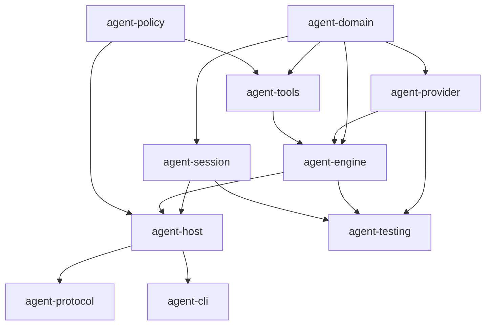

# DeepSeek Harness 与 Pi 源码优缺点对比及 Agent 设计借鉴

> 对比对象：  
> - DeepSeek Harness：`dsh-v0.1.1-rc.2`，commit `b150a551b8d465e31e418e1b2eaf5e79bbb7d28e`  
> - Pi：package `0.84.3`，commit `dcd461925db2edf69a43c8135db1180d418afd54`  
> 依据文档：`deepseek-harness-source-study.md`、`pi-source-study.md` 及对应源码仓库。  
> 方法：静态源码比较；两个仓库均未在本研究环境安装依赖或执行测试。  
> 目标：不是判断谁“绝对更好”，而是回答“如果从零写一个 Agent，哪些设计值得借鉴，哪些复杂度不应过早复制”。

---

## 目录

1. [先给结论](#1-先给结论)
2. [两个项目本质上在解决什么问题](#2-两个项目本质上在解决什么问题)
3. [总体架构对比](#3-总体架构对比)
4. [DeepSeek Harness 的优点](#4-deepseek-harness-的优点)
5. [DeepSeek Harness 的缺点](#5-deepseek-harness-的缺点)
6. [Pi 的优点](#6-pi-的优点)
7. [Pi 的缺点](#7-pi-的缺点)
8. [分维度对比与选型建议](#8-分维度对比与选型建议)
9. [最值得借鉴的设计](#9-最值得借鉴的设计)
10. [不建议直接照搬的设计](#10-不建议直接照搬的设计)
11. [推荐的新 Agent 混合架构](#11-推荐的新-agent-混合架构)
12. [核心接口建议](#12-核心接口建议)
13. [Agent Loop 建议实现](#13-agent-loop-建议实现)
14. [会话与持久化建议](#14-会话与持久化建议)
15. [工具与安全建议](#15-工具与安全建议)
16. [模型 Provider 层建议](#16-模型-provider-层建议)
17. [扩展系统建议](#17-扩展系统建议)
18. [UI、Web 与远程协议建议](#18-uiweb-与远程协议建议)
19. [测试体系建议](#19-测试体系建议)
20. [分阶段实现路线](#20-分阶段实现路线)
21. [不同目标下该参考谁](#21-不同目标下该参考谁)
22. [最终检查清单](#22-最终检查清单)
23. [专业名词与英文解释](#23-专业名词与英文解释)

---

## 1. 先给结论

### 1.1 一句话结论

如果你要从零写一个 Agent，最推荐的不是复制任一项目，而是：

> **用 Pi 的“小而明确的 Agent Loop、Provider 抽象和产品体验”做骨架，用 DeepSeek Harness 的“事件溯源、持久 Inbox、工具安全、生命周期和多客户端恢复”补可靠性。**

### 1.2 如果只能选择一个项目作为起点

- **个人 Coding Agent、CLI Agent、研究原型、单机工具**：优先参考 Pi 当前成熟主链。
- **多用户 Web Agent、长期运行服务、可恢复工作流、企业内部平台**：优先参考 DeepSeek Harness 的架构原则。
- **直接作为 npm 库嵌入**：Pi 的 `pi-ai` 和成熟 `Agent` 更容易理解和裁剪。
- **需要强插件化、HMR、复杂能力组合**：DeepSeek Harness 更完整，但学习和维护成本明显更高。
- **需要真正可靠的持久化**：DeepSeek Harness 当前设计更成熟；Pi 当前 CLI 的 v3 JSONL 不够强，Pi 的下一代 durable Session/SQLite 虽设计优秀，但 AgentHarness 编排尚未完成。

### 1.3 最值得优先复制的十项设计

| 优先级 | 借鉴项 | 主要来源 |
|---|---|---|
| P0 | 小而显式的 Agent Loop | Pi |
| P0 | 统一的流式 Assistant 事件协议 | Pi |
| P0 | 工具的 validate → policy → execute → result 流水线 | 两者 |
| P0 | AbortSignal 贯穿模型、工具、重试和清理 | 两者 |
| P0 | append-only 会话事实，不原地篡改历史 | DeepSeek Harness，Pi session tree |
| P0 | 确定性的 fake Provider 和事件测试 | Pi |
| P1 | 用户输入先持久化 Inbox，再唤醒 Agent | DeepSeek Harness |
| P1 | 文件修改 CAS、锁和原子发布 | DeepSeek Harness |
| P1 | 工具输出截断并 spill 完整结果 | 两者 |
| P1 | snapshot/baseline + 单调序号的断线恢复 | DeepSeek Harness；Pi 新 Protocol |

### 1.4 最不应该过早复制的五项设计

1. 一开始就拆成 DeepSeek Harness 规模的 227 个包；
2. 在业务边界还没稳定时先建设完整 DI/插件/HMR 框架；
3. 一开始支持几十个模型 Provider；
4. 把 TUI、Web、SDK、Workflow、Subagent、MCP 同时列入 MVP；
5. 把“扩展可执行任意 Node 代码”误认为安全插件系统。

---

## 2. 两个项目本质上在解决什么问题

### 2.1 DeepSeek Harness

DeepSeek Harness 更像一个 **Agent 操作系统或 Agent 平台内核**：

- 一切能力通过 Cordis 插件和服务 seam 注入；
- Agent、Session、Tools、LLM、Sandbox、Persistence、Web、Subagent 都能替换；
- 强调生命周期、作用域、HMR、事件恢复和多客户端状态收敛；
- 同一个核心服务 Web、Headless、SDK、ACP、Python 等入口。

它优化的是：

> “一个长期演进、多人开发、能力很多、需要动态组合和恢复的 Agent 平台，怎样不让模块互相绑死？”

### 2.2 Pi

Pi 当前成熟主链更像一个 **产品优先、库分层清楚的 Coding Agent**：

- `pi-ai` 解决多模型；
- `pi-agent-core` 解决 Agent Loop；
- `pi-tui` 解决终端 UI；
- `pi-coding-agent` 把会话、工具、扩展、设置和 UI 组装成产品。

它优化的是：

> “怎样用较直接的代码实现一个真正好用、支持多模型和扩展的终端 Coding Agent？”

Pi 同时在开发下一代 durable `AgentHarness + Session v4 + Protocol + SQLite`，说明它也开始补服务化和崩溃恢复，但这条链尚未接通当前 CLI。

### 2.3 根本差异

| 方面 | DeepSeek Harness | Pi |
|---|---|---|
| 第一目标 | 平台化、能力组合、生命周期与恢复 | Coding Agent 产品、模型兼容与终端体验 |
| 复杂度分布 | 分散在大量插件、服务、scope 和包 | 集中在少数大型 orchestrator 类 |
| 主架构风格 | 插件容器 + 事件溯源 | 分层库 + 显式对象组合 |
| 当前持久化 | 事件日志、projection、write-behind、恢复协调 | 当前 v3 JSONL 树；下一代 v4/SQLite 尚在迁移 |
| 安全关注 | approval、sandbox、CAS、审计 | project trust、进程清理；工具本身较开放 |
| UI 强项 | Web、多客户端、模块化浏览器插件 | 自研 TUI、终端细节和交互体验 |
| 模型强项 | LLM seam 清晰，DeepSeek adapter 深 | 40 个内置 Provider 和大量兼容处理 |
| 主要风险 | 过度复杂、包碎片化、生命周期难理解 | 大类膨胀、双架构并存、当前持久化较弱 |

---

## 3. 总体架构对比

### 3.1 DeepSeek Harness 主链

```text
CLI Profile / Cordis patches
  -> Plugin tree / services
  -> AgentRegistry / AgentFactory
  -> Persistent Inbox
  -> Agent Loop
  -> LLM Runtime / Adapter
  -> Tool Runtime / Approval / Sandbox
  -> Session event log
  -> Persistence coordinator
  -> Web / Headless / SDK projections
```

### 3.2 Pi 当前成熟主链

```text
CLI main
  -> cwd-bound services
  -> AgentSessionRuntime
  -> AgentSession
  -> Agent
  -> agent-loop
  -> ModelRuntime / Provider
  -> ToolDefinition
  -> SessionManager v3 JSONL
  -> TUI / Print / JSON / RPC
```

### 3.3 推荐的新 Agent 主链

```text
Host/API
  -> Command acceptance
  -> Durable inbox append
  -> Run lease
  -> Agent engine
  -> Provider stream
  -> Tool preflight/policy/execute
  -> Durable event append
  -> Projection
  -> CLI/TUI/Web/RPC
```

推荐架构刻意保留 DeepSeek Harness 的可靠性，但不要求先引入 Cordis 级插件框架。

---

## 4. DeepSeek Harness 的优点

### 4.1 能力 seam 非常完整

核心能力不是直接 import 具体实现，而是依赖服务契约：

- `ctx.sessions`；
- `ctx.systemPrompt`；
- `ctx.tools`；
- `ctx.agents`；
- `ctx.agentLoop`；
- `ctx.llm`。

工具依赖 Agent/Tool 服务，而不是某个 Agent Loop 实现。LLM、存储、沙箱和 Web Host 都能替换。

**值得借鉴之处**：业务模块依赖抽象能力，而不是依赖产品组合层。

### 4.2 生命周期设计深入

Cordis Fiber、Effect、Context、inject、realm/isolate 共同处理：

- 服务依赖；
- 插件启动顺序；
- 自动卸载；
- HMR；
- 同名服务隔离；
- 精确 disposer 身份。

AgentHandle 的 dispose 不是“从 Map 删除”，而是 abort、wait idle、释放 scope、注销 Agent/Session、撤销副作用。

**优点**：适合长期运行、动态重载、复杂插件组合，不容易遗留 listener、process 或 registry entry。

### 4.3 Session 是唯一事实源

DeepSeek Harness 把 Session 设计成 append-only event log：

- Agent Inbox 变化写入日志；
- turn/step/tool/result 写入日志；
- surface、projection、客户端状态从日志重建；
- compaction 缩短模型视图，不删除原始历史。

**优点**：

- 可审计；
- 可恢复；
- 可回放；
- 容易解释“为什么 Agent 现在处于这个状态”；
- 多个 UI 可以从相同事实构建不同视图。

### 4.4 Inbox 先持久化再执行

用户输入不是直接调用模型，而是进入持久 Inbox：

- `next-turn`：普通后续任务；
- `next-step`：steering 和当前轮上下文。

领取、删除、替换也记录事件。

**优点**：进程在“用户消息已收到但模型尚未执行”之间崩溃，消息仍然存在。

这是比普通 `agent.prompt()` 更强的可靠性语义。

### 4.5 工具执行安全链更完整

DeepSeek Harness 的工具链不只做 schema validation，还包含：

- policy；
- approval；
- sandbox profile；
- FS observation；
- 版本 token；
- session 级 CAS；
- 原子写；
- spill；
- 进程树清理；
- 结果审计。

特别是文件修改：

```text
先读文件并得到版本
  -> 模型生成修改
  -> 写锁内确认版本仍一致
  -> 写临时文件
  -> 原子替换
```

**优点**：模型不能用过期观察盲目覆盖用户或其他工具刚修改的文件。

### 4.6 取消和竞争条件考虑充分

源码区分：

- caller abort；
- timeout；
- policy denial；
- runner failure；
- job first-wins settlement；
- Agent idle 与 maintenance；
- compaction generation 是否真正取得进展。

**优点**：不是简单调用 `AbortController.abort()`，而是给每种终止原因明确语义。

### 4.7 Web 和多客户端恢复设计成熟

DeepSeek Harness 有：

- RPC 双层 schema validation；
- baseline + sequence；
- connection generation；
- 两条只读 WebSocket；
- higher-seq-wins projection；
- 断线期间 pending interaction 存活；
- 浏览器模块动态组合。

**优点**：客户端不是“收到什么就显示什么”，而是有权威 baseline 和可验证的增量窗口。

### 4.8 同一核心支持多种 Host

Web、Headless、SDK、ACP、Python 都复用相同核心，不需要维护多套 Agent Loop。

**优点**：Host 只负责输入输出和协议，不复制业务状态机。

### 4.9 Subagent、Workflow、MCP、Hooks 体系完整

- one-shot 和 continuable subagent；
- workflow worker thread；
- MCP tool 接入；
- Claude/Codex hooks 兼容；
- child lifecycle 配对；
- continuation ownership。

**优点**：适合构建复杂 Agent 平台，而不只是单 Agent 聊天。

### 4.10 工程机械约束强

- 包 invariant；
- 类型签名与文档校验；
- 模块图、事件矩阵、配置目录生成；
- 100% coverage 目标；
- HMR/teardown/e2e/浏览器/Python/构建产物测试。

**优点**：复杂架构不只依靠团队记忆，而是尽量转化成自动 gate。

---

## 5. DeepSeek Harness 的缺点

### 5.1 227 个包造成明显认知成本

高度拆包带来：

- 跳转频繁；
- 一项功能跨多个 package；
- 改动要理解 profile、bundle、patch、service、consumer；
- package 边界本身成为维护对象；
- 新成员很难快速建立调用图。

对小团队来说，这种结构可能比业务复杂度本身更难维护。

### 5.2 控制流不够直观

真实启动顺序来自：

```text
profile + bundle patch + 用户 patch + inject 依赖 + Cordis 生命周期
```

读某个函数往往看不到“谁创建它、什么时候启动、谁卸载它”。

**风险**：调试问题可能不是函数逻辑错，而是 scope、realm、代次或 teardown 顺序错。

### 5.3 框架知识成为前置条件

要有效开发必须理解：

- Fiber；
- Effect；
- Context；
- inject；
- isolate/realm；
- DSH scope；
- waterfall event；
- patch composition。

这些概念有价值，但也形成较强的“框架税”。

### 5.4 生命周期约束有一部分仍是隐含知识

例如：

- disposer 必须保持精确身份；
- HMR 接管与冷恢复不同；
- scope rebind 和 Cordis isolate 不是一件事；
- maintenance 对外 idle、对内仍占用资源。

**风险**：代码局部看起来正确，组合后才暴露资源泄漏或代次错误。

### 5.5 预览期兼容性风险

研究版本是 RC，`SESSION_FORMAT_VERSION` 仍为 0。

**风险**：

- 公开 API 和 session format 可能变化；
- 直接以其内部包作为长期依赖需要锁版本；
- 迁移成本不能忽略。

### 5.6 配置能力过强，也意味着配置是代码

Profile 中的 `!!js` 和插件 preset 属于受信代码。

**缺点**：

- 配置审计更难；
- 不能把 profile 当普通不可信 YAML；
- 用户 patch 可改变很深的运行语义。

### 5.7 Sandbox 容易被高估

源码明确显示：

- FS sandbox 有些路径只是可信代码 fence，不是内核沙箱；
- Code Runtime worker 是强制终止容器，不是安全隔离；
- 文件 sandbox 不等于网络隔离；
- 各平台 runner 能力不同。

**风险**：产品文案或调用者若只看到 “sandbox” 名称，可能误判安全保证。

### 5.8 DeepSeek Adapter 的基础设施通用性不足

研究版本中 adapter 直接使用 `fetch`，缺少像 Pi 那样统一成熟的 HTTP proxy、Provider 重试和多厂商兼容层。

**影响**：企业代理、连接池、统一 timeout/retry、复杂认证的扩展成本更高。

### 5.9 性能和启动成本难凭静态源码确认

大量插件、动态 patch、模块和生成图可能带来：

- 启动时间；
- 构建时间；
- 内存；
- HMR 复杂度。

这些需要动态基准才能下结论，但结构上确实比直接对象组合更重。

### 5.10 对简单 Agent 可能过度设计

如果目标只是：

```text
接收 prompt -> 调模型 -> 跑几个工具 -> 返回结果
```

直接引入完整 Cordis、227 包、Web projection、workflow 和 persistence coordinator，收益可能小于复杂度。

---

## 6. Pi 的优点

### 6.1 Agent Loop 小而可读

Pi 的低层 Agent Loop 直接展示核心算法：

```text
注入消息
  -> 流式请求模型
  -> 检查工具调用
  -> 执行工具
  -> 回灌结果
  -> 检查 steering/follow-up
  -> 结束
```

没有先要求读者理解大型插件容器。

**优点**：适合学习、复用、单元测试，也便于验证事件顺序。

### 6.2 工具并发语义清楚

Pi 明确规定：

- preflight 按 source order；
- allowed tools 并发执行；
- `tool_execution_end` 按 completion order；
- ToolResultMessage 按 source order；
- 任一工具要求 sequential 时整批串行；
- length 截断的 tool call 全部拒绝执行。

这是很值得直接借鉴的 Agent Loop 细节。

### 6.3 Provider 层非常成熟

Pi 内置约 40 个文本 Provider，并统一：

- 模型目录；
- API key；
- OAuth；
- ambient auth；
- dynamic model refresh；
- thinking level；
- cache；
- usage/cost；
- tool schema；
- cross-provider message replay。

对于要快速支持多模型的 Agent，Pi 的 `pi-ai` 是非常好的参考。

### 6.4 流事件 contract 统一

所有 Provider 输出统一为：

- text start/delta/end；
- thinking start/delta/end；
- tool call start/delta/end；
- done/error。

setup/auth/dynamic import 异常也通过 `lazyStream()` 转成最终 assistant error。

**优点**：Agent、UI、persistence 不需要分别适配每个厂商的异常和流格式。

### 6.5 OAuth 与模型目录并发处理优秀

值得借鉴的细节：

- OAuth double-checked locking；
- CredentialStore per-provider modify；
- refresh generation 防旧结果覆盖新结果；
- publication chain 串行；
- runtime API key overlay 不污染持久凭据；
- stored credential 失败时不偷偷回退环境变量。

### 6.6 当前 Coding Agent 功能完整

`AgentSession` 已接通：

- prompt；
- steer/follow-up；
- model/thinking；
- retry；
- compaction；
- session tree；
- extensions；
- tools；
- export；
- print/JSON/RPC/TUI。

它是可以直接观察完整产品行为的实现，而不仅是接口设计。

### 6.7 会话树简单实用

Pi 当前 SessionManager 用 `parentId + leaf` 实现：

- branch；
- tree navigation；
- fork；
- clone；
- label；
- branch summary；
- compaction boundary。

对单机 Coding Agent，这是比完整 operation event sourcing 更容易落地的方案。

### 6.8 工具实现关注真实边界

例如：

- 同文件 mutation queue；
- BOM/CRLF 保留；
- fuzzy edit；
- process tree kill；
- stdout/stderr 尾部截断；
- 完整输出临时文件；
- `fd`/`rg` managed tool；
- 图片 resize/convert。

这些细节来自真实用户问题，借鉴价值很高。

### 6.9 TUI 完成度高

Pi 的 TUI 不只是“能显示文本”：

- regular/fullscreen 双模式；
- 差分渲染；
- Kitty keyboard；
- bracketed paste；
- ANSI/CJK/grapheme；
- 图片；
- overlay；
- 鼠标选择；
- search；
- 自定义 editor/widget/footer/header。

如果你的 Agent 目标是终端产品，Pi 的 UI 经验比 DeepSeek Harness 更直接。

### 6.10 扩展开发体验较好

Pi 有清晰扩展 API、大量示例和 SDK 文档。扩展 factory 采用 commit/discard，reload 后旧 context 会 stale，避免半加载和旧上下文继续操作新 session。

### 6.11 测试重视回归问题

大量 issue 编号 regression 覆盖：

- event settlement；
- queue；
- compaction；
- network retry；
- stale extension context；
- stdout cleanliness；
- model refresh；
- session tree；
- TUI 宽度和图片。

Pi 还有 Faux Provider 和 online Evals，非常适合测试 Agent 这种非确定系统。

### 6.12 下一代基础设施设计有亮点

虽然尚未完成，但 Pi 新链的以下设计值得单独借鉴：

- strict Session payload；
- operation records；
- pure reducer；
- JSONL torn-tail repair；
- SQLite branch cache；
- writer lease fencing；
- strict CBOR framing；
- client session lease；
- snapshot + progress。

---

## 7. Pi 的缺点

### 7.1 产品复杂度集中到大型类

典型文件：

- `AgentSession` 约 3,440 行；
- `InteractiveMode` 约 6,548 行；
- `PackageManager` 约 2,699 行；
- `SessionManager` 约 1,715 行；
- TUI Editor 约 2,363 行。

与 DeepSeek Harness 的“过度分散”相反，Pi 的风险是“过度集中”。

**影响**：

- 修改一处容易影响很多状态；
- UI controller 承担过多业务协调；
- 单类状态变量很多；
- 后续拆分困难。

### 7.2 当前主链持久化较弱

Pi v3 JSONL：

- 同步 append；
- 没有 writer lease；
- 没有跨进程锁；
- 没有 operation intent log；
- malformed 非 header 行可能跳过；
- 不能恢复执行到一半的工具或 retry；
- 新 session 到首条 assistant 才落盘。

对个人 CLI 够用，对多进程长期服务不够。

### 7.3 两代架构并存造成认知和维护债务

仓库同时有：

- 当前 `AgentSession + SessionManager v3 + JSON RPC`；
- 下一代 `AgentHarness + Session v4/SQLite + CBOR Protocol`。

但下一代 `AgentHarness.prompt/compact/navigate/resume` 仍未实现，CLI 也没有接 SQLite/PiServer。

**风险**：读者容易把设计完成度和生产完成度混为一谈。

### 7.4 Compat 层仍很重要

Coding Agent 和扩展仍依赖 `pi-ai/compat` 的旧全局 registry/stream 语义。

**影响**：

- 新旧 Provider API 并存；
- tree-shaking 和依赖关系更复杂；
- 未来删除 compat 会产生迁移工作。

### 7.5 工具安全默认较开放

当前内置工具：

- 接受绝对路径；
- 没有 workspace containment；
- bash 没有内置 approval gate；
- 没有像 DeepSeek Harness 那样统一 sandbox policy；
- extension 可运行任意 Node 代码。

Project trust 只控制是否加载项目资源，不等于 runtime sandbox。

### 7.6 EventStream 没有内建容量和 backpressure

Provider producer 比 consumer 快时，事件积压在内存 queue。JSON/RPC stdout 额外处理了 backpressure，但通用 EventStream 本身没有上限。

**风险**：极端长流、慢 consumer 或无人消费时可能积累内存。

### 7.7 旧 RPC 验证不够严格

stdin/stdout RPC 主要依赖 `JSON.parse` 和 `switch`，没有 TypeBox schema。新 CBOR Protocol 很严格，但功能链还没完全接到当前 Agent。

### 7.8 扩展权限过大

扩展可以看到/修改 provider payload、headers、工具、session 和进程。这个模型适合“受信本地插件”，不适合第三方不可信插件市场。

### 7.9 模型兼容复杂度很高

支持 40 个 Provider 的代价是：

- 大量 URL/provider/model 特判；
- thinking format 差异；
- tool schema 差异；
- replay metadata 差异；
- model catalog 依赖外部 hydrate/generate。

如果你的 Agent 只支持两三个模型，直接复制这层会带来不必要负担。

### 7.10 新 AgentHarness 的公开形态先于实现完成

接口、错误类型、Session、reducer、SQLite、server/client 已很丰富，但核心编排仍 scaffold。

**教训**：设计下一代架构时，要防止“外围基础设施非常完整，关键 end-to-end 路径仍不可用”。

---

## 8. 分维度对比与选型建议

| 维度 | DeepSeek Harness | Pi | 更值得借鉴的方向 |
|---|---|---|---|
| Agent Loop 可读性 | 被插件和服务层包围 | 小而直接 | Pi |
| 平台扩展性 | 极强 | 强，但更产品化 | 大平台选 DSH，小团队选 Pi |
| LLM Provider | seam 好，内置面较窄 | 多厂商极强 | Pi |
| 当前持久可靠性 | 强 | v3 较弱 | DSH |
| 下一代存储设计 | 已形成完整体系 | v4/SQLite 设计强但编排未完 | 都可参考 |
| 工具安全 | approval/sandbox/CAS 完整 | mutation queue 好，但权限开放 | DSH 为主，Pi 补实现细节 |
| 文件编辑体验 | 版本检查、原子写强 | fuzzy edit、BOM/CRLF、diff 强 | 组合两者 |
| 输出控制 | spill、尾部窗口 | truncate/spill 具体成熟 | 两者 |
| 终端 UI | 不是主要强项 | 非常强 | Pi |
| Web/多客户端 | 成熟 | 新 server 尚迁移 | DSH |
| 插件生命周期 | Cordis/HMR 极强 | factory 事务/stale ctx 简洁 | 中小项目选 Pi，大平台选 DSH |
| Subagent/Workflow | 完整 | 主要通过扩展示例 | DSH |
| MCP/ACP/Python | 完整 | 当前重点不在这里 | DSH |
| 学习成本 | 高 | 中等 | Pi |
| 小团队维护 | 偏重 | 更合适，但要拆大类 | Pi |
| 企业长期服务 | 更匹配 | 当前主链需补持久与权限 | DSH |
| 测试假模型 | 有完整测试体系 | Faux Provider 很直接 | Pi 的测试 API |
| 工程机械 gate | 极强 | 强 | DSH |

---

## 9. 最值得借鉴的设计

### 9.1 借鉴 Pi：保持 Agent Engine 很小

Agent Engine 只负责：

- 读取当前 context；
- 调 Provider；
- 消费 stream；
- 找 tool calls；
- 调 Tool Runtime；
- 回灌 tool results；
- 判断继续或停止。

不要让低层 loop 直接负责：

- UI；
- JSONL 文件路径；
- OAuth 登录界面；
- 包管理；
- theme；
- WebSocket；
- 项目信任存储。

这些属于 Host/Session orchestrator。

### 9.2 借鉴 DeepSeek Harness：命令先落账，再执行

对于用户 prompt、steering、follow-up：

```text
验证输入
  -> append inbox event
  -> durable commit
  -> 返回“已接受”
  -> 唤醒 Agent
```

不要：

```text
收到输入
  -> 先启动模型
  -> 稍后有空再保存
```

前者给出清晰的 at-least-once 接受语义。

### 9.3 借鉴两者：统一事实事件与瞬态流事件

建议分开：

### 持久事实

- user message accepted；
- inbox enqueue/dequeue；
- run/turn/step started；
- assistant finalized；
- tool execution intended；
- tool result finalized；
- retry scheduled；
- compaction committed；
- run finished。

### 瞬态事件

- token delta；
- spinner；
- partial tool JSON；
- bash output chunk；
- UI hover/selection。

持久化所有 token delta 通常成本过高；只持久化能恢复状态的事实。

### 9.4 借鉴 Pi：Provider stream contract

推荐统一为：

```text
start
content_start/delta/end
tool_start/delta/end
done | error
```

要求：

- 一次调用只有一个 terminal event；
- error 也返回最终 AssistantMessage；
- partial 只用于展示，不是最终事实；
- usage 和 raw stop reason 标准化；
- adapter setup error 也进入相同协议。

### 9.5 借鉴 DeepSeek Harness：工具结果必须可审计

工具执行前至少记录：

- tool name；
- toolCallId；
- validated args；
- policy decision；
- approval decision；
- execution environment；
- observation/version token。

执行后记录：

- result content；
- error classification；
- exit code；
- truncation/spill reference；
- timing；
- usage；
- mutation version。

### 9.6 组合两者：文件修改既要 CAS，也要好用

理想 edit：

1. 读文件得到 `{content, version}`；
2. 支持 exact/fuzzy oldText；
3. oldText 唯一；
4. 多 edits 不重叠；
5. 保留 BOM/line ending；
6. 写锁内检查 version；
7. 临时文件 + fsync + atomic rename；
8. 返回 unified patch 和新 version。

DeepSeek Harness 提供可靠性，Pi 提供模型友好的编辑体验。

### 9.7 借鉴两者：大输出必须有双表示

```text
模型上下文：截断预览 + spill reference
持久存储：完整输出或内容寻址对象
UI：默认预览，可展开/按需读取
```

不要把几十 MB bash 输出直接塞进 session event 或模型上下文。

### 9.8 借鉴 DeepSeek Harness：projection 不应成为第二事实源

UI 状态、surface、session summary 应从事件重建。

如果 projection 可独立修改，就会出现：

- 日志说 A；
- UI cache 说 B；
- 模型 context 说 C。

projection 只缓存计算结果，不拥有业务事实。

### 9.9 借鉴 Pi：明确 settlement 边界

需要区分：

- 最后一个 token 已到；
- assistant message 已 finalized；
- tool batch 已完成；
- `agent_end` 已发；
- persistence 和 listener 已完成；
- 子进程和临时资源已清理；
- Agent 真正 idle。

提供一个可信的 `waitForIdle()` / `agent_settled`，而不是把“发了 end event”当作“全部结束”。

### 9.10 借鉴 DeepSeek Harness：恢复必须有进展证明

重试或 overflow recovery 不能无限重复同一状态。

可以记录：

- surface generation；
- compaction generation；
- retry attempt；
- last committed sequence；
- overflowRecoveryUsed。

如果恢复后 generation 没变化，应明确失败，而不是继续循环。

### 9.11 借鉴 Pi：两层重试

- Provider request retry：HTTP 429/5xx、Retry-After、连接失败；
- Agent turn retry：完整 assistant stream 中断或 transient model error。

context overflow 单独处理，不和普通网络 retry 混在一起。

### 9.12 借鉴两者：压缩只改变模型视图

原始历史应保留，compaction 只提交：

- summary；
- covered range；
- retained tail；
- token count；
- usage/cost；
- generation/version。

summary 如果 length stop、调用工具或被取消，不得 commit。

### 9.13 借鉴 Pi：扩展 factory 事务

插件加载期间把注册暂存在 staging area：

```text
factory 成功 -> commit registrations
factory 失败 -> discard + unsubscribe
```

避免插件执行一半后留下工具、event handler 或 Provider。

### 9.14 借鉴 DeepSeek Harness：插件必须有 disposer

所有副作用都要返回 disposer：

- event listener；
- timer；
- child process；
- file watcher；
- route；
- provider registration；
- tool registration；
- UI slot。

reload 时按反向依赖顺序清理。

### 9.15 借鉴客户端架构：baseline + sequence

远程 UI 至少需要：

- authoritative snapshot；
- revision/sequence；
- 增量事件；
- reconnect cursor；
- gap detection；
- stale snapshot rejection。

不要只依赖“WebSocket 从连接后开始推送”，否则断线期间的状态无法补齐。

---

## 10. 不建议直接照搬的设计

### 10.1 不要先造大型插件内核

除非已经确认需要：

- HMR；
- 多套 capability provider；
- 同名服务 isolate；
- 第三方插件；
- 多 Host 动态组合。

否则先用普通构造函数和显式 interface。等出现三个以上真实实现后再抽象。

### 10.2 不要拆出大量“一文件一包”

包边界应该满足至少一个条件：

- 独立发布；
- 独立运行环境；
- 安全边界；
- 明确替换 seam；
- 显著不同依赖。

仅为了“看起来模块化”而拆包，会把源码复杂度变成 workspace 复杂度。

### 10.3 不要把所有产品逻辑塞进 AgentSession 或 InteractiveMode

Pi 的当前实现说明：直接对象组合容易演化成大型 orchestrator。

建议提前拆：

- `RunCoordinator`；
- `RetryController`；
- `CompactionService`；
- `ToolRegistry`；
- `SessionNavigator`；
- `ExtensionHost`；
- `UiProjection`。

但它们可以先是同一个包内的普通模块，不必立刻拆 workspace。

### 10.4 不要同时维护两套生产架构太久

Pi 当前双链是重要警示。下一代架构应采用 vertical slice：

```text
prompt -> model -> tool -> persistence -> resume -> UI
```

先让一条端到端路径工作，再扩展周边。不要先完成所有接口、存储和协议，却让核心 prompt 仍未实现。

### 10.5 不要把“可扩展”当“安全”

插件 API 越强，越接近任意代码执行。若插件不可信，必须：

- 进程隔离；
- capability manifest；
- IPC schema；
- 文件/网络权限；
- resource limit；
- crash isolation。

仅靠 TypeScript interface、project trust 或 stale context 不构成沙箱。

### 10.6 不要把文件沙箱当网络沙箱

文件、进程、网络需要三套独立 policy。一个命令即使只能写 workspace，仍可能上传源码或访问内网。

### 10.7 不要在 MVP 支持几十种 Provider

先选：

- 一个主 Provider；
- 一个 OpenAI-compatible Provider；
- 一个 deterministic fake Provider。

只有实际用户需求出现后再增加厂商兼容。

### 10.8 不要默认保存所有流式 delta

每 token 落库会导致：

- 写放大；
- session 膨胀；
- projection 成本高；
- 崩溃后 partial replay 复杂。

通常保存 final message 和少量 checkpoint 即可。

### 10.9 不要依赖错误字符串作为唯一分类

Pi 为兼容多 Provider 不得不使用大量 error pattern。自己的 Agent 应优先定义：

```text
transport | rate_limit | overload | auth | quota | invalid_request |
context_overflow | policy_denied | timeout | aborted | internal
```

adapter 负责把厂商错误映射为 typed error，同时保留原始诊断。

### 10.10 不要把配置文件变成隐式代码

如果确实允许 JS 配置，应明确标记“受信代码”。普通用户设置应保持纯数据、schema 校验和版本迁移。

---

## 11. 推荐的新 Agent 混合架构

### 11.1 建议模块

初期控制在 8～12 个高内聚模块，不需要 227 个包：

```text
agent-domain        消息、事件、错误、ID、状态类型
agent-provider      模型 Provider 和统一流协议
agent-engine        最小 Agent Loop
agent-tools         Tool registry、validation、execution
agent-policy        approval、filesystem/process/network policy
agent-session       event log、inbox、projection、compaction metadata
agent-host          RunCoordinator、恢复、生命周期
agent-protocol      可选的远程 command/event schema
agent-cli           CLI/TUI adapter
agent-testing       fake provider、fake tools、conformance fixtures
```

在一个应用仓库中，它们可以先是目录；只有真正需要独立发布时再变成 package。

### 11.2 依赖方向



原则：

- Domain 不依赖 UI/Node FS/数据库；
- Engine 不依赖具体 Provider、SQLite、TUI；
- Tools 不依赖 Agent Host；
- UI 只消费 snapshot/event，不拥有业务状态；
- Session Store 不 import 产品 UI。

### 11.3 三层状态

### Durable state

数据库/JSONL 中已经 commit 的事实。

### Runtime state

AbortController、正在运行的 promise、child process、stream reader。

### Projection state

当前消息列表、UI tree、token estimate、active tools、session summary。

三者不要放进同一个可随意修改的大对象。

---

## 12. 核心接口建议

下面是设计草图，不要求逐字复制。

### 12.1 Provider

```ts
interface ModelProvider {
  id: string;
  getModels(signal?: AbortSignal): Promise<Model[]>;
  resolveAuth(input: AuthInput): Promise<ResolvedAuth>;
  stream(
    model: Model,
    context: ModelContext,
    options: StreamOptions,
  ): AssistantEventStream;
}
```

约束：

- stream factory 同步返回可消费对象；
- setup failure 转 terminal error；
- 只能有一个 terminal event；
- error 中含 typed category 和 safe diagnostic；
- usage/cost 标准化。

### 12.2 Tool

```ts
interface Tool<TArgs, TResult> {
  name: string;
  description: string;
  schema: JsonSchema;
  executionMode?: "parallel" | "sequential";

  prepare?(raw: unknown): unknown;
  execute(
    args: TArgs,
    context: ToolContext,
    signal: AbortSignal,
    onUpdate: (update: ToolUpdate) => void,
  ): Promise<TResult>;
}
```

Tool Runtime 统一负责 schema、policy、approval、audit、timeout 和结果规范化，不要求每个工具重复实现。

### 12.3 Session Store

```ts
interface SessionStore {
  append(
    sessionId: SessionId,
    expectedSeq: number,
    events: NewSessionEvent[],
  ): Promise<{ lastSeq: number }>;

  read(sessionId: SessionId, afterSeq?: number): AsyncIterable<SessionEvent>;
  snapshot(sessionId: SessionId): Promise<SessionSnapshot>;
  acquireWriter(sessionId: SessionId): Promise<WriterLease>;
}
```

`expectedSeq` 或 lease fence 防止两个 writer 静默覆盖。

### 12.4 Policy

```ts
interface PolicyEngine {
  evaluateToolCall(input: {
    session: SessionSnapshot;
    tool: ToolDefinition;
    args: unknown;
    observation?: ObservationToken;
  }): Promise<
    | { decision: "allow" }
    | { decision: "ask"; request: ApprovalRequest }
    | { decision: "deny"; reason: string }
  >;
}
```

approval request 和最终决定都应持久化。

### 12.5 Host

```ts
interface AgentHost {
  submit(sessionId: SessionId, input: UserInput): Promise<AcceptedCommand>;
  steer(sessionId: SessionId, input: UserInput): Promise<AcceptedCommand>;
  abort(sessionId: SessionId): Promise<void>;
  waitForIdle(sessionId: SessionId): Promise<void>;
  subscribe(sessionId: SessionId, afterSeq?: number): AsyncIterable<HostEvent>;
}
```

`submit()` 成功应表示输入已 durable accepted，而不是模型已经开始响应。

---

## 13. Agent Loop 建议实现

### 13.1 推荐伪代码

```ts
async function runAgent(sessionId: SessionId, signal: AbortSignal) {
  await using lease = await store.acquireWriter(sessionId);

  while (!signal.aborted) {
    const state = await rebuildProjection(sessionId);
    const input = state.inbox.takeNext();
    if (!input) return;

    await store.append(sessionId, state.seq, [
      event("inbox_dequeued", input.id),
      event("turn_started", newTurnId()),
    ]);

    let continueTurn = true;
    while (continueTurn && !signal.aborted) {
      const current = await rebuildProjection(sessionId);
      const request = await buildModelRequest(current);

      const assistant = await consumeProviderStream(request, signal);
      await appendFinalAssistant(assistant);

      if (assistant.stopReason === "error") {
        continueTurn = await recoverOrRetry(assistant, signal);
        continue;
      }

      const calls = assistant.toolCalls;
      if (calls.length === 0) {
        continueTurn = await injectSteeringOrFinishTurn();
        continue;
      }

      const results = await executeToolBatch(calls, signal);
      await appendToolResultsInSourceOrder(results);
      continueTurn = !results.every(result => result.terminate);
    }

    await appendTurnFinished();
  }
}
```

### 13.2 必须写成不变量的规则

1. 一个 session 同时只有一个 active writer/run；
2. 每个 assistant tool call 最终恰有一个 tool result；
3. tool result 顺序稳定；
4. truncated tool args 不执行；
5. terminal assistant event 恰好一次；
6. abort 后不启动新模型请求；
7. `agent_settled` 只在 listener、persistence、tool cleanup 后发；
8. retry budget 持久化，进程重启后不能归零；
9. compaction commit 原子替换 projection boundary；
10. projection sequence 只能单调增加。

### 13.3 并行工具建议

采用 Pi 的语义：

- prepare/validate/policy 按 source order；
- allowed tool 并发；
- completion event 实时发；
- durable tool results 和下轮模型 context 按 source order；
- sequential tool 让整批串行，或实现更复杂的 dependency scheduler。

MVP 不建议一开始实现任意 DAG 工具调度。

---

## 14. 会话与持久化建议

### 14.1 单机 MVP

可以从 append-only JSONL 开始，但至少应做到：

- 第一行 versioned header；
- 每条 event 有 id/seq/timestamp；
- 单 writer lock；
- append 后 flush；
- torn tail 检测；
- 中间损坏拒绝而不是静默跳过；
- 定期 snapshot；
- schema migration。

Pi 当前 v3 的“跳过 malformed 行”不适合作为高可靠方案；应更接近 Pi 新 JSONL v4。

### 14.2 服务化版本

优先 SQLite/PostgreSQL：

- session row；
- event table；
- operation table；
- inbox table或事件 projection；
- snapshot table；
- content/spill table；
- writer lease/fence；
- sequence unique constraint。

借鉴 Pi SQLite 的 writer lease，也借鉴 DeepSeek Harness persistence coordinator 的 prepare/publish 和 flush barrier。

### 14.3 Event log 与会话树如何结合

推荐分两类记录：

### Conversation entry

有 `id/parentId`，用于 branch/fork/tree。

### Operation record

有 `runId/seq`，用于恢复 tool/retry/queue/compaction。

这与 Pi 下一代 Session 的 entry + record 分离类似，也保留 Pi 当前会话树的好用体验。

### 14.4 恢复策略

启动时：

1. 读取 snapshot；
2. replay snapshot 后 events；
3. 找 open operation；
4. 校验 record log；
5. 对 tool intent 无 result 的情况按 replay policy 处理；
6. 恢复 pending inbox；
7. 只有确认身份和依赖都可用才 resume。

对有副作用工具，默认 `replay: never`。不能仅因为“没看到 result”就重跑写文件或发网络请求。

### 14.5 Compaction 数据结构

```ts
interface CompactionCommitted {
  type: "compaction_committed";
  summary: string;
  coveredThrough: EntryId;
  firstRetained: EntryId;
  tokensBefore: number;
  estimatedTokensAfter: number;
  generation: number;
  usage?: Usage;
}
```

原始 entry 不删除。模型 surface 从最新 compaction boundary 投影。

---

## 15. 工具与安全建议

### 15.1 标准执行阶段

```text
raw arguments
  -> compatibility prepare
  -> schema validation
  -> path canonicalization
  -> policy
  -> approval
  -> durable intent
  -> execute
  -> normalize/truncate/spill
  -> after hook
  -> durable result
```

每一层职责明确，不要让工具自己随意决定哪些阶段存在。

### 15.2 文件工具

必须考虑：

- workspace root policy；
- symlink traversal；
- absolute path；
- read version token；
- same-file queue；
- write lock；
- temp + rename；
- BOM/line ending；
- patch preview；
- maximum bytes；
- binary/image handling。

### 15.3 Shell 工具

必须考虑：

- 明确 shell 和 argv；
- cwd；
- env allowlist；
- secret stripping；
- timeout；
- process group/job object；
- stdout/stderr chunk；
- output byte/line limits；
- spill；
- final exit classification；
- abort race；
- descendant process cleanup。

### 15.4 Sandbox 说明必须精确

产品文档应分别声明：

| 能力 | 是否隔离 |
|---|---|
| 文件读 | 哪些根目录、是否跟随 symlink |
| 文件写 | 哪些根目录、是否只 workspace |
| 进程 | 是否 namespace/job object |
| 网络 | 是否禁网、域名 allowlist |
| 环境变量 | 是否移除 secrets |
| CPU/内存 | 是否有 cgroup/job limit |
| 系统调用 | 是否 seccomp/seatbelt/landlock |

不要只写一个含糊的“安全沙箱”。

### 15.5 Approval

Approval 应是可恢复、可审计的 interaction：

```text
approval_requested
approval_answered
approval_expired/cancelled
```

断线后请求应继续存在；多个浏览器不能重复回答同一 request；默认 fail closed。

---

## 16. 模型 Provider 层建议

### 16.1 从 Pi 借鉴的最小统一模型

至少统一：

- text/thinking/toolCall content；
- user/assistant/toolResult role；
- usage/cost；
- stop reason；
- model capabilities；
- tool schema；
- image support；
- cache metadata；
- provider response id；
- safe diagnostics。

### 16.2 不要丢失 Provider 原始信息

统一字段之外保留：

- rawStopReason；
- responseId；
- responseModel；
- thinking/tool signatures；
- retry-after；
- safe error code；
- redacted diagnostic。

否则跨轮 replay 和故障分析会困难。

### 16.3 认证单独建层

不要把 API key 拼接散落到 adapter：

```text
CredentialStore
  -> AuthResolver
  -> ResolvedAuth
  -> request preparation
  -> Provider
```

OAuth refresh 必须在 store lock 内 double check。登录、刷新、请求认证和 UI 展示是不同职责。

### 16.4 模型目录先简单后动态

MVP 可用静态配置。需要远程目录后再加入：

- stored snapshot；
- checkedAt/etag；
- refresh generation；
- stale publication rejection；
- offline restore；
- credential-specific availability。

### 16.5 错误分类

建议统一：

```ts
type ModelErrorKind =
  | "aborted"
  | "timeout"
  | "transport"
  | "rate_limit"
  | "overloaded"
  | "auth"
  | "quota"
  | "invalid_request"
  | "context_overflow"
  | "content_filter"
  | "protocol"
  | "internal";
```

字符串 pattern 只作为 adapter fallback，不作为领域层唯一依据。

---

## 17. 扩展系统建议

### 17.1 MVP 只提供有限 hooks

建议先有：

- `beforeRun`；
- `transformContext`；
- `beforeModelRequest`；
- `beforeToolCall`；
- `afterToolCall`；
- `afterRun`；
- `sessionStart/sessionShutdown`。

不要一开始暴露所有内部状态。

### 17.2 注册与动作分离

加载阶段允许：

- register tool；
- register command；
- register provider；
- subscribe event。

运行阶段才允许：

- send message；
- set model；
- access session；
- invoke UI。

借鉴 Pi 的 “loading runtime stubs + commit/discard”。

### 17.3 生命周期

每个 extension instance 应绑定：

- session generation；
- abort signal；
- disposer stack；
- permission/capability；
- source identity。

session replacement/reload 后旧 context 立即 stale。

### 17.4 第三方插件安全

如果只支持受信插件，文档必须明确“等价于执行本机代码”。

如果支持不可信插件，应放进独立进程，并通过严格 IPC 暴露能力，不能继续使用 Jiti 直接 import。

---

## 18. UI、Web 与远程协议建议

### 18.1 UI 只做 projection

UI 不直接修改 Agent 内部数组。它发 command，接收：

- command response；
- durable event；
- transient progress；
- authoritative snapshot。

Pi 当前 TUI 的组件和渲染器值得借鉴，但 `InteractiveMode` 中的业务协调不宜原样复制。

### 18.2 CLI/TUI

若终端体验重要，可参考 Pi：

- Component `render(width): string[]`；
- 16ms render throttle；
- input immediate render；
- ANSI-aware width；
- regular/fullscreen 分离；
- virtual terminal 测试。

若只做 MVP，可先使用普通 line output，不要先开发完整自研 TUI。

### 18.3 Web

参考 DeepSeek Harness：

- Host 拥有 Agent；
- Browser 只拥有 projection；
- request/response 与 event stream 分离；
- baseline 有 revision；
- event 有 seq；
- reconnect 检测 gap；
- pending approval 不依赖某条浏览器连接。

### 18.4 协议

早期 JSON 即可，但必须有 schema：

```text
hello(version, auth)
request(id, command)
response(id, ok/error)
event(sessionId, seq, payload)
snapshot(sessionId, revision, state)
```

CBOR 是优化，不是正确性的前提。先把 version、size limit、validation、sequence 和 reconnect 做对。

### 18.5 Backpressure

每条订阅应有：

- bounded queue；
- slow-consumer policy；
- coalescing（例如 token delta）；
- disconnect threshold；
- snapshot resync。

不要让任意慢客户端无限积压内存。

---

## 19. 测试体系建议

### 19.1 第一优先：确定性 Fake Provider

借鉴 Pi Faux Provider：

- 预设 assistant response；
- 模拟 text/thinking/tool delta；
- 模拟 error/abort/length；
- 模拟 cache usage；
- 模拟 deferred；
- 可控制 token 速度；
- 记录调用次数和 context。

没有 deterministic Provider，很难可靠测试 Agent Loop。

### 19.2 Event trace 测试

每个场景断言完整事件序列：

```text
agent_start
turn_start
message_start(user)
message_end(user)
message_start(assistant)
message_update*
message_end(assistant)
tool_start/update/end
message_start/end(toolResult)
turn_end
agent_end
agent_settled
```

尤其测试 abort、listener 延迟和并行工具。

### 19.3 Store conformance

同一套测试跑：

- InMemory；
- JSONL；
- SQLite/PostgreSQL。

覆盖：

- append sequence；
- duplicate id；
- branch query；
- fork；
- writer conflict；
- torn write；
- open operation restore；
- lease expiration。

### 19.4 故障注入

在以下位置强制崩溃：

- inbox commit 后、模型请求前；
- assistant intent 后、final 前；
- tool intent 后、执行前；
- 工具完成后、result commit 前；
- compaction summary 后、commit 前；
- snapshot 写一半；
- writer lease 过期后。

重启后检查是否重复执行副作用工具。

### 19.5 Tool 安全测试

- symlink escape；
- TOCTOU；
- concurrent edit；
- stale version；
- huge line；
- binary file；
- process descendant；
- timeout/abort race；
- spill cleanup；
- approval disconnect。

### 19.6 Protocol 测试

- oversize frame；
- truncated frame；
- duplicate request id；
- invalid schema；
- stale snapshot；
- sequence gap；
- reconnect replay；
- slow consumer；
- unauthorized attach。

### 19.7 在线 Evals

借鉴 Pi Evals，把 prompt/system prompt/tool 描述改动做 baseline/candidate 对照：

- 完成率；
- tool call 正确率；
- token；
- latency；
- cost；
- destructive action rate。

在线 Evals 不能替代单元测试，但能发现“代码没错，模型行为变差”。

---

## 20. 分阶段实现路线

### 20.1 阶段一：最小可用 Agent

只做：

- 一个 Provider + 一个 fake Provider；
- text + tool call stream；
- user/assistant/toolResult；
- read/bash/edit/write；
- in-memory session；
- CLI print；
- AbortSignal；
- Agent Loop 事件测试。

暂不做：Web、插件、HMR、subagent、MCP、多数据库。

### 20.2 阶段二：可靠单机 Agent

增加：

- append-only JSONL；
- durable inbox；
- session tree；
- file mutation queue；
- CAS + atomic write；
- process tree；
- truncate/spill；
- typed error；
- provider/turn 两层 retry；
- compaction；
- crash injection tests。

这个阶段可以形成可靠的个人 Coding Agent。

### 20.3 阶段三：扩展和权限

增加：

- tool/command hooks；
- extension staging transaction；
- disposer stack；
- stale context；
- project trust；
- approval；
- filesystem/process/network policy；
- trusted extension 明示。

### 20.4 阶段四：服务化

增加：

- SQLite/PostgreSQL store；
- writer lease/fence；
- operation records；
- restore reducer；
- command/event protocol；
- snapshot/revision；
- Web/TUI client projection；
- reconnect/gap recovery；
- auth/tenant isolation。

### 20.5 阶段五：高级能力

真实需求出现后再加：

- subagent；
- workflow；
- MCP；
- deferred Provider；
- HMR；
- multi-lane；
- Python SDK；
- browser plugin graph；
- distributed worker。

---

## 21. 不同目标下该参考谁

### 21.1 个人终端 Coding Agent

推荐比例：

```text
Pi 70% + DeepSeek Harness 30%
```

参考 Pi：

- Agent Loop；
- Provider；
- TUI；
- tool UX；
- session tree；
- fake Provider。

补 DeepSeek Harness：

- persistent inbox；
- CAS/atomic write；
- approval；
- 更严格的 session recovery。

### 21.2 企业内部 Coding Agent

推荐比例：

```text
DeepSeek Harness 60% + Pi 40%
```

参考 DSH：

- event sourcing；
- service seam；
- persistence；
- sandbox/approval；
- Web reconnect；
- audit；
- subagent ownership。

参考 Pi：

- Provider 兼容；
- OAuth；
- tool concrete implementation；
- deterministic testing；
- terminal client。

### 21.3 多租户 Web Agent

主要参考 DeepSeek Harness，但额外增加：

- tenant id 全链路；
- server-side auth；
- row-level access；
- secret vault；
- network egress policy；
- per-tenant quotas；
- distributed lease；
- object storage spill。

不能直接把单机 Pi 扩展模型暴露给不可信租户。

### 21.4 Agent SDK/库

主要参考 Pi 的分层：

- `provider`；
- `agent-core`；
- `tool`；
- `testing`。

保持 host-agnostic，不要让 SDK 强依赖 TUI、默认文件目录或全局 registry。

### 21.5 自动化工作流 Agent

参考 DeepSeek Harness：

- workflow worker；
- child lifecycle；
- continuable subagent；
- persistent operation；
- first-wins settlement；
- resume identity。

但工作流 DSL 和通用代码执行要分开，不能把 worker thread 误当安全沙箱。

---

## 22. 最终检查清单

如果准备动手写 Agent，先回答以下问题。

### 22.1 Agent Loop

- [ ] turn 和 step 的定义是什么？
- [ ] 多工具按什么顺序执行和回灌？
- [ ] steering 与 follow-up 在什么边界注入？
- [ ] length stop 下的 tool call 是否禁止执行？
- [ ] 什么时刻才算真正 idle？

### 22.2 Provider

- [ ] 流事件是否统一？
- [ ] 是否只有一个 terminal event？
- [ ] setup error 如何表示？
- [ ] usage/cost/stop reason 如何标准化？
- [ ] OAuth refresh 是否有锁？
- [ ] Provider retry 和 turn retry 是否分开？

### 22.3 Session

- [ ] 用户输入是否先持久化再执行？
- [ ] 是否有单调 sequence？
- [ ] 是否能识别 open operation？
- [ ] 崩溃后副作用工具会不会重复执行？
- [ ] compaction 是否保留原始历史？
- [ ] 是否支持 migration、torn tail 和 writer conflict？

### 22.4 Tools

- [ ] 参数是否 schema validate？
- [ ] policy/approval 是否在 execute 前？
- [ ] 文件修改是否 CAS + atomic？
- [ ] 同文件并发是否串行？
- [ ] shell 是否杀整个进程树？
- [ ] 大输出是否 truncate + spill？
- [ ] 文件、进程、网络权限是否分别说明？

### 22.5 Extensions

- [ ] factory 失败会不会留下半注册状态？
- [ ] 所有副作用是否有 disposer？
- [ ] reload 后旧 context 是否失效？
- [ ] 插件是 trusted code 还是隔离进程？
- [ ] hook 异常是 fail-open 还是 fail-closed？

### 22.6 UI/Protocol

- [ ] snapshot 是否权威？
- [ ] revision/seq 是否单调？
- [ ] 断线是否能补事件或强制重取 snapshot？
- [ ] 慢 consumer 是否有 bounded queue？
- [ ] command、response、event 是否 schema validate？
- [ ] transport auth 与 session authorization 在哪里？

### 22.7 测试

- [ ] 是否有 deterministic fake Provider？
- [ ] 是否断言完整 event trace？
- [ ] 是否有 store conformance？
- [ ] 是否有 crash injection？
- [ ] 是否测试 abort/completion race？
- [ ] 是否有在线 Evals 监测模型行为退化？

---

## 最终建议

### 对第一次写 Agent 的开发者

从 Pi 风格开始：

1. 先实现统一 Provider stream；
2. 写一个 300～800 行内可读的 Agent Loop；
3. 写四个工具和 fake Provider；
4. 把事件顺序测透；
5. 再加 JSONL、重试和 compaction。

不要从 Cordis、HMR、Web、多租户和几十个 Provider 开始。

### 对准备做生产平台的团队

在最小 Loop 可用后，尽快加入 DeepSeek Harness 风格的：

1. durable inbox；
2. append-only event log；
3. projection；
4. tool intent/result；
5. file CAS/atomic write；
6. approval/sandbox/audit；
7. snapshot + sequence reconnect；
8. lifecycle disposer；
9. writer lease/fence；
10. crash recovery tests。

### 最精炼的混合方案

```text
Pi 的 Loop
+ Pi 的 Provider
+ Pi 的 Fake Provider 和工具体验
+ DeepSeek Harness 的 Session/Event/Inbox
+ DeepSeek Harness 的 Tool Policy/CAS/Approval
+ DeepSeek Harness 的多客户端恢复
+ 适量而非全量的插件生命周期
```

这套组合兼顾：

- 可读性；
- 开发速度；
- 模型兼容；
- 工具体验；
- 崩溃恢复；
- 安全性；
- 后续平台化能力。

> 直接复用源码前还应分别核对两个仓库的许可证、版本稳定性和发布承诺；本文重点是架构思想借鉴，不构成代码授权建议。

---

## 23. 专业名词与英文解释

> 本节专门解释全文出现的专业名词、缩写和常见英文。解释以“读懂这两个项目”为目标，不追求教科书式定义。一个词在不同系统里可能有更精确的含义，应以对应源码的接口和注释为准。

### 23.1 最先理解的 20 个词

| 英文/术语 | 中文 | 最通俗的解释 |
|---|---|---|
| Agent | 智能执行体 | 不只是聊天模型，而是“模型 + 工具 + 会话 + 循环控制”组成的程序 |
| Harness | 运行框架/承载平台 | 把模型、工具、记录、安全和界面组织起来的外壳 |
| Agent Loop | Agent 循环 | 不断执行“问模型 → 跑工具 → 把结果交回模型”，直到任务结束 |
| Provider | 模型提供方适配单元 | 负责连接 OpenAI、Anthropic、DeepSeek 等模型厂商 |
| Adapter | 适配器 | 把项目统一格式翻译成某家厂商的格式，再把回复翻译回来 |
| Tool | 工具 | Agent 可调用的外部能力，例如读文件、改文件、执行命令 |
| Tool Call | 工具调用请求 | 模型提出“请调用某工具，并使用这些参数” |
| Tool Result | 工具结果 | 宿主执行工具后交还给模型的结果 |
| Session | 会话 | 一次长期任务的消息、工具、设置和运行历史 |
| Context | 上下文 | 本次请求发给模型的 system prompt、历史消息和工具定义 |
| Inbox | 收件箱/待办队列 | 已经收到、但 Agent 尚未处理的用户消息 |
| Event | 事件 | 系统中已经发生的一项事实，例如“工具开始”“消息完成” |
| Snapshot | 快照 | 某一时刻完整的状态副本 |
| Projection | 投影/派生视图 | 从事件历史计算出的当前状态，例如当前消息列表 |
| Persistence | 持久化 | 把内存状态保存到 JSONL、SQLite 等存储，重启后还能恢复 |
| Durable | 可持久恢复的 | 不只存在内存里，进程崩溃后仍能找回 |
| Compaction | 上下文压缩 | 把旧对话总结成摘要，减少发给模型的 token |
| Retry | 重试 | 临时失败后再次执行请求 |
| Sandbox | 沙箱 | 限制代码或命令能访问哪些文件、网络和系统能力 |
| Extension/Plugin | 扩展/插件 | 在不修改核心代码的情况下增加工具、命令、模型或界面 |

### 23.2 Agent 运行流程相关术语

| 英文/术语 | 中文解释 | 在本文中的含义 |
|---|---|---|
| Run | 一次运行 | Agent 从被唤醒到再次稳定空闲的一段工作 |
| Turn | 一轮对话 | 通常是一条用户输入对应的 assistant 回复及其工具执行 |
| Step | 一个步骤 | 一次模型请求和随后的一批工具调用，粒度通常比 Turn 小 |
| Engine | 引擎 | 真正执行 Agent Loop 的核心代码 |
| Runtime | 运行时 | 当前进程中真正工作的对象、状态、连接和资源集合 |
| Host | 宿主 | 拥有 Agent 的程序，例如 CLI 进程或 Web Server |
| Orchestrator | 编排器 | 决定各组件以什么顺序协作的对象；`AgentSession` 就承担很多编排职责 |
| Coordinator | 协调器 | 专门处理并发、顺序和提交边界的组件，例如 persistence coordinator |
| Lifecycle | 生命周期 | 一个对象从创建、启动、运行到停止、释放的全过程 |
| State | 状态 | 当前系统保存的信息，例如 idle、running、aborting |
| State Machine | 状态机 | 规定状态可以怎样合法转换的模型 |
| Idle | 空闲 | 当前没有活动的 Agent 工作；有些系统还要求清理和 listener 也已完成 |
| Active/Running | 活动/运行中 | 正在请求模型、执行工具或做维护 |
| Pending | 等待中 | 已登记但尚未完成，例如 pending tool call |
| Maintenance | 维护阶段 | 不属于普通对话轮次，但要独占 Agent 的压缩、清理等工作 |
| Wake/Wakeup | 唤醒 | 通知空闲 Agent 有新任务需要处理 |
| Queue | 队列 | 按顺序保存待处理工作的数据结构 |
| Dequeue/Drain | 出队/排空 | 从队列取出一项或全部项 |
| Steering | 中途引导 | 当前工具批完成后，尽快插入的新指示 |
| Follow-up | 后续消息 | Agent 原本准备结束时才开始处理的新任务 |
| Preflight | 执行前检查 | 真正调用模型或工具前的参数、权限、状态检查 |
| Prepare | 准备 | 把原始输入整理成可以执行的格式 |
| Execute | 执行 | 真正运行工具或操作 |
| Finalize | 最终定稿 | 把 partial 状态变成最终消息或工具结果 |
| Settlement | 完全收敛/结算完成 | 不只主任务结束，异步 listener、持久化和清理也全部完成 |
| Quiescence | 完全静止 | 系统没有正在运行、排队或清理的工作，比普通 idle 更严格 |
| First-wins | 第一个结果获胜 | 多个完成/取消信号竞争时，只接受最先到的一个 |
| Short-circuit | 短路 | 某个处理器直接给出结果，不再运行后续处理器 |
| Terminate | 终止 | 明确要求当前批次或 Agent 不再继续下一轮 |

### 23.3 消息、上下文和会话术语

| 英文/术语 | 中文解释 | 通俗说明 |
|---|---|---|
| System Prompt | 系统提示词 | 给模型的最高层工作规则、角色、工具说明和项目约束 |
| User Message | 用户消息 | 用户输入给 Agent 的内容 |
| Assistant Message | 模型消息 | 大模型生成的文本、思考或工具调用 |
| Tool Result Message | 工具结果消息 | 执行工具后作为一条消息放回模型上下文 |
| Message Role | 消息角色 | 表示消息来自 user、assistant 还是 tool |
| Surface | 模型表面/模型视图 | 从完整会话历史中选出本次真正给模型看的内容 |
| Transcript | 对话记录 | 用户、assistant 和工具结果组成的可读历史 |
| Entry | 条目/节点 | 会话中的一条记录，可能是消息、压缩或设置变化 |
| Record | 操作记录 | 描述运行意图和过程的日志，例如 tool started、retry scheduled |
| Log | 日志 | 按顺序保存的事件或记录集合 |
| Append-only | 只追加 | 旧记录不修改不删除，只在末尾增加新记录 |
| Event Sourcing | 事件溯源 | 保存“发生过什么”，当前状态通过重放事件计算出来 |
| Source of Truth | 唯一事实源 | 最权威的数据；其他缓存或 UI 状态都应从它推导 |
| Replay | 重放 | 按顺序重新读取历史事件，恢复当前状态 |
| Resume | 继续执行 | 重启后从之前停下的位置继续 |
| Recovery | 故障恢复 | 进程或机器异常后恢复到合法状态 |
| Checkpoint | 检查点 | 保存的中间状态，恢复时不必从最早事件重新计算 |
| Branch | 分支 | 从历史某一点走出另一条对话路径 |
| Fork | 分叉/复制分支 | 从某个历史节点创建新的会话或工作分支 |
| Leaf | 叶节点 | 当前会话分支最末端的节点 |
| Parent ID | 父节点 ID | 表示一条记录接在哪条旧记录之后 |
| Lane | 工作车道 | 同一 Session 内可独立推进的一条分支和运行状态 |
| Projection Store | 投影存储 | 保存从事件计算出的读取优化结果 |
| Context Window | 上下文窗口 | 模型一次请求最多能容纳的 token 数量 |
| Retained Tail | 保留尾部 | 压缩后仍保留的最近消息 |
| Branch Summary | 分支摘要 | 离开某条分支时，为它生成的简短总结 |
| Operation Intent | 操作意图 | 执行前记录“准备做什么”，用于审计和崩溃恢复 |
| Open Operation | 未完成操作 | 已开始但还没有结束记录的运行 |
| Generation | 代次/世代号 | 每次重建或刷新递增，用来识别旧异步结果 |
| Sequence/Seq | 序号 | 按发生顺序递增的数字，用于排序和检测缺失事件 |
| Revision | 修订版本号 | 某份 snapshot 或设置的版本；新版本不能被旧版本覆盖 |
| Monotonic | 单调递增 | 数值只增不减，例如 seq 和 revision |
| Authoritative | 权威的 | 应以它为准，例如 authoritative snapshot |

### 23.4 模型和 Provider 相关术语

| 英文/缩写 | 中文解释 | 通俗说明 |
|---|---|---|
| AI | Artificial Intelligence，人工智能 | 本文主要指大模型驱动的软件能力 |
| LLM | Large Language Model，大语言模型 | 例如 DeepSeek、GPT、Claude、Gemini |
| Model | 模型 | 某个具体模型版本及其能力、价格和上下文限制 |
| Provider | 提供方 | 提供模型、认证和请求实现的厂商或服务 |
| API | Application Programming Interface，应用程序接口 | 程序之间调用功能的约定 |
| SDK | Software Development Kit，软件开发工具包 | 给开发者使用的一组 API、类型和辅助代码 |
| Adapter | 适配器 | 把统一消息转换成某家 API 所需格式 |
| Compatibility/Compat | 兼容层 | 处理旧 API 或不同厂商细节差异的代码 |
| Model Catalog | 模型目录 | 所有可用模型及其能力、价格、窗口大小列表 |
| Capability | 能力 | 模型或工具支持什么，例如图片、思考、工具调用 |
| Modality | 模态 | 输入/输出类型，例如文字、图片、音频 |
| Reasoning/Thinking | 推理/思考 | 模型在最终回答前生成的内部或摘要推理内容 |
| Thinking Level | 思考等级 | low、medium、high 等推理强度设置 |
| Signature | 签名/不透明凭证 | 厂商返回的 replay 数据，不一定是密码学签名 |
| Token | 模型计量单位 | 文字被模型切分后的单位；一个汉字不一定恰好一个 token |
| Usage | 用量 | 输入、输出、缓存和推理消耗的 token 统计 |
| Cost | 费用 | 根据模型价格和 usage 估算或计算的金额 |
| Input/Output Tokens | 输入/输出 token | 发给模型和模型生成的 token 数 |
| Cache Read/Write | 缓存读/写 | 从模型厂商 prompt cache 读取或写入的 token |
| Prompt Cache | 提示词缓存 | 厂商缓存长对话的共同前缀，减少重复计算和费用 |
| KV Cache | Key-Value Cache | 模型推理内部保存前文计算结果的缓存 |
| Sampling | 采样 | 模型从候选 token 中选择输出的过程 |
| Temperature | 温度参数 | 控制输出随机程度，越高通常越随机 |
| Max Tokens | 最大输出 token | 限制一次回复最多生成多少内容 |
| Stop Reason | 停止原因 | 正常结束、长度上限、工具调用、错误或取消 |
| Raw Stop Reason | 原始停止原因 | Provider 未统一前返回的厂商原值 |
| Response ID | 响应 ID | 厂商为一次模型回复分配的标识 |
| Cross-provider Replay | 跨提供方重放 | 把 A 厂商历史转换后发给 B 厂商 |
| Deferred Response | 延迟响应 | 先返回取件句柄，模型任务在后台继续，之后轮询结果 |
| Fake/Faux Provider | 假模型提供方 | 测试用的可控 Provider，不真正调用在线模型 |
| Deterministic | 确定性的 | 同样输入和配置总产生同样结果，便于测试 |
| Non-deterministic | 非确定性的 | 结果可能变化，大模型通常具有这种特性 |

### 23.5 流式处理和网络术语

| 英文/缩写 | 中文解释 | 通俗说明 |
|---|---|---|
| Stream/Streaming | 流/流式传输 | 回复不是一次到齐，而是一小段一小段到达 |
| Event Stream | 事件流 | 可以不断读取事件，最后再得到最终结果 |
| Delta | 增量 | 相比上次新增的一小段文字或参数 |
| Partial | 部分结果 | 尚未结束的临时消息 |
| Terminal Event | 终止事件 | 表示这条 stream 成功或失败结束的最后事件 |
| HTTP | Hypertext Transfer Protocol | 常见的请求/响应网络协议 |
| SSE | Server-Sent Events | 服务器通过一个 HTTP 连接持续向客户端推送文本事件 |
| WebSocket | Web 套接字 | 客户端和服务器可长期双向传消息的连接 |
| Request | 请求 | 客户端发给服务端的调用 |
| Response | 响应 | 服务端对 request 的回答 |
| Payload | 载荷/正文数据 | 请求或事件真正携带的数据对象 |
| Header | 请求头 | HTTP 请求的附加元数据，例如认证、content type |
| Authorization | 认证头 | 告诉服务端调用者凭据的 header |
| Status Code | 状态码 | HTTP 的 200、401、429、500 等结果编号 |
| Rate Limit | 速率限制 | 服务端限制单位时间内请求次数或 token 数 |
| Retry-After | 重试等待提示 | 服务端告诉客户端多久后再试 |
| Timeout | 超时 | 操作超过规定时间后终止 |
| Transient Error | 临时错误 | 网络抖动、过载等稍后重试可能成功的错误 |
| Deterministic Error | 确定性错误 | 参数错误、余额不足等重复执行仍会失败的错误 |
| Backoff | 退避 | 每次重试前逐步延长等待，例如 2、4、8 秒 |
| Exponential Backoff | 指数退避 | 等待时间按倍数增长 |
| Backpressure | 背压 | 下游处理不过来时，要求上游减慢或暂停 |
| Bounded Queue | 有界队列 | 有最大容量的队列，防止慢消费者导致无限内存增长 |
| Slow Consumer | 慢消费者 | 读取事件速度比生产速度慢的客户端 |
| Reconnect | 重新连接 | 网络断开后再次建立连接 |
| Resync | 重新同步 | 丢失增量后重新获取完整 snapshot |
| Gap Detection | 缺口检测 | 根据 seq 判断中间是否漏掉了事件 |
| Correlation ID | 关联 ID | 把 response 与对应 request 配对的编号 |
| Connection Generation | 连接代次 | 标识这是第几次连接，旧连接结果不能影响新连接 |
| Lazy Load | 延迟加载 | 真正需要时才加载模块或建立资源 |
| Dynamic Import | 动态导入 | 运行时使用 `import()` 加载代码 |

### 23.6 认证和凭据术语

| 英文/缩写 | 中文解释 | 通俗说明 |
|---|---|---|
| Authentication/Auth | 身份认证 | 确认“你是谁、是否有调用资格” |
| Authorization | 权限授权 | 确认“你能做什么”；与 authentication 不完全相同 |
| Credential | 凭据 | API key、access token、refresh token 等秘密信息 |
| API Key | API 密钥 | 厂商分配的调用密钥 |
| OAuth | 开放授权协议 | 通过浏览器登录或设备码取得访问 token 的标准流程 |
| Access Token | 访问令牌 | 真正用于请求 API，通常有效期较短 |
| Refresh Token | 刷新令牌 | access token 过期后用它换取新 token |
| Ambient Auth | 环境认证 | 从环境变量、AWS profile、系统文件等自动发现凭据 |
| Auth Resolver | 认证解析器 | 按优先级从 request、存储、环境中找到最终凭据 |
| Credential Store | 凭据存储 | 安全保存和并发更新认证信息的组件 |
| Double-checked Locking | 双重检查锁 | 加锁前检查一次，加锁后再检查，避免多人重复刷新 token |
| Secret | 秘密 | 不应写进日志、UI 或普通配置的敏感信息 |
| Redaction | 脱敏 | 删除或遮盖敏感字段 |
| Tenant | 租户 | 多用户系统中彼此隔离的客户或组织 |
| Multi-tenant | 多租户 | 同一服务同时服务多个隔离用户/组织 |
| Row-level Access | 行级权限 | 数据库层限制用户只能访问属于自己的记录 |
| Secret Vault | 密钥保险库 | 专门保存和轮换秘密的服务 |

### 23.7 工具、安全和文件一致性术语

| 英文/缩写 | 中文解释 | 通俗说明 |
|---|---|---|
| Schema | 数据结构规则 | 规定对象有哪些字段、字段是什么类型 |
| JSON Schema | JSON 结构规范 | 用 JSON 风格描述和验证数据结构 |
| TypeBox | TypeScript schema 库 | 同时生成运行时 schema 和 TypeScript 类型 |
| Validation | 校验 | 检查输入是否符合 schema 和业务规则 |
| Policy | 策略 | 决定某个操作允许、询问还是拒绝 |
| Policy Engine | 策略引擎 | 集中执行权限和安全规则的组件 |
| Approval | 审批/用户确认 | 危险操作执行前询问用户是否允许 |
| Audit | 审计 | 保存谁在何时请求、批准和执行了什么 |
| Capability | 能力许可 | 一个组件被明确授予的操作能力 |
| Fail-open | 失败时放行 | 检查系统出错后仍允许操作，安全性较低 |
| Fail-closed | 失败时拒绝 | 无法确认安全时默认禁止，安全性较高 |
| Sandbox | 沙箱 | 限制文件、进程、网络、系统调用等权限的隔离环境 |
| Containment | 边界限制 | 保证路径或操作不逃出规定范围 |
| Workspace | 工作区 | Agent 被允许操作的项目目录 |
| FS | File System，文件系统 | 文件和目录相关能力 |
| Canonical Path | 规范真实路径 | 消除 `..`、相对路径或软链接歧义后的路径 |
| Realpath | 真实路径 | 解析 symlink 后的最终文件系统路径 |
| Symlink | 符号链接/软链接 | 一个路径指向另一个路径 |
| Path Traversal | 路径穿越 | 通过 `../` 或 symlink 访问允许目录之外的位置 |
| CAS | Compare-And-Swap，比较后交换 | 只有文件仍是之前读到的版本时才允许写入 |
| Observation Token | 观察版本令牌 | 读文件时获得、写文件时用于确认没被别人改过的版本 |
| TOCTOU | Time Of Check To Time Of Use | 检查和使用之间数据发生变化造成的竞态 |
| Atomic Write | 原子写 | 要么完整写入成功，要么旧文件保持不变，不出现半文件 |
| Temporary File | 临时文件 | 先把完整新内容写到旁边，再替换正式文件 |
| `fsync` | 强制刷盘 | 要求操作系统把缓冲数据真正提交到存储设备 |
| Rename | 重命名/替换 | 同文件系统内常用于原子发布临时文件 |
| Lock | 锁 | 防止多个执行者同时修改同一资源 |
| Mutation | 修改操作 | 会改变文件或状态的动作 |
| Mutation Queue | 修改队列 | 对同一文件的修改按顺序执行 |
| Replay Policy | 重放策略 | 崩溃恢复时决定某个工具能否重新执行 |
| Side Effect | 副作用 | 修改文件、发网络请求等超出返回值的外部影响 |
| Idempotent | 幂等 | 同一操作执行多次，最终效果与执行一次相同 |
| At-least-once | 至少一次 | 保证不会漏执行，但可能重复 |
| At-most-once | 至多一次 | 保证不重复，但失败时可能没执行 |
| Exactly-once | 恰好一次 | 既不漏也不重复；分布式副作用中实现成本很高 |

### 23.8 进程、取消和输出术语

| 英文/缩写 | 中文解释 | 通俗说明 |
|---|---|---|
| Process | 进程 | 操作系统中运行的程序实例 |
| Child Process | 子进程 | Agent 启动的 shell、git、test 等外部程序 |
| Process Tree | 进程树 | 子进程及它继续创建的后代进程 |
| Process Group | 进程组 | Unix 中可整体发送信号的一组进程 |
| PID | Process ID，进程编号 | 操作系统分配给进程的数字 |
| Signal | 信号 | Unix 中通知进程停止、继续或退出的机制 |
| Abort | 中止 | 调用者主动要求正在运行的操作停止 |
| Cancel | 取消 | 泛指撤销尚未完成的操作 |
| AbortController | 中止控制器 | JavaScript 中发出 abort 的对象 |
| AbortSignal | 中止信号 | 传给模型、工具和 sleep，使其感知取消 |
| Race Condition | 竞态条件 | 多个异步操作先后顺序不确定导致错误 |
| Concurrency | 并发 | 多项工作时间上重叠推进 |
| Parallel | 并行 | 多项工作同时执行 |
| Sequential | 串行 | 一项完成后再执行下一项 |
| Promise | 异步结果对象 | 代表未来会成功或失败的结果 |
| Callback | 回调函数 | 某件事发生后调用的函数 |
| Listener | 监听器 | 订阅事件并在事件发生时运行的回调 |
| stdio | Standard I/O，标准输入输出 | stdin、stdout、stderr 的统称 |
| stdin | 标准输入 | 程序读取命令或数据的输入流 |
| stdout | 标准输出 | 程序正常输出结果的流 |
| stderr | 标准错误 | 程序输出错误和诊断信息的流 |
| Exit Code | 退出码 | 命令结束时返回的数字，通常 0 表示成功 |
| Truncate | 截断 | 只保留输出的一部分 |
| Spill | 溢出保存 | 大内容不内联，改为保存到文件或对象存储 |
| Chunk | 数据块 | 流式读取的一小段 bytes 或文本 |
| Buffer | 缓冲区 | 暂时保存二进制或文本数据的内存区域 |
| Cleanup | 清理 | 关闭文件、连接、timer、进程等资源 |
| Best-effort | 尽力而为 | 尝试完成，但清理失败通常不覆盖原始错误 |
| Resource Leak | 资源泄漏 | listener、timer、文件句柄或进程没有释放 |

### 23.9 持久化和数据库术语

| 英文/缩写 | 中文解释 | 通俗说明 |
|---|---|---|
| JSON | JavaScript Object Notation | 常见的文本数据格式 |
| JSONL | JSON Lines | 每一行都是一个独立 JSON 对象，适合追加日志 |
| SQL | Structured Query Language | 关系数据库查询语言 |
| SQLite | 嵌入式数据库 | 数据保存在单个本地文件中的关系数据库 |
| PostgreSQL | 服务型关系数据库 | 常用于多用户、服务化生产系统 |
| Transaction | 事务 | 一组数据库操作要么全部成功，要么全部撤销 |
| Commit | 提交 | 确认事务或变更正式生效 |
| Rollback | 回滚 | 事务失败后撤销已做的修改 |
| WAL | Write-Ahead Log，预写日志 | 数据页修改前先写日志，提高崩溃恢复和并发能力 |
| Migration | 数据迁移 | 数据结构升级时把旧版本转换为新版本 |
| Index | 索引 | 用额外数据结构加速数据库查询 |
| FTS | Full-Text Search，全文搜索 | 按文本内容搜索大量记录 |
| Cache | 缓存 | 保存计算结果以便快速再次使用 |
| Branch Cache | 分支缓存 | 为会话树路径预计算的查询加速数据 |
| Writer Lease | 写者租约 | 在一段时间内允许某个实例独占写入 session |
| TTL | Time To Live，存活时间 | lease 或缓存过多久失效 |
| Heartbeat | 心跳 | 写者定期续租，证明自己仍然存活 |
| Fence/Fencing Token | 栅栏令牌 | 接管写权限时递增，旧写者醒来也不能继续写 |
| Content-addressed | 内容寻址 | 用内容哈希作为对象标识，相同内容可复用 |
| Blob | 大二进制对象 | 图片、完整工具输出等较大数据 |
| Flush | 刷新/刷出 | 把内存缓冲提交给文件或下游 |
| Flush Barrier | 刷新屏障 | 等待此前所有异步写入都完成的边界 |
| Write-behind | 延后写入 | 先更新内存，再在后台批量持久化 |
| Torn Write/Torn Tail | 撕裂写/半截尾行 | 崩溃导致文件最后只写了一部分 |
| Corruption | 数据损坏 | 日志或数据库出现不可能、无法正确解释的状态 |

### 23.10 架构和插件术语

| 英文/缩写 | 中文解释 | 通俗说明 |
|---|---|---|
| Architecture | 架构 | 系统如何拆分、依赖和协作的整体设计 |
| Module | 模块 | 一组相关代码 |
| Package | 包 | 可独立构建或发布的代码单元 |
| Workspace | 工作区包集合 | Monorepo 中由 npm/pnpm 管理的一组 package |
| Monorepo | 单仓多项目 | 多个包放在同一个 Git 仓库 |
| Dependency | 依赖 | 一个模块需要另一个模块才能工作 |
| Coupling | 耦合 | 模块彼此依赖的紧密程度 |
| Cohesion | 内聚 | 一个模块内部功能是否围绕同一职责 |
| Boundary | 边界 | 两个模块或信任区域之间的分界 |
| Contract | 契约 | 调用双方必须遵守的输入、输出和错误规则 |
| Interface | 接口 | TypeScript 中描述对象应有哪些成员的类型 |
| Abstraction | 抽象 | 隐藏具体实现，只暴露稳定概念和能力 |
| Seam | 可替换接缝 | 可以替换实现而不改调用方的接口位置 |
| DI | Dependency Injection，依赖注入 | 从外部把依赖传入，而不是模块内部写死创建 |
| IoC | Inversion of Control，控制反转 | 由框架决定何时创建和调用组件 |
| Registry | 注册表 | 按名称保存 Provider、Tool、Agent 等对象的集合 |
| Factory | 工厂函数 | 专门负责创建对象或插件实例的函数 |
| Plugin | 插件 | 可安装、卸载的功能模块 |
| Extension | 扩展 | Pi 对插件系统常用的名称 |
| Hook | 钩子 | 在特定执行点允许外部代码介入 |
| Middleware | 中间件 | 请求经过的一串处理器，可修改或终止流程 |
| Waterfall | 瀑布式处理链 | 前一个处理结果传给后一个，可调用 next 或短路 |
| Event Bus | 事件总线 | 模块通过发布和订阅事件通信 |
| Cordis | DeepSeek Harness 使用的插件框架 | 管理 Context、Service、Fiber、Effect 和生命周期 |
| Context（Cordis） | 服务容器/作用上下文 | 插件通过 `ctx.xxx` 取得当前可见服务 |
| Service | 服务 | 插件向其他模块提供的一组能力 |
| Inject | 注入声明 | 插件声明启动前依赖哪些服务 |
| Fiber | 插件运行实例 | 某个插件本次启动对应的生命周期对象 |
| Effect | 可撤销副作用 | 注册 listener、service 等时同时记录如何卸载 |
| Scope | 作用域 | 一个 Agent 或插件能看见哪些对象和注册项 |
| Realm | 服务领域/实例边界 | 控制服务实例属于哪个隔离区域 |
| Isolate | 隔离实例 | 让同名服务在不同组合中拥有独立实例 |
| HMR | Hot Module Replacement，热模块替换 | 进程不退出时卸载旧模块并加载新模块 |
| Disposer | 释放函数 | 撤销注册、关闭资源的函数 |
| Dispose | 释放 | 执行对象完整的停止和清理流程 |
| Stale Context | 过期上下文 | reload 或换 session 后，仍指向旧运行时的 context |
| Bind/Rebind | 绑定/重新绑定 | 把 UI 或动作连接到当前 session；替换后重新连接 |
| Register/Unregister | 注册/注销 | 把能力加入或移出 registry |
| Staging Area | 暂存区 | 插件加载成功前暂存注册内容 |
| Commit/Discard | 提交/丢弃 | factory 成功就应用注册，失败就全部撤销 |
| Profile | 启动配置组合 | DeepSeek Harness 中选择一组插件和 patch 的配置 |
| Bundle | 组合包 | 向 profile 增加一组插件配置 |
| Patch/Overlay | 补丁/覆盖层 | 在基础配置上增加或覆盖字段 |
| Override | 覆盖 | 用新配置或实现替代默认值 |
| Fallback | 后备方案 | 首选不可用时使用的替代方案 |
| Facade | 外观层 | 用更简单的接口包住复杂内部系统 |

### 23.11 UI 和终端术语

| 英文/缩写 | 中文解释 | 通俗说明 |
|---|---|---|
| UI | User Interface，用户界面 | 用户看到和操作的界面 |
| UX | User Experience，用户体验 | 使用产品时的整体感受 |
| CLI | Command-Line Interface，命令行界面 | 通过命令和普通文本与程序交互 |
| TUI | Terminal User Interface，终端用户界面 | 在终端中绘制选择器、编辑器和滚动区域 |
| Component | 组件 | 可以独立渲染和处理输入的 UI 单元 |
| Render | 渲染 | 把状态转换成屏幕内容 |
| Differential Rendering | 差分渲染 | 只重画与上次不同的行，减少闪烁 |
| Main Screen | 主屏 | 终端正常使用、会保留 scrollback 的屏幕 |
| Alternate Screen | 备用全屏 | Vim 等程序使用的临时全屏缓冲区 |
| Regular Mode | 普通模式 | Pi 在主屏中绘制，历史保留在终端滚屏 |
| Fullscreen Mode | 全屏模式 | Pi 自己管理固定大小的 alternate screen |
| Viewport | 视口 | 当前屏幕能看到的那一部分内容 |
| Overlay | 浮层 | 显示在主内容上面的弹窗或面板 |
| Focus | 焦点 | 当前接收键盘输入的组件 |
| Scrollback | 回滚历史 | 终端保存的旧输出，可向上滚动查看 |
| Raw Mode | 原始输入模式 | 键盘按键直接交给程序，不由终端行编辑 |
| Bracketed Paste | 带边界的粘贴 | 终端告诉程序这段输入是一次粘贴，不是逐键输入 |
| ANSI Escape Sequence | ANSI 转义序列 | 控制颜色、光标和屏幕的特殊字符 |
| CSI | Control Sequence Introducer | 常用于移动光标、清屏、键盘事件 |
| OSC | Operating System Command | 常用于标题、颜色查询、超链接、剪贴板 |
| Grapheme | 字素 | 用户看到的一个完整字符，可能由多个 Unicode code point 组成 |
| CJK | Chinese/Japanese/Korean | 中日韩字符，终端中通常占两列 |
| UTF-8 | Unicode 编码 | 常见的可变长度文本编码 |
| BOM | Byte Order Mark | 某些文本文件开头的不可见编码标记 |
| LF | Line Feed | Unix 换行 `\n` |
| CRLF | Carriage Return + Line Feed | Windows 换行 `\r\n` |
| IME | Input Method Editor，输入法 | 中文、日文等文字输入系统 |
| Kitty Protocol | Kitty 终端协议 | 支持更完整键盘事件和图片的终端协议 |

### 23.12 远程协议和编码术语

| 英文/缩写 | 中文解释 | 通俗说明 |
|---|---|---|
| Protocol | 协议 | 两个进程交换消息时共同遵守的格式和顺序 |
| RPC | Remote Procedure Call，远程过程调用 | 像调用函数一样向另一个进程发送命令 |
| IPC | Inter-Process Communication，进程间通信 | 不同进程之间交换数据的方式 |
| Command | 命令 | 客户端要求服务端执行的操作 |
| Response Envelope | 响应信封 | 包含 request id、成功/失败和结果的外层对象 |
| Event Envelope | 事件信封 | 包含事件类型、session 和序号的外层对象 |
| Wire Format | 线上格式 | 数据真正通过 socket/pipe 发送时的编码 |
| Frame | 帧 | 一条完整消息的字节包 |
| Length Prefix | 长度前缀 | 在消息前写明后面有多少字节 |
| CBOR | Concise Binary Object Representation | 类似 JSON 的紧凑二进制编码 |
| Codec | 编解码器 | 把对象编码成 bytes，再从 bytes 解码回对象 |
| Decoder | 解码器 | 把网络 bytes 还原为消息 |
| Framing | 分帧 | 从连续字节流中分出一条条完整消息 |
| Schema Validation | 结构校验 | 收到消息后确认字段、类型和取值合法 |
| Protocol Version | 协议版本 | 客户端与服务端用于判断是否兼容的编号 |
| Handshake | 握手 | 连接建立后先交换版本、身份和初始 snapshot |
| Attach/Detach | 附着/分离 | 客户端开始或停止操作某个 session |
| Session Lease | 会话租约 | 客户端暂时持有 session 使用权的凭证 |
| Shared Lease | 共享租约 | 允许同一客户端存在多个共享 handle |
| Exclusive Lease | 独占租约 | 不允许同一客户端再取得冲突 handle |

### 23.13 测试和工程质量术语

| 英文/缩写 | 中文解释 | 通俗说明 |
|---|---|---|
| Unit Test | 单元测试 | 单独验证一个函数或类 |
| Integration Test | 集成测试 | 验证多个模块组合后是否正确 |
| E2E | End-to-End，端到端测试 | 从入口一直跑到最终输出的完整测试 |
| Smoke Test | 冒烟测试 | 快速确认最基本路径能运行 |
| Regression Test | 回归测试 | 为已修复问题增加测试，防止以后复发 |
| Conformance Test | 契约一致性测试 | 多个后端实现必须通过同一组行为测试 |
| Snapshot Test | 快照测试 | 保存预期输出，之后比较是否发生变化 |
| Property Test | 属性测试 | 用大量随机输入验证必须一直成立的规则 |
| Fault Injection | 故障注入 | 故意在特定位置模拟崩溃、断网或写失败 |
| Crash Recovery Test | 崩溃恢复测试 | 验证进程中断后能否安全继续 |
| Fixture | 测试夹具 | 测试开始前准备好的模型、文件、数据库等环境 |
| Mock | 模拟对象 | 记录调用并返回预设结果的替代实现 |
| Stub | 桩实现 | 只提供测试所需最小固定行为的实现 |
| Fake | 可工作假实现 | 例如内存数据库或 Faux Provider，比 mock 更完整 |
| Eval | 模型行为评测 | 检查真实模型完成任务的效果，不只是代码是否报错 |
| Baseline | 基线方案 | 用来对照的旧 prompt、旧模型或旧实现 |
| Candidate | 候选方案 | 准备与 baseline 比较的新方案 |
| Judge | 评判器 | 根据结果判断任务是否成功或给出分数 |
| Artifact | 测试制品 | session、日志、生成代码、报告等保留文件 |
| Coverage | 覆盖率 | 测试执行到多少源码分支或行 |
| Invariant | 不变量 | 无论何种执行顺序都必须成立的规则 |
| Assertion | 断言 | 测试中明确检查某个结果必须满足的条件 |
| Reproduction/Repro | 复现 | 能稳定触发某个 bug 的最小场景 |
| Benchmark | 基准测试 | 测量速度、内存、吞吐量等性能指标 |

### 23.14 常见开发缩写和代码词汇

| 英文/缩写 | 中文解释 | 通俗说明 |
|---|---|---|
| MVP | Minimum Viable Product，最小可用产品 | 只做足以验证价值的最小版本 |
| P0/P1/P2 | 优先级等级 | P0 最先做，P1 次之，P2 可后做；不是统一国际标准 |
| RC | Release Candidate，发布候选版 | 接近正式发布，但仍可能有重大变化 |
| SemVer | Semantic Versioning，语义化版本 | 常见的 `主版本.次版本.修订号` |
| Backward Compatibility | 向后兼容 | 新版本仍能读取或支持旧版本接口和数据 |
| Breaking Change | 破坏性变更 | 升级后旧代码或旧数据不能直接使用 |
| TypeScript/TS | 带静态类型的 JavaScript | 编译前检查很多类型错误 |
| Interface | 接口类型 | 规定对象需要有哪些属性和方法 |
| Generic | 泛型 | 用类型参数复用同一套类型逻辑 |
| Union Type | 联合类型 | 一个值可以是多种规定类型之一 |
| Branded ID | 品牌化 ID 类型 | 底层都是字符串，但类型系统禁止不同 ID 混用 |
| Async | 异步 | 操作不会立刻完成，之后通过 Promise 得到结果 |
| Sync | 同步 | 当前调用完成后才继续下一行 |
| `async/await` | 异步语法 | 用接近同步写法等待 Promise |
| Map | 键值映射 | 按 key 保存 value 的集合 |
| Set | 不重复集合 | 保存唯一值的集合 |
| Mutable | 可变 | 对象内容可以原地修改 |
| Immutable | 不可变 | 不修改旧对象，而是创建新对象 |
| Shallow Copy | 浅复制 | 只复制最外层，内部对象仍共享 |
| Deep Copy | 深复制 | 内部嵌套内容也复制 |
| Merge | 合并 | 把多个配置或对象组合起来 |
| Transform | 转换 | 输入经过处理后变成另一种表示 |
| Normalize | 规范化 | 把多种等价写法统一成一种格式 |
| Resolve | 解析/确定 | 根据配置和环境找出最终值或对象 |
| Emit | 发出事件 | 向监听者发布一条事件 |
| Subscribe | 订阅 | 注册 listener 接收未来事件 |
| Publish | 发布 | 把新状态或目录安全提交给其他读取者 |
| Invalidate | 使失效 | 标记缓存、context 或对象不能再使用 |
| Reload | 重新加载 | 卸载或刷新旧资源后再次加载 |
| Hot Reload | 热重载 | 进程不退出时完成 reload |
| Tree-shaking | 摇树优化 | 构建时删除没有使用的导出代码 |
| Bundle | 打包产物 | 把多个模块合并成少量可运行文件 |
| Barrel Export | 桶式导出 | `index.ts` 集中 re-export 多个模块 |

### 23.15 文中常见英文短语整句翻译

| 原短语 | 通俗中文 |
|---|---|
| small and explicit Agent Loop | 小而且每一步都写得很清楚的 Agent 循环 |
| durable inbox | 崩溃后仍能恢复的待办消息队列 |
| append-only event log | 只在末尾增加、不会修改旧事实的事件日志 |
| validate → policy → execute → result | 校验参数 → 判断权限 → 真正执行 → 保存结果 |
| file CAS + atomic write | 确认文件未被别人修改，再以不会产生半文件的方式替换 |
| snapshot + progress | 完整权威状态 + 两次快照之间的实时增量 |
| baseline + sequence | 一份权威起点 + 按顺序编号的后续事件 |
| source order | 模型原始输出中的先后顺序 |
| completion order | 实际执行完成的先后顺序 |
| fail closed | 检查失败或无法确定时默认拒绝 |
| fail open | 检查失败时仍默认放行 |
| bounded queue | 有最大容量、不会无限增长的队列 |
| slow-consumer policy | 客户端太慢时如何丢弃、合并、断开或重同步的规则 |
| stale publication rejection | 拒绝过期异步任务发布旧结果 |
| generation-checked publication | 发布前检查任务代次仍是最新 |
| exactly-once semantics | 操作既不漏执行也不重复执行的语义 |
| crash-consistent storage | 进程突然崩溃后，存储仍保持可解释的合法状态 |
| backend-neutral | 不绑定某个具体数据库、文件系统或运行平台 |
| host-agnostic | 不绑定 CLI、Web、TUI 等具体宿主 |
| vertical slice | 先完成一条从入口到存储和输出都能运行的完整小链路 |
| product-first | 先确保真实产品可用，再逐步抽象平台能力 |
| platform-first | 优先建设通用平台、扩展边界和基础设施 |

### 23.16 如何把文档中的混合表达换成白话

下面给出几个典型句子的完整翻译。

#### “用 Pi 的 Agent Loop 和 Provider 做骨架”

意思是：先参考 Pi 实现最核心的模型—工具循环，并把不同模型厂商藏在统一接口后面，不要先建设复杂插件平台。

#### “加入 DeepSeek Harness 的 durable Inbox”

意思是：收到用户消息后先把它写进可恢复的待办记录，再通知 Agent 开始工作；进程中途崩溃也不会丢失已接受任务。

#### “Projection 不应成为第二事实源”

意思是：UI 中显示的消息列表只是从日志算出来的结果，不能独立修改并与真实日志产生矛盾。

#### “工具执行要有 CAS 和 atomic write”

意思是：模型读文件后，真正写入前要再次确认文件没有被其他人修改；新文件必须完整写好后一次替换，不能留下半截内容。

#### “Provider request retry 与 Agent turn retry 分离”

意思是：HTTP 请求没发成功可以在网络层重试；整条模型回复流到一半断掉，则由 Agent 层决定是否重新开始这一轮。两类失败的次数、等待和提示不应混为一套。

#### “AgentHarness 是 scaffold”

`scaffold` 是“脚手架/骨架”的意思。接口和外围设施已经搭好，但关键 prompt、resume 等执行逻辑尚未全部完成，不能误认为已经是生产主链。

#### “扩展 context 变 stale”

意思是：reload 或切换 session 后，旧插件对象仍指向已经废弃的运行时；系统会禁止继续使用它，扩展必须取得新 context。

#### “writer lease + fence”

意思是：数据库暂时允许某个进程写 session；如果它失联，另一个进程可接管并获得更高世代号。旧进程醒来后因为世代号过期，不能继续写入。

#### “snapshot 是 authoritative，progress 是 transient”

意思是：snapshot 是最终应相信的完整状态；progress 只是为了实时显示的临时变化，若两者冲突，应以较新 snapshot 为准。

#### “不要过早 over-engineering”

`over-engineering` 是“过度设计”。意思是需求还很小，却先建设复杂插件框架、分布式协议和几十个包，维护成本可能超过实际收益。

### 23.17 最简阅读建议

如果仍觉得术语很多，可以只按以下顺序理解全文：

1. **Agent Loop**：模型和工具如何反复协作；
2. **Provider**：如何兼容不同模型厂商；
3. **Session + Event**：发生过的事情怎样保存；
4. **Inbox**：用户任务怎样可靠排队；
5. **Tool Policy + Approval**：工具执行前怎样控制风险；
6. **CAS + Atomic Write**：文件怎样避免被错误覆盖；
7. **Compaction**：对话太长怎样生成摘要；
8. **Snapshot + Sequence**：客户端断线后怎样恢复；
9. **Extension Lifecycle**：插件怎样加载和安全卸载；
10. **Fake Provider + Conformance Test**：怎样把 Agent 测可靠。

掌握这十项后，前文绝大多数英文架构描述都可以直接读懂。
