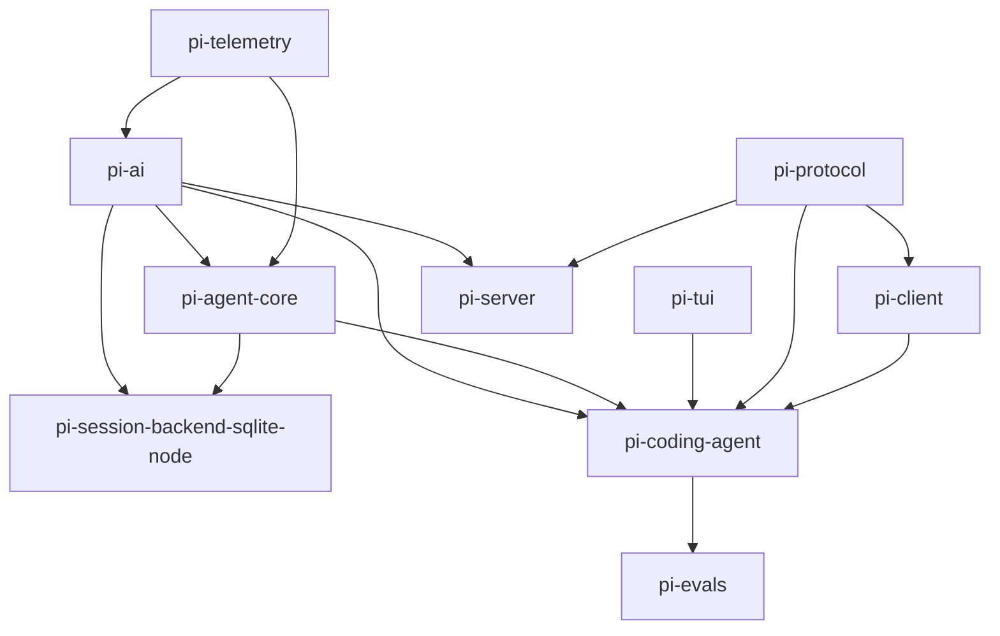
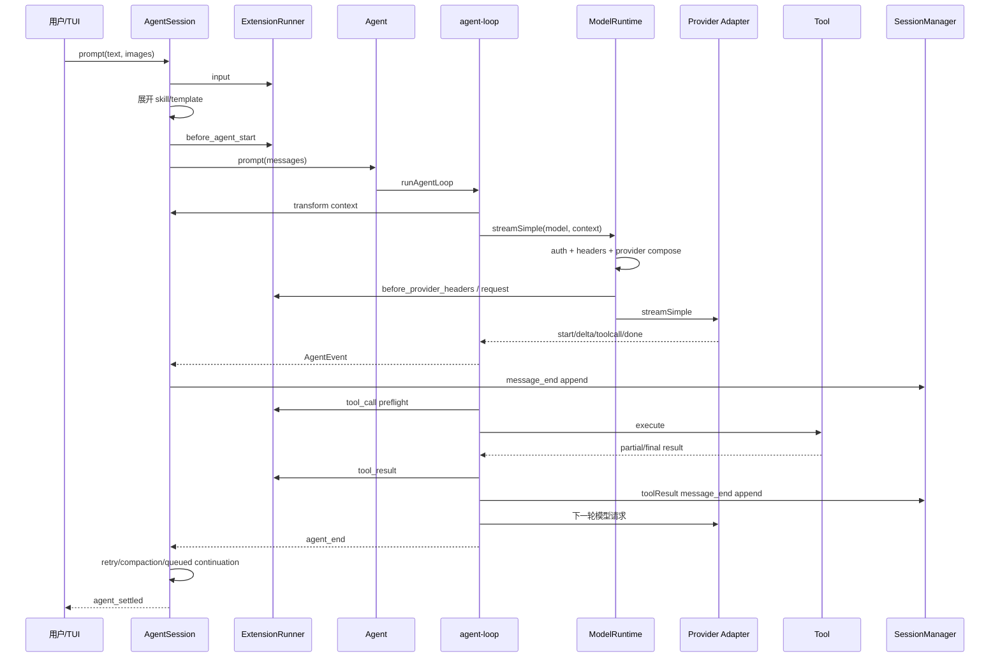

# Pi 全部源码静态研究

> 仓库：<https://github.com/earendil-works/pi>  
> 研究版本：`dcd461925db2edf69a43c8135db1180d418afd54`（`main`，提交说明：`feat: show llama presets if autoload enabled (#8558)`）  
> 包版本：`0.84.3`  
> 研究方式：完整仓库静态阅读、调用链追踪、导出符号与测试清单盘点；未安装依赖、未运行构建和测试。  
> 研究日期：2026-08-25

---

## 目录

1. [研究口径与结论摘要](#1-研究口径与结论摘要)
2. [仓库规模、目录与依赖图](#2-仓库规模目录与依赖图)
3. [整体架构：成熟运行时与下一代运行时并存](#3-整体架构成熟运行时与下一代运行时并存)
4. [CLI 启动全链路](#4-cli-启动全链路)
5. [一次普通任务的完整调用链](#5-一次普通任务的完整调用链)
6. [`pi-ai`：统一模型、认证与流式协议](#6-pi-ai统一模型认证与流式协议)
7. [`pi-agent-core`：Agent 循环与工具调度](#7-pi-agent-coreagent-循环与工具调度)
8. [`pi-coding-agent`：会话编排核心](#8-pi-coding-agent会话编排核心)
9. [内置工具执行链](#9-内置工具执行链)
10. [扩展系统](#10-扩展系统)
11. [资源、包、设置与项目信任](#11-资源包设置与项目信任)
12. [会话树、JSONL 持久化与分支](#12-会话树jsonl-持久化与分支)
13. [压缩、重试与上下文恢复](#13-压缩重试与上下文恢复)
14. [`pi-tui`：终端渲染引擎](#14-pi-tui终端渲染引擎)
15. [输出模式与旧 RPC](#15-输出模式与旧-rpc)
16. [新 Protocol / Client / Server 远程栈](#16-新-protocol--client--server-远程栈)
17. [新 Session API、JSONL v4 与 SQLite 后端](#17-新-session-apijsonl-v4-与-sqlite-后端)
18. [Telemetry 与 Evals](#18-telemetry-与-evals)
19. [并发、一致性与错误处理不变量](#19-并发一致性与错误处理不变量)
20. [安全边界](#20-安全边界)
21. [构建、发布与测试体系](#21-构建发布与测试体系)
22. [逐包结论](#22-逐包结论)
23. [尚未完成或处于迁移期的部分](#23-尚未完成或处于迁移期的部分)
24. [源码文件全量清单](#24-源码文件全量清单)
25. [测试、示例、脚本与原生代码清单](#25-测试示例脚本与原生代码清单)
26. [白话版源码讲解](#26-白话版源码讲解)
27. [术语对照表](#27-术语对照表)
28. [动态验证建议](#28-动态验证建议)
29. [Agent Loop 专项深读](#29-agent-loop-专项深读)
30. [Agent Loop 技术句与白话句逐句对照](#30-agent-loop-技术句与白话句逐句对照)

---

# 技术版

## 1. 研究口径与结论摘要

### 1.1 “全部源码”的口径

本研究覆盖：

- 根目录配置、构建、发布和 CI；
- 10 个生产工作区：`telemetry`、`ai`、`agent`、`tui`、`coding-agent`、`protocol`、`client`、`server`、`session-backends/sqlite-node`、`evals`；
- `packages/*/src` 与 SQLite migration 的全部生产文件盘点；
- Coding Agent 的文档、SDK 示例和扩展示例；
- 所有测试文件的主题级盘点；
- TUI 的 macOS/Windows 原生辅助模块；
- 关键超大文件的深读与核心调用链追踪。

“全部”表示生产源码文件和子系统均纳入研究，并不表示把约十二万行生产 TypeScript 逐句翻译成中文。附录给出全量文件清单，正文深读关键实现。

### 1.2 最重要的十个结论

1. **Pi 不是单一 CLI，而是分层库集合。** `pi-ai`、`pi-agent-core`、`pi-tui` 都可独立使用，`pi-coding-agent` 才是最终产品组合层。
2. **当前成熟主链仍是 `AgentSession + SessionManager(v3 JSONL)`。** CLI、TUI、print、JSON 和 stdin/stdout RPC 都围绕这条链运行。
3. **仓库同时在建设下一代 durable harness。** 新链由 `AgentHarness + Session(v4) + Protocol + Client + Server + SQLite` 构成，但 `AgentHarness` 的 prompt、compact、navigate、resume 等核心方法仍明确抛出 `HarnessNotImplemented`。
4. **模型层是 Provider 对象注册表，而不是巨型 switch。** Provider 自带认证、模型目录、流函数和可选动态刷新；`Models` 负责认证解析、并发刷新、请求分派。
5. **所有模型流都归一为同一事件协议。** 文本、思考、工具调用分别有 start/delta/end，最终一定是 `done` 或 `error`，失败编码进最终 `AssistantMessage`。
6. **Agent 循环很小，但语义很严密。** 多工具默认并行；预检顺序稳定；执行可并发；工具结果按模型原始调用顺序回灌；截断的工具参数绝不执行。
7. **扩展系统不是弱插件沙箱。** 扩展拥有进程内 Node 权限，可注册工具、命令、Provider、快捷键、渲染器并拦截上下文、请求载荷、请求头和工具执行。
8. **会话不是消息数组，而是 append-only 树。** `parentId` 表示分支；leaf 指针决定当前路径；压缩和分支摘要也是树节点。
9. **TUI 是自研差分渲染器。** regular 模式写主屏并保留 scrollback，fullscreen 模式接管 alternate screen、布局、滚动、鼠标选择、搜索、图片与滚动条。
10. **工程质量重点是边界不变量。** 典型例子包括 OAuth 双检锁、文件修改串行队列、严格 CBOR 子集、Unix socket 身份校验、SQLite writer lease fencing、事件 settlement 与 stdout backpressure。

### 1.3 静态研究限制

- 仓库未安装 `node_modules`；
- 未执行 `npm ci`、build、typecheck 和测试；
- `packages/ai/src/providers/data/` 被 `.gitignore` 排除，模型 JSON 需通过 `npm run hydrate:model-data` 生成，因此无法仅从 Git 工作树统计精确模型条目数；
- 平台相关行为（Windows Console、macOS modifier、Unix socket、图片协议）未动态验证；
- 文中“会”“保证”均指源码意图和静态控制流，不替代运行验证。

---

## 2. 仓库规模、目录与依赖图

### 2.1 规模

| 工作区 | 生产源码行数（约） | 测试源码行数（约） | 主要职责 |
|---|---:|---:|---|
| `telemetry` | 935 | 243 | callback span 抽象、类型化 schema、内存实现 |
| `ai` | 23,555 | 35,352 | Provider、模型、认证、各家 API adapter、流协议 |
| `agent` | 12,635 | 8,688 | Agent loop、新 durable harness/session scaffold、执行环境 |
| `tui` | 16,790 | 16,981 | 终端输入、组件、布局、差分渲染、图片 |
| `coding-agent` | 60,707 | 51,570 | CLI、会话编排、工具、扩展、资源、TUI 产品层 |
| `protocol` | 1,236 | 716 | TypeBox schema、CBOR、长度帧 |
| `client` | 1,225 | 1,232 | 远程客户端、租约、连接和状态 |
| `server` | 2,299 | 1,447 | 远程服务端、会话所有权、Unix listener |
| `session-backends/sqlite-node` | 2,511 | 1,807 | durable Session 的 SQLite 后端与搜索 |
| `evals` | 1,277 | 463 | vitest-evals harness、评测比较与制品 |
| **合计** | **约 123,170** | **约 118,499** | 不含文档、示例和 vendored minified JS |

生产目录共有约 540 个 `.ts` 文件；测试目录共有 467 个 `*.test.ts` 文件，静态检出约 4,570 个 `it()/test()` 调用。

### 2.2 根目录

- `package.json`：npm workspaces；Node `>=22.19.0`；统一 build/check/test/release。
- `tsconfig.base.json`：严格 TS、ES2022、Node16/NodeNext、`.ts` 扩展导入重写。
- `biome.json`：格式化与 lint。
- `.github/workflows/`：CI、二进制、模型目录、审计、PR gate、发布。
- `scripts/`：模型目录、bundle、版本同步、npm 发布、二进制、统计脚本。
- `.pi/`：仓库自身使用的扩展、prompt 和 skill，是 Pi 自举能力的实例。

### 2.3 包依赖图



值得注意：`coding-agent` 的 package dependencies **没有** `pi-server` 和 SQLite backend。它包含新 client facade 和 `createCodingAgentHarness()`，但新 server/SQLite 尚未成为当前 CLI 主链。

---

## 3. 整体架构：成熟运行时与下一代运行时并存

### 3.1 当前成熟链

```text
cli.ts
  -> main.ts
  -> AgentSessionRuntime
  -> AgentSession
  -> Agent (pi-agent-core)
  -> ModelRuntime
  -> Provider / API adapter (pi-ai)
  -> AgentEvent
  -> SessionManager v3 JSONL + Interactive/Print/RPC projection
```

其特征：

- `SessionManager` 是同步文件 I/O 的 append-only JSONL 树；
- `AgentSession` 是真正的产品编排中心；
- 扩展 API、TUI 和旧 RPC 都很成熟；
- 自动重试、自动压缩、分支摘要和工具 UI 已接通。

### 3.2 下一代 durable 链

```text
AgentHarness API
  -> durable Session interface
  -> JSONL v4 / InMemory / SQLite backend
  -> PiServerService / PiSessionRuntime
  -> CBOR framed Protocol
  -> PiClient
  -> RemoteSession
```

其设计目标明显更强：

- operation intent/result 日志；
- crash/deferred resume；
- 多 lane；
- writer lease；
- storage conformance；
- snapshot + progress 的远程协议；
- backend-neutral ExecutionEnv。

但当前 `AgentHarness.create()` 只实现无 record 的初始 scaffold，看到已有 record 就抛 `HarnessNotImplemented("create.restore")`；`prompt()`、`compact()`、`navigateTree()`、`resume()`、watch 和手动 drive 等核心入口也未实现。它是**接口、存储、reducer 和测试先行的迁移架构**，不是当前 CLI 的替代品。

### 3.3 两套 JSONL 不可混为一谈

| 项目 | 当前 Coding Agent | 新 Agent Harness |
|---|---|---|
| 版本 | `CURRENT_SESSION_VERSION = 3` | header `version: 4` |
| 文件内容 | header + tree entries | header + entry/record/lane/fact mutations |
| 编排恢复日志 | 无独立 operation log | 有 `operation_started`、`step_attempt`、`tool_started` 等 |
| 损坏处理 | malformed 行多处跳过 | schema 错误拒绝；仅末尾 syntax torn write 可修复 |
| 写入方式 | 同步 append；首次 assistant 后才落盘 | 串行 append；fork 原子 publish |
| 当前 CLI 使用 | 是 | 否 |

---

## 4. CLI 启动全链路

入口是 `packages/coding-agent/src/cli.ts`：

1. 设置 `process.title`、`PI_CODING_AGENT=true`、`AI_AGENT=pi`；
2. 屏蔽 `process.emitWarning`；
3. 预配置 undici dispatcher；
4. 调用 `main(process.argv.slice(2))`。

`main.ts` 的启动顺序非常讲究：

1. 判断 offline；
2. 先处理 `auth`、package 和 config 一次性命令；
3. `parseArgs()`，未知长 flag 暂存，留给扩展注册；
4. 处理 version/export；
5. 决定 interactive / print / JSON / RPC，并在非交互模式接管 stdout；
6. 执行旧认证和 session 迁移；
7. 创建启动 cwd 的 settings，只用于选择 session；
8. 选择/创建/恢复/fork session；
9. 根据 session header 确定**最终 cwd**；
10. 处理项目 cwd 不存在的情况；
11. 解析项目信任；
12. 通过 `createAgentSessionServices()` 创建 cwd-bound settings、ModelRuntime、ResourceLoader；
13. 加载扩展并注册扩展 Provider；
14. 离线恢复模型目录和认证可用性；
15. 解析 CLI model scope、thinking、tools；
16. `createAgentSessionFromServices()`；
17. `createAgentSessionRuntime()` 保存可重建 runtime 的 factory；
18. 根据模式进入 TUI、print 或 RPC。

### 4.1 为什么先选 session，再加载项目资源

恢复其他项目的 session 时，`cwd` 会变化。若一开始就读取当前 shell cwd 下的 `.pi/settings.json`、扩展和 `AGENTS.md`，会把错误项目的代码和指令加载进会话。因此源码明确把“启动 cwd 服务”和“最终 session cwd 服务”分开。

### 4.2 stdout 接管

非交互模式调用 `takeOverStdout()`，防止扩展或库随意 `console.log` 污染 JSON/RPC 协议。真正协议输出走 `writeRawStdout()`；Agent listener 还等待 stdout backpressure，保证高频流事件不会无限冲垮管道。

---

## 5. 一次普通任务的完整调用链

以用户输入“读取并修改一个文件”为例：



### 5.1 prompt 预处理

`AgentSession.prompt()`：

- `/xxx` 先尝试扩展命令；
- compaction 期间拒绝普通 SDK prompt，TUI 自己另建 compaction queue；
- 依次运行扩展 `input` handler，支持 transform 或 handled；
- 展开 `/skill:name` 和 prompt template；
- streaming 时必须说明 `steer` 或 `followUp`；
- idle 时验证 model 和 auth；
- 在新 prompt 前检查上一次 aborted/error 是否需要压缩；
- 合并 pending next-turn custom message；
- 运行 `before_agent_start`，允许注入消息和替换本轮 system prompt。

### 5.2 Agent loop

`runLoop()` 有两层循环：

- 内层：模型响应 -> 工具 -> steering；
- 外层：当本应结束时再拉 follow-up。

一轮 turn 定义为“一条 assistant 响应 + 它的全部 tool result”。`turn_end` 之后依次执行：

1. `prepareNextTurn` 刷新 context/model/thinking；
2. `shouldStopAfterTurn`；
3. steering；
4. 无工具、无 steering 后才检查 follow-up。

### 5.3 settlement

`Agent.subscribe()` 的异步 listener 按注册顺序 await。`agent_end` 虽是最后一个事件，但 listener 尚未完成时 Agent 仍非 idle。`AgentSession` 再增加 `agent_settled`，表示 persistence、extensions、post-run retry/compaction 和 listener 都已处理完。这是 RPC `waitForIdle()` 的可靠边界。

---

## 6. `pi-ai`：统一模型、认证与流式协议

### 6.1 核心数据模型

`types.ts` 定义统一抽象：

- `Model<Api>`：provider、api、baseUrl、reasoning、输入模态、价格、contextWindow、maxTokens、compat；
- `Context`：system prompt、messages、tools；
- `Message`：user / assistant / toolResult；
- assistant content：text / thinking / toolCall；
- `Usage`：input、output、cacheRead、cacheWrite、reasoning 和 cost；
- `StopReason`：pending / stop / length / toolUse / error / aborted / deferred；
- `DeferredHandle`：异步 Provider 请求句柄。

### 6.2 流协议

`AssistantMessageEventStream` 基于通用 `EventStream<T,R>`：

```text
start
  text_start -> text_delta* -> text_end
  thinking_start -> thinking_delta* -> thinking_end
  toolcall_start -> toolcall_delta* -> toolcall_end
done | error
```

关键约束：

- 请求/模型/运行失败不应 reject stream factory；
- 失败以 `error` 事件和 stopReason=error/aborted 的最终 message 表示；
- `.result()` 返回最终 message，即使是 error message；
- `lazyStream()` 把认证、动态 import 等 setup 异常也转换成协议 error。

`EventStream` 自身是内存 queue，没有容量限制和生产者 backpressure；高层 JSON/RPC 额外用 stdout backpressure 控制输出侧。

### 6.3 Provider 与 Models

每个 `Provider` 拥有：

- `id/name/baseUrl/headers`；
- `auth`；
- `getModels()`；
- 可选 `refreshModels()` 和 credential-specific `filterModels()`；
- `stream()/streamSimple()`；
- 可选 deferred fetch/cancel。

`ModelsImpl`：

- Provider 以 id 注册和替换；
- 模型同步读取，坏 Provider 的 `getModels()` 被 best-effort 隔离；
- 动态模型刷新按 Provider 并行；
- 每 Provider 有 refresh generation 和 AbortController，旧刷新不能覆盖新刷新；
- publication 通过 per-provider promise chain 串行；
- 请求前解析认证、合并 headers/env/baseUrl，再 dispatch 给 Provider。

### 6.4 40 个内置文本 Provider

静态目录 Provider 加一个动态 Radius，共 40 个：

`amazon-bedrock`、`ant-ling`、`anthropic`、`azure-openai-responses`、`baseten`、`cerebras`、`cloudflare-ai-gateway`、`cloudflare-workers-ai`、`deepseek`、`fireworks`、`github-copilot`、`google`、`google-vertex`、`groq`、`huggingface`、`kimi-coding`、`minimax`、`minimax-cn`、`mistral`、`moonshotai`、`moonshotai-cn`、`nvidia`、`openai`、`openai-codex`、`opencode`、`opencode-go`、`openrouter`、`qwen-token-plan`、`qwen-token-plan-cn`、`qwen-token-plan-individual`、`radius`、`together`、`vercel-ai-gateway`、`xai`、`xiaomi`、三个 Xiaomi token-plan region、`zai`、`zai-coding-cn`。

另有 OpenRouter image Provider。静态 model catalog JSON 不入 Git，构建时由 `generate-models.ts` 从 models.dev、厂商目录和大量手工纠正规则生成。

### 6.5 十类文本 API adapter

| API | 主要实现 |
|---|---|
| Anthropic Messages | SDK + 自写 SSE 解码 fallback；thinking、redacted thinking、cache control、OAuth stealth headers |
| OpenAI Completions | 最宽兼容层；适配 DeepSeek/OpenRouter/ZAI/Together/Qwen/自建服务 |
| OpenAI Responses | message/reasoning/function/custom tools、encrypted replay、prompt cache |
| OpenAI Codex Responses | SSE、WebSocket、cached WebSocket、连接复用和 fallback |
| Azure OpenAI Responses | deployment map、Azure base URL/API version |
| Google Generative AI | Gemini stream、thinking、signature、tool schema |
| Google Vertex | ADC/API key、project/location/custom endpoint |
| Bedrock Converse Stream | AWS SDK、SigV4 header middleware、Claude thinking/cache |
| Mistral Conversations | 自写 HTTP/SSE、prompt mode/reasoning/tool conversion |
| Pi Messages | Radius gateway 的 Pi 原生消息事件协议 |

### 6.6 跨 Provider 消息转换

`transformMessages()` 处理：

- 非视觉模型把图片换成占位文本；
- 跨模型丢弃不可复用的 encrypted/redacted thinking；
- 同模型保留 thinking signature；
- 跨模型规范化 tool call id；
- 跳过 error/aborted assistant message；
- 给孤立 tool call 合成错误 tool result，保证下一家 API 的消息结构合法。

OpenAI Responses 还把 tool call id 编码为 `call_id|item_id`，对跨模型 replay 重建/裁剪 `fc_*` id；thinking item 整体 JSON 存入 signature，以便 `store:false` 多轮重放。

### 6.7 认证

认证来源：

1. request override；
2. stored credential；
3. ambient env/file/profile；
4. 无配置。

一旦存在 stored credential，它拥有该 Provider，不会在 OAuth refresh 失败后偷偷退回环境变量。OAuth 使用 double-checked lock：接近过期先乐观判断，再进入 `CredentialStore.modify()` 重新判断，只刷新一次，并在释放锁前持久化 rotated token。

Coding Agent 的 `AuthStorage` 使用 `proper-lockfile`，首次创建 `auth.json` 时 mode `0600`；`RuntimeCredentials` 在其上叠加不落盘的 CLI API key。

### 6.8 两层重试

- `retryProviderRequest()`：单次 SDK/HTTP 请求层；识别 408/409/429/5xx、`x-should-retry`、`retry-after`；sleep 可 abort；默认 server delay 上限 60 秒。
- `retryAssistantCall()` / AgentSession auto retry：完整 assistant turn 层；根据错误文本识别 network/rate limit/overload/stream drop，指数退避；quota/billing 明确不重试。

context overflow 不走普通 retry，而走 compact-and-retry。

### 6.9 Compat 层

`@earendil-works/pi-ai/compat` 保留旧的全局 registry、`streamSimple()`、`getModel()` 和环境变量注入。Coding Agent 和扩展虚拟模块仍大量依赖它；注释明确说这是迁移层，未来在 ModelManager 迁移完成后删除。

---

## 7. `pi-agent-core`：Agent 循环与工具调度

### 7.1 Agent 状态

`Agent` 持有：

- system prompt、model、thinking level；
- tools 和 transcript；
- streaming message；
- pending tool call id；
- last error；
- steering / follow-up 两个队列；
- active run + AbortController。

数组赋值做顶层复制，避免调用者继续修改传入数组。

### 7.2 steering 与 follow-up

- steering：当前 turn 的 tool calls 全部执行后、下一次模型请求前注入；
- follow-up：Agent 本来要停止时才注入；
- 两者都支持 `all` 或 `one-at-a-time` drain。

### 7.3 多工具执行

默认 parallel：

1. 按模型输出顺序发 `tool_execution_start`；
2. 按顺序找工具、参数兼容转换、TypeBox 校验、运行 `beforeToolCall`；
3. immediate failure（未知工具、校验失败、blocked）立即结束；
4. 允许的调用并发执行；
5. `tool_execution_end` 按实际完成顺序发；
6. `ToolResultMessage` 最后按 assistant 原始顺序发并回灌模型。

只要 batch 中某个工具声明 `executionMode="sequential"`，整批改为串行。只有 batch 的**每个**最终结果都 `terminate=true`，才提前终止下一模型轮。

### 7.4 防危险细节

- assistant 因 token length 截断时，所有工具调用都返回错误，绝不执行可能不完整的参数；
- tool partial update 在 execute promise settle 后被忽略；
- tool 异常变成 error tool result；
- hook 异常也变成 error result；
- tool result 的 null content 被规范化为空数组。

### 7.5 AgentHarness scaffold

`agent/src/harness` 是下一代 API：

- typed `Result` 与 tagged errors；
- lane、operation、queue、deferred、manual drive API；
- backend-neutral `ExecutionEnv`；
- durable Session 和 reducer；
- harness telemetry schema；
- read/bash/edit/write 工具；
- scanning session search。

但编排执行仍未实现。当前可用的是大量基础设施和纯函数，不应把 `AgentHarness` 当成成熟替代 API。

---

## 8. `pi-coding-agent`：会话编排核心

`AgentSession` 是当前产品最关键的类，约 3,440 行。它把低层 Agent 组合成 Coding Agent：

- 自动 persistence；
- extension event 映射；
- tool registry 与 system prompt 重建；
- model/thinking 切换；
- retry/compaction；
- bash side-channel；
- tree navigation；
- stats/export。

### 8.1 事件处理顺序

对一个 Agent event：

1. 更新 queue UI bookkeeping；
2. 先发给 extension；
3. 再发给 AgentSession listener（TUI/RPC）；
4. `message_end` 时写 SessionManager；
5. assistant message 更新 retry/compaction bookkeeping。

扩展的 `message_end` 可以返回同 role 的替代消息；源码原地清空并 `Object.assign` 到原对象，使 Agent state、后续 event 和 persistence 指向同一最终内容。

### 8.2 每轮运行后的决策

`_handlePostAgentRun()`：

1. 若 transient error 且 retry budget 允许，移除 error assistant，sleep，`agent.continue()`；
2. 否则结束 retry 状态；
3. 检查 overflow / threshold compaction；
4. 若扩展在 `agent_end` 新排队，再 continue；
5. 最终发 `agent_settled`。

### 8.3 tool registry

定义优先：

- base tool definitions；
- extension tools；
- SDK custom tools；
- allowlist / denylist；
- wrapped 为 AgentTool。

重名时后写 registry 的扩展/custom definition 可覆盖 builtin 执行项；资源层另发 conflict diagnostic。active tool 改变后，system prompt 的 tool snippets 和 guidelines 同步重建，下一 turn 通过 `prepareNextTurnWithContext` 获取最新 tools、model、thinking 和 prompt。

### 8.4 runtime replacement

`AgentSessionRuntime` 保存一个 factory。`/new`、resume、fork、import 时：

1. 当前 session abort 并等待 settle；
2. 发 `session_shutdown`；
3. 同步拆掉 extension UI；
4. invalidate 旧 extension context；
5. 根据新 cwd 重建全部 services 和 AgentSession；
6. TUI/RPC rebind；
7. `withSession` 回调拿到新鲜 context。

这是源码反复警告扩展不要缓存旧 `ctx` 的原因。

---

## 9. 内置工具执行链

### 9.1 工具集合

默认开启 `read`、`bash`、`edit`、`write`；`grep`、`find`、`ls` 可开启；Windows 另有 `powershell`。

每个 `ToolDefinition` 同时包含：

- 模型看到的 name/description/TypeBox parameters；
- prompt snippet/guidelines；
- execute；
- TUI renderCall/renderResult；
- 可选 prepareArguments、executionMode、constrainedSampling。

### 9.2 read

- 路径可相对 cwd 或绝对；
- 图片识别后可 resize/convert 并作为 image block；
- 非视觉模型附加提示；
- 文本默认 head 截断到 2,000 行或 50 KiB；
- offset/limit 产生可继续读取的提示；
- 单行超过 50 KiB 时建议用 shell 截取。

### 9.3 write/edit 的同文件串行化

`withFileMutationQueue()` 先通过全局 registration queue 原子登记，再按 canonical realpath 为同一文件排队。不同文件仍并发。abort 不能提前释放 queue；每次 await 后检查 signal，确保已开始的 FS 操作 settle 后才允许下一修改。

### 9.4 edit

- 兼容 legacy `oldText/newText` 和模型误传的 JSON string；
- 所有 edits 都对同一原文件匹配；
- oldText 必须非空且唯一；
- 多 edits 不得重叠；
- 逆序应用，保持 offset；
- 支持 NFKC、尾随空白、智能引号、Unicode dash/space 的保守 fuzzy match；
- fuzzy 时只重写实际触及的行，保留其他行原字节形态；
- 保留 BOM 和原 CRLF/LF；
- 返回 UI diff 和标准 unified patch。

### 9.5 bash/powershell

- 根据平台和设置解析 shell；
- Unix detached process group，Windows `taskkill /T`；
- stdout/stderr 合并流式展示；
- update 100ms 节流；
- 只保留尾部 2,000 行/50 KiB；
- 一旦超限，完整原始 bytes 写临时文件；
- 可暴露 `PI_SESSION_ID/FILE/PROVIDER/MODEL/REASONING_LEVEL`；
- timeout 和 abort 都杀进程树。

### 9.6 grep/find/ls

- `grep` 调 `rg --json`，支持 regex/literal/glob/context/limit；
- `find` 调 `fd`，处理 nested gitignore 和 path glob；
- `ls` 用 Node FS，包含 dotfile、目录加 `/`；
- `fd`/`rg` 缺失时 `ToolsManager` 尝试下载 managed binary；
- 所有输出都有 match/result/byte/long-line 多重限制。

### 9.7 路径不是沙箱

这些工具以 cwd 解析相对路径，但接受绝对路径，也没有“必须位于 workspace 内”的 containment 检查。安全边界是操作系统账户权限、项目信任和用户自己安装的扩展，不是文件沙箱。

---

## 10. 扩展系统

### 10.1 加载

`loader.ts` 使用 `jiti` 动态加载 TS/JS。三种运行形态：

- source TS：virtual modules + tsconfig paths；
- npm Node bundle：alias 到 dist；
- Bun/Node SEA：内嵌 virtual modules。

兼容旧 `@mariozechner/*` import；`@earendil-works/pi-ai` 在扩展环境映射到 compat 入口。

### 10.2 factory 事务

扩展 factory 加载期间：

- 注册写入临时 Extension 对象；
- Provider 注册、flag default、event bus subscription 暂存；
- factory 成功才 commit；
- 失败则 discard，并取消 loading 期间 subscription。

避免“半加载扩展”污染全局 runtime。

### 10.3 扩展能力

扩展可注册：

- lifecycle/input/context/provider/tool 事件；
- tool；
- slash command；
- shortcut / CLI flag；
- custom message/entry renderer；
- Markdown transformer；
- Provider（配置式或原生对象）；
- UI widget/header/footer/editor/overlay。

还能发消息、切模型、改 thinking、改 active tools、执行进程、写 session custom entry、new/fork/switch/reload/shutdown。

### 10.4 handler 组合语义

- 普通 event：顺序执行，异常记录后继续；
- session_before_*：结果可逐个覆盖，`cancel` 立即短路；
- input：transform 串联，handled 短路；
- context/payload/message_end/tool_result：前一个输出进入后一个；
- tool_call：block 短路；其异常是 fail-closed，会阻止工具；
- project_trust：首个 yes/no 胜出，undecided 继续。

### 10.5 stale context 防护

reload 或 session replacement 后，旧 runner/runtime 被 `invalidate()`；所有 getter/action 都先 `assertActive()`，event bus subscription 自动解除。它防的是生命周期误用，不是权限隔离。

---

## 11. 资源、包、设置与项目信任

### 11.1 ResourceLoader

统一加载：

- extensions；
- skills；
- prompt templates；
- themes；
- `AGENTS.override.md` / `AGENTS.md` / `CLAUDE.md`；
- `SYSTEM.md` / `APPEND_SYSTEM.md`。

来源带 `SourceInfo`：source、scope（user/project/temporary）、origin（package/top-level）、baseDir。资源冲突采用“先到先得”并产生 diagnostic。

### 11.2 context 文件继承

从全局 agentDir 到 cwd 的祖先目录依次加载；更近目录在后。linked worktree 有专门 shadow 逻辑，避免主 worktree 与嵌套 worktree 的同一逻辑上下文重复加载。

### 11.3 skill

遵循 Agent Skills 风格：

- `SKILL.md` 或根目录 markdown；
- frontmatter name/description；
- name 长度、字符和连字符校验；
- description 最长 1,024；
- ignore 文件生效；
- 同名 first wins；
- `disable-model-invocation` 只从 system prompt 隐藏，仍可显式 `/skill:name`。

System prompt 只列 name/description/location，真正执行时再读完整文件，减少基础 prompt。

### 11.4 PackageManager

支持：

- local path；
- npm spec/range/pinned version；
- Git URL/ref；
- package `pi` manifest；
- autoload 和 resource filter；
- global/project scope；
- temporary CLI source；
- update check 和并发限制。

资源优先级为 project explicit > project auto > user explicit > user auto > package。项目 scope 写入要求 project trusted。

### 11.5 SettingsManager

- global `~/.pi/agent/settings.json`；
- project `<cwd>/.pi/settings.json`；
- project 覆盖 global，嵌套对象 deep merge；
- session override 只改 effective settings；
- 每字段和 nested field 记录 dirty set；
- 保存时加文件锁并只合并本次改动，降低并发覆盖；
- parse error 时保留错误并拒绝覆盖坏文件；
- 写队列异步串行，可 `flush()`。

### 11.6 项目信任

未信任项目时：

- 不读取 project settings；
- 不加载 project `.pi` extensions/packages/SYSTEM 等；
- project scope 写入被拒绝。

CLI 显式路径和全局资源仍可加载。信任决定本身存入 trust store；TUI 有 `/trust`。

---

## 12. 会话树、JSONL 持久化与分支

### 12.1 v3 文件格式

第一行是 header：id、timestamp、cwd、parentSession。之后每行一个 entry：

- message；
- model/thinking change；
- compaction；
- branch_summary；
- custom / custom_message；
- label；
- session_info。

每条 entry 有短 id、parentId、ISO timestamp。

### 12.2 leaf 与 branch

`SessionManager` 在内存中维护 `byId` 和 `leafId`。append 总是成为当前 leaf 的 child。`branch(id)` 只移动 leaf，不删历史；下一 append 自然形成新分支。

`getBranch()` 从 leaf 追 parent 到 root；`getTree()` 根据 parentId 重建 children。label 本身也是 entry，但另有 resolved label map。

### 12.3 compaction-aware context

`buildContextEntries()` 找当前 path 上最新 compaction：

```text
[latest compaction summary]
+ [压缩前被指定保留的 tail]
+ [compaction 之后的新 entry]
```

model/thinking 状态则按完整当前 path 扫描，assistant message 也可恢复实际模型。

### 12.4 落盘时机

新 session 不立即创建文件；直到出现第一条 assistant message 才一次性写 header 和此前 entries。这样空 session/只有用户输入的中止 session 不污染目录。之后同步 append。

代价：

- 当前 v3 writer 没有跨进程 writer lock；
- 没有 fsync/事务；
- malformed 非 header 行在加载时常被跳过；
- 更像单进程产品日志，而不是 crash-consistent database。

这些正是新 v4/SQLite 架构要补的能力。

### 12.5 fork

- tree navigation：同一文件内移动 leaf；
- `createBranchedSession()`：复制一条 root-to-leaf path 到新 session；
- `forkFrom()`：跨项目复制全部历史并更新 cwd；
- label entry 被移除后会重链，再按 resolved labels 重建；
- `parentSession` 记录来源。

---

## 13. 压缩、重试与上下文恢复

### 13.1 触发条件

`shouldCompact = contextTokens > contextWindow - reserveTokens`。默认：

- reserve 16,384 tokens；
- 保留最近约 20,000 tokens。

context token 优先使用最近有效 assistant usage，再加它之后消息的 chars/4 估算；若无 usage 则全量估算。

### 13.2 cut point

从最新 entry 向前累计 token，达到 keepRecentTokens 后选择合法 cut point：

- 可切 user-like 或 assistant；
- 绝不切在 toolResult；
- 若切到 turn 中间，单独生成 turn-prefix summary；
- 相邻、不可见 metadata 会一起保留；
- 上一次 summary 采用 update prompt 迭代更新。

### 13.3 summary 请求

- 把对话序列化为 `[User]`、`[Assistant thinking]`、`[Assistant tool calls]` 等文本，防模型把它当成待继续对话；
- tool result 最多 2,000 字符；
- `toolChoice=none`；
- `cacheRetention=none`；
- 独立 session routing id；
- length stop 被视为失败，绝不保存半截 summary；
- 记录 summary LLM usage/cost；
- 追加 read-files/modified-files。

### 13.4 overflow recovery

context overflow 或“在原 maxTokens 之下仍 length stop”时：

1. 识别必须是当前 model 的响应；
2. 最多 compact-and-retry 一次；
3. error/length assistant 已写 session 历史，但从 Agent 当前 state 删除；
4. compact；
5. 重建 context 后再次删除可能被 retained tail 恢复的失败 assistant；
6. `agent.continue()`。

成功响应若 usage 已超过窗口，只压缩，不错误地 continue assistant。

### 13.5 branch summary

导航到另一节点时，找 old path 和 target path 的 deepest common ancestor，只总结离开的分支。可由扩展取消、替换 summary 或改 label。summary 作为目标位置的新 child，保留离开分支的关键上下文。

---

## 14. `pi-tui`：终端渲染引擎

### 14.1 Component 模型

最小接口：

```ts
render(width): string[]
handleInput?(data): void
invalidate(): void
```

UI 不是 DOM。每个组件返回含 ANSI 的行字符串。Container、Text、Markdown、Editor、SelectList、ScrollView、HStack/VStack 等都遵循它。

### 14.2 输入链

`ProcessTerminal`：

- raw mode；
- bracketed paste；
- Kitty keyboard protocol 协商；
- 不支持 Kitty 时退回 modifyOtherKeys；
- Windows 原生 helper 开启 VT input；
- macOS/Windows 原生 modifier 检测补 Shift+Enter；
- `StdinBuffer` 重组拆包的 CSI/OSC/DCS/APC/鼠标序列；
- SSH 可提高 lone ESC 等待时间；
- stop/drain 防 key release 泄漏给父 shell。

### 14.3 regular 主屏差分

`TuiMainScreen`：

- 第一次直接输出；
- 宽高变化通常 full redraw；
- 对比 previous/new lines 找最小 changed range；
- 用 synchronized output 包裹；
- 只清并重写变化行；
- shrink 可配置 full clear；
- 图片变化扩大 dirty range；
- 渲染行超过 terminal width 会写 crash log 并停止 TUI。

它保留 terminal scrollback，适合普通 CLI 体验。

### 14.4 fullscreen alternate screen

`TuiAltScreen`：

- 进入 `?1049h` alternate screen，关闭 autowrap；
- layout engine 把 VStack/HStack/ScrollView 分配为 rect/clip；
- 屏幕固定 height，逐行差分；
- app 自己处理 wheel、nested scroll、scrollbar drag；
- 单/双/三击分别字符/词/整行选择；
- OSC 8 链接点击；
- transcript search overlay；
- Kitty 图片缓存、placement 重用和内存上限；
- 退出可回放 transcript 到主屏或仅给 resume hint。

### 14.5 ANSI、Unicode 和图片

- `visibleWidth()` 基于 grapheme 和 East Asian width；
- ANSI/OSC 8 aware slice/wrap/truncate；
- CJK、regional indicator、tab width 均有回归测试；
- Kitty 和 iTerm2 图片协议；
- PNG/JPEG/GIF/WebP dimension parser；
- cell pixel size通过 `CSI 16 t` 查询。

### 14.6 Editor

Editor 支持：

- 多行、word/CJK wrap；
- visual-line cursor；
- history draft；
- undo；
- Emacs kill/yank；
- jump-to-char；
- bracketed paste；
- 大 paste 替换成原子 `[paste #n ...]` marker，提交时恢复；
- async autocomplete 的 abort、debounce 和 request generation；
- slash command、`@file`、quoted path、`fd` fuzzy file completion。

### 14.7 Coding Agent TUI 组合

`InteractiveMode` 本身约 6,548 行，是 UI application controller：

- transcript、pending queue、status、widgets、editor、footer 六块；
- regular/fullscreen 可运行时切换，并用 Proxy 给扩展保持稳定 TUI 引用；
- AgentSession event 投影成 Assistant/Tool/Bash/Custom components；
- 内建 command selectors、login、settings、model、tree、session；
- extension UI bridge；
- signal/uncaughtException 时恢复终端。

---

## 15. 输出模式与旧 RPC

### 15.1 text print

执行一个或多个 prompt，只输出最终 assistant text。error/aborted 返回 exit code 1。finally 发 extension shutdown、清理 detached child、flush raw stdout。

### 15.2 JSON event mode

每行一个 JSON：先 session header，再 AgentSession events。`message_update` 去掉不断增长的 cumulative partial，只保留 delta、usage，以及 toolcall_start 的 id/name，避免流量二次方增长。

### 15.3 stdin/stdout RPC

旧 RPC 也是 JSONL，但有 request id 和 typed command union，支持 prompt、steer、model、thinking、compact、bash、tree、export、session switch 等。扩展 UI 通过 `extension_ui_request/response` 反向请求宿主。

特征：

- `prompt` 在 preflight 成功后立即 response，实际输出走 events；
- `agent_settled` 是 waitForIdle 边界；
- stdout 严格 LF framing，不用 Node readline，避免 U+2028/U+2029 被误切；
- `RpcClient` 通过 child process spawn CLI；
- 输入只做 `JSON.parse` 和 switch，没有 TypeBox schema 验证。

它与第 16 节的 CBOR Protocol 是两套独立远程协议。

---

## 16. 新 Protocol / Client / Server 远程栈

### 16.1 Protocol v1

TypeBox strict schema 定义：

- hello/version；
- list/create/attach/detach/prompt/steer/abort/set_model/set_thinking；
- ServerSnapshot / SessionSnapshot；
- transcript snapshot 和 progress delta；
- response/error/event envelope。

wire：

```text
4-byte unsigned big-endian length
+ strict RFC 8949 CBOR subset
```

默认 frame 16 MiB；CBOR 限 byte/container/depth；拒绝 tags、indefinite length、duplicate map key、非有限数、unsafe integer、cycle、非 plain object 和非法 UTF-8。

### 16.2 PiClient

- `Connection` 强制第一帧 hello；
- request id 关联 pending promise；
- ServerSnapshot/SessionSnapshot 用 revision 拒绝倒退；
- attach 由 `SessionLease` 表示；
- shared/exclusive lease 在 client 进程内防冲突；
- 最后一个 lease detach 才发协议 detach；
- release 失败可标记 cleanupRequired，下次 acquire 先 reconcile；
- disconnect 使全部 handle generation invalid。

### 16.3 PiServer

- listener 与协议层分离；
- handshake timeout 默认 5 秒；
- 每 connection 有 stage machine；
- `LiveSessionManager` 对同一 session 复用一个 runtime；
- connection 必须 attach 才能操作；
- session 无 connection、无 operation 且 runtime idle 时 dispose；
- runtime progress 广播增量，snapshot 仍是权威状态；
- server snapshot revision 串行广播。

### 16.4 Unix transport

- socket 默认 `0600`；
- 限 UTF-8 path bytes；Windows 不支持；
- bind 到私有 `.p-<hash>` 再 hard-link 到公开路径；
- stale socket 先 probe；
- 清理前核对 dev/inode，避免删除被其他进程替换的 socket；
- pending bytes 限制；
- close 可发送 final frame 并有 graceful timeout。

### 16.5 RemoteSession

Coding Agent client facade 把 PiClient 包成 UI 友好状态机：unbound/ready/busy/disposed。它把 authoritative snapshot 与 progress overlay 合并；tool argument delta 未形成 JSON 前保留 raw string；新 snapshot 到来会清空 progress overlay。

---

## 17. 新 Session API、JSONL v4 与 SQLite 后端

### 17.1 durable 数据模型

Session 有：

- entries：消息、model/thinking/tool config、compaction、branch summary、custom；
- records：operation intent/result、abort、step attempt、tool start、queue、deferred write、usage；
- lanes：每条 lane 一个 leaf；
- facts：name/label；
- 全局共享 sequence。

`assertJsonSerializable()` 比 `JSON.stringify` 严：拒绝 NaN/Infinity、cycle、sparse array、accessor、symbol、非 plain prototype 和 non-enumerable property。

### 17.2 reducer

`validateRecordLog()` 检查不可能状态：

- 多个 open operation；
- unknown run；
- finish 后还有 record；
- attempt 不连续；
- tool call ordinal/id/name 不匹配；
- 重复 tool invocation；
- queue cancellation 无匹配 enqueue；
- provisioned entry 内容不一致；
- deferred assistant 没 handle。

`reduceLaneState()` 从有界 slice 纯函数恢复 operation step、tool batch、pending queues/writes、deferred、overflow recovery 和 effective model/tools/thinking。

### 17.3 JSONL v4

- mutation 按 entry/record/lane/fact 编码；
- storage 用 promise tail 串行 append；
- load 时 schema 解码并 apply state；
- 末行 syntax error 视为 torn tail，原子发布 valid prefix；
- 非 syntax 错误或中间损坏直接拒绝；
- fork 先构造 sibling `.tmp`，完成后 atomic rename。

### 17.4 SQLite schema

核心表：sessions、entries、session_sequences、session_stats、branch_entries、lanes、records、lane_moves、facts、branch_tips、writer_leases。

设计要点：

- WAL + `synchronous=FULL` + busy timeout；
- `BEGIN IMMEDIATE` 同步 transaction；
- per-session sequence；
- parent link 是 canonical，`branch_entries` 只是派生 cache；
- fork 可复制 branch 或完整 tree；
- FTS5 trigram search；
- migration table。

### 17.5 writer lease fencing

打开 session 获取 `{ownerId, fence, expiresAt}`：

- 默认 TTL 30s，heartbeat 10s；
- 每次写 transaction 内先 renew；
- lease 过期后新 owner 增加 fence；
- 老 writer 即使恢复也无法通过 owner+fence 更新；
- repository close/reopen/delete 会正确释放或接管。

这比当前 v3 SessionManager 的单进程假设强很多。

---

## 18. Telemetry 与 Evals

### 18.1 Telemetry

采用 callback span：

```ts
context.startSpan(options, async span => { ... })
```

这样父子关系不依赖 AsyncLocalStorage。span 自身也是 child context。schema 只是类型推导，不做 runtime validation：

- start/end/event attributes 编译期精确；
- 多 schema span name 不可重复；
- InMemory 实现记录 parentId 和 endSequence；
- callback throw/reject 自动 error status，除非显式 status；
- settlement 后操作 inert；
- telemetry 永远 passive，坏 payload 不影响业务。

### 18.2 Evals

`createPiCodingAgentHarness()`：

- 每次运行创建隔离 temp cwd/agentDir/sessionDir；
- 复用指定 ModelRuntime；
- 默认无扩展；
- 可 prompt/reload 多步；
- 收集 transcript/tool events、usage、cost、timing；
- session JSONL 和生成源文件写 artifact；
- finally dispose 并删除 temp root。

`evalHarnessTable()` 生成 baseline/candidate × repetition；稳定 group key 来自 canonical JSON hash；Reporter 配对比较 pass rate、tokens、latency、cost，并诊断缺失、重复、error、unscored observation。

当前 eval 包有 smoke 和“默认 system prompt 是否帮助模型正确编写 Pi 扩展”的对照评测。

---

## 19. 并发、一致性与错误处理不变量

| 场景 | 机制 |
|---|---|
| Agent 同时 prompt | `activeRun` 拒绝；只能 steer/followUp |
| Agent listener 顺序 | subscription order 串行 await |
| 多工具 | 预检顺序稳定；执行并发；结果 source order |
| 同文件 edit/write | canonical path promise queue |
| auth refresh | CredentialStore per-provider modify lock + double check |
| model refresh | generation + AbortController + publication chain |
| settings 写 | dirty field merge + file lock + write queue |
| current JSONL | 单进程同步 append；弱 crash 语义 |
| v4 JSONL | serialized append + torn tail repair + atomic fork |
| SQLite | transaction + sequence + writer lease fence |
| server snapshot | broadcast queue + revision |
| client snapshot | revision monotonic check |
| Unix output | pending-byte cap + ordered write tail |
| JSON stdout | raw writer backpressure |
| TUI render | 16ms throttle；键盘触发 immediate render |

错误处理分层也很一致：

- 预期业务失败尽量变为 Result / protocol error / assistant error；
- programmer invariant 或 storage corruption 才 throw；
- telemetry、diagnostic listener 和 UI observer 不得影响业务；
- cleanup 多处 best-effort，但关键 replacement/disposal 会 AggregateError。

---

## 20. 安全边界

### 20.1 已有保护

- project trust 阻止未信任项目自动执行 `.pi` 资源；
- auth/settings 文件锁；auth 首建 0600；
- Unix socket 默认 0600；
- protocol strict validation、frame/CBOR limits；
- Provider error body 截断和诊断脱敏；
- session export 有 XSS 测试；
- command process tree 清理；
- package/release 脚本有路径与工作区检查；
- 测试脚本以空环境和隔离 HOME 运行。

### 20.2 明确不是保护的部分

- 扩展不是 sandbox；
- tool filesystem 不是 workspace jail；
- bash 不是 approval-gated sandbox；
- legacy RPC 没 transport auth/schema validator；
- Protocol 本身没有 auth 字段，listener 被要求在 accept 前完成 transport auth；默认 Unix 依赖本机文件权限；
- Provider/header hooks 可看到敏感请求信息；扩展本来已有本进程权限。

因此正确威胁模型是：**只信任自己愿意作为本机代码执行的项目和扩展**。

---

## 21. 构建、发布与测试体系

### 21.1 构建顺序

根 `npm run build`：

```text
tui -> telemetry -> ai -> agent -> sqlite -> protocol -> client -> server -> coding-agent
```

AI build 先生成/校验模型数据；Coding Agent 先 tsgo unbundled，再 esbuild bundle。

### 21.2 Coding Agent bundle

`build-coding-agent-bundle.mjs`：

- ESM、Node 22.19 target；
- entry：cli、index、rpc-entry、client；
- code splitting；
- Jiti 改成 lazy require；
- Bedrock、OAuth flows、image worker 单独自包含 bundle；
- 只允许少数 external native/optional package；
- 检查 unexpected external imports。

另有 Bun `--compile` 单文件二进制和 GitHub 平台二进制流程；TUI 预编译 macOS/Windows `.node` helper 随包分发。

### 21.3 Check gate

- Biome format/lint；
- pinned dependencies；
- `.ts` relative import 规则；
- shrinkwrap/install-lock 一致性；
- `tsgo --noEmit`；
- browser smoke/treeshake smoke；
- model data validation。

### 21.4 测试特点

467 个测试文件覆盖：

- 每家 Provider payload/stream/compat/replay；
- Agent event settlement、parallel tools、queue；
- JSONL/SQLite conformance；
- CBOR/frame fuzz-like边界；
- TUI virtual terminal、ANSI/CJK、overlay、图片；
- extension 生命周期、项目信任和 stale context；
- session compaction/tree/retry；
- 大量 issue 编号 regression。

`test.sh` 清空环境变量，只保留平台必需项，HOME/TMP/npm/git config 全隔离，并明确禁用 metadata endpoint 和本地 LLM。

---

## 22. 逐包结论

### 22.1 `@earendil-works/pi-telemetry`

小而严格的 callback telemetry contract。最大价值不是 exporter，而是 schema-driven TS 类型和 backend conformance。当前内置只有 noop/memory，实际 exporter 留给宿主。

### 22.2 `@earendil-works/pi-ai`

仓库最通用的库。统一多 Provider 差异、认证生命周期、消息 replay、tool schema、cache/usage/cost 和流事件。复杂度主要集中在各家 compat，而核心 `Models` API 较清晰。

### 22.3 `@earendil-works/pi-agent-core`

成熟 `Agent` 很精炼；同时承载下一代 `AgentHarness`、Session v4 和 backend-neutral tools。后半部分仍在 scaffold 阶段，包名相同容易让读者误判成熟度。

### 22.4 `@earendil-works/pi-tui`

完整终端 UI toolkit，不依赖 React/Ink。regular/fullscreen 双 renderer、ANSI-aware layout、原生键盘兼容和图片处理是其主要技术资产。

### 22.5 `@earendil-works/pi-coding-agent`

产品层和最大包。当前架构的真正 orchestration 在 `AgentSession`，InteractiveMode 是视图控制器，ResourceLoader/ModelRuntime/SettingsManager 是可重建 services。

### 22.6 `@earendil-works/pi-protocol`

刻意窄小、严格、无业务实现。CBOR 实现只支持协议所需子集，安全上比直接引入宽松通用 decoder 更可控。

### 22.7 `@earendil-works/pi-client`

负责 transport-independent byte client 和 session lease ownership，不负责 UI。lease/reconcile/disconnect invalidation 设计认真。

### 22.8 `@earendil-works/pi-server`

负责连接、握手、attach 权限和 live runtime 生命周期，不知道 Coding Agent 内部细节。服务边界 `PiServerService` 允许替换 runtime 实现。

### 22.9 `@earendil-works/pi-session-backend-sqlite-node`

下一代 Session API 的 production-grade storage 候选：WAL、cache repair、fork、FTS、writer fencing 和 conformance 都已具备，但尚未接入当前 CLI 主链。

### 22.10 `@earendil-works/pi-evals`

不是普通 unit test，而是在线模型行为评测。它把同一 prompt 在 baseline/candidate harness 上配对，关注正确性提升与 token/延迟/费用代价。

---

## 23. 尚未完成或处于迁移期的部分

1. **AgentHarness 编排未实现**：大多数操作直接 `HarnessNotImplemented`。
2. **existing durable session restore 未实现**：有任一 record 时 `create.restore` 失败。
3. **experimental `pi/server/client` command parser 未接到当前 `main.ts`**：源码只有 command builder 和 context interface。
4. **新 PiServer 没有 Coding Agent production service adapter**：server 包测试用 TestService，coding-agent 只有未完成 harness factory。
5. **SQLite 未接当前 CLI**：依赖图上 coding-agent 不依赖 SQLite backend。
6. **Compat 迁移未完**：Coding Agent 仍从 `pi-ai/compat` 使用旧 global stream/registry 语义。
7. **两套 session/RPC 并存**：v3 JSONL + JSONL RPC 与 v4/SQLite + CBOR Protocol 需要后续统一。
8. **动态 model data 不在 Git**：完整 build 依赖 hydrate/generate。

这些不是“代码坏了”，而是仓库处于一次明确的底层替换过程中。

---

## 24. 源码文件全量清单

> 下列清单由当前 commit 的生产目录自动盘点。每个 `.ts` 文件都列出；“导出线索”截取主要 public symbol，内部函数不全部展开。它用于确认覆盖范围和快速导航。

### 24.1 Telemetry（6 个 TS/SQL 文件）

| 文件（相对 `src/`） | 职责/导出线索 |
|---|---|
| `index.ts` | 主要导出：AttributeValue, SpanAttributes, SpanOptions, SpanStatus, TelemetryContext, TelemetrySpan, TelemetryAttributeType… |
| `memory.ts` | 主要导出：RecordedTelemetryEvent, RecordedTelemetrySpan, InMemoryTelemetryContext |
| `noop.ts` | 主要导出：NOOP_TELEMETRY_CONTEXT |
| `testing/conformance.ts` | 主要导出：createTelemetryAdapterConformance |
| `testing/index.ts` | 包/子目录公开导出入口 |
| `testing/types.ts` | 核心类型与接口契约 |

### 24.2 AI / Provider（177 个 TS/SQL 文件）

| 文件（相对 `src/`） | 职责/导出线索 |
|---|---|
| `api/anthropic-messages.lazy.ts` | API adapter 的延迟加载包装 |
| `api/anthropic-messages.ts` | 主要导出：AnthropicEffort, AnthropicThinkingDisplay, AnthropicOptions, stream, streamSimple |
| `api/azure-openai-responses.lazy.ts` | API adapter 的延迟加载包装 |
| `api/azure-openai-responses.ts` | 主要导出：AzureOpenAIResponsesOptions, stream, streamSimple |
| `api/bedrock-converse-stream.lazy.ts` | API adapter 的延迟加载包装 |
| `api/bedrock-converse-stream.ts` | 主要导出：BedrockThinkingDisplay, BedrockOptions, stream, streamSimple |
| `api/cloudflare-gateway-binding.ts` | 主要导出：AiGatewayBinding, AiGatewayBindingGateway, AiGatewayUniversalRequestLike, CLOUDFLARE_GATEWAY_BINDING_AUTH_SENTINEL, GatewayBindingFetchOptions, createGatewayBindingFetch |
| `api/cloudflare.ts` | 主要导出：CLOUDFLARE_WORKERS_AI_BASE_URL, CLOUDFLARE_AI_GATEWAY_COMPAT_BASE_URL, CLOUDFLARE_AI_GATEWAY_OPENAI_BASE_URL, CLOUDFLARE_AI_GATEWAY_ANTHROPIC_BASE_URL |
| `api/constrained-sampling.ts` | 主要导出：makeStrictJsonSchema, getJsonSchemaToolParameters, GrammarConstrainedSampling, GrammarToolInputJsonBuffer, getGrammarToolInput, appendGrammarToolInputJsonDelta, resolveJsonSchemaStrictSampling… |
| `api/github-copilot-headers.ts` | 主要导出：inferCopilotInitiator, hasCopilotVisionInput, buildCopilotDynamicHeaders |
| `api/google-generative-ai.lazy.ts` | API adapter 的延迟加载包装 |
| `api/google-generative-ai.ts` | 主要导出：GoogleOptions, stream, streamSimple |
| `api/google-shared.ts` | 主要导出：GoogleApiThinkingLevel, ResolvedGoogleThinkingLevel, resolveGoogleThinkingLevel, isThinkingPart, retainThoughtSignature, requiresToolCallId, convertMessages… |
| `api/google-vertex.lazy.ts` | API adapter 的延迟加载包装 |
| `api/google-vertex.ts` | 主要导出：GoogleVertexOptions, stream, streamSimple |
| `api/lazy.ts` | 主要导出：lazyStream, LazyApiCapabilities, lazyApi |
| `api/mistral-conversations.lazy.ts` | API adapter 的延迟加载包装 |
| `api/mistral-conversations.ts` | 主要导出：MistralOptions, stream, streamSimple |
| `api/openai-codex-responses.lazy.ts` | API adapter 的延迟加载包装 |
| `api/openai-codex-responses.ts` | 主要导出：OpenAICodexResponsesOptions, stream, streamSimple, OpenAICodexWebSocketDebugStats, getOpenAICodexWebSocketDebugStats, resetOpenAICodexWebSocketDebugStats, closeOpenAICodexWebSocketSessions |
| `api/openai-completions.lazy.ts` | API adapter 的延迟加载包装 |
| `api/openai-completions.ts` | 主要导出：OpenAICompletionsOptions, ConvertCompletionsMessagesOptions, stream, streamSimple, convertMessages |
| `api/openai-prompt-cache.ts` | 主要导出：OPENAI_PROMPT_CACHE_KEY_MAX_LENGTH, clampOpenAIPromptCacheKey |
| `api/openai-responses-shared.ts` | 主要导出：OpenAIResponsesStreamOptions, ConvertResponsesMessagesOptions, ConvertResponsesToolsOptions, convertResponsesMessages, convertResponsesTools, processResponsesStream |
| `api/openai-responses.lazy.ts` | API adapter 的延迟加载包装 |
| `api/openai-responses.ts` | 主要导出：OpenAIResponsesOptions, stream, streamSimple |
| `api/openrouter-images.lazy.ts` | API adapter 的延迟加载包装 |
| `api/openrouter-images.ts` | 主要导出：generateImages |
| `api/pi-messages.lazy.ts` | API adapter 的延迟加载包装 |
| `api/pi-messages.ts` | 主要导出：PiMessagesOptions, PiMessagesRewriteImpact, PiMessagesEvent, PiMessagesResponseError, stream, streamSimple |
| `api/simple-options.ts` | 主要导出：clampMaxTokensToContext, buildBaseOptions, MIN_ANSWER_TOKENS, DEFAULT_THINKING_BUDGETS, clampReasoning, thinkingBudgetForLevel, clampThinkingBudgetToAnswerRoom… |
| `api/transform-messages.ts` | 主要导出：transformMessages |
| `auth/context.ts` | 主要导出：defaultProviderAuthContext |
| `auth/credential-store.ts` | 主要导出：InMemoryCredentialStore |
| `auth/helpers.ts` | 主要导出：envApiKeyAuth, lazyOAuth |
| `auth/oauth/anthropic.ts` | 主要导出：anthropicOAuth |
| `auth/oauth/device-code.ts` | 主要导出：OAuthDeviceCodePollResult, OAuthDeviceCodePollOptions, abortableSleep, pollOAuthDeviceCodeFlow |
| `auth/oauth/github-copilot.ts` | 主要导出：githubCopilotOAuth |
| `auth/oauth/kimi-coding.ts` | 主要导出：kimiCodingOAuth |
| `auth/oauth/load.ts` | 主要导出：registerBundledOAuthFlowLoaders, loadAnthropicOAuth, loadOpenAICodexOAuth, loadGitHubCopilotOAuth, loadOpenRouterOAuth, loadKimiCodingOAuth, loadXaiOAuth… |
| `auth/oauth/oauth-page.ts` | 主要导出：oauthSuccessHtml, oauthErrorHtml |
| `auth/oauth/openai-codex.ts` | 主要导出：openaiCodexOAuth |
| `auth/oauth/openrouter.ts` | 主要导出：openRouterOAuth |
| `auth/oauth/pkce.ts` | 主要导出：generatePKCE |
| `auth/oauth/radius.ts` | 主要导出：RadiusOAuthOptions, createRadiusOAuth |
| `auth/oauth/xai.ts` | 主要导出：xaiOAuth |
| `auth/resolve.ts` | 主要导出：ModelsErrorCode, AuthResolutionOverrides, ModelsError, resolveProviderAuth |
| `auth/types.ts` | 核心类型与接口契约 |
| `bedrock-provider.ts` | 主要导出：bedrockProviderModule |
| `bun-oauth.ts` | 主要导出：registerBunOAuthFlows |
| `cli.ts` | 内部实现或可执行入口（无具名 public export） |
| `compat/extension-oauth-types.ts` | 主要导出：OAuthPrompt, OAuthAuthInfo, OAuthDeviceCodeInfo, OAuthSelectOption, OAuthSelectPrompt, OAuthLoginCallbacks |
| `compat.ts` | 主要导出：getModel, getModels, getProviders, ApiStreamFunction, ApiStreamSimpleFunction, ApiProvider, registerApiProvider… |
| `env-api-keys.ts` | 主要导出：ANTHROPIC_AUTH_TOKEN_ENV, ANTHROPIC_OAUTH_TOKEN_ENV, ANTHROPIC_API_KEY_ENV, findEnvKeys, getEnvApiKey |
| `image-models.generated.ts` | 自动生成目录聚合 |
| `image-models.ts` | 主要导出：getImageModel, getImageProviders, getImageModels |
| `images-api-registry.ts` | 主要导出：ImagesApiFunction, ImagesApiProvider, registerImagesApiProvider, getImagesApiProvider |
| `images-models.ts` | 主要导出：ImagesProvider, ImagesModels, MutableImagesModels, createImagesModels, CreateImagesProviderOptions, createImagesProvider |
| `images.ts` | 主要导出：generateImages |
| `index.ts` | 包/子目录公开导出入口 |
| `legacy-api-aliases.ts` | 主要导出：streamAnthropic, streamSimpleAnthropic, streamAzureOpenAIResponses, streamSimpleAzureOpenAIResponses, streamGoogle, streamSimpleGoogle, streamGoogleVertex… |
| `model-catalog.ts` | 主要导出：ModelGroups, ModelCatalog, flattenModelCatalog |
| `models-store.ts` | 主要导出：ModelsStoreEntry, ModelsStoreOperationOptions, ModelsStore, InMemoryModelsStore |
| `models.generated.ts` | 自动生成目录聚合 |
| `models.ts` | 主要导出：ModelsPublication, RefreshModelsContext, ModelsRefreshOptions, ModelsRefreshResult, ModelsRequestTransforms, ModelsApiStreamOptions, ModelsSimpleStreamOptions… |
| `oauth.ts` | 内部实现或可执行入口（无具名 public export） |
| `providers/all.ts` | 主要导出：BuiltinProvider, getBuiltinModel, getBuiltinProviders, getBuiltinModelDataGeneratedAt, getBuiltinModels, builtinProviders, builtinModels… |
| `providers/amazon-bedrock.models.ts` | 生成模型目录桥接（读取构建时 provider JSON） |
| `providers/amazon-bedrock.ts` | 主要导出：amazonBedrockProvider |
| `providers/ant-ling.models.ts` | 生成模型目录桥接（读取构建时 provider JSON） |
| `providers/ant-ling.ts` | 主要导出：antLingProvider |
| `providers/anthropic.models.ts` | 生成模型目录桥接（读取构建时 provider JSON） |
| `providers/anthropic.ts` | 主要导出：anthropicProvider |
| `providers/azure-openai-responses.models.ts` | 生成模型目录桥接（读取构建时 provider JSON） |
| `providers/azure-openai-responses.ts` | 主要导出：azureOpenAIResponsesProvider |
| `providers/baseten.models.ts` | 生成模型目录桥接（读取构建时 provider JSON） |
| `providers/baseten.ts` | 主要导出：basetenProvider |
| `providers/cerebras.models.ts` | 生成模型目录桥接（读取构建时 provider JSON） |
| `providers/cerebras.ts` | 主要导出：cerebrasProvider |
| `providers/cloudflare-ai-gateway.models.ts` | 生成模型目录桥接（读取构建时 provider JSON） |
| `providers/cloudflare-ai-gateway.ts` | 主要导出：cloudflareAIGatewayProvider |
| `providers/cloudflare-auth.ts` | 主要导出：cloudflareWorkersAIAuth, cloudflareAIGatewayAuth |
| `providers/cloudflare-stream.ts` | 主要导出：resolveCloudflareModel, cloudflareStreams |
| `providers/cloudflare-workers-ai.models.ts` | 生成模型目录桥接（读取构建时 provider JSON） |
| `providers/cloudflare-workers-ai.ts` | 主要导出：cloudflareWorkersAIProvider |
| `providers/data-json.d.ts` | 类型声明 |
| `providers/deepseek.models.ts` | 生成模型目录桥接（读取构建时 provider JSON） |
| `providers/deepseek.ts` | 主要导出：deepseekProvider |
| `providers/faux.ts` | 主要导出：FauxModelDefinition, FauxContentBlock, fauxText, fauxThinking, fauxToolCall, fauxAssistantMessage, FauxProviderState… |
| `providers/fireworks.models.ts` | 生成模型目录桥接（读取构建时 provider JSON） |
| `providers/fireworks.ts` | 主要导出：fireworksProvider |
| `providers/github-copilot.models.ts` | 生成模型目录桥接（读取构建时 provider JSON） |
| `providers/github-copilot.ts` | 主要导出：githubCopilotProvider |
| `providers/google-vertex.models.ts` | 生成模型目录桥接（读取构建时 provider JSON） |
| `providers/google-vertex.ts` | 主要导出：googleVertexProvider |
| `providers/google.models.ts` | 生成模型目录桥接（读取构建时 provider JSON） |
| `providers/google.ts` | 主要导出：googleProvider |
| `providers/groq.models.ts` | 生成模型目录桥接（读取构建时 provider JSON） |
| `providers/groq.ts` | 主要导出：groqProvider |
| `providers/huggingface.models.ts` | 生成模型目录桥接（读取构建时 provider JSON） |
| `providers/huggingface.ts` | 主要导出：huggingfaceProvider |
| `providers/images/register-builtins.ts` | 主要导出：generateImagesOpenRouter, registerBuiltInImagesApiProviders |
| `providers/kimi-coding.models.ts` | 生成模型目录桥接（读取构建时 provider JSON） |
| `providers/kimi-coding.ts` | 主要导出：kimiCodingProvider |
| `providers/minimax-cn.models.ts` | 生成模型目录桥接（读取构建时 provider JSON） |
| `providers/minimax-cn.ts` | 主要导出：minimaxCnProvider |
| `providers/minimax.models.ts` | 生成模型目录桥接（读取构建时 provider JSON） |
| `providers/minimax.ts` | 主要导出：minimaxProvider |
| `providers/mistral.models.ts` | 生成模型目录桥接（读取构建时 provider JSON） |
| `providers/mistral.ts` | 主要导出：mistralProvider |
| `providers/moonshotai-cn.models.ts` | 生成模型目录桥接（读取构建时 provider JSON） |
| `providers/moonshotai-cn.ts` | 主要导出：moonshotaiCnProvider |
| `providers/moonshotai.models.ts` | 生成模型目录桥接（读取构建时 provider JSON） |
| `providers/moonshotai.ts` | 主要导出：moonshotaiProvider |
| `providers/nvidia.models.ts` | 生成模型目录桥接（读取构建时 provider JSON） |
| `providers/nvidia.ts` | 主要导出：nvidiaProvider |
| `providers/openai-codex.models.ts` | 生成模型目录桥接（读取构建时 provider JSON） |
| `providers/openai-codex.ts` | 主要导出：openaiCodexProvider |
| `providers/openai.models.ts` | 生成模型目录桥接（读取构建时 provider JSON） |
| `providers/openai.ts` | 主要导出：openaiProvider |
| `providers/opencode-go.models.ts` | 生成模型目录桥接（读取构建时 provider JSON） |
| `providers/opencode-go.ts` | 主要导出：opencodeGoProvider |
| `providers/opencode.models.ts` | 生成模型目录桥接（读取构建时 provider JSON） |
| `providers/opencode.ts` | 主要导出：opencodeProvider |
| `providers/openrouter-images.ts` | 主要导出：openrouterImagesProvider |
| `providers/openrouter.models.ts` | 生成模型目录桥接（读取构建时 provider JSON） |
| `providers/openrouter.ts` | 主要导出：openrouterProvider |
| `providers/qwen-token-plan-cn.models.ts` | 生成模型目录桥接（读取构建时 provider JSON） |
| `providers/qwen-token-plan-cn.ts` | 主要导出：qwenTokenPlanCnProvider |
| `providers/qwen-token-plan-individual.models.ts` | 生成模型目录桥接（读取构建时 provider JSON） |
| `providers/qwen-token-plan-individual.ts` | 主要导出：qwenTokenPlanIndividualProvider |
| `providers/qwen-token-plan.models.ts` | 生成模型目录桥接（读取构建时 provider JSON） |
| `providers/qwen-token-plan.ts` | 主要导出：qwenTokenPlanProvider |
| `providers/radius-config.ts` | 主要导出：DEFAULT_RADIUS_GATEWAY, RadiusGatewayModel, RadiusGatewayConfig, RadiusOAuthCredential, normalizeRadiusGatewayUrl, getRadiusCredentialConfig, getRadiusModelsFromConfig… |
| `providers/radius.ts` | 主要导出：RadiusProviderOptions, radiusProvider |
| `providers/together.models.ts` | 生成模型目录桥接（读取构建时 provider JSON） |
| `providers/together.ts` | 主要导出：togetherProvider |
| `providers/vercel-ai-gateway.models.ts` | 生成模型目录桥接（读取构建时 provider JSON） |
| `providers/vercel-ai-gateway.ts` | 主要导出：vercelAIGatewayProvider |
| `providers/xai.models.ts` | 生成模型目录桥接（读取构建时 provider JSON） |
| `providers/xai.ts` | 主要导出：xaiProvider |
| `providers/xiaomi-token-plan-ams.models.ts` | 生成模型目录桥接（读取构建时 provider JSON） |
| `providers/xiaomi-token-plan-ams.ts` | 主要导出：xiaomiTokenPlanAmsProvider |
| `providers/xiaomi-token-plan-cn.models.ts` | 生成模型目录桥接（读取构建时 provider JSON） |
| `providers/xiaomi-token-plan-cn.ts` | 主要导出：xiaomiTokenPlanCnProvider |
| `providers/xiaomi-token-plan-sgp.models.ts` | 生成模型目录桥接（读取构建时 provider JSON） |
| `providers/xiaomi-token-plan-sgp.ts` | 主要导出：xiaomiTokenPlanSgpProvider |
| `providers/xiaomi.models.ts` | 生成模型目录桥接（读取构建时 provider JSON） |
| `providers/xiaomi.ts` | 主要导出：xiaomiProvider |
| `providers/zai-coding-cn.models.ts` | 生成模型目录桥接（读取构建时 provider JSON） |
| `providers/zai-coding-cn.ts` | 主要导出：zaiCodingCnProvider |
| `providers/zai.models.ts` | 生成模型目录桥接（读取构建时 provider JSON） |
| `providers/zai.ts` | 主要导出：zaiProvider |
| `session-resources.ts` | 主要导出：SessionResourceCleanup, registerSessionResourceCleanup, cleanupSessionResources |
| `types.ts` | 核心类型与接口契约 |
| `utils/abort-signals.ts` | 主要导出：CombinedAbortSignal, combineAbortSignals |
| `utils/abort.ts` | 主要导出：operationSignal, raceWithAbortSignal |
| `utils/deferred-tools.ts` | 主要导出：splitDeferredTools |
| `utils/diagnostics.ts` | 主要导出：DiagnosticErrorInfo, AssistantMessageDiagnostic, formatThrownValue, extractDiagnosticError, createAssistantMessageDiagnostic, appendAssistantMessageDiagnostic |
| `utils/error-body.ts` | 主要导出：MAX_PROVIDER_ERROR_BODY_CHARS, NormalizedProviderError, normalizeProviderError, formatProviderError, truncateErrorText, safeJsonStringify |
| `utils/estimate.ts` | 主要导出：ContextUsageEstimate, calculateContextTokens, estimateTextTokens, estimateTextAndImageContentTokens, estimateMessageTokens, estimateContextTokens |
| `utils/event-stream.ts` | 主要导出：EventStream, AssistantMessageEventStream, createAssistantMessageEventStream |
| `utils/hash.ts` | 主要导出：shortHash |
| `utils/headers.ts` | 主要导出：headersToRecord, providerHeadersToRecord |
| `utils/json-parse.ts` | 主要导出：repairJson, parseJsonWithRepair, parseStreamingJson |
| `utils/node-http-proxy.ts` | 主要导出：UNSUPPORTED_PROXY_PROTOCOL_MESSAGE, resolveHttpProxyUrlForTarget |
| `utils/overflow.ts` | 主要导出：isContextOverflow, isRecoverableLength, getOverflowPatterns |
| `utils/pi-user-agent.ts` | 主要导出：getPiUserAgent |
| `utils/provider-env.ts` | 主要导出：getProviderEnvValue |
| `utils/provider-retry.ts` | 主要导出：retryProviderRequest |
| `utils/retry.ts` | 主要导出：RetryPolicy, RetryCallbacks, retryAssistantCall, isRetryableAssistantError |
| `utils/sanitize-unicode.ts` | 主要导出：sanitizeSurrogates |
| `utils/sleep.ts` | 主要导出：sleep |
| `utils/text.ts` | 主要导出：contentText |
| `utils/typebox-helpers.ts` | 主要导出：StringEnum |
| `utils/uuid.ts` | 主要导出：uuidv7 |
| `utils/validation.ts` | 主要导出：validateToolCall, validateToolArguments |

### 24.3 Agent Core / Harness（50 个 TS/SQL 文件）

| 文件（相对 `src/`） | 职责/导出线索 |
|---|---|
| `agent-loop.ts` | 主要导出：AgentEventSink, agentLoop, agentLoopContinue, runAgentLoop, runAgentLoopContinue |
| `agent.ts` | 主要导出：AgentOptions, Agent |
| `harness/agent-harness.ts` | 主要导出：LaneBusy, MissingIdentities, NoActiveRun, NoActiveOperation, NothingToResume, InvalidMessage, UnknownSkill… |
| `harness/compaction/branch-summarization.ts` | 主要导出：BranchSummaryResult, BranchSummaryDetails, BranchPreparation, CollectEntriesResult, GenerateBranchSummaryOptions, collectEntriesForBranchSummary, prepareBranchEntries… |
| `harness/compaction/compaction.ts` | 主要导出：CompactionDetails, CompactResult, completeSimpleWithRetries, CompactionSettings, DEFAULT_COMPACTION_SETTINGS, calculateContextTokens, getLastAssistantUsage… |
| `harness/compaction/utils.ts` | 主要导出：FileOperations, createFileOps, extractFileOpsFromMessage, computeFileLists, formatFileOperations, serializeConversation |
| `harness/env/nodejs.ts` | 主要导出：NodeExecutionEnv |
| `harness/events.ts` | 主要导出：RunStartEvent, RunEndEvent, HarnessEvent, HarnessEventType, HarnessEventOfType, HarnessEventListener, Events… |
| `harness/messages.ts` | 主要导出：COMPACTION_SUMMARY_PREFIX, COMPACTION_SUMMARY_SUFFIX, BRANCH_SUMMARY_PREFIX, BRANCH_SUMMARY_SUFFIX, BashExecutionMessage, CustomMessage, BranchSummaryMessage… |
| `harness/prompt-templates.ts` | 主要导出：PromptTemplateDiagnosticCode, PromptTemplateDiagnostic, loadPromptTemplates, loadSourcedPromptTemplates, parseCommandArgs, substituteArgs, formatPromptTemplateInvocation |
| `harness/reducer.ts` | 主要导出：RecordLogCorruptionReason, RecordLogCorruption, RecordLogSlice, EffectiveLaneConfiguration, TerminalFailureState, ToolBatchState, LaneState… |
| `harness/result.ts` | 主要导出：Result, TaggedErrorValue, TaggedErrorFactory, TaggedError, ErrorMatchers, matchError |
| `harness/session/context.ts` | 主要导出：SessionContext, ContextEntryTransform, CustomEntryContextMessageProjector, SessionContextBuildOptions, defaultContextEntryTransform, buildContextEntries, sessionEntryToContextMessages… |
| `harness/session/index.ts` | 包/子目录公开导出入口 |
| `harness/session/jsonl/codec.ts` | 主要导出：parseHeader, encodeHeader, metadataFromHeader, parseMutation, encodeMutation |
| `harness/session/jsonl/errors.ts` | 主要导出：JsonlDecodeError, fileResult, invalidFile |
| `harness/session/jsonl/repo.ts` | 主要导出：listJsonlSessionMetadata, loadJsonlSessionStorage, JsonlSessionRepo |
| `harness/session/jsonl/storage.ts` | 主要导出：JsonlSessionStorage |
| `harness/session/jsonl/types.ts` | 核心类型与接口契约 |
| `harness/session/jsonl.ts` | 主要导出：re-exports |
| `harness/session/memory.ts` | 主要导出：InMemorySessionStorage, InMemorySessionRepo |
| `harness/session/session.ts` | 主要导出：assertJsonSerializable, Session |
| `harness/session/state.ts` | 主要导出：SessionMutation, SessionState |
| `harness/session/testing/conformance.ts` | 主要导出：createSessionBackendConformance |
| `harness/session/testing/index.ts` | 包/子目录公开导出入口 |
| `harness/session/testing/types.ts` | 核心类型与接口契约 |
| `harness/session/types.ts` | 核心类型与接口契约 |
| `harness/skills.ts` | 主要导出：SkillDiagnosticCode, SkillDiagnostic, formatSkillInvocation, loadSkills, loadSourcedSkills |
| `harness/system-prompt.ts` | 主要导出：formatSkillsForSystemPrompt |
| `harness/telemetry.ts` | 主要导出：AI_TELEMETRY_SCHEMA, AiSpanName, AiSpanStartAttributes, AiSpanEndAttributes, AiSpanAttributes, AiSpanEventName, AiSpanEventAttributes… |
| `harness/tools/bash.ts` | 主要导出：BashToolInput, BashToolDetails, BashExecution, BashPrepare, BashToolOptions, createBashTool |
| `harness/tools/edit-diff.ts` | 主要导出：detectLineEnding, normalizeToLF, restoreLineEndings, normalizeForFuzzyMatch, applyReplacementsPreservingUnchangedLines, FuzzyMatchResult, Edit… |
| `harness/tools/edit.ts` | 主要导出：EditToolInput, EditToolDetails, createEditTool |
| `harness/tools/file-mutation-queue.ts` | 主要导出：withFileMutationQueue |
| `harness/tools/image.ts` | 主要导出：detectSupportedImageMimeType, encodeBase64 |
| `harness/tools/index.ts` | 包/子目录公开导出入口 |
| `harness/tools/path-utils.ts` | 主要导出：resolveToolPath, resolveReadToolPath |
| `harness/tools/read.ts` | 主要导出：ReadToolInput, ReadToolDetails, ReadImageProcessorResult, ReadImageProcessor, ReadToolOptions, createReadTool |
| `harness/tools/tool-context.ts` | 主要导出：ExecutionToolContext |
| `harness/tools/write.ts` | 主要导出：WriteToolInput, createWriteTool |
| `harness/types.ts` | 核心类型与接口契约 |
| `harness/utils/shell-output.ts` | 主要导出：ShellCaptureProgress, ShellCaptureOptions, ShellCaptureResult, sanitizeBinaryOutput, executeShellWithCapture |
| `harness/utils/truncate.ts` | 主要导出：DEFAULT_MAX_LINES, DEFAULT_MAX_BYTES, GREP_MAX_LINE_LENGTH, TruncationResult, TruncationOptions, formatSize, truncateHead… |
| `index.ts` | 包/子目录公开导出入口 |
| `node.ts` | 主要导出：re-exports |
| `proxy.ts` | 主要导出：ProxyAssistantMessageEvent, ProxyStreamOptions, streamProxy |
| `search/index.ts` | 主要导出：SessionSearchOptions, SessionSearchHit, SessionSearch, re-exports |
| `search/scanning.ts` | 主要导出：SessionSearchCandidate, ScanningReadable, ScanningReadableSource, ScanningSearchTextProjector, ScanningReadableOptions, ScanningSessionSearchHit, ScanningSessionSearchOptions… |
| `stream-fn.ts` | 主要导出：setDefaultStreamFn, getDefaultStreamFn |
| `types.ts` | 核心类型与接口契约 |

### 24.4 TUI（40 个 TS/SQL 文件）

| 文件（相对 `src/`） | 职责/导出线索 |
|---|---|
| `alt-screen-search.ts` | 主要导出：AltScreenSearchSegment, AltScreenSearchMatch, findAltScreenSearchMatches, getAltScreenSearchMatchKey, AltScreenSearchComponent |
| `autocomplete.ts` | 主要导出：AutocompleteItem, SlashCommand, AutocompleteSuggestions, AutocompleteProvider, CombinedAutocompleteProvider |
| `components/alt-screen-flash.ts` | TUI 组件；主要导出：AltScreenFlashContainer |
| `components/box.ts` | TUI 组件；主要导出：Box |
| `components/cancellable-loader.ts` | TUI 组件；主要导出：CancellableLoader |
| `components/editor.ts` | TUI 组件；主要导出：TextChunk, wordWrapLine, EditorTheme, EditorOptions, Editor |
| `components/h-stack.ts` | TUI 组件；主要导出：HStack |
| `components/image.ts` | TUI 组件；主要导出：ImageTheme, ImageOptions, Image |
| `components/input.ts` | TUI 组件；主要导出：Input |
| `components/loader.ts` | TUI 组件；主要导出：LoaderIndicatorOptions, Loader |
| `components/markdown.ts` | TUI 组件；主要导出：DefaultTextStyle, MarkdownTheme, MarkdownOptions, Markdown |
| `components/scroll-view.ts` | TUI 组件；主要导出：ScrollViewScrollbar, ScrollViewOptions, ScrollViewScrollToOptions, ScrollView |
| `components/select-list.ts` | TUI 组件；主要导出：SelectItem, SelectListTheme, SelectListTruncatePrimaryContext, SelectListLayoutOptions, SelectList |
| `components/settings-list.ts` | TUI 组件；主要导出：SettingItem, SettingsListTheme, SettingsListOptions, SettingsList |
| `components/spacer.ts` | TUI 组件；主要导出：Spacer |
| `components/stack.ts` | TUI 组件；主要导出：StackEntryOptions, StackEntry, StackChild, StackOptions, Stack, visibleStackEntries |
| `components/text.ts` | TUI 组件；主要导出：Text |
| `components/truncated-text.ts` | TUI 组件；主要导出：TruncatedText |
| `components/v-stack.ts` | TUI 组件；主要导出：VStack |
| `editor-component.ts` | 主要导出：EditorComponent |
| `fuzzy.ts` | 主要导出：FuzzyMatch, fuzzyMatch, fuzzyFilter |
| `index.ts` | 包/子目录公开导出入口 |
| `keybindings.ts` | 主要导出：Keybindings, Keybinding, KeybindingDefinition, KeybindingDefinitions, KeybindingsConfig, TUI_KEYBINDINGS, KeybindingConflict… |
| `keys.ts` | 主要导出：setKittyProtocolActive, isKittyProtocolActive, KeyId, Key, KeyEventType, isKeyRelease, isKeyRepeat… |
| `kill-ring.ts` | 主要导出：KillRing |
| `latex.ts` | 主要导出：RenderLatexOptions, renderLatex |
| `layout-node.ts` | 主要导出：LAYOUT_NODE, LayoutViewport, StackLayoutEntry, StackLayoutNode, ScrollLayoutState, ScrollLayoutNode, LayoutNode… |
| `layout.ts` | 主要导出：LayoutRect, LayoutBox, LayoutFrame, ScrollbarGeometry, getScrollbarGeometry, renderLayoutFrame, getScrollViewBox… |
| `native-modifiers.ts` | 主要导出：ModifierKey, isNativeModifierPressed |
| `native-module-path.ts` | 主要导出：NativeModuleCandidateOptions, getNativeModuleCandidates |
| `stdin-buffer.ts` | 主要导出：StdinBufferOptions, StdinBufferEventMap, StdinBuffer |
| `terminal-colors.ts` | 主要导出：RgbColor, TerminalColorScheme, isOsc11BackgroundColorResponse, parseOsc11BackgroundColor, parseTerminalColorSchemeReport |
| `terminal-image.ts` | 主要导出：ImageProtocol, TerminalCapabilities, CellDimensions, ImageDimensions, ImageRenderOptions, getCellDimensions, setCellDimensions… |
| `terminal.ts` | 主要导出：KeyboardProtocolNegotiationSequence, parseKeyboardProtocolNegotiationSequence, isAppleTerminalSession, normalizeNativeShiftEnterInput, normalizeAppleTerminalInput, Terminal, resolveEscapeTimeoutMs… |
| `tui-alt-screen.ts` | 主要导出：TuiAltScreenOptions, TuiAltScreen |
| `tui-main-screen.ts` | 主要导出：TuiMainScreenRenderState, TuiMainScreen |
| `tui.ts` | 主要导出：Component, TuiInputListenerResult, TuiInputListener, Focusable, isFocusable, CURSOR_MARKER, OverlayAnchor… |
| `undo-stack.ts` | 主要导出：UndoStack |
| `utils.ts` | 主要导出：getGraphemeSegmenter, getWordSegmenter, cjkBreakRegex, visibleWidth, stripTerminalSequences, getGraphemeCellRange, getOsc8LinkAtColumn… |
| `word-navigation.ts` | 主要导出：WordNavigationOptions, findWordBackward, findWordForward |

### 24.5 Protocol（8 个 TS/SQL 文件）

| 文件（相对 `src/`） | 职责/导出线索 |
|---|---|
| `cbor/decoder.ts` | 主要导出：decodeCbor |
| `cbor/encoder.ts` | 主要导出：encodeCbor |
| `cbor/index.ts` | 包/子目录公开导出入口 |
| `cbor/options.ts` | 主要导出：UINT32_BASE, MAX_UINT32, DEFAULT_MAX_CBOR_BYTE_LENGTH, DEFAULT_MAX_CBOR_CONTAINER_LENGTH, DEFAULT_MAX_CBOR_DEPTH, CborOptions, ResolvedCborOptions… |
| `codec.ts` | 主要导出：ProtocolValidationError, parseClientMessage, parseServerMessage, encodeClientMessage, encodeServerMessage, ClientMessageDecoder, ServerMessageDecoder… |
| `framing.ts` | 主要导出：DEFAULT_MAX_FRAME_LENGTH, FrameDecoderOptions, FrameError, encodeFrame, assertCompleteFrame, FrameDecoder |
| `index.ts` | 包/子目录公开导出入口 |
| `schemas.ts` | 协议 TypeBox schema 与静态类型 |

### 24.6 Client（10 个 TS/SQL 文件）

| 文件（相对 `src/`） | 职责/导出线索 |
|---|---|
| `client.ts` | 主要导出：PiClient |
| `connection.ts` | 主要导出：Connection |
| `errors.ts` | 主要导出：PiServerError, PiDisconnectedError, PiClientDisposedError, PiSessionOwnershipError, PiSessionDetachedError, toError, toDisconnectedError |
| `index.ts` | 包/子目录公开导出入口 |
| `promise.ts` | 主要导出：PromiseResolvers, createPromiseResolvers |
| `session-handle.ts` | 主要导出：SessionLeaseMode, AcquireSessionOptions, SessionLease, PiSessionHandle, SessionHandleCallbacks, SessionHandle |
| `state.ts` | 主要导出：ClientState |
| `transport.ts` | 主要导出：ByteTransport, ByteTransportHandlers, ByteTransportFactory |
| `types.ts` | 核心类型与接口契约 |
| `unix.ts` | 主要导出：UnixTransportOptions, createUnixTransportFactory |

### 24.7 Server（17 个 TS/SQL 文件）

| 文件（相对 `src/`） | 职责/导出线索 |
|---|---|
| `connection.ts` | 主要导出：ByteConnection, ByteConnectionHandler, ByteConnectionAcceptor, ConnectionStage, ConnectionState, isTerminalConnection |
| `errors.ts` | 主要导出：PiServerOperationErrorCode, INTERNAL_SERVER_ERROR_MESSAGE, NOT_IMPLEMENTED_MESSAGE, PiServerError, SessionBusyError, SessionLockedError, SessionNotFoundError… |
| `index.ts` | 包/子目录公开导出入口 |
| `listener.ts` | 主要导出：PiServerListener |
| `protocol.ts` | 主要导出：AssistantTranscriptOptions, UserTranscriptOptions, ToolTranscriptOptions, toProtocolJsonValue, sanitizeProtocolDetails, toProtocolUsage, toProtocolModelMetadata… |
| `server.ts` | 主要导出：PiServer |
| `sessions.ts` | 主要导出：LiveSessionManager |
| `snapshots.ts` | 主要导出：ServerSnapshotPublisher |
| `testing/client.ts` | 主要导出：WireChannel, ProtocolTestClient, connectUnixTestClient |
| `testing/index.ts` | 包/子目录公开导出入口 |
| `testing/server.ts` | 主要导出：TestServerOptions, TestServer, createTestServer |
| `testing/service.ts` | 主要导出：TEST_MODEL, Deferred, TestSessionRuntime, TestServerService |
| `transports/unix/index.ts` | 包/子目录公开导出入口 |
| `transports/unix/listener.ts` | 主要导出：validateUnixSocketPath, UnixByteConnection, createUnixListener |
| `transports/unix/preset.ts` | 主要导出：createUnixServer |
| `transports/unix/types.ts` | 核心类型与接口契约 |
| `types.ts` | 核心类型与接口契约 |

### 24.8 SQLite Session Backend（19 个 TS/SQL 文件）

| 文件（相对 `src/`） | 职责/导出线索 |
|---|---|
| `index.ts` | 主要导出：wrapNodeSqliteDatabase, createNodeSqliteFactory, re-exports |
| `sqlite/branch-cache.ts` | 主要导出：deleteBranchCache, rebuildBranchCache, buildCachedBranch, appendEntryToBranchCache |
| `sqlite/index.ts` | 包/子目录公开导出入口 |
| `sqlite/migrations/001_initial.sql` | SQLite 初始 schema migration |
| `sqlite/migrations.ts` | 主要导出：SqliteMigration, loadMigrations, applyMigrations |
| `sqlite/repo.ts` | 主要导出：SqliteWriterLeaseOptions, SqliteSessionRepositoryOptions, SqliteSessionRepository |
| `sqlite/search-backend.ts` | 主要导出：SqliteSessionSearchOptions, SqliteSessionSearchHit, createSqliteSessionSearch |
| `sqlite/sql.ts` | 主要导出：SqlQuery, sql, joinSqlFragments |
| `sqlite/storage/branch-entries.ts` | 主要导出：CachedBranch, CachedBranchEntryRow, CachedBranchQuery, readCachedBranch, queryCachedBranchRows, deleteBranchEntries, insertBranchEntry… |
| `sqlite/storage/branch-tips.ts` | 主要导出：readBranchTipIds, readBranchTipBranchId, insertBranchTip, updateBranchTip, deleteBranchTips |
| `sqlite/storage/entries.ts` | 主要导出：EntryRow, NewEntryRow, entryPayload, insertEntryRow, readEntryRow, readEntryRows, idExistsInEntries… |
| `sqlite/storage/facts.ts` | 主要导出：FactRow, appendFact, readLatestFact, readLatestLabelFacts, readFactRows, deleteFactRows |
| `sqlite/storage/lanes.ts` | 主要导出：LaneRow, LaneMoveRow, createInitialLane, readLanes, readLane, readLaneHead, createLane… |
| `sqlite/storage/records.ts` | 主要导出：RecordRow, NewRecordRow, appendRecordRow, idExistsInRecords, deleteRecordRows, readRecordRows, readOpenOperationRows |
| `sqlite/storage/session-sequences.ts` | 主要导出：createSequence, getNextSequence, setNextSequence, advanceSequence, deleteSequence |
| `sqlite/storage/session-stats.ts` | 主要导出：SessionStatsRow, createStats, readStats, incrementMessageCount, addUsageToStats, deleteStats |
| `sqlite/storage/sessions.ts` | 主要导出：SessionRow, NewSessionRow, sessionExists, insertSessionRow, readSessionRow, readSessionRows, deleteSessionRow… |
| `sqlite/storage/writer-leases.ts` | 主要导出：WriterLease, acquireWriterLease, renewWriterLease, releaseWriterLease, deleteWriterLease |
| `sqlite/types.ts` | 核心类型与接口契约 |

### 24.9 Coding Agent（206 个 TS/SQL 文件）

| 文件（相对 `src/`） | 职责/导出线索 |
|---|---|
| `bun/cli.ts` | 内部实现或可执行入口（无具名 public export） |
| `bun/register-bedrock.ts` | 内部实现或可执行入口（无具名 public export） |
| `bun/restore-sandbox-env.ts` | 主要导出：restoreSandboxEnv |
| `cli/args.ts` | 主要导出：Mode, Args, isValidThinkingLevel, normalizeSessionName, parseArgs, printHelp |
| `cli/auth-check.ts` | 主要导出：AuthCheckStatus, AuthCheckReason, AuthCheckResult, checkProviderAuth, getProviderCredential, createAuthCheckModelRuntime |
| `cli/auth-command.ts` | 主要导出：AuthCommandKind, AuthCommand, AuthCommandError, getAuthCommandName, getAuthCommandUsage, isAuthCommandHelp, printAuthCommandHelp… |
| `cli/config-selector.ts` | 主要导出：ConfigSelectorOptions, selectConfig |
| `cli/credential-print.ts` | 主要导出：resolveCredentialForPrint |
| `cli/experimental/auth.ts` | 主要导出：AuthInput, RawAuthOptions, parseAuthInput |
| `cli/experimental/cli.ts` | 主要导出：ExperimentalCliContext, experimentalCli |
| `cli/experimental/command-options.ts` | 主要导出：authTokenOption, authTokenFileOption, transportOption, parseAuth, parseLegacyOptions, unsupportedLegacyOptions |
| `cli/experimental/command.ts` | 主要导出：NamedCommandInvocation, CommandParseResult, CommandExecutionResult, CommandOptionParseResult, CommandOption, valueOption, stringOption… |
| `cli/experimental/commands/client.ts` | 主要导出：ClientCommand, ClientCommandContext, clientCommand |
| `cli/experimental/commands/pi.ts` | 主要导出：PiCommand, PiCommandContext, piCommand |
| `cli/experimental/commands/server.ts` | 主要导出：ServerCommand, ServerCommandContext, serverCommand |
| `cli/experimental/transport-address.ts` | 主要导出：UnixTransportAddress, TransportAddress, parseTransportAddress |
| `cli/file-processor.ts` | 主要导出：ProcessedFiles, ProcessFileOptions, processFileArguments |
| `cli/initial-message.ts` | 主要导出：InitialMessageInput, InitialMessageResult, buildInitialMessage |
| `cli/list-models.ts` | 主要导出：listModels |
| `cli/project-trust.ts` | 主要导出：createProjectTrustContext |
| `cli/session-picker.ts` | 主要导出：selectSession |
| `cli/startup-ui.ts` | 主要导出：createStartupTui, startStartupTui, shouldRunFirstTimeSetup, showStartupSelector, showFirstTimeSetup, showStartupInput |
| `cli.ts` | 内部实现或可执行入口（无具名 public export） |
| `client/index.ts` | 包/子目录公开导出入口 |
| `client/remote-session.ts` | 主要导出：RemoteSessionOperation, RemoteSessionLifecycle, RemoteSessionState, CreateRemoteSessionOptions, RemoteSessionOptions, RemoteSession |
| `client/transcript.ts` | 主要导出：TranscriptState, createTranscriptState, applyTranscriptSnapshot, applyTranscriptProgress, selectTranscript |
| `config.ts` | 主要导出：isBunBinary, isBunRuntime, InstallMethod, SelfUpdateCommand, SelfUpdatePackageTarget, detectInstallMethod, getSelfUpdateCommand… |
| `core/agent-session-runtime.ts` | 主要导出：CreateAgentSessionRuntimeResult, CreateAgentSessionRuntimeFactory, SessionImportFileNotFoundError, AgentSessionRuntime, createAgentSessionRuntime, re-exports |
| `core/agent-session-services.ts` | 主要导出：AgentSessionRuntimeDiagnostic, CreateAgentSessionServicesOptions, CreateAgentSessionFromServicesOptions, AgentSessionServices, createAgentSessionServices, createAgentSessionFromServices |
| `core/agent-session.ts` | 主要导出：ParsedSkillBlock, parseSkillBlock, AgentSessionEvent, AgentSessionEventListener, AgentSessionConfig, ExtensionBindings, PromptOptions… |
| `core/auth-guidance.ts` | 主要导出：getProviderLoginHelp, formatNoModelsAvailableMessage, formatNoModelSelectedMessage, formatNoApiKeyFoundMessage |
| `core/auth-storage.ts` | 主要导出：AuthStorageBackend, FileAuthStorageBackend, ReadOnlyAuthStorage, InMemoryAuthStorageBackend, AuthStorage, readStoredCredential |
| `core/bash-executor.ts` | 主要导出：BashExecutorOptions, BashResult, executeBashWithOperations |
| `core/cache-stats.ts` | 主要导出：CACHE_TTL_MS, CacheMiss, CacheWasteTotals, ModelPriceSource, computeCacheWaste, collectCacheMisses, detectCacheMiss |
| `core/compaction/branch-summarization.ts` | 主要导出：BranchSummaryResult, BranchSummaryDetails, BranchPreparation, CollectEntriesResult, GenerateBranchSummaryOptions, collectEntriesForBranchSummary, prepareBranchEntries… |
| `core/compaction/compaction.ts` | 主要导出：CompactionDetails, CompactionResult, CompactionSettings, DEFAULT_COMPACTION_SETTINGS, calculateContextTokens, getLastAssistantUsage, ContextUsageEstimate… |
| `core/compaction/index.ts` | 包/子目录公开导出入口 |
| `core/compaction/utils.ts` | 主要导出：FileOperations, createFileOps, extractFileOpsFromMessage, computeFileLists, formatFileOperations, serializeConversation, SUMMARIZATION_SYSTEM_PROMPT |
| `core/defaults.ts` | 主要导出：DEFAULT_THINKING_LEVEL, THINKING_LEVEL_OPTIONS |
| `core/diagnostics.ts` | 主要导出：ResourceCollision, ResourceDiagnostic |
| `core/event-bus.ts` | 主要导出：EventBus, EventBusController, createEventBus |
| `core/exec.ts` | 主要导出：ExecOptions, ExecResult, execCommand |
| `core/experimental.ts` | 主要导出：areExperimentalFeaturesEnabled, getExperimentalToolSampling |
| `core/export-html/ansi-to-html.ts` | 主要导出：ansiToHtml, ansiLinesToHtml |
| `core/export-html/index.ts` | 主要导出：ToolHtmlRenderer, ExportOptions, exportSessionToHtml, exportFromFile |
| `core/export-html/tool-renderer.ts` | 主要导出：ToolHtmlRendererDeps, ToolHtmlRenderer, createToolHtmlRenderer |
| `core/extensions/index.ts` | 包/子目录公开导出入口 |
| `core/extensions/loader.ts` | 主要导出：clearExtensionCache, createExtensionRuntime, loadExtensionFromFactory, loadExtensions, loadExtensionsCached, discoverAndLoadExtensions |
| `core/extensions/runner.ts` | 主要导出：ExtensionErrorListener, NewSessionHandler, ForkHandler, NavigateTreeHandler, SwitchSessionHandler, ReloadHandler, ShutdownHandler… |
| `core/extensions/types.ts` | 核心类型与接口契约 |
| `core/extensions/wrapper.ts` | 主要导出：wrapRegisteredTool, wrapRegisteredTools |
| `core/footer-data-provider.ts` | 主要导出：GitPaths, findGitPaths, FooterDataProvider, ReadonlyFooterDataProvider |
| `core/http-dispatcher.ts` | 主要导出：DEFAULT_HTTP_IDLE_TIMEOUT_MS, HTTP_IDLE_TIMEOUT_CHOICES, parseHttpIdleTimeoutMs, formatHttpIdleTimeoutMs, applyHttpProxySettings, configureHttpDispatcher |
| `core/index.ts` | 包/子目录公开导出入口 |
| `core/keybindings.ts` | 主要导出：AppKeybindings, AppKeybinding, useWindowsKeybindings, KEYBINDINGS, migrateKeybindingsConfig, KeybindingsManager |
| `core/messages.ts` | 主要导出：COMPACTION_SUMMARY_PREFIX, COMPACTION_SUMMARY_SUFFIX, BRANCH_SUMMARY_PREFIX, BRANCH_SUMMARY_SUFFIX, BashExecutionMessage, CustomMessage, BranchSummaryMessage… |
| `core/model-config.ts` | 主要导出：ModelsJsonModel, ModelsJsonModelOverride, ModelsJsonProvider, ModelConfig |
| `core/model-registry.ts` | 主要导出：ResolvedRequestAuth, ModelRegistry, re-exports |
| `core/model-resolver.ts` | 主要导出：defaultModelPerProvider, ScopedModel, findExactModelReferenceMatch, ParsedModelResult, parseModelPattern, ModelScopeDiagnostic, ResolveModelScopeResult… |
| `core/model-runtime.ts` | 主要导出：CreateModelRuntimeOptions, ModelRuntimeAuthOverrides, CredentialSynchronizationOperation, CredentialSynchronizationError, ModelRuntime |
| `core/models-store.ts` | 主要导出：InMemoryCodingAgentModelsStore, FileModelsStore |
| `core/output-guard.ts` | 主要导出：takeOverStdout, restoreStdout, isStdoutTakenOver, writeRawStdout, waitForRawStdoutBackpressure, flushRawStdout |
| `core/package-manager.ts` | 主要导出：PathMetadata, ResolvedResource, ResolvedPaths, MissingSourceAction, ProgressEvent, ProgressCallback, PackageUpdate… |
| `core/pi-manifest.ts` | 主要导出：PiManifest, readPiManifest |
| `core/project-trust.ts` | 主要导出：AppMode, ResolveProjectTrustedOptions, resolveProjectTrusted |
| `core/prompt-templates.ts` | 主要导出：PromptTemplate, parseCommandArgs, substituteArgs, LoadPromptTemplatesOptions, loadPromptTemplates, expandPromptTemplate |
| `core/provider-attribution.ts` | 主要导出：mergeProviderAttributionHeaders |
| `core/provider-composer.ts` | 主要导出：ExtensionOAuthConfig, ProviderConfigInput, AuthStatus, clearApiKeyCache, validateExtensionProvider, composeModelProvider, resolveConfiguredModelHeaders… |
| `core/radius.ts` | 主要导出：RADIUS_PROVIDER_ID |
| `core/remote-catalog-provider.ts` | 主要导出：REMOTE_CATALOG_REFRESH_INTERVAL_MS, withRemoteCatalog |
| `core/resolve-config-value.ts` | 主要导出：getConfigValueEnvVarName, getConfigValueEnvVarNames, getMissingConfigValueEnvVarNames, isCommandConfigValue, isConfigValueConfigured, resolveConfigValue, resolveConfigValueUncached… |
| `core/resource-loader.ts` | 主要导出：ResourceExtensionPaths, ResourceLoaderReloadOptions, ResourceLoader, loadProjectContextFiles, DefaultResourceLoaderOptions, DefaultResourceLoader |
| `core/runtime-credentials.ts` | 主要导出：RuntimeCredentials |
| `core/sdk.ts` | 主要导出：CreateAgentSessionOptions, CreateAgentSessionResult, createAgentSession, re-exports |
| `core/session-cwd.ts` | 主要导出：SessionCwdIssue, getMissingSessionCwdIssue, formatMissingSessionCwdError, formatMissingSessionCwdPrompt, MissingSessionCwdError, assertSessionCwdExists |
| `core/session-export.ts` | 主要导出：exportSessionToJsonl |
| `core/session-manager.ts` | 主要导出：CURRENT_SESSION_VERSION, SessionHeader, NewSessionOptions, SessionEntryBase, SessionMessageEntry, ThinkingLevelChangeEntry, ModelChangeEntry… |
| `core/settings-diagnostics.ts` | 主要导出：collectSettingsDiagnostics, deduplicateDiagnostics |
| `core/settings-manager.ts` | 主要导出：CompactionSettings, BranchSummarySettings, ProviderRetrySettings, RetrySettings, TuiMode, FullscreenExitOutput, TerminalSettings… |
| `core/skills.ts` | 主要导出：SkillFrontmatter, Skill, LoadSkillsResult, LoadSkillsFromDirOptions, loadSkillsFromDir, formatSkillsForPrompt, LoadSkillsOptions… |
| `core/slash-commands.ts` | 主要导出：SlashCommandSource, SlashCommandInfo, BuiltinSlashCommand, BUILTIN_SLASH_COMMANDS |
| `core/source-info.ts` | 主要导出：SourceScope, SourceOrigin, SourceInfo, createSourceInfo, createSyntheticSourceInfo |
| `core/system-prompt.ts` | 主要导出：BuildSystemPromptOptions, buildSystemPrompt |
| `core/telemetry.ts` | 主要导出：isInstallTelemetryEnabled |
| `core/timings.ts` | 主要导出：resetTimings, time, printTimings |
| `core/tools/bash.ts` | 主要导出：bashToolSystemPromptContribution, BashToolInput, BashToolDetails, BashOperations, createLocalShellOperations, createLocalBashOperations, BashSpawnContext… |
| `core/tools/edit-diff.ts` | 主要导出：detectLineEnding, normalizeToLF, restoreLineEndings, normalizeForFuzzyMatch, applyReplacementsPreservingUnchangedLines, FuzzyMatchResult, Edit… |
| `core/tools/edit.ts` | 主要导出：editToolSystemPromptContribution, EditToolInput, EditToolDetails, EditOperations, EditToolOptions, createEditToolDefinition, createEditTool |
| `core/tools/file-mutation-queue.ts` | 主要导出：withFileMutationQueue |
| `core/tools/find.ts` | 主要导出：relativizeFindResultPath, findToolSystemPromptContribution, FindToolInput, FindToolDetails, FindOperations, FindToolOptions, createFindToolDefinition… |
| `core/tools/grep.ts` | 主要导出：grepToolSystemPromptContribution, GrepToolInput, GrepToolDetails, GrepOperations, GrepToolOptions, createGrepToolDefinition, createGrepTool |
| `core/tools/index.ts` | 主要导出：Tool, ToolDef, ToolName, allToolNames, ToolsOptions, createToolDefinition, createTool… |
| `core/tools/ls.ts` | 主要导出：lsToolSystemPromptContribution, LsToolInput, LsToolDetails, LsOperations, LsToolOptions, createLsToolDefinition, createLsTool |
| `core/tools/output-accumulator.ts` | 主要导出：OutputAccumulatorOptions, OutputSnapshot, OutputAccumulator |
| `core/tools/path-utils.ts` | 主要导出：pathExists, expandPath, resolveToCwd, resolveReadPath, resolveReadPathAsync |
| `core/tools/powershell.ts` | 主要导出：powershellToolSystemPromptContribution, PowerShellOperations, PowerShellSpawnContext, PowerShellSpawnHook, PowerShellToolDetails, PowerShellToolInput, PowerShellToolOptions… |
| `core/tools/read.ts` | 主要导出：readToolSystemPromptContribution, ReadToolInput, ReadToolDetails, ReadOperations, ReadToolOptions, createReadToolDefinition, createReadTool |
| `core/tools/render-utils.ts` | 主要导出：shortenPath, linkPath, str, replaceTabs, normalizeDisplayText, getTextOutput, ToolRenderResultLike… |
| `core/tools/tool-definition-wrapper.ts` | 主要导出：wrapToolDefinition, wrapToolDefinitions, createToolDefinitionFromAgentTool |
| `core/tools/truncate.ts` | 主要导出：DEFAULT_MAX_LINES, DEFAULT_MAX_BYTES, GREP_MAX_LINE_LENGTH, TruncationResult, TruncationOptions, formatSize, truncateHead… |
| `core/tools/write.ts` | 主要导出：writeToolSystemPromptContribution, WriteToolInput, WriteOperations, WriteToolOptions, createWriteToolDefinition, createWriteTool |
| `core/trust-manager.ts` | 主要导出：ProjectTrustDecision, ProjectTrustStoreEntry, ProjectTrustUpdate, ProjectTrustOption, getProjectTrustParentPath, getProjectTrustOptions, hasTrustRequiringProjectResources… |
| `core/usage-totals.ts` | 主要导出：UsageTotals, createUsageTotals, addUsageToTotals, UsageCostBreakdownEntry, getUsageCostBreakdown |
| `extensions/index.ts` | 主要导出：builtInExtensions |
| `extensions/llama/client.ts` | 主要导出：LlamaModelStatus, LlamaModelInfo, LlamaModelsResponse, LlamaServerProps, LlamaModelEvent, LlamaProgress, formatBytes… |
| `extensions/llama/huggingface.ts` | 主要导出：HuggingFaceModel, HuggingFaceQuantization, HuggingFaceModelDetails, findHuggingFaceToken, HuggingFaceClient |
| `extensions/llama/index.ts` | 主要导出：llamaExtension |
| `extensions/llama/provider.ts` | 主要导出：LLAMA_PROVIDER_ID, DEFAULT_LLAMA_SERVER_URL, LlamaProviderController, createLlamaProvider |
| `extensions/llama/ui.ts` | 主要导出：LlamaManagerAction, LlamaUi, showLlamaUi, runWithProgress |
| `index.ts` | 包/子目录公开导出入口 |
| `main.ts` | 主要导出：createSessionManager, MainOptions, main |
| `migrations.ts` | 主要导出：migrateAuthToAuthJson, migrateSessionsFromAgentRoot, showDeprecationWarnings, runMigrations |
| `modes/index.ts` | 包/子目录公开导出入口 |
| `modes/interactive/components/armin.ts` | TUI 组件；主要导出：ArminComponent |
| `modes/interactive/components/assistant-message.ts` | TUI 组件；主要导出：AssistantMessageComponent |
| `modes/interactive/components/bash-execution.ts` | TUI 组件；主要导出：BashExecutionComponent |
| `modes/interactive/components/bordered-loader.ts` | TUI 组件；主要导出：BorderedLoader |
| `modes/interactive/components/branch-summary-message.ts` | TUI 组件；主要导出：BranchSummaryMessageComponent |
| `modes/interactive/components/compaction-summary-message.ts` | TUI 组件；主要导出：CompactionSummaryMessageComponent |
| `modes/interactive/components/config-selector.ts` | TUI 组件；主要导出：ScopedResolvedPaths, ConfigSelectorComponent |
| `modes/interactive/components/countdown-timer.ts` | TUI 组件；主要导出：CountdownTimer |
| `modes/interactive/components/custom-editor.ts` | TUI 组件；主要导出：CustomEditor |
| `modes/interactive/components/custom-entry.ts` | TUI 组件；主要导出：CustomEntryComponent |
| `modes/interactive/components/custom-message.ts` | TUI 组件；主要导出：CustomMessageComponent |
| `modes/interactive/components/daxnuts.ts` | TUI 组件；主要导出：DaxnutsComponent |
| `modes/interactive/components/diff.ts` | TUI 组件；主要导出：RenderDiffOptions, renderDiff |
| `modes/interactive/components/dynamic-border.ts` | TUI 组件；主要导出：DynamicBorder |
| `modes/interactive/components/earendil-announcement.ts` | TUI 组件；主要导出：EarendilAnnouncementComponent |
| `modes/interactive/components/extension-editor.ts` | TUI 组件；主要导出：ExtensionEditorComponent |
| `modes/interactive/components/extension-input.ts` | TUI 组件；主要导出：ExtensionInputOptions, ExtensionInputComponent |
| `modes/interactive/components/extension-selector.ts` | TUI 组件；主要导出：ExtensionSelectorOptions, ExtensionSelectorComponent |
| `modes/interactive/components/first-time-setup.ts` | TUI 组件；主要导出：FirstTimeSetupResult, FirstTimeSetupOptions, FirstTimeSetupComponent |
| `modes/interactive/components/footer.ts` | TUI 组件；主要导出：formatTokens, formatCwdForFooter, FooterComponent |
| `modes/interactive/components/index.ts` | 包/子目录公开导出入口 |
| `modes/interactive/components/keybinding-hints.ts` | TUI 组件；主要导出：KeyTextFormatOptions, formatKeyText, keyText, keyDisplayText, keyHint, rawKeyHint |
| `modes/interactive/components/login-dialog.ts` | TUI 组件；主要导出：LoginDialogComponent |
| `modes/interactive/components/markdown-transform.ts` | TUI 组件；主要导出：createMarkdownTransform |
| `modes/interactive/components/mermaid.ts` | TUI 组件；主要导出：createMermaidMarkdownTransformer |
| `modes/interactive/components/model-selector.ts` | TUI 组件；主要导出：ModelSelectorComponent |
| `modes/interactive/components/oauth-selector.ts` | TUI 组件；主要导出：AuthSelectorProvider, formatAuthSelectorProviderType, OAuthSelectorComponent |
| `modes/interactive/components/scoped-models-selector.ts` | TUI 组件；主要导出：ModelsConfig, ModelsCallbacks, ScopedModelsSelectorComponent |
| `modes/interactive/components/session-selector-search.ts` | TUI 组件；主要导出：SortMode, NameFilter, ParsedSearchQuery, MatchResult, hasSessionName, parseSearchQuery |
| `modes/interactive/components/session-selector.ts` | TUI 组件；主要导出：SessionSelectorComponent |
| `modes/interactive/components/settings-selector.ts` | TUI 组件；主要导出：SettingsConfig, SettingsCallbacks, SettingsSelectorComponent |
| `modes/interactive/components/settings-submenu.ts` | TUI 组件；主要导出：SelectSubmenuOptions, SelectSubmenu, SteppedSubmenuStep, SteppedSubmenu |
| `modes/interactive/components/show-images-selector.ts` | TUI 组件；主要导出：ShowImagesSelectorComponent |
| `modes/interactive/components/skill-invocation-message.ts` | TUI 组件；主要导出：SkillInvocationMessageComponent |
| `modes/interactive/components/status-indicator.ts` | TUI 组件；主要导出：StatusIndicatorKind, StatusIndicator, WorkingStatusIndicator, RetryStatusIndicator, CompactionStatusReason, CompactionStatusIndicator |
| `modes/interactive/components/theme-selector.ts` | TUI 组件；主要导出：ThemeSelectorComponent |
| `modes/interactive/components/thinking-selector.ts` | TUI 组件；主要导出：ThinkingSelectorComponent |
| `modes/interactive/components/tool-execution.ts` | TUI 组件；主要导出：ToolExecutionOptions, ToolExecutionComponent |
| `modes/interactive/components/tree-selector.ts` | TUI 组件；主要导出：FilterMode, TreeSelectorComponent |
| `modes/interactive/components/trust-selector.ts` | TUI 组件；主要导出：TrustSelection, TrustSelectorOptions, TrustSelectorComponent |
| `modes/interactive/components/user-message-selector.ts` | TUI 组件；主要导出：UserMessageSelectorComponent |
| `modes/interactive/components/user-message.ts` | TUI 组件；主要导出：UserMessageComponent |
| `modes/interactive/components/visual-truncate.ts` | TUI 组件；主要导出：VisualTruncateResult, truncateToVisualLines |
| `modes/interactive/external-editor.ts` | 主要导出：ExternalEditorOptions, ExternalEditorResult, editInExternalEditor |
| `modes/interactive/interactive-mode.ts` | 主要导出：formatResumeCommand, InteractiveModeOptions, createInteractiveTui, createInteractiveTuiReference, InteractiveMode |
| `modes/interactive/model-catalog-refresh.ts` | 主要导出：refreshModelCatalogs |
| `modes/interactive/model-search.ts` | 主要导出：ModelSearchItem, getModelSearchText, getModelSelectorSearchText |
| `modes/interactive/session-share.ts` | 主要导出：exportSessionForShare, shareSession |
| `modes/interactive/theme/theme-controller.ts` | 主要导出：InteractiveThemeController |
| `modes/interactive/theme/theme.ts` | 主要导出：ThemeColor, ThemeBg, Theme, getAvailableThemes, ThemeInfo, getAvailableThemesWithPaths, loadThemeFromPath… |
| `modes/json-event.ts` | 主要导出：JsonAgentSessionEvent, toJsonEvent |
| `modes/print-mode.ts` | 主要导出：PrintModeOptions, runPrintMode |
| `modes/rpc/jsonl.ts` | 主要导出：serializeJsonLine, attachJsonlLineReader |
| `modes/rpc/rpc-client.ts` | 主要导出：RpcClientOptions, ModelInfo, RpcEventListener, RpcClient |
| `modes/rpc/rpc-mode.ts` | 主要导出：runRpcMode |
| `modes/rpc/rpc-types.ts` | 主要导出：RpcCommand, RpcSlashCommand, RpcSessionState, RpcResponse, RpcExtensionUIRequest, RpcExtensionUIResponse, RpcCommandType |
| `package-manager-cli.ts` | 主要导出：PackageCommand, cleanupManagedInstall, PackageCommandRuntimeOptions, handleConfigCommand, handlePackageCommand |
| `rpc-entry.ts` | 内部实现或可执行入口（无具名 public export） |
| `server/create-harness.ts` | 主要导出：CodingAgentHarnessTool, CreateCodingAgentHarnessOptions, BuildCodingAgentHarnessSystemPromptOptions, buildCodingAgentHarnessSystemPrompt, createCodingAgentHarness |
| `utils/abort.ts` | 主要导出：operationSignal, raceWithAbortSignal |
| `utils/ansi.ts` | 主要导出：stripAnsi |
| `utils/changelog.ts` | 主要导出：ChangelogEntry, normalizeChangelogLinks, parseChangelog, compareVersions, getNewEntries, re-exports |
| `utils/child-process.ts` | 主要导出：spawnProcess, spawnProcessSync, waitForChildProcess |
| `utils/clipboard-image.ts` | 主要导出：ClipboardImage, isWaylandSession, extensionForImageMimeType, readClipboardImage |
| `utils/clipboard-native.ts` | 主要导出：ClipboardModule, loadClipboardNative, re-exports |
| `utils/clipboard.ts` | 主要导出：readClipboardText, copyToClipboard |
| `utils/deprecation.ts` | 主要导出：warnDeprecation, clearDeprecationWarningsForTests |
| `utils/exif-orientation.ts` | 主要导出：applyExifOrientation |
| `utils/frontmatter.ts` | 主要导出：parseFrontmatter, stripFrontmatter |
| `utils/fs-watch.ts` | 主要导出：FS_WATCH_RETRY_DELAY_MS, closeWatcher, watchWithErrorHandler |
| `utils/git.ts` | 主要导出：GitSource, parseGitUrl |
| `utils/highlight-js.d.ts` | 类型声明 |
| `utils/html.ts` | 主要导出：DecodedHtmlEntity, decodeHtmlEntity, decodeHtmlEntityAt |
| `utils/image-convert.ts` | 主要导出：convertImageBytesToPng, convertToPng |
| `utils/image-process.ts` | 主要导出：ProcessImageOptions, ProcessImageResult, processImage |
| `utils/image-resize-core.ts` | 主要导出：ImageResizeOptions, ResizedImage, resizeImageInProcess |
| `utils/image-resize-worker.ts` | 内部实现或可执行入口（无具名 public export） |
| `utils/image-resize.ts` | 主要导出：resizeImage, formatDimensionNote |
| `utils/json.ts` | 主要导出：stripJsonComments |
| `utils/management-http.ts` | 主要导出：FetchRetryOptions, fetchWithRetry |
| `utils/mime.ts` | 主要导出：detectSupportedImageMimeType, detectSupportedImageMimeTypeFromFile |
| `utils/open-browser.ts` | 主要导出：openBrowser |
| `utils/paths.ts` | 主要导出：PathInputOptions, canonicalizePath, getFileRevision, isLocalPath, normalizeWindowsShellPath, normalizePath, resolvePath… |
| `utils/photon.ts` | 主要导出：loadPhoton |
| `utils/pi-user-agent.ts` | 主要导出：getPiUserAgent |
| `utils/shell.ts` | 主要导出：ShellConfig, getShellConfig, POWERSHELL_ARGS, getPowerShellConfig, getShellEnv, sanitizeBinaryOutput, trackDetachedChildPid… |
| `utils/sleep.ts` | 主要导出：sleep |
| `utils/syntax-highlight.ts` | 主要导出：loadAllHighlightLanguages, HighlightFormatter, HighlightTheme, HighlightOptions, renderHighlightedHtml, highlight, supportsLanguage |
| `utils/text.ts` | 主要导出：splitBom, stripBom |
| `utils/tool-result-images.ts` | 主要导出：ToolResultContent, NormalizeToolResultImagesOptions, normalizeToolResultImages |
| `utils/tools-manager.ts` | 主要导出：getToolPath, ToolStatus, ensureTool |
| `utils/version-check.ts` | 主要导出：LatestPiRelease, formatVersionCheckError, comparePackageVersions, isNewerPackageVersion, getLatestPiRelease, getLatestPiVersion, checkForNewPiVersion |
| `utils/windows-self-update.ts` | 主要导出：cleanupWindowsSelfUpdateQuarantine, quarantineWindowsNativeDependencies |

### 24.10 Evals（8 个 TS/SQL 文件）

| 文件（相对 `src/`） | 职责/导出线索 |
|---|---|
| `extensions.eval.ts` | 内部实现或可执行入口（无具名 public export） |
| `pi-harness.ts` | 主要导出：PiCodingAgentInput, resolveModelSelection, createPiCodingAgentHarness |
| `smoke.eval.ts` | 内部实现或可执行入口（无具名 public export） |
| `vitest-evals/artifacts.ts` | 主要导出：PI_SESSION_SNAPSHOT_ARTIFACT, SourceAttachment, recordEvalSessionArtifact, recordEvalSourceArtifact, persistEvalArtifactReferences |
| `vitest-evals/harness-table.ts` | 主要导出：EVAL_HARNESS_ITERATION_ARTIFACT, EvalHarnessIterationArtifact, EvalHarnessTableRow, EvalHarnessTablePairOptions, EvalHarnessTableCandidatesOptions, EvalHarnessTableOptions, parseEvalHarnessIterationArtifact… |
| `vitest-evals/reporter.ts` | 主要导出：EvalHarnessReporter |
| `vitest-evals/setup.ts` | 内部实现或可执行入口（无具名 public export） |
| `vitest-evals/summary.ts` | 主要导出：HarnessObservation, PairedMetricSummary, CorrectnessLiftSummary, HarnessPairComparison, HarnessComparisonDiagnostic, HarnessEvalSetReport, HarnessComparisonReport… |

### 24.11 生产源码中的非 TypeScript 资产

- `packages/ai/bedrock-provider.js` / `bedrock-provider.d.ts`：把包根子路径转发到构建后的 Bedrock 模块，供 Bun 二进制显式注册。
- `packages/coding-agent/src/core/export-html/template.css`
- `packages/coding-agent/src/core/export-html/template.html`
- `packages/coding-agent/src/core/export-html/template.js`
- `packages/coding-agent/src/core/export-html/vendor/highlight.min.js`
- `packages/coding-agent/src/core/export-html/vendor/marked.min.js`
- `packages/coding-agent/src/modes/interactive/assets/clankolas.png`
- `packages/coding-agent/src/modes/interactive/theme/dark.json`
- `packages/coding-agent/src/modes/interactive/theme/light.json`
- `packages/coding-agent/src/modes/interactive/theme/theme-schema.json`

说明：`coding-agent/src/core/export-html/vendor/*` 是浏览器侧 vendored/minified 资产；主题 JSON、HTML/CSS 模板和 PNG 是运行时资源，不是业务 TypeScript。模型目录 `ai/src/providers/data/` 被 Git 忽略，需 hydrate。

---

## 25. 测试、示例、脚本与原生代码清单

### 25.1 全量测试文件（按包）

测试文件名本身体现覆盖主题；以下列出当前 commit 的全部 `*.test.ts`，不把 fixture、benchmark 和手工 smoke 脚本计入 467 个测试文件。

#### `telemetry`（2）

- `packages/telemetry/test/conformance.test.ts`
- `packages/telemetry/test/telemetry.test.ts`

#### `ai`（136）

- `packages/ai/test/abort.test.ts`
- `packages/ai/test/anthropic-adaptive-thinking-models.test.ts`
- `packages/ai/test/anthropic-auth-token.test.ts`
- `packages/ai/test/anthropic-cache-write-1h-cost.test.ts`
- `packages/ai/test/anthropic-eager-tool-input-compat.test.ts`
- `packages/ai/test/anthropic-eager-tool-input-e2e.test.ts`
- `packages/ai/test/anthropic-empty-thinking-signature-compat.test.ts`
- `packages/ai/test/anthropic-force-adaptive-thinking.test.ts`
- `packages/ai/test/anthropic-long-cache-retention-e2e.test.ts`
- `packages/ai/test/anthropic-oauth.test.ts`
- `packages/ai/test/anthropic-opus-4-8-smoke.test.ts`
- `packages/ai/test/anthropic-sse-parsing.test.ts`
- `packages/ai/test/anthropic-temperature-compat.test.ts`
- `packages/ai/test/anthropic-thinking-disable.test.ts`
- `packages/ai/test/anthropic-tool-name-normalization.test.ts`
- `packages/ai/test/azure-openai-base-url.test.ts`
- `packages/ai/test/azure-openai-responses-reasoning-replay.test.ts`
- `packages/ai/test/azure-openai-tool-choice.test.ts`
- `packages/ai/test/baseten-models.test.ts`
- `packages/ai/test/bedrock-convert-messages.test.ts`
- `packages/ai/test/bedrock-credentials.test.ts`
- `packages/ai/test/bedrock-custom-headers.test.ts`
- `packages/ai/test/bedrock-endpoint-resolution.test.ts`
- `packages/ai/test/bedrock-error-metadata.test.ts`
- `packages/ai/test/bedrock-models.test.ts`
- `packages/ai/test/bedrock-raw-stop-reason.test.ts`
- `packages/ai/test/bedrock-redacted-reasoning.test.ts`
- `packages/ai/test/bedrock-response-headers.test.ts`
- `packages/ai/test/bedrock-thinking-payload.test.ts`
- `packages/ai/test/cache-retention.test.ts`
- `packages/ai/test/cloudflare-gateway-binding.test.ts`
- `packages/ai/test/cloudflare-stream.test.ts`
- `packages/ai/test/compat-env.test.ts`
- `packages/ai/test/constrained-sampling.test.ts`
- `packages/ai/test/context-estimate.test.ts`
- `packages/ai/test/context-overflow.test.ts`
- `packages/ai/test/cross-provider-handoff.test.ts`
- `packages/ai/test/deferred-tools.test.ts`
- `packages/ai/test/empty.test.ts`
- `packages/ai/test/env-api-keys.test.ts`
- `packages/ai/test/error-body.test.ts`
- `packages/ai/test/faux-provider.test.ts`
- `packages/ai/test/fetch-option.test.ts`
- `packages/ai/test/fireworks-models.test.ts`
- `packages/ai/test/generate-models-strict.test.ts`
- `packages/ai/test/github-copilot-anthropic.test.ts`
- `packages/ai/test/github-copilot-oauth.test.ts`
- `packages/ai/test/google-raw-stop-reason.test.ts`
- `packages/ai/test/google-shared-convert-tools.test.ts`
- `packages/ai/test/google-shared-gemini3-unsigned-tool-call.test.ts`
- `packages/ai/test/google-shared-image-tool-result-routing.test.ts`
- `packages/ai/test/google-shared-retry.test.ts`
- `packages/ai/test/google-shared-signed-empty-blocks.test.ts`
- `packages/ai/test/google-thinking-disable.test.ts`
- `packages/ai/test/google-thinking-level-map.test.ts`
- `packages/ai/test/google-thinking-signature.test.ts`
- `packages/ai/test/google-vertex-api-key-resolution.test.ts`
- `packages/ai/test/image-model-data.test.ts`
- `packages/ai/test/image-tool-result.test.ts`
- `packages/ai/test/images-models.test.ts`
- `packages/ai/test/images.test.ts`
- `packages/ai/test/interleaved-thinking.test.ts`
- `packages/ai/test/kimi-coding-oauth.test.ts`
- `packages/ai/test/lax-message-content.test.ts`
- `packages/ai/test/lazy-module-load.test.ts`
- `packages/ai/test/max-thinking.test.ts`
- `packages/ai/test/mistral-http-transport.test.ts`
- `packages/ai/test/mistral-raw-stop-reason.test.ts`
- `packages/ai/test/mistral-reasoning-mode.test.ts`
- `packages/ai/test/mistral-tool-schema.test.ts`
- `packages/ai/test/model-catalog-types.test.ts`
- `packages/ai/test/model-data-validation.test.ts`
- `packages/ai/test/models-runtime.test.ts`
- `packages/ai/test/node-http-proxy.test.ts`
- `packages/ai/test/oauth-auth.test.ts`
- `packages/ai/test/oauth-device-code.test.ts`
- `packages/ai/test/openai-codex-cache-affinity-e2e.test.ts`
- `packages/ai/test/openai-codex-oauth.test.ts`
- `packages/ai/test/openai-codex-stream.test.ts`
- `packages/ai/test/openai-completions-cache-control-format.test.ts`
- `packages/ai/test/openai-completions-empty-tools.test.ts`
- `packages/ai/test/openai-completions-prompt-cache.test.ts`
- `packages/ai/test/openai-completions-raw-stop-reason.test.ts`
- `packages/ai/test/openai-completions-reasoning-details.test.ts`
- `packages/ai/test/openai-completions-response-model.test.ts`
- `packages/ai/test/openai-completions-retry.test.ts`
- `packages/ai/test/openai-completions-thinking-as-text.test.ts`
- `packages/ai/test/openai-completions-thinking-token-budget.test.ts`
- `packages/ai/test/openai-completions-tool-choice.test.ts`
- `packages/ai/test/openai-completions-tool-result-images.test.ts`
- `packages/ai/test/openai-responses-cache-affinity-e2e.test.ts`
- `packages/ai/test/openai-responses-compat.test.ts`
- `packages/ai/test/openai-responses-empty-tool-result.test.ts`
- `packages/ai/test/openai-responses-foreign-toolcall-id.test.ts`
- `packages/ai/test/openai-responses-message-id.test.ts`
- `packages/ai/test/openai-responses-namespace.test.ts`
- `packages/ai/test/openai-responses-partial-json-cleanup.test.ts`
- `packages/ai/test/openai-responses-reasoning-replay-e2e.test.ts`
- `packages/ai/test/openai-responses-terminal-event.test.ts`
- `packages/ai/test/openai-responses-tool-result-images.test.ts`
- `packages/ai/test/openrouter-cache-control-models.test.ts`
- `packages/ai/test/openrouter-cache-write-repro.test.ts`
- `packages/ai/test/openrouter-images.test.ts`
- `packages/ai/test/openrouter-oauth.test.ts`
- `packages/ai/test/overflow.test.ts`
- `packages/ai/test/pi-messages.test.ts`
- `packages/ai/test/provider-error-body-passthrough.test.ts`
- `packages/ai/test/provider-error-body-regression.test.ts`
- `packages/ai/test/provider-retry.test.ts`
- `packages/ai/test/providers.test.ts`
- `packages/ai/test/qwen-token-plan-models.test.ts`
- `packages/ai/test/radius-oauth.test.ts`
- `packages/ai/test/reasoning-options.test.ts`
- `packages/ai/test/responseid.test.ts`
- `packages/ai/test/retry.test.ts`
- `packages/ai/test/sampling-options.test.ts`
- `packages/ai/test/stream.test.ts`
- `packages/ai/test/supports-xhigh.test.ts`
- `packages/ai/test/telemetry-options.test.ts`
- `packages/ai/test/text.test.ts`
- `packages/ai/test/together-models.test.ts`
- `packages/ai/test/tokens.test.ts`
- `packages/ai/test/tool-call-id-normalization.test.ts`
- `packages/ai/test/tool-call-without-result.test.ts`
- `packages/ai/test/total-tokens.test.ts`
- `packages/ai/test/transform-messages-copilot-openai-to-anthropic.test.ts`
- `packages/ai/test/unicode-surrogate.test.ts`
- `packages/ai/test/uuid.test.ts`
- `packages/ai/test/validation.test.ts`
- `packages/ai/test/xai-oauth.test.ts`
- `packages/ai/test/xai-responses.test.ts`
- `packages/ai/test/xhigh.test.ts`
- `packages/ai/test/xiaomi-models.test.ts`
- `packages/ai/test/xiaomi-token-plan-ams-anthropic-empty-signature-smoke.test.ts`
- `packages/ai/test/zai-coding-plan-models.test.ts`
- `packages/ai/test/zen.test.ts`

#### `agent`（23）

- `packages/agent/test/agent-loop.test.ts`
- `packages/agent/test/agent.test.ts`
- `packages/agent/test/e2e.test.ts`
- `packages/agent/test/harness/agent-harness-scaffold.test.ts`
- `packages/agent/test/harness/branch-summarization.test.ts`
- `packages/agent/test/harness/compaction.test.ts`
- `packages/agent/test/harness/events.test.ts`
- `packages/agent/test/harness/nodejs-env.test.ts`
- `packages/agent/test/harness/prompt-templates.test.ts`
- `packages/agent/test/harness/reducer.test.ts`
- `packages/agent/test/harness/resource-formatting.test.ts`
- `packages/agent/test/harness/session/context.test.ts`
- `packages/agent/test/harness/session/jsonl-codec.test.ts`
- `packages/agent/test/harness/session/jsonl-storage.test.ts`
- `packages/agent/test/harness/session/jsonl.test.ts`
- `packages/agent/test/harness/session/memory.test.ts`
- `packages/agent/test/harness/session/search.test.ts`
- `packages/agent/test/harness/skills.test.ts`
- `packages/agent/test/harness/system-prompt.test.ts`
- `packages/agent/test/harness/telemetry.test.ts`
- `packages/agent/test/harness/tools.test.ts`
- `packages/agent/test/harness/truncate.test.ts`
- `packages/agent/test/proxy.test.ts`

#### `tui`（33）

- `packages/tui/test/autocomplete.test.ts`
- `packages/tui/test/bug-regression-isimageline-startswith-bug.test.ts`
- `packages/tui/test/editor-history-keybindings.test.ts`
- `packages/tui/test/editor.test.ts`
- `packages/tui/test/fuzzy.test.ts`
- `packages/tui/test/input.test.ts`
- `packages/tui/test/keybindings.test.ts`
- `packages/tui/test/keys.test.ts`
- `packages/tui/test/latex.test.ts`
- `packages/tui/test/layout.test.ts`
- `packages/tui/test/markdown.test.ts`
- `packages/tui/test/native-module-path.test.ts`
- `packages/tui/test/overlay-non-capturing.test.ts`
- `packages/tui/test/overlay-options.test.ts`
- `packages/tui/test/overlay-short-content.test.ts`
- `packages/tui/test/regression-overlay-cjk-boundary.test.ts`
- `packages/tui/test/regression-regional-indicator-width.test.ts`
- `packages/tui/test/select-list.test.ts`
- `packages/tui/test/settings-list.test.ts`
- `packages/tui/test/stdin-buffer.test.ts`
- `packages/tui/test/tab-width.test.ts`
- `packages/tui/test/terminal-colors.test.ts`
- `packages/tui/test/terminal-image.test.ts`
- `packages/tui/test/terminal.test.ts`
- `packages/tui/test/truncate-to-width.test.ts`
- `packages/tui/test/truncated-text.test.ts`
- `packages/tui/test/tui-alt-screen.test.ts`
- `packages/tui/test/tui-cell-size-input.test.ts`
- `packages/tui/test/tui-overlay-style-leak.test.ts`
- `packages/tui/test/tui-render.test.ts`
- `packages/tui/test/tui-shrink.test.ts`
- `packages/tui/test/word-navigation.test.ts`
- `packages/tui/test/wrap-ansi.test.ts`

#### `protocol`（3）

- `packages/protocol/test/cbor/cbor.test.ts`
- `packages/protocol/test/framing.test.ts`
- `packages/protocol/test/protocol.test.ts`

#### `client`（6）

- `packages/client/test/connection.test.ts`
- `packages/client/test/disposal.test.ts`
- `packages/client/test/requests.test.ts`
- `packages/client/test/sessions.test.ts`
- `packages/client/test/state.test.ts`
- `packages/client/test/unix.test.ts`

#### `server`（7）

- `packages/server/test/conformance.test.ts`
- `packages/server/test/listener.test.ts`
- `packages/server/test/protocol.test.ts`
- `packages/server/test/server.test.ts`
- `packages/server/test/sessions.test.ts`
- `packages/server/test/unix-connection.test.ts`
- `packages/server/test/unix.test.ts`

#### `session-backends/sqlite-node`（11）

- `packages/session-backends/sqlite-node/test/adapter.test.ts`
- `packages/session-backends/sqlite-node/test/branch-cache.test.ts`
- `packages/session-backends/sqlite-node/test/branch-query.test.ts`
- `packages/session-backends/sqlite-node/test/conformance.test.ts`
- `packages/session-backends/sqlite-node/test/facts-query.test.ts`
- `packages/session-backends/sqlite-node/test/log-query.test.ts`
- `packages/session-backends/sqlite-node/test/migrations.test.ts`
- `packages/session-backends/sqlite-node/test/repository.test.ts`
- `packages/session-backends/sqlite-node/test/search.test.ts`
- `packages/session-backends/sqlite-node/test/sql.test.ts`
- `packages/session-backends/sqlite-node/test/writer-leases.test.ts`

#### `coding-agent`（242）

- `packages/coding-agent/test/agent-session-auto-compaction-queue.test.ts`
- `packages/coding-agent/test/agent-session-branching.test.ts`
- `packages/coding-agent/test/agent-session-compaction.test.ts`
- `packages/coding-agent/test/agent-session-concurrent.test.ts`
- `packages/coding-agent/test/agent-session-dynamic-provider.test.ts`
- `packages/coding-agent/test/agent-session-dynamic-tools.test.ts`
- `packages/coding-agent/test/agent-session-retry.test.ts`
- `packages/coding-agent/test/agent-session-runtime-events.test.ts`
- `packages/coding-agent/test/agent-session-stats.test.ts`
- `packages/coding-agent/test/agent-session-tree-navigation.test.ts`
- `packages/coding-agent/test/ansi-utils.test.ts`
- `packages/coding-agent/test/args.test.ts`
- `packages/coding-agent/test/assistant-message.test.ts`
- `packages/coding-agent/test/auth-check.test.ts`
- `packages/coding-agent/test/auth-storage.test.ts`
- `packages/coding-agent/test/bash-close-hang-windows.test.ts`
- `packages/coding-agent/test/bash-execution-width.test.ts`
- `packages/coding-agent/test/block-images.test.ts`
- `packages/coding-agent/test/branch-summarization.test.ts`
- `packages/coding-agent/test/branch-summary-extensions.test.ts`
- `packages/coding-agent/test/cache-stats.test.ts`
- `packages/coding-agent/test/changelog.test.ts`
- `packages/coding-agent/test/client/remote-session-lifecycle.test.ts`
- `packages/coding-agent/test/client/remote-session-ownership.test.ts`
- `packages/coding-agent/test/client/remote-session.test.ts`
- `packages/coding-agent/test/client/transcript.test.ts`
- `packages/coding-agent/test/clipboard-image-bmp-conversion.test.ts`
- `packages/coding-agent/test/clipboard-image.test.ts`
- `packages/coding-agent/test/clipboard-native.test.ts`
- `packages/coding-agent/test/clipboard.test.ts`
- `packages/coding-agent/test/compaction-extensions-example.test.ts`
- `packages/coding-agent/test/compaction-extensions.test.ts`
- `packages/coding-agent/test/compaction-serialization.test.ts`
- `packages/coding-agent/test/compaction-summary-reasoning.test.ts`
- `packages/coding-agent/test/compaction.test.ts`
- `packages/coding-agent/test/config-value-migration.test.ts`
- `packages/coding-agent/test/config.test.ts`
- `packages/coding-agent/test/credential-print.test.ts`
- `packages/coding-agent/test/custom-editor-history-keybindings.test.ts`
- `packages/coding-agent/test/custom-message.test.ts`
- `packages/coding-agent/test/default-tools-setting.test.ts`
- `packages/coding-agent/test/edit-tool-legacy-input.test.ts`
- `packages/coding-agent/test/edit-tool-no-full-redraw.test.ts`
- `packages/coding-agent/test/experimental-cli-command.test.ts`
- `packages/coding-agent/test/experimental-cli-resolution.test.ts`
- `packages/coding-agent/test/experimental-tool-strict-mode.test.ts`
- `packages/coding-agent/test/experimental.test.ts`
- `packages/coding-agent/test/export-html-skill-block.test.ts`
- `packages/coding-agent/test/export-html-whitespace.test.ts`
- `packages/coding-agent/test/export-html-xss.test.ts`
- `packages/coding-agent/test/export-jsonl-share.test.ts`
- `packages/coding-agent/test/extensions-discovery.test.ts`
- `packages/coding-agent/test/extensions-input-event.test.ts`
- `packages/coding-agent/test/extensions-runner.test.ts`
- `packages/coding-agent/test/external-editor.test.ts`
- `packages/coding-agent/test/file-mutation-queue.test.ts`
- `packages/coding-agent/test/first-time-setup-fork.test.ts`
- `packages/coding-agent/test/first-time-setup.test.ts`
- `packages/coding-agent/test/footer-data-provider.test.ts`
- `packages/coding-agent/test/footer-width.test.ts`
- `packages/coding-agent/test/format-resume-command.test.ts`
- `packages/coding-agent/test/frontmatter.test.ts`
- `packages/coding-agent/test/git-merge-and-resolve-extension.test.ts`
- `packages/coding-agent/test/git-ssh-url.test.ts`
- `packages/coding-agent/test/git-update.test.ts`
- `packages/coding-agent/test/http-dispatcher.test.ts`
- `packages/coding-agent/test/image-process.test.ts`
- `packages/coding-agent/test/image-processing.test.ts`
- `packages/coding-agent/test/image-resize-callers.test.ts`
- `packages/coding-agent/test/initial-message.test.ts`
- `packages/coding-agent/test/input-transform-streaming-example.test.ts`
- `packages/coding-agent/test/interactive-mode-anthropic-warning.test.ts`
- `packages/coding-agent/test/interactive-mode-clone-command.test.ts`
- `packages/coding-agent/test/interactive-mode-compaction.test.ts`
- `packages/coding-agent/test/interactive-mode-import-command.test.ts`
- `packages/coding-agent/test/interactive-mode-startup-input.test.ts`
- `packages/coding-agent/test/interactive-mode-status.test.ts`
- `packages/coding-agent/test/interactive-mode-suspend.test.ts`
- `packages/coding-agent/test/interactive-tui.test.ts`
- `packages/coding-agent/test/keybindings-migration.test.ts`
- `packages/coding-agent/test/keybindings.test.ts`
- `packages/coding-agent/test/llama-extension.test.ts`
- `packages/coding-agent/test/management-http.test.ts`
- `packages/coding-agent/test/max-thinking.test.ts`
- `packages/coding-agent/test/mermaid.test.ts`
- `packages/coding-agent/test/model-catalog-refresh.test.ts`
- `packages/coding-agent/test/model-registry.test.ts`
- `packages/coding-agent/test/model-resolver.test.ts`
- `packages/coding-agent/test/model-runtime-auth-options.test.ts`
- `packages/coding-agent/test/model-runtime-cloudflare-compat.test.ts`
- `packages/coding-agent/test/model-runtime-credential-sync.test.ts`
- `packages/coding-agent/test/model-runtime-modify-models-compat.test.ts`
- `packages/coding-agent/test/model-selector.test.ts`
- `packages/coding-agent/test/models-store.test.ts`
- `packages/coding-agent/test/oauth-selector.test.ts`
- `packages/coding-agent/test/package-command-paths.test.ts`
- `packages/coding-agent/test/package-distribution.test.ts`
- `packages/coding-agent/test/package-manager-ssh.test.ts`
- `packages/coding-agent/test/package-manager.test.ts`
- `packages/coding-agent/test/path-utils.test.ts`
- `packages/coding-agent/test/paths.test.ts`
- `packages/coding-agent/test/pi-user-agent.test.ts`
- `packages/coding-agent/test/plan-mode-extension.test.ts`
- `packages/coding-agent/test/plan-mode-utils.test.ts`
- `packages/coding-agent/test/powershell-tool.test.ts`
- `packages/coding-agent/test/print-mode.test.ts`
- `packages/coding-agent/test/prompt-templates.test.ts`
- `packages/coding-agent/test/radius.test.ts`
- `packages/coding-agent/test/remote-catalog-provider.test.ts`
- `packages/coding-agent/test/resolve-config-value.test.ts`
- `packages/coding-agent/test/resource-loader.test.ts`
- `packages/coding-agent/test/restore-sandbox-env.test.ts`
- `packages/coding-agent/test/rpc-client-clone.test.ts`
- `packages/coding-agent/test/rpc-client-process-exit.test.ts`
- `packages/coding-agent/test/rpc-jsonl.test.ts`
- `packages/coding-agent/test/rpc-prompt-response-semantics.test.ts`
- `packages/coding-agent/test/rpc.test.ts`
- `packages/coding-agent/test/runtime-credentials.test.ts`
- `packages/coding-agent/test/scrollbar-theme.test.ts`
- `packages/coding-agent/test/sdk-openrouter-attribution.test.ts`
- `packages/coding-agent/test/sdk-session-manager.test.ts`
- `packages/coding-agent/test/sdk-skills.test.ts`
- `packages/coding-agent/test/sdk-stream-options.test.ts`
- `packages/coding-agent/test/server/create-harness.test.ts`
- `packages/coding-agent/test/session-cwd.test.ts`
- `packages/coding-agent/test/session-file-invalid.test.ts`
- `packages/coding-agent/test/session-id-readonly.test.ts`
- `packages/coding-agent/test/session-info-modified-timestamp.test.ts`
- `packages/coding-agent/test/session-manager/build-context.test.ts`
- `packages/coding-agent/test/session-manager/custom-session-id.test.ts`
- `packages/coding-agent/test/session-manager/file-operations.test.ts`
- `packages/coding-agent/test/session-manager/labels.test.ts`
- `packages/coding-agent/test/session-manager/migration.test.ts`
- `packages/coding-agent/test/session-manager/save-entry.test.ts`
- `packages/coding-agent/test/session-manager/tree-traversal.test.ts`
- `packages/coding-agent/test/session-selector-path-delete.test.ts`
- `packages/coding-agent/test/session-selector-rename.test.ts`
- `packages/coding-agent/test/session-selector-search.test.ts`
- `packages/coding-agent/test/settings-diagnostics.test.ts`
- `packages/coding-agent/test/settings-manager-bug.test.ts`
- `packages/coding-agent/test/settings-manager.test.ts`
- `packages/coding-agent/test/settings-selector.test.ts`
- `packages/coding-agent/test/skills.test.ts`
- `packages/coding-agent/test/startup-session-name.test.ts`
- `packages/coding-agent/test/status-indicator.test.ts`
- `packages/coding-agent/test/stdout-cleanliness.test.ts`
- `packages/coding-agent/test/suite/agent-session-bash-persistence.test.ts`
- `packages/coding-agent/test/suite/agent-session-compaction.test.ts`
- `packages/coding-agent/test/suite/agent-session-model-extension.test.ts`
- `packages/coding-agent/test/suite/agent-session-prompt.test.ts`
- `packages/coding-agent/test/suite/agent-session-queue.test.ts`
- `packages/coding-agent/test/suite/agent-session-retry-events.test.ts`
- `packages/coding-agent/test/suite/agent-session-runtime.test.ts`
- `packages/coding-agent/test/suite/agent-session-tool-result-images.test.ts`
- `packages/coding-agent/test/suite/lax-message-content.test.ts`
- `packages/coding-agent/test/suite/regressions/1717-2113-agent-session-event-settlement.test.ts`
- `packages/coding-agent/test/suite/regressions/2023-queued-slash-command-followup.test.ts`
- `packages/coding-agent/test/suite/regressions/2753-reload-stale-resource-settings.test.ts`
- `packages/coding-agent/test/suite/regressions/2781-skill-collision-precedence.test.ts`
- `packages/coding-agent/test/suite/regressions/2791-fswatch-error-crash.test.ts`
- `packages/coding-agent/test/suite/regressions/2835-tools-allowlist-filters-extension-tools.test.ts`
- `packages/coding-agent/test/suite/regressions/2860-replaced-session-context.test.ts`
- `packages/coding-agent/test/suite/regressions/3217-scoped-model-order.test.ts`
- `packages/coding-agent/test/suite/regressions/3302-find-path-glob.test.ts`
- `packages/coding-agent/test/suite/regressions/3303-find-nested-gitignore.test.ts`
- `packages/coding-agent/test/suite/regressions/3317-network-connection-lost-retry.test.ts`
- `packages/coding-agent/test/suite/regressions/3592-no-builtin-tools-keeps-extension-tools.test.ts`
- `packages/coding-agent/test/suite/regressions/3616-settings-inmemory-reload.test.ts`
- `packages/coding-agent/test/suite/regressions/3686-session-name-event.test.ts`
- `packages/coding-agent/test/suite/regressions/3688-tree-cancel-compacting.test.ts`
- `packages/coding-agent/test/suite/regressions/3982-message-end-cost-override.test.ts`
- `packages/coding-agent/test/suite/regressions/4167-thinking-toggle-pending-tool-render.test.ts`
- `packages/coding-agent/test/suite/regressions/5080-signal-shutdown-extension-cleanup.test.ts`
- `packages/coding-agent/test/suite/regressions/5109-exclude-tools.test.ts`
- `packages/coding-agent/test/suite/regressions/5208-late-bash-output.test.ts`
- `packages/coding-agent/test/suite/regressions/5217-compaction-reason.test.ts`
- `packages/coding-agent/test/suite/regressions/5303-bash-output-truncation.test.ts`
- `packages/coding-agent/test/suite/regressions/5433-extension-oauth-prompt-input.test.ts`
- `packages/coding-agent/test/suite/regressions/5596-missing-theme-export.test.ts`
- `packages/coding-agent/test/suite/regressions/5661-uppercase-header-values.test.ts`
- `packages/coding-agent/test/suite/regressions/5724-sigterm-signal-exit.test.ts`
- `packages/coding-agent/test/suite/regressions/5868-rpc-unknown-command-id.test.ts`
- `packages/coding-agent/test/suite/regressions/5943-session-start-notify.test.ts`
- `packages/coding-agent/test/suite/regressions/5996-session-name-newlines.test.ts`
- `packages/coding-agent/test/suite/regressions/5998-blocked-tool-terminate.test.ts`
- `packages/coding-agent/test/suite/regressions/6019-explicit-provider-retry-message.test.ts`
- `packages/coding-agent/test/suite/regressions/6104-find-root-relativization.test.ts`
- `packages/coding-agent/test/suite/regressions/6162-extension-active-tools-next-turn.test.ts`
- `packages/coding-agent/test/suite/regressions/6260-inline-extension-naming.test.ts`
- `packages/coding-agent/test/suite/regressions/6324-branch-summary-ambient-auth.test.ts`
- `packages/coding-agent/test/suite/regressions/6363-agent-settled-event.test.ts`
- `packages/coding-agent/test/suite/regressions/6647-compaction-retries-transient-stream-drop.test.ts`
- `packages/coding-agent/test/suite/regressions/6768-copilot-compaction-base-url.test.ts`
- `packages/coding-agent/test/suite/regressions/6904-dns-transport-retry.test.ts`
- `packages/coding-agent/test/suite/regressions/6949-unavailable-scoped-model.test.ts`
- `packages/coding-agent/test/suite/regressions/6999-models-json-hot-reload.test.ts`
- `packages/coding-agent/test/suite/regressions/7027-credential-refresh-hang.test.ts`
- `packages/coding-agent/test/suite/regressions/7048-compaction-truncated-summary.test.ts`
- `packages/coding-agent/test/suite/regressions/7150-rpc-prompt-during-compaction.test.ts`
- `packages/coding-agent/test/suite/regressions/7153-scoped-models-refresh.test.ts`
- `packages/coding-agent/test/suite/regressions/7187-malformed-package-manifest.test.ts`
- `packages/coding-agent/test/suite/regressions/7193-event-bus-lifecycle.test.ts`
- `packages/coding-agent/test/suite/regressions/7209-model-selector-filter-resets-selection.test.ts`
- `packages/coding-agent/test/suite/regressions/7253-manual-compact-during-response.test.ts`
- `packages/coding-agent/test/suite/regressions/7269-cli-end-of-options.test.ts`
- `packages/coding-agent/test/suite/regressions/7290-json-stream-linear.test.ts`
- `packages/coding-agent/test/suite/regressions/7301-stalled-availability-refresh.test.ts`
- `packages/coding-agent/test/suite/regressions/7443-model-command-cached-match.test.ts`
- `packages/coding-agent/test/suite/regressions/7497-session-discovery-symlink.test.ts`
- `packages/coding-agent/test/suite/regressions/7572-provider-retry-settings-merge.test.ts`
- `packages/coding-agent/test/suite/regressions/7731-tui-method-wrapping.test.ts`
- `packages/coding-agent/test/suite/regressions/7829-invalid-settings-warning.test.ts`
- `packages/coding-agent/test/suite/regressions/7911-json-stream-usage.test.ts`
- `packages/coding-agent/test/suite/regressions/7925-toolcall-start-metadata.test.ts`
- `packages/coding-agent/test/suite/regressions/8237-node-sea-extension-loading.test.ts`
- `packages/coding-agent/test/suite/regressions/8261-subagent-project-trust.test.ts`
- `packages/coding-agent/test/suite/regressions/8328-zero-usage-auto-compaction.test.ts`
- `packages/coding-agent/test/suite/regressions/8337-utf8-bom-parsing.test.ts`
- `packages/coding-agent/test/suite/regressions/8423-extension-factory-failure.test.ts`
- `packages/coding-agent/test/suite/regressions/extension-factory-cache.test.ts`
- `packages/coding-agent/test/suite/regressions/pre-prompt-compaction-no-continue.test.ts`
- `packages/coding-agent/test/suite/regressions/startup-session-rebind-duplicate-subscription.test.ts`
- `packages/coding-agent/test/suite/regressions/tree-during-streaming.test.ts`
- `packages/coding-agent/test/syntax-highlight.test.ts`
- `packages/coding-agent/test/system-prompt.test.ts`
- `packages/coding-agent/test/test-harness.test.ts`
- `packages/coding-agent/test/theme-controller.test.ts`
- `packages/coding-agent/test/theme-detection.test.ts`
- `packages/coding-agent/test/theme-export.test.ts`
- `packages/coding-agent/test/theme-picker.test.ts`
- `packages/coding-agent/test/tool-execution-component.test.ts`
- `packages/coding-agent/test/tool-result-images.test.ts`
- `packages/coding-agent/test/tool-system-prompt-contributions.test.ts`
- `packages/coding-agent/test/tools-manager.test.ts`
- `packages/coding-agent/test/tools.test.ts`
- `packages/coding-agent/test/tree-selector.test.ts`
- `packages/coding-agent/test/trigger-compact-extension.test.ts`
- `packages/coding-agent/test/truncate-to-width.test.ts`
- `packages/coding-agent/test/trust-manager.test.ts`
- `packages/coding-agent/test/trust-selector.test.ts`
- `packages/coding-agent/test/user-message.test.ts`
- `packages/coding-agent/test/version-check.test.ts`

#### `evals`（4）

- `packages/evals/test/pi-harness.test.ts`
- `packages/evals/test/vitest-evals/artifacts.test.ts`
- `packages/evals/test/vitest-evals/harness-table.test.ts`
- `packages/evals/test/vitest-evals/summary.test.ts`

#### 测试辅助与手工探针源码（不计入上述 467 个 `*.test.ts`）

- `packages/agent/test/harness/session-test-utils.ts`
- `packages/agent/test/utils/calculate.ts`
- `packages/agent/test/utils/get-current-time.ts`
- `packages/ai/test/azure-utils.ts`
- `packages/ai/test/bedrock-utils.ts`
- `packages/ai/test/cloudflare-utils.ts`
- `packages/ai/test/codex-websocket-cached-probe.ts`
- `packages/ai/test/oauth.ts`
- `packages/ai/test/scratch.ts`
- `packages/client/test/support.ts`
- `packages/coding-agent/test/client/support.ts`
- `packages/coding-agent/test/fixtures/fake-external-editor.mjs`
- `packages/coding-agent/test/model-runtime-test-utils.ts`
- `packages/coding-agent/test/rpc-example.ts`
- `packages/coding-agent/test/sdk-codex-cache-probe-tool-loop.ts`
- `packages/coding-agent/test/streaming-render-debug.ts`
- `packages/coding-agent/test/suite/harness.ts`
- `packages/coding-agent/test/test-harness.ts`
- `packages/coding-agent/test/test-network-env.ts`
- `packages/coding-agent/test/test-theme-colors.ts`
- `packages/coding-agent/test/utilities.ts`
- `packages/server/test/fixtures/stale-socket-server.mjs`
- `packages/session-backends/sqlite-node/test/test-utils.ts`
- `packages/tui/test/chat-simple.ts`
- `packages/tui/test/image-test.ts`
- `packages/tui/test/key-tester.ts`
- `packages/tui/test/render-churn-bench.ts`
- `packages/tui/test/test-themes.ts`
- `packages/tui/test/viewport-overwrite-repro.ts`
- `packages/tui/test/virtual-terminal.ts`

### 25.2 Coding Agent 示例源码

- `packages/coding-agent/examples/extensions/auto-commit-on-exit.ts`
- `packages/coding-agent/examples/extensions/bash-spawn-hook.ts`
- `packages/coding-agent/examples/extensions/bookmark.ts`
- `packages/coding-agent/examples/extensions/border-status-editor.ts`
- `packages/coding-agent/examples/extensions/built-in-tool-renderer.ts`
- `packages/coding-agent/examples/extensions/claude-rules.ts`
- `packages/coding-agent/examples/extensions/commands.ts`
- `packages/coding-agent/examples/extensions/confirm-destructive.ts`
- `packages/coding-agent/examples/extensions/custom-compaction.ts`
- `packages/coding-agent/examples/extensions/custom-footer.ts`
- `packages/coding-agent/examples/extensions/custom-header.ts`
- `packages/coding-agent/examples/extensions/custom-provider-anthropic/index.ts`
- `packages/coding-agent/examples/extensions/custom-provider-gitlab-duo/index.ts`
- `packages/coding-agent/examples/extensions/custom-provider-gitlab-duo/test.ts`
- `packages/coding-agent/examples/extensions/dirty-repo-guard.ts`
- `packages/coding-agent/examples/extensions/doom-overlay/doom/build.sh`
- `packages/coding-agent/examples/extensions/doom-overlay/doom/doomgeneric_pi.c`
- `packages/coding-agent/examples/extensions/doom-overlay/doom-component.ts`
- `packages/coding-agent/examples/extensions/doom-overlay/doom-engine.ts`
- `packages/coding-agent/examples/extensions/doom-overlay/doom-keys.ts`
- `packages/coding-agent/examples/extensions/doom-overlay/index.ts`
- `packages/coding-agent/examples/extensions/doom-overlay/wad-finder.ts`
- `packages/coding-agent/examples/extensions/dynamic-resources/index.ts`
- `packages/coding-agent/examples/extensions/dynamic-tools.ts`
- `packages/coding-agent/examples/extensions/entry-renderer.ts`
- `packages/coding-agent/examples/extensions/event-bus.ts`
- `packages/coding-agent/examples/extensions/file-trigger.ts`
- `packages/coding-agent/examples/extensions/git-checkpoint.ts`
- `packages/coding-agent/examples/extensions/git-merge-and-resolve.ts`
- `packages/coding-agent/examples/extensions/github-issue-autocomplete.ts`
- `packages/coding-agent/examples/extensions/gondolin/index.ts`
- `packages/coding-agent/examples/extensions/handoff.ts`
- `packages/coding-agent/examples/extensions/hello.ts`
- `packages/coding-agent/examples/extensions/hidden-thinking-label.ts`
- `packages/coding-agent/examples/extensions/inline-bash.ts`
- `packages/coding-agent/examples/extensions/input-transform-streaming.ts`
- `packages/coding-agent/examples/extensions/input-transform.ts`
- `packages/coding-agent/examples/extensions/interactive-shell.ts`
- `packages/coding-agent/examples/extensions/kimi-deferred-tools.ts`
- `packages/coding-agent/examples/extensions/mac-system-theme.ts`
- `packages/coding-agent/examples/extensions/message-renderer.ts`
- `packages/coding-agent/examples/extensions/minimal-mode.ts`
- `packages/coding-agent/examples/extensions/modal-editor.ts`
- `packages/coding-agent/examples/extensions/model-status.ts`
- `packages/coding-agent/examples/extensions/notify.ts`
- `packages/coding-agent/examples/extensions/overlay-qa-tests.ts`
- `packages/coding-agent/examples/extensions/overlay-test.ts`
- `packages/coding-agent/examples/extensions/permission-gate.ts`
- `packages/coding-agent/examples/extensions/pirate.ts`
- `packages/coding-agent/examples/extensions/plan-mode/index.ts`
- `packages/coding-agent/examples/extensions/plan-mode/utils.ts`
- `packages/coding-agent/examples/extensions/preset.ts`
- `packages/coding-agent/examples/extensions/project-trust.ts`
- `packages/coding-agent/examples/extensions/prompt-customizer.ts`
- `packages/coding-agent/examples/extensions/protected-paths.ts`
- `packages/coding-agent/examples/extensions/provider-payload.ts`
- `packages/coding-agent/examples/extensions/qna.ts`
- `packages/coding-agent/examples/extensions/question.ts`
- `packages/coding-agent/examples/extensions/questionnaire.ts`
- `packages/coding-agent/examples/extensions/rainbow-editor.ts`
- `packages/coding-agent/examples/extensions/reload-runtime.ts`
- `packages/coding-agent/examples/extensions/rpc-demo.ts`
- `packages/coding-agent/examples/extensions/sandbox/index.ts`
- `packages/coding-agent/examples/extensions/send-user-message.ts`
- `packages/coding-agent/examples/extensions/session-name.ts`
- `packages/coding-agent/examples/extensions/shutdown-command.ts`
- `packages/coding-agent/examples/extensions/snake.ts`
- `packages/coding-agent/examples/extensions/space-invaders.ts`
- `packages/coding-agent/examples/extensions/ssh.ts`
- `packages/coding-agent/examples/extensions/status-line.ts`
- `packages/coding-agent/examples/extensions/structured-output.ts`
- `packages/coding-agent/examples/extensions/subagent/agents.ts`
- `packages/coding-agent/examples/extensions/subagent/index.ts`
- `packages/coding-agent/examples/extensions/summarize.ts`
- `packages/coding-agent/examples/extensions/system-prompt-header.ts`
- `packages/coding-agent/examples/extensions/tic-tac-toe.ts`
- `packages/coding-agent/examples/extensions/timed-confirm.ts`
- `packages/coding-agent/examples/extensions/titlebar-spinner.ts`
- `packages/coding-agent/examples/extensions/todo.ts`
- `packages/coding-agent/examples/extensions/tool-override.ts`
- `packages/coding-agent/examples/extensions/tools.ts`
- `packages/coding-agent/examples/extensions/trigger-compact.ts`
- `packages/coding-agent/examples/extensions/truncated-tool.ts`
- `packages/coding-agent/examples/extensions/widget-placement.ts`
- `packages/coding-agent/examples/extensions/with-deps/index.ts`
- `packages/coding-agent/examples/extensions/working-indicator.ts`
- `packages/coding-agent/examples/extensions/working-message-test.ts`
- `packages/coding-agent/examples/rpc-extension-ui.ts`
- `packages/coding-agent/examples/sdk/01-minimal.ts`
- `packages/coding-agent/examples/sdk/02-custom-model.ts`
- `packages/coding-agent/examples/sdk/03-custom-prompt.ts`
- `packages/coding-agent/examples/sdk/04-skills.ts`
- `packages/coding-agent/examples/sdk/05-tools.ts`
- `packages/coding-agent/examples/sdk/06-extensions.ts`
- `packages/coding-agent/examples/sdk/07-context-files.ts`
- `packages/coding-agent/examples/sdk/08-prompt-templates.ts`
- `packages/coding-agent/examples/sdk/09-api-keys-and-oauth.ts`
- `packages/coding-agent/examples/sdk/10-settings.ts`
- `packages/coding-agent/examples/sdk/11-sessions.ts`
- `packages/coding-agent/examples/sdk/12-full-control.ts`
- `packages/coding-agent/examples/sdk/13-session-runtime.ts`

示例覆盖扩展 lifecycle、工具、Provider、计划模式、subagent、sandbox、SSH、git checkpoint、overlay/game、自定义 TUI、RPC UI，以及 13 个由简到繁的 SDK 示例。Doom 示例的预编译 JS/WASM 属于生成二进制，未作为手写源码分析。

### 25.3 根目录与包内脚本

- `test.sh`、`pi-test.sh`、`pi-test.ps1`、`pi-test.bat`：跨平台隔离测试入口。
- `packages/agent/scripts/generate-telemetry-docs.ts`
- `packages/ai/scripts/check-model-data.ts`
- `packages/ai/scripts/generate-image-models.ts`
- `packages/ai/scripts/generate-models.ts`
- `packages/ai/scripts/generate-test-image.ts`
- `packages/ai/scripts/model-data.ts`
- `packages/ai/scripts/models-dev-reasoning-options.ts`
- `packages/coding-agent/scripts/migrate-sessions.sh`
- `packages/evals/scripts/run-evals.mjs`
- `packages/session-backends/sqlite-node/scripts/prepare-dist.mjs`
- `scripts/agent-treeshake-smoke-entry.ts`
- `scripts/auto-pi.sh`
- `scripts/browser-smoke-entry.ts`
- `scripts/build-binaries.sh`
- `scripts/build-coding-agent-bundle.mjs`
- `scripts/check-browser-smoke.mjs`
- `scripts/check-lockfile-commit.mjs`
- `scripts/check-pinned-deps.mjs`
- `scripts/check-ts-relative-imports.mjs`
- `scripts/cost.ts`
- `scripts/create-source-archive.sh`
- `scripts/diff-model-catalog.mjs`
- `scripts/edit-tool-stats.mjs`
- `scripts/generate-coding-agent-install-lock.mjs`
- `scripts/generate-coding-agent-shrinkwrap.mjs`
- `scripts/generate-thinking-capabilities.mjs`
- `scripts/local-release.mjs`
- `scripts/package-workspaces.mjs`
- `scripts/profile-coding-agent-node.mjs`
- `scripts/publish-model-catalog.mjs`
- `scripts/publish-release-announcement.mjs`
- `scripts/publish-release-announcement.test.mjs`
- `scripts/publish.mjs`
- `scripts/read-tool-stats.mjs`
- `scripts/release-notes.mjs`
- `scripts/release-packages.mjs`
- `scripts/release.mjs`
- `scripts/repro-5893-wsl-bash.mjs`
- `scripts/session-context-stats.mjs`
- `scripts/session-transcripts.ts`
- `scripts/stats.ts`
- `scripts/sync-versions.js`
- `scripts/sync-versions.test.mjs`
- `scripts/tool-stats.ts`
- `scripts/update-source-imports-to-ts.sh`

### 25.4 原生代码与仓库自举资源

- `.pi/extensions/import-repro.ts`
- `.pi/extensions/prompt-url-widget.ts`
- `.pi/extensions/redraws.ts`
- `.pi/extensions/tps.ts`
- `.pi/prompts/cl.md`
- `.pi/prompts/is.md`
- `.pi/prompts/pr.md`
- `.pi/prompts/sa.md`
- `.pi/prompts/wr.md`
- `.pi/skills/add-llm-provider.md`
- `packages/tui/native/darwin/build.sh`
- `packages/tui/native/darwin/README.md`
- `packages/tui/native/darwin/src/darwin-modifiers.c`
- `packages/tui/native/win32/build.mjs`
- `packages/tui/native/win32/README.md`
- `packages/tui/native/win32/src/win32-console-mode.c`

`native/darwin` 读取 modifier key 状态；`native/win32` 设置 Console VT input mode。各架构 `.node` 是预编译产物。仓库 `.pi` 下的扩展、prompt 和 skill 说明 Pi 团队也用 Pi 自身开发 Pi。

### 25.5 文档与锁文件的处理

- Coding Agent 的 extensions、SDK、TUI、RPC、session format、compaction、security、models、providers、packages、skills、settings、themes、prompt templates、keybindings、environment variables 等文档已用于交叉核对。
- `README`、`CHANGELOG`、package manifest、workflow 已纳入架构和发布研究。
- npm lock/shrinkwrap、预编译 `.node`、PNG、WASM、vendored minified JS 属于依赖或构建资产，不作逐行算法解释。

---

## 26. 白话版源码讲解

这一节不假设读者熟悉 Agent、Provider、CBOR 或终端转义序列。技术版保留在前面，这里用“公司、翻译员、工单和档案室”的比喻重新讲一遍。

### 26.1 Pi 到底是什么

可以把 Pi 想成一家小型软件公司：

- **用户**是客户；
- **CLI/TUI**是前台；
- **AgentSession**是项目经理；
- **Agent loop**是执行流程；
- **大模型**是会思考但不能直接碰电脑的工程师；
- **tools**是这位工程师可以申请使用的读文件、改文件和跑命令能力；
- **Provider adapter**是与不同模型厂商沟通的翻译员；
- **SessionManager**是档案员；
- **extensions**是外聘顾问和插件；
- **compaction**是会议纪要；
- **TUI**是不断刷新但尽量不闪烁的电子白板。

Pi 不是把 prompt 发给模型就结束。它要负责让模型看懂项目、执行工具、记录结果、处理失败、控制上下文大小，并把所有变化实时画在终端里。

### 26.2 启动 Pi 时发生了什么

用户敲下 `pi` 后，大致发生以下事情：

1. 先看你是不是要执行一次性命令，例如登录、安装扩展或导出 session；
2. 解析命令行参数；
3. 决定是打开交互界面，还是只打印答案，还是进入 RPC；
4. 找到你要继续的 session；
5. 从 session 里确认真正的项目目录；
6. 判断这个项目是否可信；
7. 读取全局和项目设置；
8. 加载模型、认证、扩展、skills、prompt、theme 和 `AGENTS.md`；
9. 组装 Agent、工具和 system prompt；
10. 启动 TUI 或其他输出模式。

为什么这么绕？因为你可能在 A 目录启动 Pi，却恢复 B 项目的会话。Pi 必须先知道目标项目是谁，才敢加载那个项目的扩展和指令。

### 26.3 用户发一句话以后

假设用户说：

> 找出登录失败的原因并修好。

Pi 的项目经理 `AgentSession` 会先做预处理：

- 看它是不是 `/command`；
- 让扩展有机会修改或接管输入；
- 如果是 skill 或 prompt template，就展开；
- 检查现在有没有模型和认证；
- 把项目说明、可用工具和用户消息准备好。

然后 Agent 把内容交给模型。模型不能直接打开文件，只能回答：

> 我要调用 `grep` 搜索 “login failed”。

Pi 验证工具参数，再真的执行搜索，把结果记录为 tool result，重新发给模型。模型看完可能再调用 `read`，然后 `edit`。直到模型不再调用工具，而是给出最终解释。

### 26.4 为什么模型厂商这么多，主流程却不用到处写 if

Pi 把不同厂商包装成统一的 Provider：

```text
模型列表 + 登录方式 + 发请求的方法 + 收流的方法
```

Agent 只认识统一事件：

- 文本开始、增加、结束；
- 思考开始、增加、结束；
- 工具调用开始、参数增加、结束；
- 整条消息成功或失败。

Anthropic、OpenAI、Google、Bedrock、Mistral 的原始协议都不一样，但翻译员负责把它们变成同一种语言。这样 Agent loop 不用知道“Claude 的 tool_use”和“OpenAI 的 function_call”有什么区别。

### 26.5 流式输出为什么不是一个字符串

模型回答时，文字是一小段一小段到达的。工具参数也可能是：

```text
{"pa
th":"src/
index.ts"}
```

所以 Pi 不能等完整 JSON 才更新界面。adapter 一边接收，一边维护 partial message，并发 delta event。TUI 用 partial 显示正在生成的文本和工具参数；结束时再用 final message 覆盖。

如果网络失败，Pi 也不让整个调用突然“消失”。它生成一条 stopReason 为 `error` 或 `aborted` 的 assistant message，让 UI、session 和重试逻辑都能看到同一个失败事实。

### 26.6 多个工具为什么既并行又有顺序

模型一次可能要求：

- 读 A；
- 读 B；
- 搜索 C。

这三件事可以并行，但记录必须稳定。Pi 的办法是：

1. 按模型给出的顺序检查三个工具；
2. 能执行的同时执行；
3. 谁先完成，UI 就先显示谁完成；
4. 最终发回模型时，仍按原来的 A、B、C 顺序。

这样既快，又不会因为机器调度不同让下一轮模型看到随机顺序。如果其中一个工具要求串行，例如有副作用的操作，整批就改成串行。

### 26.7 为什么截断的工具调用绝对不能执行

如果模型输出达到 token 上限，工具参数可能只生成了一半。修复 JSON 的程序有时还能把半截内容“修成合法 JSON”，但语义可能错。例如：

```json
{"path":"/important","recursive":
```

如果猜成 `false` 或丢掉字段后执行，风险很高。因此只要 assistant stopReason 是 `length`，Pi 会让这一批工具全部失败，并要求模型重新发完整参数。

### 26.8 文件修改为什么要排队

如果两个并行工具同时修改同一文件：

- 两边都读到旧内容；
- A 写入修改；
- B 又用旧内容覆盖 A。

Pi 按文件真实路径建立队列。同一文件一次只允许一个 mutation，不同文件仍可并行。即使用户中途 abort，也要等已经开始的文件操作真正结束后再释放队列，否则下一次修改仍可能和迟到的旧写入打架。

### 26.9 edit 工具为什么比“字符串替换”复杂

`edit` 要解决实际代码文件中的很多问题：

- Windows 的 CRLF；
- UTF-8 BOM；
- 模型把智能引号写成普通引号；
- 模型给出多个不相邻修改；
- oldText 出现多次；
- 多个修改重叠；
- 预览 diff 和真正落盘结果必须一致。

所以它先统一换行，做精确匹配，必要时做保守 fuzzy 匹配；要求目标唯一；检查区间不重叠；逆序替换；最后恢复原换行和 BOM。它不是通用 patch 引擎，而是专为大模型可控修改设计的安全字符串编辑器。

### 26.10 bash 输出为什么只显示尾部

命令错误通常出现在结尾。一个 build 可能输出几万行，如果全塞进模型上下文，既贵又淹没重点。因此 bash：

- UI 和模型只看到最后 2,000 行或 50 KiB；
- 完整输出一旦超限就保存到临时文件；
- tool result 告诉模型完整文件在哪里；
- 进程超时或 abort 时杀掉整棵进程树。

read 则相反，默认保留文件开头，并告诉模型下一次从哪个 offset 继续。

### 26.11 session 不是聊天数组，而是一棵树

普通聊天程序可能只有：

```text
消息1 -> 消息2 -> 消息3
```

Pi 每条记录还有 `parentId`：

```text
消息1
  └─ 消息2
      ├─ 消息3A
      └─ 消息3B
```

当前 leaf 决定“我们现在走哪一条路”。回到消息2再继续，不需要删除消息3A，只要把 leaf 移回去，下一条自然变成消息3B。

这让 `/tree`、fork、clone 都能保留历史，而不是破坏性回退。

### 26.12 为什么新 session 一开始可能没有文件

用户可能启动 Pi 后马上退出，或者只输入了一句话就取消。为了不产生大量空档案，当前 SessionManager 要等第一条 assistant message 出现后，才把 header 和之前积累的记录一起写入文件。

这对日常 CLI 很实用，但不适合高可靠多进程服务。因此下一代 Session v4 和 SQLite 使用更严格的 operation log、writer lease 和损坏恢复。

### 26.13 compaction 像整理会议纪要

模型上下文有容量限制。聊天太长时，Pi 不会简单删除最旧消息，而是：

1. 保留最近一段工作；
2. 把更早的内容交给模型写成结构化摘要；
3. 摘要里保留目标、约束、已完成工作、关键决定、下一步和文件列表；
4. 把“摘要 + 最近消息”作为新上下文。

如果切点正好落在一个超大 turn 中间，还会单独总结 turn 的前半段，让保留的后半段不失去背景。

### 26.14 为什么摘要也要防失败

摘要是以后继续工作的依据。若 summary 自己因 token 上限只写了一半，保存它可能比不压缩更糟。因此：

- summary 禁止调用工具；
- length stop 直接判失败；
- 网络临时错误可重试；
- summary 请求关闭 prompt cache，避免为一次性任务写缓存；
- 记录 summary 自己花掉的 token 和费用。

### 26.15 steering 和 follow-up 有什么区别

假设 Agent 正在读文件：

- steering：“别查旧接口了，重点看新接口。”它会在当前工具批次完成后尽快插入；
- follow-up：“做完后再写一份测试。”它只在 Agent 原本准备结束时插入。

两种消息都不会硬生生打断正在运行到一半的工具，避免留下不完整 tool call/result 对。

### 26.16 扩展能做什么

扩展像在 Pi 公司里加入一个有完整电脑权限的新同事。它可以：

- 加工具和命令；
- 在模型请求前改 prompt、payload、headers；
- 拦住危险工具；
- 改 tool result；
- 加模型厂商；
- 改 TUI；
- 新建、切换或 fork session；
- 自己运行 shell。

所以扩展非常强，也意味着不能把不可信扩展当成浏览器插件随便安装。项目 trust 只是防止项目里的代码在未确认前自动加载，不会把已信任扩展关进沙箱。

### 26.17 为什么 reload 后旧扩展 context 不能再用

reload 会创建新的设置、资源、Provider、工具和 ExtensionRunner。旧 context 仍指向旧 session，就像公司换了整套项目组后还拿旧门卡办事。

Pi 会把旧 context 标成 stale。之后再调用它就明确报错。扩展若要在 new/fork/switch 后继续，应使用 `withSession(newCtx)` 收到的新 context。

### 26.18 TUI 为什么不直接每次清屏重画

每来一个 token 就清屏，会疯狂闪烁。Pi 保存上一次每一行，下一次只比较：

```text
哪些行变了？
```

只移动光标到变化范围、清掉那些行并重写。键盘输入要求低延迟，会立即 render；普通流式 token 最多约每 16ms 合并一次。

终端文字又不等于 JavaScript 字符数：中文通常占两列，emoji 可能由多个 code point 组成，ANSI 颜色不占宽度。Pi 的工具函数会按 grapheme 和可见列计算，否则光标、overlay 和截断都会错位。

### 26.19 regular 与 fullscreen 的区别

- regular：使用终端主屏，历史留在 scrollback；适合普通命令行习惯。
- fullscreen：进入 alternate screen，Pi 自己管理固定大小 viewport、滚动、鼠标选择、搜索和滚动条；退出时可以把 transcript 回放到主屏。

二者共用组件树。InteractiveMode 切换 renderer 时还给扩展一个稳定 Proxy，所以扩展手里的 TUI 引用不用跟着换。

### 26.20 为什么有两套 RPC

仓库正在迁移：

1. **旧 RPC**：CLI 子进程 stdin/stdout JSONL，功能很全，已经能控制当前 AgentSession；
2. **新协议**：Unix socket + 长度帧 + CBOR + strict schema，结构更适合独立 server/client。

新协议更严格，但它依赖的下一代 AgentHarness 还没把核心编排实现完。因此现阶段“旧的功能完整，新的底座更强但尚未接通”。

### 26.21 新 Protocol 为什么不用普通 JSON 行

网络流可能把一条消息拆成任意小块，也可能把多条粘在一起。长度前缀明确告诉 decoder：“后面 N 字节是一条完整消息”。CBOR 比 JSON 紧凑，还能自然表示 bytes。

Pi 没采用 CBOR 的所有花哨功能，只实现固定长度、有限深度、string key map 等严格子集，减少不可信输入的攻击面和模糊解释。

### 26.22 session lease 是什么

远程 client attach session 时会拿到一个 lease，像借阅证：

- shared：同一 client 里可多人读用；
- exclusive：不允许该 client 再拿其他 lease；
- 最后一个 lease 释放时才真正向 server detach；
- 连接断开后，旧证件全部作废；
- 释放失败时，下次借阅先做 cleanup reconcile。

Server 端则保证 connection 只有 attach 后才能操作 session。

### 26.23 SQLite writer fence 为什么重要

假设进程 A 卡住，lease 过期；进程 B 接管并开始写。随后 A 又醒了。如果只检查“时间没过期”，A 可能继续乱写。

fence 是每次接管递增的世代号。A 拿的是旧 fence，B 拿的是新 fence。A 即使醒来，也无法 renew 或提交写入。这叫 fencing token。

### 26.24 Telemetry 为什么用 callback

如果写成：

```text
start span
做事
end span
```

任何提前 return 或 throw 都可能漏掉 end。callback 形式让 telemetry 包住整个工作：callback resolve 就正常结束，throw/reject 就自动标 error。child span 直接从 parent span 启动，父子关系明确。

### 26.25 Evals 与普通测试有什么不同

普通测试检查确定代码：给同样输入一定有同样输出。模型回答有随机性，所以 Evals 更像实验：

- baseline 用旧 prompt；
- candidate 用新 prompt；
- 两边跑相同任务；
- judge 看任务是否成功；
- 再比较正确率、token、耗时和估算费用。

例如仓库会测试“完整 Pi system prompt 是否让模型更容易写出能 reload 并调用的正确扩展”。

### 26.26 当前最需要避免的误解

#### 误解一：`AgentHarness` 已经是 CLI 内核

不是。当前 CLI 内核仍是 `AgentSession + Agent + SessionManager v3`。AgentHarness 的接口和存储设计很完整，但 prompt 等方法仍未实现。

#### 误解二：SQLite 已替代 JSONL

没有。SQLite 是下一代 Session API backend，当前 CLI package 甚至没有依赖它。

#### 误解三：项目 trust 等于 sandbox

不是。trust 只是决定要不要加载项目代码。一旦加载，扩展和 bash 仍是本机权限。

#### 误解四：模型 error 会直接 throw 到最外层

大部分 Provider error 被编码成 assistant error message。这样 persistence、UI 和 retry 都能处理同一个结果。只有 invariant、配置/存储边界或低层 contract 被破坏时才更可能 throw。

### 26.27 用一句话串起全部源码

> Pi 先安全地装配项目、模型和插件，再把模型的流式“思考—工具—结果—继续”循环变成可记录的会话树，用自研 TUI 实时呈现；同时它正在把这套成熟单机架构迁移到有 durable operation log、严格协议和 SQLite fencing 的远程架构。

---

## 27. 术语对照表

| 术语 | 技术含义 | 白话解释 |
|---|---|---|
| Agent | 持有状态并运行模型/工具循环的对象 | 会持续工作的执行员 |
| AgentSession | Coding Agent 产品编排层 | 项目经理 |
| AgentHarness | 下一代 durable 编排 API | 正在建设的新项目管理系统 |
| Provider | 模型厂商运行单元 | 厂商翻译员兼通讯录 |
| API adapter | 某类厂商协议实现 | 具体方言翻译器 |
| ModelRuntime | Coding Agent 的 Provider/认证/目录组合层 | 模型调度中心 |
| Context | system prompt + messages + tools | 发给模型的工作资料包 |
| Tool call | 模型请求宿主执行能力 | 工程师提交操作申请 |
| Tool result | 工具执行结果消息 | 操作回执 |
| Steering | 当前工作中尽快插入的消息 | 中途纠偏 |
| Follow-up | 原任务结束后再处理的消息 | 后续任务单 |
| EventStream | 可异步迭代并有最终结果的事件队列 | 一边播报一边最终交卷 |
| Partial message | 尚未完成的 assistant message | 正在书写的草稿 |
| Stop reason | 模型停止原因 | 为什么停笔 |
| Thinking signature | 厂商用于多轮 replay 的不透明数据 | 模型的续思考凭证 |
| Prompt cache | 厂商缓存共同前缀 | 重复资料免重读 |
| Compaction | 旧上下文摘要化 | 把旧会议整理成纪要 |
| Branch summary | 离开分支的摘要 | 给岔路工作留便条 |
| Session tree | parentId 组成的消息树 | 可回到任意岔路的档案 |
| Leaf | 当前会话路径末端 | 现在所在的树梢 |
| Entry | session 树节点 | 一条档案记录 |
| Record | durable operation 日志 | 工作流程流水账 |
| Lane | 同一 session 内独立 leaf/operation | 多条并行工作车道 |
| Provisioned entry | 先分配 id、后持久化的 entry | 已领档案号但尚未入柜 |
| Reducer | 从日志纯函数重建状态 | 根据流水账还原现场 |
| Deferred response | Provider 异步完成、以后轮询 | 先拿取件号，稍后取结果 |
| Writer lease | session 写者租约 | 临时独占写权限 |
| Fence | 防旧 writer 复活写入的世代号 | 换锁后的新钥匙编号 |
| Snapshot | 某时刻完整权威状态 | 完整快照 |
| Progress event | snapshot 之间的临时增量 | 实时变化播报 |
| CBOR | 二进制对象编码 | 更紧凑的 JSON 类格式 |
| Frame | 长度前缀包 | 标明大小的信封 |
| TUI | Terminal User Interface | 终端里的图形界面 |
| ANSI/CSI/OSC | 终端控制序列 | 控制颜色、光标、标题的暗号 |
| Alternate screen | 终端备用全屏缓冲区 | 不弄乱主滚屏的临时画布 |
| Grapheme | 用户看到的一个字符单位 | 一个完整 emoji/文字形状 |
| Overlay | 浮在主内容之上的组件 | 弹窗 |
| Backpressure | 下游慢时限制上游输出 | 管道堵了就慢一点写 |
| Jiti | 运行时加载 TS/JS 的工具 | 插件即时编译加载器 |
| Virtual module | 编译二进制内给扩展提供的模块映射 | 内置依赖的虚拟货架 |
| Project trust | 是否加载项目本地可执行资源 | 是否信任这个项目的代码 |
| SourceInfo | 资源来源、scope、origin 元数据 | 资源身份证 |
| Conformance test | 多 backend 共用契约测试 | 换实现也必须通过同一考试 |
| Faux Provider | 可脚本控制的测试模型 Provider | 假模型 |
| Settlement | 事件 listener 和后处理都结束 | 真正忙完，而不只是最后一条事件发出 |

---

## 28. 动态验证建议

静态研究已经覆盖全部生产子系统。若要把结论升级为运行验证，建议按风险从低到高执行。

### 28.1 基础构建

模型数据不在 Git，应先：

```bash
cd pi
npm ci --ignore-scripts
npm run hydrate:model-data
npm run build:offline
npm run check
```

随后在隔离环境执行：

```bash
./test.sh
```

Windows 可使用仓库的 `pi-test.ps1` / `pi-test.bat` 对应入口。

### 28.2 优先验证项

1. **Agent 工具并发顺序**：确认 completion-order `tool_execution_end` 与 source-order tool result。
2. **event settlement**：让 `agent_end` listener 延迟，验证 `waitForIdle()` 不提前返回。
3. **JSONL v3 故障**：模拟半行、并发 writer、首次 assistant 前退出。
4. **JSONL v4 torn tail**：只允许末行 syntax repair，中间损坏应拒绝。
5. **SQLite writer lease**：短 TTL 下模拟旧 writer 复活，确认 fence 生效。
6. **model refresh race**：旧网络请求晚于新请求返回时不得覆盖新目录。
7. **OAuth 并发 refresh**：多个请求只能刷新一次。
8. **TUI virtual terminal**：宽度变化、CJK/emoji、overlay、Kitty image dirty range。
9. **Unix socket stale cleanup**：活 socket、死 socket、路径被替换三种情况。
10. **session replacement**：扩展旧 context 必须报 stale，新 `withSession` context 可用。
11. **stdout cleanliness**：扩展乱写 console 时 JSON/RPC 仍保持协议输出。
12. **跨平台进程树清理**：Windows taskkill、Unix process group、descendant 持有 stdio。

### 28.3 下一代链路的验收门槛

在声称新 server stack 可替换当前 CLI 前，至少应验证：

- `AgentHarness.prompt/compact/navigate/resume` 不再是 scaffold；
- existing operation restore 和 deferred resume；
- Coding Agent 的 `PiServerService` production adapter；
- CLI `server/client/pi` 子命令真正接入；
- v3 session 迁移到 durable Session；
- extension hooks 与新 operation log 的 exactly-once/replay 语义；
- SQLite/JSONL v4 后端 conformance 全通过；
- 新 Protocol 能表达当前 RPC 的完整功能或有明确降级范围。

---

## 结语

Pi 当前源码最值得学习的不是某一个模型 adapter，而是它如何把大量不可靠、异步、平台相关的边界收束成稳定 contract：Provider 流事件、Agent turn、工具结果、session tree、extension lifecycle、TUI frame、remote snapshot 和 storage lease。成熟主链已经是功能完整的本地 Coding Agent；新主链则展现了它向可恢复、多进程、远程服务架构演进的方向。

---

## 29. Agent Loop 专项深读

### 29.1 先区分三个层次

Pi 源码中容易把三个概念都叫成“Agent Loop”，实际上它们职责不同：

| 层次 | 核心文件 | 职责 |
|---|---|---|
| 低层循环函数 | `packages/agent/src/agent-loop.ts` | 请求模型、执行工具、注入队列、产生事件 |
| 有状态 Agent | `packages/agent/src/agent.ts` | 保存 transcript、管理 active run、队列、AbortController 和 listener |
| Coding Agent 编排 | `packages/coding-agent/src/core/agent-session.ts` | persistence、扩展、自动重试、压缩、模型切换和 `agent_settled` |

因此一次真实 Coding Agent 运行并不是低层 `runLoop()` 返回就完全结束：

```text
低层 Agent Loop 结束
  -> Agent 的 agent_end listener 结算
  -> AgentSession 检查 retry
  -> 检查 compaction
  -> 检查 agent_end 阶段新加入的队列
  -> 必要时 agent.continue()
  -> 最终 agent_settled
```

### 29.2 入口调用链

用户调用：

```ts
await agent.prompt("修复这个问题")
```

内部调用链：

```text
Agent.prompt()
  -> normalizePromptInput()
  -> runPromptMessages()
  -> runWithLifecycle()
  -> runAgentLoop()
  -> runLoop()
```

继续已有上下文时：

```text
Agent.continue()
  -> runContinuation()
  -> runWithLifecycle()
  -> runAgentLoopContinue()
  -> runLoop()
```

两者区别：

- `prompt()` 会先加入新的 prompt message，并为它发 `message_start/message_end`；
- `continue()` 不增加初始 message，适合 retry、overflow recovery 或已有 tool result 的继续请求；
- continuation 的最后一条消息不能是 assistant，否则 Provider 通常无法继续合法对话。

### 29.3 `runWithLifecycle()`：一次运行的所有权

`Agent` 使用 `activeRun` 保证同一时刻只有一个 prompt/continuation：

```text
activeRun = {
  promise,
  resolve,
  abortController
}
```

开始时：

1. 若已有 `activeRun`，直接拒绝第二个 prompt；
2. 创建 AbortController；
3. `isStreaming = true`；
4. 清空上次 streaming message 和 error；
5. 执行低层循环。

结束时：

1. 若低层 throw，尝试合成一条 error/aborted assistant message；
2. 清除 streaming 状态和 pending tool calls；
3. resolve idle promise；
4. 删除 `activeRun`。

这意味着调用者不能在运行中再次 `prompt()`，只能使用：

- `steer()`；
- `followUp()`；
- 或等待 `waitForIdle()`。

### 29.4 `runLoop()` 的双层循环

核心算法不是一个简单 `while(toolCalls)`，而是两层循环。

```text
外层循环：处理 Agent 本来结束后才出现的 follow-up
  内层循环：处理 tool calls 和 steering
```

源码等价逻辑：

```ts
pendingMessages = getSteeringMessages()

while (true) {
  hasMoreToolCalls = true

  while (hasMoreToolCalls || pendingMessages.length > 0) {
    开始 turn
    注入 pending steering
    请求 assistant

    如果 assistant error/aborted：结束整个 run

    执行 assistant 中的工具
    发 turn_end
    prepareNextTurn()
    shouldStopAfterTurn()
    pendingMessages = getSteeringMessages()
  }

  followUps = getFollowUpMessages()
  if (followUps.length > 0) {
    pendingMessages = followUps
    continue
  }
  break
}

发 agent_end
```

`hasMoreToolCalls` 初始为 `true`，即使没有 pending message，也能保证第一次模型请求发生。

### 29.5 Turn 的精确定义

Pi 中一个 Turn 是：

```text
一条 assistant response
+ 该 response 发起的全部 tool calls/results
```

它不是“一次 Provider 请求”那么简单，因为 assistant 可能带多个并行工具。

典型事件序列：

```text
agent_start
turn_start
message_start(user)
message_end(user)
message_start(assistant)
message_update...
message_end(assistant)
tool_execution_start...
tool_execution_update...
tool_execution_end...
message_start(toolResult)
message_end(toolResult)
turn_end
...
agent_end
```

第二个 Turn 才会再次发 `turn_start`；第一轮的 `turn_start` 已在 `runAgentLoop()` 进入 `runLoop()` 前发出。

### 29.6 请求模型前的 Context 转换

`streamAssistantResponse()` 在每次 Provider 请求前做四件事：

1. `transformContext(AgentMessage[])`；
2. `convertToLlm(AgentMessage[])`；
3. 组装 `Context { systemPrompt, messages, tools }`；
4. 动态调用 `getApiKey(provider)`。

两步转换的区别：

- `transformContext` 仍工作在 AgentMessage 层，可处理自定义消息、裁剪上下文；
- `convertToLlm` 把自定义消息转换或过滤成 Provider 能理解的 user/assistant/toolResult。

API key 每次请求都重新解析，适合执行工具很久后 OAuth token 已经过期的情况。

Coding Agent 还通过 `prepareNextTurnWithContext` 在下一请求前刷新：

- system prompt；
- active tools；
- model；
- thinking level。

所以扩展在当前 Turn 中改变工具或模型，下一 Turn 可以立即生效。

### 29.7 流式 assistant 如何进入 Context

收到 Provider `start`：

- 把 partial assistant push 到当前 Context；
- 发 `message_start`。

收到 text/thinking/toolcall delta：

- 用 Provider 给出的新 partial 替换 Context 最后一条；
- 发 `message_update`。

收到 `done/error`：

- 调 `response.result()` 获取权威 final message；
- 用 final 替换 partial；
- 发 `message_end`；
- 返回 final assistant。

如果 Provider 没有正常发 terminal event，但 async iterator 结束，代码仍会调用 `.result()`。因此 Provider contract 必须保证 final result promise 会完成，否则这里可能永久等待。

### 29.8 assistant error 与普通工具错误不同

如果 assistant 的 stopReason 是：

- `error`；
- `aborted`；

低层 loop 会：

1. 发 `turn_end`，toolResults 为空；
2. 发 `agent_end`；
3. 立即结束，不再检查 steering/follow-up。

Provider/模型失败属于“本轮 assistant 失败”。

工具失败不同：工具异常会被转换成 `isError=true` 的 ToolResultMessage，再交回模型，模型仍有机会修正参数或换一种做法。

### 29.9 length stop 为什么拒绝全部工具

assistant 因最大输出长度停止时，流式工具参数可能只生成了一部分。即使 JSON repair 能把它解析成对象，也不代表语义完整。

因此：

```text
stopReason === "length"
  -> 所有 tool call 都不执行
  -> 每个调用生成一条 error tool result
  -> 告诉模型重新发完整参数
```

这是 Agent Loop 中非常重要的安全规则，避免执行“合法但被截断”的危险参数。

### 29.10 工具模式选择

`executeToolCalls()` 先检查：

```text
config.toolExecution === sequential
或
本批任一工具 executionMode === sequential
```

只要满足一个条件，整个 batch 串行；否则并行。

默认由 `Agent` 设置为 `parallel`。

这种策略实现简单、语义容易解释，但比较保守：一个必须串行的工具会让其他互不相关的只读工具也串行。

### 29.11 串行工具执行

每个工具依次经历：

```text
tool_execution_start
  -> prepareToolCall
  -> executePreparedToolCall
  -> finalizeExecutedToolCall
  -> tool_execution_end
  -> ToolResultMessage start/end
```

每个调用完整结束后才处理下一个。若 signal 已 aborted，则在当前调用结束后停止准备更多工具。

### 29.12 并行工具执行

并行模式分两阶段。

#### 阶段一：顺序预检

按模型原始顺序：

- 发 `tool_execution_start`；
- 查找 tool；
- 兼容性参数转换；
- schema validation；
- `beforeToolCall`；
- blocked/invalid/unknown 立即生成结果。

#### 阶段二：并发执行

所有通过预检的工具通过 `Promise.all()` 同时开始。

保证：

- `tool_execution_end` 在每个工具完成后立即发，因此是 completion order；
- `Promise.all()` 返回数组保持输入顺序；
- ToolResultMessage 在所有执行完成后按 assistant source order 发出。

这个设计兼顾：

- UI 可以尽快显示哪个工具先完成；
- 模型上下文中的工具结果顺序稳定，不受操作系统调度影响。

### 29.13 工具调用的准备阶段

`prepareToolCall()`：

1. 通过名称寻找工具；
2. 若有 `prepareArguments`，转换旧格式或模型错误格式；
3. 使用 TypeBox schema 校验参数；
4. 调 `beforeToolCall`；
5. 若 hook 返回 block，生成错误结果；
6. signal aborted 时生成“Operation aborted”；
7. 其余情况返回 prepared tool + validated args。

未知工具、参数错误、blocked 都是 immediate outcome，不会真正调用 `execute()`。

需要注意：这些 immediate outcome 不进入 `afterToolCall`；`afterToolCall` 只处理已经执行过的工具。

### 29.14 工具执行和流式 update

工具 `execute()` 收到：

- toolCallId；
- validated params；
- AbortSignal；
- onUpdate callback。

onUpdate 发 `tool_execution_update`。源码在工具 promise settle 前收集所有 update 对应的 promise，并在 `tool_execution_end` 前等待它们完成。

工具 promise settle 后继续调用 onUpdate 会被忽略，防止迟到输出污染已经结束的工具。

若 `execute()` throw：

- 异常文本变成 error tool result；
- `isError=true`；
- Agent Loop 本身继续运行。

### 29.15 `afterToolCall` 的覆盖语义

工具执行后可由 hook 覆盖：

- `content`；
- `details`；
- `isError`；
- `usage`；
- `terminate`。

这是逐字段替换，不做 deep merge。hook 自己 throw 时，原成功结果也会被替换为 error result。

Coding Agent 利用该 hook：

- 运行扩展 `tool_result`；
- 规范化扩展注入的图片；
- 允许扩展修改结果和错误标志。

### 29.16 `terminate` 不是任一工具说停就停

一个 batch 只有满足：

```ts
finalizedCalls.length > 0
&& finalizedCalls.every(result => result.terminate === true)
```

才停止下一次模型请求。

也就是说多个并行工具中只有一个要求 terminate 不够，必须全部同意。这避免一个辅助工具意外终止其他工具形成的完整工作流。

### 29.17 Steering 与 Follow-up 的时机

#### Steering

每个 Turn 完成并发出 `turn_end` 后检查。若有 steering：

```text
注入为消息
  -> 新 turn_start
  -> 下一次模型请求
```

当前 assistant 已发起的工具不会被 steering 跳过。

#### Follow-up

只有当：

- 没有更多工具；
- 没有 steering；
- Agent 原本准备结束；

才检查 follow-up。

两种队列支持：

- `all`：一次全部取出；
- `one-at-a-time`：每次只取最早一条。

### 29.18 `prepareNextTurn` 与 `shouldStopAfterTurn`

`turn_end` 后顺序是：

1. `prepareNextTurn`；
2. `shouldStopAfterTurn`；
3. steering；
4. 最后才可能 follow-up。

`prepareNextTurn` 可替换：

- Context；
- Model；
- Thinking level。

`shouldStopAfterTurn=true` 会直接发 `agent_end`，不会再拉 steering/follow-up。它适合在当前 Turn 已完整完成后做优雅停止。

### 29.19 Agent 事件怎样更新公开状态

`Agent.processEvents()` 先更新内部状态，再 await listeners：

- `message_start/update`：更新 streamingMessage；
- `message_end`：清 streamingMessage，并 append 到 transcript；
- `tool_execution_start/end`：复制并更新 pendingToolCalls Set；
- `turn_end`：记录 assistant errorMessage；
- `agent_end`：清 streamingMessage。

listener 使用 `Set`，按注册顺序逐个 await。因此同一个事件内，listener 顺序稳定。

### 29.20 `waitForIdle()` 为什么可信

`agent_end` 是最后一个 loop event，但不是立刻 idle：

```text
agent_end
  -> await 所有 agent_end listeners
  -> runAgentLoop 返回
  -> runWithLifecycle finally
  -> finishRun()
  -> resolve activeRun.promise
```

所以 `waitForIdle()` 在 `agent_end` listener 完成前不会 resolve。

Coding Agent 再在更高层发 `agent_settled`，因为它还可能在一次低层 `agent_end` 后启动 retry 或 compaction continuation。

### 29.21 AgentSession 如何扩展低层 Loop

`AgentSession._runAgentPrompt()`：

```text
agent.prompt()
  -> _handlePostAgentRun()
  -> 如果需要 retry/compaction/queued continuation
       agent.continue()
  -> 再次 _handlePostAgentRun()
  -> 最终 agent_settled
```

`_handlePostAgentRun()` 顺序：

1. transient error auto retry；
2. retry 最终失败收尾；
3. overflow/threshold compaction；
4. 检查 `agent_end` extension handler 新排入的消息。

因此低层 Loop 保持简单，产品策略放在 AgentSession。

### 29.22 自动重试为何在 Loop 外

低层 Agent Loop 看到 assistant error 就正常 `agent_end`。AgentSession 再判断：

- 是否 context overflow；
- 是否 transient error；
- retry 是否开启；
- 是否超过 maxRetries；
- 等待多久。

若要 retry：

1. error assistant 保留在持久 Session 历史；
2. 从 Agent 当前 context 删除它；
3. 指数退避；
4. `agent.continue()`。

优点是 Loop 不绑定产品重试策略，缺点是理解“真正一次用户任务何时结束”必须再读 AgentSession。

### 29.23 自动压缩为何也在 Loop 外

AgentSession 在一次低层 run 结束后根据：

- assistant usage；
- contextWindow；
- reserveTokens；
- overflow error；
- recoverable length；

决定是否 compact。

若 overflow 需要重试：

- 从 Agent state 删除失败 assistant；
- 生成 summary；
- 重建 compaction-aware context；
- 再次移除可能由 retained tail 恢复的失败 assistant；
- `agent.continue()`。

这使低层 Agent Loop 不需要知道 Session tree 和 CompactionEntry。

### 29.24 低层 Agent Loop 的优点

1. **代码主路径短**：核心控制流可在一个文件中完整理解。
2. **Provider 无关**：只依赖 `StreamFn` 和统一 Context。
3. **消息可扩展**：AgentMessage 允许应用声明合并自定义 role。
4. **转换边界清楚**：自定义消息只在 LLM 请求边界转换。
5. **事件完整**：Agent、Turn、Message、Tool 均有生命周期事件。
6. **队列语义清楚**：steering 和 follow-up 时机不同。
7. **工具顺序稳定**：执行并发但回灌顺序确定。
8. **安全处理 length**：截断参数不执行。
9. **每请求动态认证**：适合 OAuth token 更新。
10. **产品策略外置**：retry、compaction 和 persistence 不污染低层 Loop。

### 29.25 低层 Agent Loop 的不足和风险

#### 1. 没有内建最大轮次预算

只要模型持续产生工具调用，Loop 可以一直运行。生产系统通常还需要：

- max turns；
- max tool calls；
- max wall-clock time；
- max cost/tokens。

#### 2. Abort 是合作式的

AbortSignal 只传给 Provider、hook 和 Tool。某个工具若忽略 signal，Agent 无法强制停止它；需要进程隔离或工具级 timeout。

#### 3. 并行工具没有并发上限

一个 assistant 一次给出很多工具调用时，默认全部并发。生产系统可增加 semaphore，例如最多同时执行 4 个。

#### 4. 一个 sequential 工具会串行整个 batch

实现简单但吞吐量偏保守。更高级实现可把有副作用工具串行、只读工具并行，但调度语义会更复杂。

#### 5. `Promise.all()` 等最慢工具

已完成工具会实时发 end event，但 ToolResultMessage 要等整批完成后才按 source order发出。一个永不结束的工具会阻塞下一模型请求。

#### 6. update promise 可能无限积累

工具的 onUpdate 是同步 callback；源码把对应 emit promise 全放入数组，工具结束时一起 await。若工具极高频更新，数组可能很大。应节流、合并或设置 bounded queue。

#### 7. EventStream 没有 backpressure 和 reject 通道

通用 EventStream queue 无容量上限；若 producer 快、consumer 慢，会积压内存。低层 loop wrapper 的异步任务若发生 contract 外异常，也缺少统一 reject 路径。

#### 8. 部分 hook 依赖“不抛异常”契约

类型注释要求 `convertToLlm`、`transformContext`、queue callback、`shouldStopAfterTurn` 不 throw，但低层不总是逐个捕获。普通 `Agent` 外层会尝试合成 failure message，直接使用低层 stream wrapper 时更容易出现挂起或未处理 rejection。

#### 9. listener 异常不隔离

Agent listener 被 await，但没有逐 listener catch。某个 listener throw 可中断当前事件链，甚至让 synthetic failure handler 再次触发同一坏 listener。宿主应保证 listener 自己捕获错误，或在 Agent 层增加 observer error policy。

#### 10. 并行事件不是全局串行队列

同一个事件内 listener 顺序稳定；但多个并行工具可以同时产生 update/end，它们的异步 listener 工作可能交错。不能把所有工具事件都理解成全局完全串行。

#### 11. 队列本身不持久

Agent 的 steering/follow-up 是内存数组。当前 Coding Agent 只在消息真正进入 `message_end` 后持久化，进程在排队后、消费前崩溃可能丢失队列。DeepSeek Harness 的持久 Inbox 在这方面更强。

#### 12. 立即失败不会经过 `afterToolCall`

未知工具、参数校验失败和 `beforeToolCall` block 直接形成 immediate outcome；扩展不能再通过 after hook 统一改写这些结果。若产品需要统一审计/脱敏，应另设 `afterToolOutcome`。

#### 13. 公开消息快照多为浅复制

`message_update` 常用 `{...partialMessage}`，嵌套 content 仍可能共享。listener 不应长期保存并假设它是深度不可变快照；最终应以 `message_end` 为权威。

### 29.26 如果自己写 Agent Loop，建议保留什么

建议直接借鉴：

- Prompt 和 Continue 两个入口；
- Agent/Turn/Message/Tool 事件层次；
- AgentMessage 到 LLM Message 的边界转换；
- 动态 getApiKey；
- steering/follow-up 双队列；
- parallel preflight + stable result order；
- length tool call 全拒绝；
- before/after tool hooks；
- `prepareNextTurn`；
- `shouldStopAfterTurn`；
- listener settlement 后才 idle。

建议补充：

- durable inbox；
- max turn/tool/time/token/cost budget；
- tool concurrency limit；
- tool timeout；
- observer/listener error isolation；
- bounded/coalesced update stream；
- typed error category；
- operation intent/result 持久记录；
- crash resume 与 side-effect replay policy。

### 29.27 白话版完整示例

用户说：

> 读取两个配置文件并告诉我区别。

执行过程：

```text
1. Agent 拒绝其他同时到来的 prompt，创建本次 AbortController
2. 发 agent_start 和 turn_start
3. 用户消息进入 transcript
4. 把 system prompt、历史和工具交给模型
5. 模型一次返回两个 read tool call
6. Pi 按顺序检查两个 read 参数
7. 两个 read 同时执行
8. 先读完的工具先在 UI 显示完成
9. 等两个工具都结束后，按模型原顺序生成两条 tool result
10. 再次请求模型
11. 模型生成差异说明，不再调用工具
12. 发 turn_end 和 agent_end
13. 等 persistence、扩展和 UI listener 完成
14. AgentSession 检查无需 retry/compaction
15. 发 agent_settled，任务才真正结束
```

如果用户在第 7 步输入：

> 重点比较安全配置。

它作为 steering 排队，不会砍掉正在进行的 read；两个 read 完成后，steering 在下一次模型请求前注入。

如果用户输入的是 follow-up：

> 比较完以后再生成迁移建议。

则先完成原任务；Agent 原本准备停止时，再把这条消息作为下一轮任务。

### 29.28 最终评价

Pi 的 Agent Loop 是整个项目中最值得借鉴的部分之一。它的核心优点不是功能多，而是：

> **低层循环只负责模型、工具、消息和队列；复杂产品策略由 AgentSession 在循环外继续编排。**

这种分层使 Loop 容易阅读和测试。但用于生产平台时，还应补上持久 Inbox、运行预算、并发限制、listener 隔离和 crash recovery。最合适的方向不是把 Loop 变成巨型状态机，而是在它外面增加可靠的 Host/Session 层。

---

## 30. Agent Loop 技术句与白话句逐句对照

> 阅读方式：每条“技术句”下面紧跟一条“白话句”。技术句保留源码中的准确概念，白话句使用生活化语言解释同一件事。可以只读白话句，也可以上下对照。

### 30.1 Agent Loop 到底是什么

**技术句 1：** Agent Loop 是负责反复调用模型、执行工具并把工具结果重新加入上下文的控制循环。

> **白话句：** 它像一个项目主管，不断让大模型想办法、安排工具干活，再把工具结果交给大模型继续判断。

**技术句 2：** Pi 的 Agent Loop 不直接负责 TUI、会话文件、OAuth 登录界面或模型目录管理。

> **白话句：** 这个主管只管任务怎么往前走，不负责画界面、保存文件或处理登录。

**技术句 3：** Pi 把低层循环、有状态 Agent 和 Coding Agent 产品编排拆成三层。

> **白话句：** Pi 把“做事流程”“保存当前工作状态”“处理产品功能”交给三个不同负责人。

**技术句 4：** `agent-loop.ts` 是算法层，`agent.ts` 是运行状态层，`agent-session.ts` 是产品策略层。

> **白话句：** 第一个文件规定步骤，第二个文件记住现在做到哪，第三个文件处理重试、保存和压缩等产品功能。

**技术句 5：** 低层 Loop 的一次结束不一定等于用户任务已经彻底结束。

> **白话句：** 大模型暂时停笔，不代表整个任务已经收工，后面可能还要重试、整理历史或处理排队消息。

### 30.2 `prompt()` 和 `continue()`

**技术句 1：** `Agent.prompt()` 用于向当前上下文加入新的用户消息并启动一次运行。

> **白话句：** 用户交来一个新任务，Pi 把它放进对话记录，然后开始工作。

**技术句 2：** `Agent.continue()` 不添加新用户消息，而是从已有上下文继续请求模型。

> **白话句：** Pi 不增加新要求，只是让大模型从上次停下的地方接着做。

**技术句 3：** 自动重试、上下文溢出恢复和已有工具结果后的继续处理适合使用 `continue()`。

> **白话句：** 网络失败重来、对话太长整理后重来，或者工具已经做完后继续思考，都不需要伪造一条新用户消息。

**技术句 4：** continuation 的最后一条上下文消息不能是 assistant message。

> **白话句：** 如果对话最后只是大模型自己说完一句话，却没有用户要求或工具结果，大多数模型接口不知道为什么还要继续回答。

**技术句 5：** 同一个 Agent 正在运行时，第二次 `prompt()` 会被拒绝。

> **白话句：** 同一个工作人员一次只能负责一个正在执行的主任务，新要求要排队，不能直接再开一份主任务。

### 30.3 一次运行怎样开始和结束

**技术句 1：** `runWithLifecycle()` 为每次运行创建独立的 AbortController 和 idle promise。

> **白话句：** 每次任务都会拿到一个“停止按钮”和一个“彻底做完后通知我”的凭证。

**技术句 2：** `activeRun` 保证同一 Agent 同时只有一个 prompt 或 continuation。

> **白话句：** `activeRun` 就像工位上的“正在办理”牌子，牌子没撤掉前不能再开一个主任务。

**技术句 3：** 运行开始时 `isStreaming` 被设为 true，并清理上次的临时消息和错误。

> **白话句：** Pi 先标记“正在工作”，再把上次遗留的草稿状态清掉。

**技术句 4：** 运行结束时会清除 streaming message 和 pending tool call 集合。

> **白话句：** 收工时，Pi 会把“正在写的草稿”和“还在执行的工具标记”清理干净。

**技术句 5：** `waitForIdle()` 只有在运行和异步监听器都结算后才会完成。

> **白话句：** 它不是看到最后一句回答就说完成，而是等保存记录、更新界面等收尾工作也做完。

### 30.4 双层循环

**技术句 1：** `runLoop()` 使用内外两层循环，而不是单个工具调用循环。

> **白话句：** Pi 有两层待办检查：一层处理当前任务中的工作，另一层处理原任务结束后才做的新任务。

**技术句 2：** 内层循环处理 assistant tool calls 和 steering messages。

> **白话句：** 内层负责大模型当前要用的工具，以及用户中途补充的方向。

**技术句 3：** 外层循环处理 Agent 原本将要停止时出现的 follow-up messages。

> **白话句：** 外层负责“前面的事做完以后，再帮我做这件事”这种后续要求。

**技术句 4：** `hasMoreToolCalls` 初始值为 true，用来确保第一次模型请求必定发生。

> **白话句：** 即使现在没有工具或排队消息，Pi 也会先让大模型回答一次，不会一进循环就直接退出。

**技术句 5：** 只有没有工具、没有 steering、也没有 follow-up 时，Agent 才真正发出 `agent_end`。

> **白话句：** 当前活、临时插单和后续任务都清空以后，Pi 才宣布这次运行结束。

### 30.5 Turn 和 Step

**技术句 1：** Pi 将一条 assistant response 及其产生的全部工具结果定义为一个 Turn。

> **白话句：** 大模型说一次话并把这次要求的工具都跑完，合起来算一轮。

**技术句 2：** 同一个 Turn 可以包含多个并行 tool calls。

> **白话句：** 大模型一次可以同时要求读取多个文件，这些工作仍属于同一轮。

**技术句 3：** 下一次 Provider 请求通常会开启新的 Turn。

> **白话句：** 工具结果交回大模型后，大模型再次思考和回答，就进入下一轮。

**技术句 4：** `turn_end` 事件携带本轮 assistant message 和所有 ToolResultMessage。

> **白话句：** 每轮结束时，Pi 会打包记录“大模型说了什么、工具又返回了什么”。

**技术句 5：** Coding Agent 的完整用户任务可能包含多个低层 Turn 和多次低层 run。

> **白话句：** 一个用户任务可能让大模型思考很多轮，甚至失败重试后重新开始一次内部运行。

### 30.6 请求模型前怎样准备上下文

**技术句 1：** `transformContext()` 在 AgentMessage 层修改或裁剪消息。

> **白话句：** Pi 先在自己的消息格式里整理历史，例如删掉不需要的内容或加入额外资料。

**技术句 2：** `convertToLlm()` 把自定义 AgentMessage 转成模型能理解的标准消息。

> **白话句：** Pi 再把自己的特殊记录翻译成大模型认识的用户消息、模型消息或工具结果。

**技术句 3：** 无法发送给模型的 UI-only message 可以在转换时过滤掉。

> **白话句：** 只给人看的提示文字不用交给大模型，避免浪费上下文。

**技术句 4：** 每次模型请求前都会重新获取 API key。

> **白话句：** Pi 每次联系模型厂商前都重新确认通行证，长任务中通行证过期也有机会刷新。

**技术句 5：** `prepareNextTurn()` 可以在下一轮替换 context、model 和 thinking level。

> **白话句：** 当前一轮结束后，Pi 可以换模型、调整思考强度，或者重新整理下一轮要看的资料。

### 30.7 流式 assistant 消息

**技术句 1：** Provider 先发 `start`，然后持续发送 text、thinking 或 toolcall delta。

> **白话句：** 模型先表示“我开始回答了”，随后一小段一小段地送来文字、思考或工具参数。

**技术句 2：** partial assistant message 会暂时放入当前 Context。

> **白话句：** Pi 会把尚未完成的回答当作草稿保存，方便界面实时显示。

**技术句 3：** 每次 delta 到来时，Context 最后一条 partial 会被更新。

> **白话句：** 新内容到达后，Pi 用更新后的草稿替换旧草稿。

**技术句 4：** terminal event 到来后，`.result()` 提供权威 final message。

> **白话句：** 模型明确说回答结束后，Pi 取得最终定稿，不再把中间草稿当真。

**技术句 5：** `message_end` 是持久化和后续策略应优先相信的完成边界。

> **白话句：** 真正保存记录、统计费用和判断重试时，应以“最终消息完成”这一刻为准。

### 30.8 模型错误与工具错误

**技术句 1：** assistant stopReason 为 `error` 或 `aborted` 时，低层 Loop 直接结束当前 run。

> **白话句：** 模型请求失败或用户取消后，这次内部运行先停下来，不再继续调用工具。

**技术句 2：** assistant error 会触发 `turn_end` 和 `agent_end`，但不会在低层自动重试。

> **白话句：** 低层只如实记录失败并收工，是否重来交给更高层决定。

**技术句 3：** 工具 throw 会被转换成错误 ToolResultMessage。

> **白话句：** 某个工具失败时，Pi 不让整个 Agent 立刻崩溃，而是把失败原因告诉大模型。

**技术句 4：** 模型收到工具错误后仍可以调整参数或改用其他工具。

> **白话句：** 大模型看到“这个办法没成功”后，还能换一种办法继续解决问题。

**技术句 5：** Provider 错误和工具错误使用不同的恢复路径。

> **白话句：** “联系大模型失败”和“执行某个工具失败”不是一回事，Pi 不会用同一种方式处理。

### 30.9 为什么 length 时不执行工具

**技术句 1：** stopReason 为 `length` 表示模型输出被 token 上限截断。

> **白话句：** 大模型还没说完，就因为回答长度达到上限被强制停下。

**技术句 2：** 截断后的工具参数即使能解析成 JSON，也可能缺少关键字段。

> **白话句：** 半句话有时看起来格式合法，但真实意思可能已经残缺。

**技术句 3：** Pi 会让本条 assistant message 中的全部工具调用失败，而不是尝试执行。

> **白话句：** 只要这次工具要求可能没说完整，Pi 宁可一个都不做。

**技术句 4：** 每个失败工具都会得到一条要求模型重新提交完整参数的结果。

> **白话句：** Pi 会告诉大模型“刚才参数没说完整，请重新完整地发一次”。

**技术句 5：** 这种行为属于 fail-closed 策略。

> **白话句：** 无法确认安全时默认拒绝，而不是冒险猜测并执行。

### 30.10 工具预检

**技术句 1：** Pi 在执行工具前按名称从当前工具列表中查找定义。

> **白话句：** Pi 先确认大模型点名的工具确实存在并且当前可用。

**技术句 2：** `prepareArguments` 用于兼容旧参数格式或修正模型常见格式错误。

> **白话句：** 如果大模型把参数包装方式写错，但意思很明确，Pi 可以先整理成标准格式。

**技术句 3：** `validateToolArguments()` 根据 TypeBox schema 校验参数。

> **白话句：** Pi 检查每个参数是不是该有的类型、有没有缺字段。

**技术句 4：** `beforeToolCall` 可以允许、阻止或要求本批终止。

> **白话句：** 工具真正开工前，扩展或安全规则还有一次机会说“可以做”“不能做”或“做完就停”。

**技术句 5：** 未知工具、参数错误和被阻止调用都会立即生成错误结果。

> **白话句：** 工具不存在、参数不对或权限不允许时，Pi 不会真的执行，只会返回清楚的失败说明。

### 30.11 串行工具

**技术句 1：** 串行模式按 assistant 中的工具顺序逐个执行。

> **白话句：** 大模型先写的工具先做，做完一个才开始下一个。

**技术句 2：** 每个工具完成全部 start、execute、end 和 result 事件后才处理下一个。

> **白话句：** 一个工具从登记到结果记录全部收尾后，后面的工具才能开工。

**技术句 3：** 只要本批任一工具声明 `executionMode="sequential"`，整批都会串行。

> **白话句：** 这一组工具中只要有一个不适合同时运行，Pi 就让整组排队执行。

**技术句 4：** AbortSignal 在当前工具结束后阻止继续准备更多工具。

> **白话句：** 用户按取消时，Pi 会让正在收尾的工具结束，然后不再启动后面的工具。

**技术句 5：** 串行模式更安全、顺序更简单，但总体速度可能更慢。

> **白话句：** 排队做事不容易互相打架，不过不能充分利用同时执行带来的速度。

### 30.12 并行工具

**技术句 1：** 并行模式仍然按 source order 顺序完成工具预检。

> **白话句：** 真正同时开工前，Pi 仍按大模型写下的顺序一个个检查工具。

**技术句 2：** 通过预检的工具会通过 `Promise.all()` 并发执行。

> **白话句：** 检查合格以后，这些互不阻塞的工具一起开工。

**技术句 3：** `tool_execution_end` 按 completion order 发出。

> **白话句：** 谁先做完，界面就先显示谁完成。

**技术句 4：** ToolResultMessage 按 assistant source order 回灌模型。

> **白话句：** 最终交给大模型时，结果仍按大模型原先列出的顺序排列，不会因为完成速度不同而乱序。

**技术句 5：** 一个长时间不结束的工具会阻塞整个 batch 进入下一轮模型请求。

> **白话句：** 即使其他工具已经完成，只要还有一个一直卡住，大模型就暂时收不到这一整组的最终结果。

### 30.13 工具流式更新和最终结果

**技术句 1：** 工具可以通过 `onUpdate` 连续发送 partial result。

> **白话句：** 命令执行很久时，工具可以不断报告“目前输出到这里了”。

**技术句 2：** Pi 会在最终 `tool_execution_end` 前等待该工具已经发出的 update promise。

> **白话句：** Pi 确保之前报告的进度都处理完，再宣布工具正式结束。

**技术句 3：** 工具 promise settle 后到来的 update 会被忽略。

> **白话句：** 工具已经交卷以后，迟到的进度消息不再算数。

**技术句 4：** `afterToolCall` 可以替换 content、details、isError、usage 和 terminate。

> **白话句：** 工具做完后，扩展还能修改展示内容、附加信息、成功失败标志、费用或是否停止。

**技术句 5：** `afterToolCall` 的字段是整项替换，不会自动深层合并对象。

> **白话句：** 扩展一旦提供某个字段，就用新字段整体替掉旧字段，不会猜测内部小字段该怎样拼接。

### 30.14 `terminate` 规则

**技术句 1：** 单个工具返回 `terminate=true` 不一定终止整个 batch。

> **白话句：** 一组工具中只有一个想停，还不能代表整组都应该停。

**技术句 2：** 只有全部 finalized tool results 都要求 terminate，Loop 才不再进行下一模型轮。

> **白话句：** 这一组每个工具都明确同意停止，Pi 才真的结束后续思考。

**技术句 3：** 被 `beforeToolCall` 阻止的工具也可以携带 terminate 提示。

> **白话句：** 安全规则拦下工具时，也可以顺便告诉 Pi“不要再继续这个任务”。

**技术句 4：** 未知工具和普通参数错误默认不会自动 terminate。

> **白话句：** 工具名写错或参数不对时，Pi 通常把错误交给大模型修正，而不是直接结束任务。

### 30.15 Steering

**技术句 1：** Steering message 在当前 assistant 的工具 batch 完整结束后注入。

> **白话句：** 用户中途纠正方向时，Pi 不会把已经开始的这一组工具从中间砍断，而是等它们做完再告诉大模型。

**技术句 2：** Steering 会在下一次 Provider 请求前成为新的上下文消息。

> **白话句：** 大模型下一次思考之前，一定能看到用户刚补充的方向。

**技术句 3：** Steering 不会跳过当前 assistant 已经发出的工具调用。

> **白话句：** 大模型已经安排好的当前工具仍会执行，纠偏从下一步开始生效。

**技术句 4：** `one-at-a-time` 模式每次只取最早一条 steering。

> **白话句：** 多条临时指示排队时，Pi 一次只处理最早的一条。

**技术句 5：** `all` 模式会把当前所有 steering 一次注入。

> **白话句：** Pi 也可以把积累的所有中途补充一起交给大模型。

### 30.16 Follow-up

**技术句 1：** Follow-up 只在 Agent 没有工具和 steering、原本准备停止时检查。

> **白话句：** 后续任务必须等当前工作和中途插单都处理完，才会开始。

**技术句 2：** Follow-up 被取出后会作为 pending message 进入新的内层循环。

> **白话句：** Pi 把后续任务变成下一轮正式待办，然后重新让大模型工作。

**技术句 3：** Follow-up 适合“做完当前任务后再做另一件事”。

> **白话句：** 它就是日常说的“这个先完成，完成以后顺便再帮我……”。

**技术句 4：** Steering 和 follow-up 是两个独立队列。

> **白话句：** “现在就纠偏”和“以后再做”不会混在同一排队列表中。

### 30.17 `prepareNextTurn` 和 `shouldStopAfterTurn`

**技术句 1：** `prepareNextTurn` 在 `turn_end` 后、下一请求前运行。

> **白话句：** 一轮做完以后、下一轮开始以前，Pi 会提供一次重新准备的机会。

**技术句 2：** 它可以让动态工具、模型和 thinking level 在下一轮生效。

> **白话句：** 扩展刚加的工具、用户刚换的模型或思考等级，不必等整个任务结束才生效。

**技术句 3：** `shouldStopAfterTurn` 在当前 Turn 正常完成后决定是否优雅停止。

> **白话句：** 当前这轮全部收尾后，产品规则可以说“到这里就够了，不要再开下一轮”。

**技术句 4：** `shouldStopAfterTurn=true` 时不会继续读取 steering 和 follow-up。

> **白话句：** 一旦高层明确要求停止，排队的新消息暂时保留，不会在这次运行中继续处理。

### 30.18 事件和公开状态

**技术句 1：** Agent 在通知 listener 前先更新内部公开状态。

> **白话句：** 界面收到事件时，读取到的 Agent 状态已经反映了这次变化。

**技术句 2：** `message_start/update/end` 控制 streamingMessage 和 transcript。

> **白话句：** 消息开始和更新时放在草稿位置，消息完成后才正式加入对话记录。

**技术句 3：** `tool_execution_start/end` 控制 pendingToolCalls 集合。

> **白话句：** Pi 会维护一张“哪些工具还没做完”的实时清单。

**技术句 4：** 同一事件的 listener 按订阅顺序逐个等待。

> **白话句：** 对一条事件来说，先注册的处理者先做，做完后才轮到后注册的处理者。

**技术句 5：** 并行工具产生的不同事件仍可能在异步 listener 中交错。

> **白话句：** 两个工具同时运行时，它们各自的进度处理可能穿插进行，不能假设全世界只有一条事件流水线。

### 30.19 `agent_end` 和 `agent_settled`

**技术句 1：** `agent_end` 表示低层 Loop 不会再产生新的本次运行事件。

> **白话句：** 低层工作流程已经到最后一步，不会再冒出新的模型或工具事件。

**技术句 2：** Agent 会等待 `agent_end` listener 完成后才 resolve `waitForIdle()`。

> **白话句：** 保存记录和更新界面等收尾监听器没做完时，Pi 不会谎称已经空闲。

**技术句 3：** AgentSession 可能在一个 `agent_end` 后继续做 retry 或 compaction。

> **白话句：** 低层虽然收工了，但产品层发现需要重试或整理对话时，还会继续处理。

**技术句 4：** `agent_settled` 才表示 Coding Agent 层的整个用户任务完全稳定。

> **白话句：** 看到 `agent_settled`，才可以认为这次任务连重试、压缩和收尾都真正结束。

### 30.20 自动重试

**技术句 1：** 低层 Loop 不内置产品重试策略。

> **白话句：** 底层只报告失败，不自己决定失败几次后要重来。

**技术句 2：** AgentSession 根据错误类别、设置和重试次数决定是否继续。

> **白话句：** 产品层判断这是临时网络问题还是无法解决的问题，再决定要不要重试。

**技术句 3：** 重试前会从 Agent 当前上下文移除失败 assistant message。

> **白话句：** 再次请求大模型时，不把刚才那条失败回答当成正常历史交给它。

**技术句 4：** 失败消息仍保留在持久 Session 中供审计和 UI 查看。

> **白话句：** 虽然重试时不让大模型看到失败草稿，但历史档案中仍记录这次失败发生过。

**技术句 5：** 重试等待使用可取消的指数退避。

> **白话句：** 每失败一次就多等一会儿再试，用户按取消时也能立即停止等待。

### 30.21 自动压缩

**技术句 1：** AgentSession 根据 usage、contextWindow 和 compaction 设置决定是否压缩。

> **白话句：** Pi 会估算对话快不快塞满模型容量，快满时就整理旧内容。

**技术句 2：** Compaction 生成摘要，但不会删除原始 Session 历史。

> **白话句：** Pi 给大模型看精简会议纪要，完整聊天档案仍然保留。

**技术句 3：** 上下文溢出时可执行 compact-and-retry。

> **白话句：** 如果因为对话太长而失败，Pi 可以先整理历史，再重新让大模型回答。

**技术句 4：** Overflow recovery 最多尝试一次，防止无限压缩重试。

> **白话句：** 同一个溢出问题只自动抢救一次，仍失败就明确告诉用户，不会死循环。

### 30.22 主要优点对照

**技术句 1：** Loop 与 Provider 实现解耦。

> **白话句：** 更换 OpenAI、Claude 或 DeepSeek 时，不需要重写 Agent 的工作流程。

**技术句 2：** AgentMessage 只在 LLM 边界转换。

> **白话句：** Pi 内部可以保留自己的特殊消息，只有真正发给大模型时才翻译。

**技术句 3：** 并行执行与确定性结果顺序兼得。

> **白话句：** 工具可以一起跑得更快，同时大模型看到的结果顺序不会随机变化。

**技术句 4：** 产品策略放在 AgentSession，而不是塞进低层 Loop。

> **白话句：** 底层流程保持简单，重试、压缩和保存由外面的管理层负责。

**技术句 5：** listener settlement 被纳入 idle 语义。

> **白话句：** Pi 把收尾工作也算作任务的一部分，不会过早宣布完成。

### 30.23 主要不足对照

**技术句 1：** Loop 缺少 maxTurns、maxToolCalls、maxCost 和 deadline。

> **白话句：** 如果大模型不断调用工具，底层没有自带的次数、费用和总时间上限。

**技术句 2：** 工具取消依赖对 AbortSignal 的合作式响应。

> **白话句：** 工具自己不理会停止信号时，Pi 没法只靠这个 Loop 强制把它停掉。

**技术句 3：** 并行工具没有 semaphore 或 concurrency limit。

> **白话句：** 大模型一次要求执行很多工具时，Pi 可能同时全部启动，没有“最多同时四个”的限制。

**技术句 4：** EventStream 和 tool update 没有完整 backpressure。

> **白话句：** 如果事件产生得太快、界面处理得太慢，内存中的待处理消息可能越积越多。

**技术句 5：** steering 和 follow-up 队列只保存在内存。

> **白话句：** 消息刚排队但还没真正进入对话时，进程突然崩溃可能把这些排队消息丢掉。

**技术句 6：** listener throw 可能破坏运行事件链。

> **白话句：** 某个扩展的事件处理器报错时，可能把本来正常的收尾流程也打断。

**技术句 7：** 当前低层 Loop 不负责 crash resume。

> **白话句：** 程序执行到一半崩溃后，单靠这段循环无法知道该从哪个工具或哪一步接着做。

### 30.24 自己实现时的对照建议

**技术句 1：** 保留 Pi 的小型 Loop 和明确事件协议。

> **白话句：** 先把核心流程写得短、清楚、可测试，不要一开始做成庞大框架。

**技术句 2：** 增加 durable inbox 和 operation intent/result。

> **白话句：** 用户任务和工具准备执行的事实要先保存，程序崩溃后才知道哪些工作收到过、哪些做完了。

**技术句 3：** 增加运行预算和工具并发上限。

> **白话句：** 给任务设定最多轮数、最多工具、最长时间和最高费用，避免失控。

**技术句 4：** 增加工具级 timeout 和强制进程清理。

> **白话句：** 工具自己不听停止信号时，也要能通过杀进程树等办法真正停下来。

**技术句 5：** 增加 listener 错误隔离和 bounded event queue。

> **白话句：** 一个扩展报错不能拖垮整个 Agent，事件积压也必须有容量和处理规则。

**技术句 6：** 保持 retry 和 compaction 在可靠 Host/Session 层编排。

> **白话句：** 不要把所有功能塞回核心循环，而是在外面加一个负责保存、恢复和策略的管理层。

### 30.25 最后用最简单的话总结

**技术句：** Pi Agent Loop 是一个 Provider-neutral、event-driven、tool-capable、queue-aware 的异步状态循环。

> **白话句：** Pi 的核心就是一个不绑定模型厂商、会实时汇报进度、能调用工具、还能处理插单和后续任务的工作循环。

**技术句：** 它最值得借鉴的是低层机制与高层产品策略的分离。

> **白话句：** 最值得学习的是：核心流程只专心把事情做下去，保存、重试、压缩和界面交给外层管理。

**技术句：** 它用于生产平台时仍需要持久队列、预算、并发控制和崩溃恢复。

> **白话句：** 如果要做成长期稳定服务，还要补上不丢任务、防止无限运行、限制同时执行数量，以及程序崩溃后继续工作的能力。
